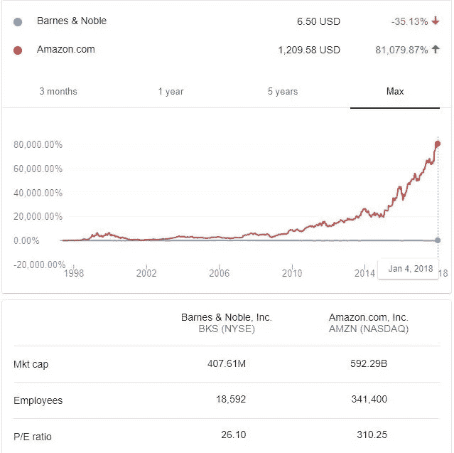
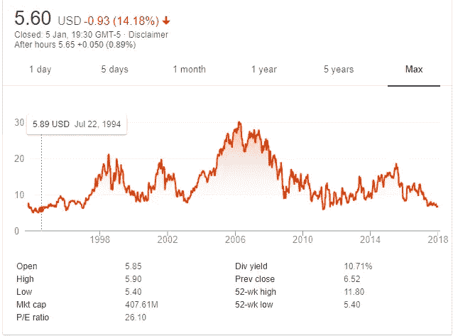
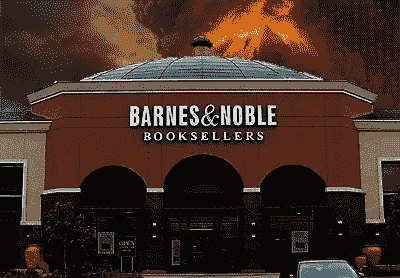
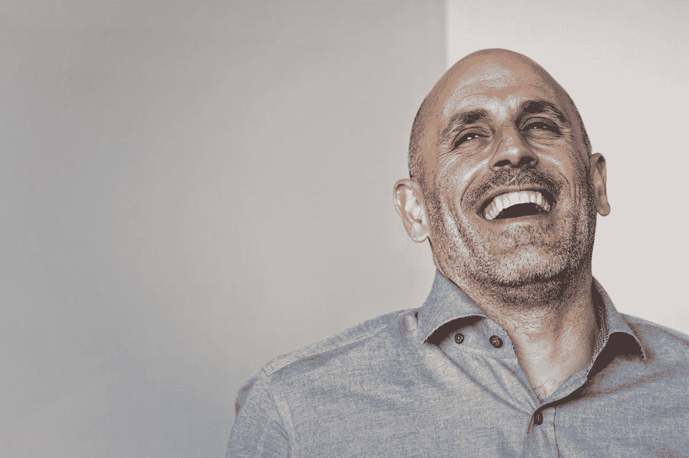
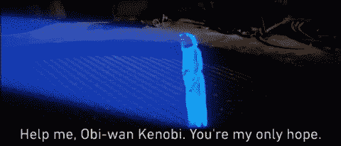

# 对巴诺来说，1994 年又是一年

> 原文：<https://medium.com/hackernoon/for-barnes-noble-its-1994-all-over-again-1f72e27c4118>

上周五，巴诺的股价跌至 1994 年以来的最低点。同店和数字销售的持续下降应该让我们这些爱书人感到担忧。为了在亚马逊生存，巴诺应该怎么做？

**有时候一张图抵得上 81079 个字:**

Amazon vs. Barnes & Noble — 20+ years comparison

巴诺周四宣布，在截至 12 月 30 日的九周时间里，可比商店销售额下降了 6.4%(至 9.52 亿美元)。在线销售额(美国零售商的平均销售额有所增长)下降了 4.5%。有趣的是，销售额下降的一半归因于音乐和 DVD 类别的下降，而这两个类别在巴诺书店被认为是强劲的。

这一消息导致巴诺的股价直线下跌近 14%，上周五收于 5.57 美元，为 1994 年以来的最低点。

Barnes & Noble share price since 1994

第一张图表显示，自 1997 年以来，B&N 的股价下跌了 35%，而亚马逊的份额增长了 81，000%……亚马逊的市值超过 5920 亿美元，几乎是 B&N 4.07 亿美元市值的 1500 倍。曾经是世界上最大的图书销售商，现在远远排在第二位(尽管仍然是最大的实体书店)。

Barnes & Noble 的纽约旗舰店曾经是我在世界上最喜欢的地方。时至今日，如果我在纽约开会时有一个小时的空闲时间，B&N 的商店将是我的首选目的地。不幸的是，该公司正在挣扎，这个假期圣诞老人没有带来任何礼物。我们都猜测，销售额下降的主要原因是亚马逊。亚马逊继续推进其 Prime 计划，在刚刚过去的假期中，一周之内向 400 万人发放了试用会员资格，创造了假期记录。需要注意的是，亚马逊至今还开设了 13 家实体书店。顺便说一下，巴诺书店有 634 个。

在去年八月的一篇[博文中，我带你回到了 1998 年 7 月。N 的股价几乎是 18 美元。在 1998 年《财富》杂志的一篇文章中，尼娜·马斯克引用了 Zak Capital 一家资金管理集团的负责人苏珊娜·扎克的话，Zak Capital 当时是巴诺书店的大股东。扎克告诉马斯克，她开始认真对待亚马逊的贝佐斯。1998 年 7 月 24 日，她参加了 Amazon.com 为分析师和基金经理举办的会议。扎克表示:](https://hackernoon.com/amazon-a-view-from-1999-3a802b982279)

> “最初，像很多人一样，我们对亚马逊持怀疑态度，”她解释道。“但在那次会议上，听贝佐斯讲话时，我突然明白了。我说，“我们会有一个问题。”

**

*Yes I know I have used this one before, but it’s too relevant no to use it again. Sorry.*

*巴诺首席执行官德莫斯·帕内罗斯(Demos Parneros)2016 年 11 月才加入公司，2017 年 4 月被任命为首席执行官。他的计划包括降低 B&N 的成本基础，缩小商店规模，尝试店内餐厅和酒吧。这些举措是有道理的，但我看不出它们会带来足够显著和深刻的变化。*

*我相信巴诺仍然是一个非常重要的品牌。当你在寻找一家[书店](https://hackernoon.com/tagged/book)时，第一个想到的就是这个名字。它应该能够反击——如果它得到财政、技术和后勤支持的话。我相信，有了正确的数字行动，有了强大的后勤骨干，B & N 实际上可以有一个光明的[未来](https://hackernoon.com/tagged/future)。然而，4 亿美元的市值，可能的情况是私募股权支持的收购，更多的成本削减和/或短期投资，“财务补偿”等。被一家私募股权公司收购并不会真的有很大的不同，也不会给 B & N 一个重新获得领导地位的适当机会*

*对于苦苦挣扎的零售公司来说，这种解决方案已经被用得太多了，但人们不能不想象一个穿着闪亮盔甲的骑士来拯救品牌:马克·洛里和 B&·n·洛里的新黎明，一个新的零售名人，是 Quidsi(尿布)的创始人兼首席执行官。com)直到被亚马逊收购(亚马逊最近彻底关闭了它)。在沃尔玛收购了他的最新公司 Jet.com(30 亿美元)后，Lore 现在是沃尔玛美国电子商务的首席执行官。Lore 目前最广为人知的是作为零售业对抗亚马逊的最后希望。他是约翰·斯诺，卢克·天行者(或绝地雷伊)。如果有人能在商业上把不可能变成可能，那就是他。*

**

*I’ll make Barnes & Noble great again! Yeah!*

*沃尔玛收购 B&N 不会是一个容易或正统的举动，但杰夫·贝索斯收购全食超市也不是正统的举动，不是吗？这对两家公司都有明显的优势和好处。如果没有别的，这将有助于沃尔玛在主场迎战亚马逊——书籍。另外——我们离假期不远了，那是奇迹发生的时候。*

*所以，马克，代表我们这些热爱巴诺书店的书虫，请帮帮忙。*

**

**Help us Oh Marc Lore. You’re our only hope.**

*如果你赞成沃尔玛收购巴诺——鼓掌；-)*