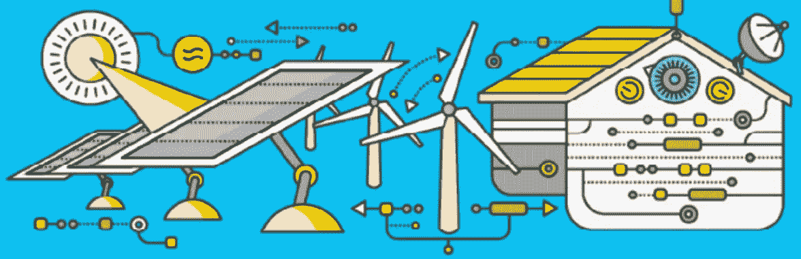
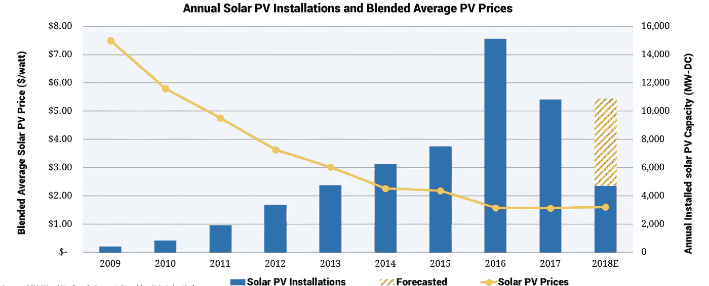

# 对于能源来说，这是去中心化之前的数字化

> 原文：<https://medium.com/hackernoon/for-energy-its-digitization-before-decentralization-823ac7db733e>

大约 10 年前，P2P 电子现金系统的愿景发表，标志着比特币和区块链的诞生。虽然新创业公司的激增迷恋加密货币热潮，但能源部门已经设想利用区块链，原因与金融类似——透明、信任和自动化。我想强调一些观察结果(*和揭穿一两个神话*)，现在区块链的炒作正在消退，新的分布式能源解决方案仍然稀缺。

## 年轻人开始改变了

许多人猜测，金融领域的加密革命自然会降临到能源等其他行业。然而，金融所拥有的能源所没有的是来自移动和数字的颠覆时刻——这一趋势迫使现有垄断企业重新思考他们为寻求更高便利、信任和控制的年轻一代提供的产品。这些都是加密货币发展的推动因素，这要归功于如今成长为区块链项目首席执行官和网络开发者的年轻人。

虽然少数开发者专注于通过比特币改造货币，但能源正在以一种不那么数字化的方式发生变化。太阳能、风能和储能技术的进步成为电网差异的制造者，并产生了自己的新网络效应(除了这个网络已经有 100 年的历史，而不是 10 年)。如果能源行业正走向与精通技术的一代人相似的命运，它也需要认真的数字化转型。

## 去中心化前的数字化？很复杂。

加密货币和未来能源格局有着相似的去中心化、民主化和消费者保护目标。由于电力网是一个由发电商、配电商和运营商组成的复杂网络，它们都在一个错综复杂的输送系统中运行，难怪会出现试图连接这两者的用例。不管是好是坏，分布式账本作为一种解决方案吸引了人们的兴趣，这种解决方案将推动能源公司采用现代技术。

这种想法似乎有些牵强，但两年前我对此感到惊讶，现在我将重申这一点——令人难以置信的是，分布式总账开发首先解决了最复杂和高度监管的行业之一。如果没有什么可以证明金融系统过于复杂，对不知情的人不利，这是令人钦佩的工作。它不会因为钱而停止。如果有足够的脑力专注于“密码经济学”以建立一个新的金融系统，那么与电网相关的平行过时和分散的系统也是如此。引用前谷歌高管和雅虎首席执行官玛丽莎·梅耶尔的话，“创造力喜欢约束”，很少有行业比能源更受约束。

(Source: Smart Grid Consumer Collaborative 2016 Annual Report)

## 能源行业会面临与金融业相似的命运吗？

简而言之，是的。对能源区块链的许多猜测是由“**交易能源**”的概念驱动的，或者是一种为新的自动化服务而优化拼凑的电网系统的方法。这可能是预测性负载平衡、高精度断电管理或邻居间的能量交易。但是重要的是要认识到物理网格资产大多是*愚蠢的基础设施*。模拟传感器、传真机流程、主机计费系统。令人沮丧的是，这些是今天运行我们能源网的关键骨干业务。公用事业和运营商将按照监管的步伐提高他们的数字能力，而电网边缘电信和面向消费者的能源解决方案将成为**智能基础设施**。

我愿意打赌，智能基础设施的发展会带来有竞争力的产品和服务，首先释放交易能源的繁荣。这些产品可能是对未来更注重能源和移动设备的客户最具吸引力的创意，从而推动了能源公司自己的数字颠覆时刻。

## 区块链仍然可以发挥作用

干净和可用的数据是数字化转型的入口，现在是时候根据这一需求采取行动了。不幸的是，能源运营商长期以来一直在解读技术，但却依赖监管激励来推动数字应用的变化。尽管这长期以来一直困扰着他们，推迟了高质量的数据管理实践，但这显然是除了更成熟的人工智能或面向客户的产品之外，迎接分布式总账突破的桥梁。正如没有一个区块链会轻易解决金融领域的所有低效率问题一样，一体化的区块链能源网络也不会神奇地取代今天所依赖的能源系统。

撇开数据问题不谈，我们不应该忽视区块链初创公司的出色创新速度和对该领域的深远兴趣。项目正在通过全球社会渠道形成，可能会给行业标准带来更多的一致性。协议开发正在为未来的应用和服务奠定基础，这些应用和服务可能会对未来的能源产生影响。来自欧洲、澳大利亚和北美的许多监管机构、公用事业公司和能源交易商都对这项技术特别感兴趣，我不能不提能源部和世界经济论坛也渴望了解更多。

但是区块链不会消耗太多能源吗？

虽然我不会对媒体报道这个标题感到不安(这是一个能源友好的问题)，但我们不能忽视其他技术进步对电力消耗的影响。数据中心也曾是消耗能源的庞然大物，正为全球指数级增长做准备。快进到 2018 年，云计算成熟为廉价、快速和高能效。

> 能源部劳伦斯伯克利国家实验室发现，美国数据中心在 2014 年消耗了 700 亿千瓦时，约占美国当年总耗电量的 1.8%。从 2010 年到 2014 年，数据中心的能耗仅增长了 4%。相比之下，从 2000 年到 2005 年增长了 90%，从 2005 年到 2010 年增长了 24%。

分布式账本在我看来没什么不同。虽然比特币是最受欢迎和最广泛采用的网络，但以太坊在 2017 年的发展为低能耗协议打开了大门，这些协议今天仍在不断改进。迄今为止推出的大多数企业区块链解决方案都是基于以太坊代码，具有完全的识别能力，经济高效的节点将推动规模扩大。

*   ***附注:10 年前比特币推出时，能源看上去有着惊人的不同****

(Source: SEIA)

*   2008 年，超过一半的电力供应来自煤炭
*   全电动汽车在美国的销量不到 5000 辆
*   可再生能源仅占总供应量的 9%
*   特斯拉跑车上市，成为第一款使用锂离子电池的量产汽车
*   太阳能光伏电池的平均价格超过每瓦 7 美元，一个普通住宅系统的价格超过 4 万美元