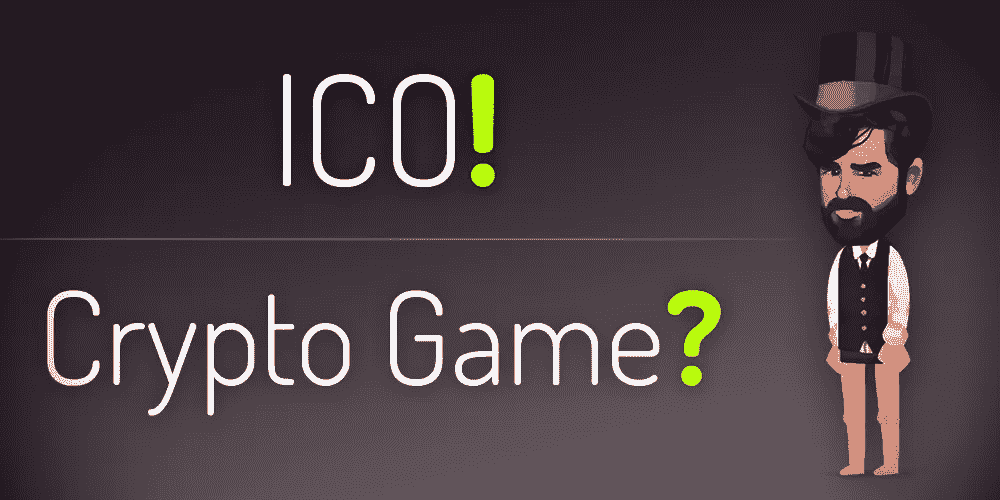

# 向 ICO 投资者解释加密游戏

> 原文：<https://medium.com/hackernoon/for-the-ico-investors-5643c59463b9>

亲爱的密码社区:

我们知道，一些注意到我们项目的人可能不熟悉区块链的游戏。从未养过数码猫，或在区块链拥有过数码国家？无忧无虑。

Crypto games

事实上，基于区块链的游戏正在发展成为一种全新的东西，它结合了传统游戏的有趣元素，体验区块链互动的兴奋感，以及令人兴奋的交易和盈利元素。 [ETH。TOWN](https://eth.town/) ，一款基于[以太坊的](https://hackernoon.com/tagged/ethereum-based)游戏，支持 MetaMask，将带来创新的游戏开发，围绕在一个加密商业塔中购买和出售公寓和公司办公室。该团队相信这个项目有每个人都在寻找的东西，我们将在这篇文章中对此进行更多的阐述。

# 例如，现在想一想你会加入“正常”ICO 的所有理由。

你觉得**项目背后的概念很棒**，获得一些代币使你**成为快速发展空间的一部分**。

**我们的推介:**游戏正迅速成为世界上一个巨大的产业。《口袋妖怪 Go》和《糖果粉碎传奇》等应用程序每天带来超过 200 万美元和 150 万美元的收入。随着主流区块链采用率的上升，区块链游戏也将出现指数级增长。

该团队已经多次重申，我们打算成为这一领域的杰出长期参与者之一，我们将通过密切倾听我们的社区来实现这一目标。当我们成长时，我们一起成长！

你认为团队有**经验和能力**来实现他们的项目愿景。

**我们的推介:**这款游戏由 On5 Games Development Studio 开发——我们是一家经验丰富的手机游戏开发商，曾与三星、雅达利和艺电等公司合作。看看我们在 twitter 帖子上的角色设计，这是我们对质量关注的一个简单例子。还是不相信我们？我们将很快邀请玩家加入阿尔法——自己试试吧！

你是为了**利润**和**交易的刺激**！

**我们的推介:**[ETH 的核心部分。城镇](https://eth.town/)游戏围绕着交易——买卖角色和场地。随着我们社区的发展，游戏中的资产会自然增加，因为人们越来越重视他们提供的功能。从广义上讲，这与从服务提供商 [ICO](https://hackernoon.com/tagged/ico) 那里获得一些公用设施代币，然后等着随着用户群的增长再出售没有什么不同。我们相信我们的用户群将会增长，从现在到 6 月我们将举办一系列活动，6 月我们将推出手机版！

这些游戏资产就其本身而言是罕见的数字收藏品(只要看看艺术品)，但我们也纳入了重要的 ETH。城镇功能也融入其中，这将进一步增加他们的需求。我们正在出售/拍卖一些 15 级明星英雄，9 级人物和部分道黑客的地板在我们的网站预售[现在](https://eth.town/)。

特别是占地面积，已经售出了 76%!顺便来看看是否有什么吸引你的东西。😊

更重要的是，ERC-20 兼容的以太网。城镇投资者代币(ETIT)在游戏中扮演着重要角色。[我们之前在 token mechanics](/@ethtown/eth-town-investor-tokens-f294de8b6f0b) 上的帖子清楚地概述了 ETIT 持有人将如何从该平台的交易量中分得一杯羹。这些代币是罕见的，因为它们永远无法从游戏或开发者那里直接购买，只能通过某些渠道获得，包括早期空投/奖金、游戏活动、预售参与以及在 EtherDelta 或其他交易所的交易。

随着游戏交易量的增长，以太分发池也将增长。反过来，代币供应将通过在其他有价值的游戏内容(例如，英雄)上的代币花费而受到控制。如果你持有任何股票，坐下来，放松，看着更多的利润流进来。

## 加密投资者常问的问题。

我们运行的是游戏中的项目预售，而不是 ICO，但我们仍然有答案。

**预售代币分配上限:**
20 万代币

**代币发放:**
代币全部发放给预售购买英雄和楼层的人，没有直接购买代币的方式

**令牌状态:**实用令牌。

**代币持有者将获得什么**(根据游戏机制):
-游戏中完成的每笔 ETH 交易的百分比(具体百分比取决于每笔交易的许多因素)；
-代币可以用于游戏中的物品和游戏中的动作，其中一些只能用代币来完成，不能用以太

**预售结束**:
4 月 6 日

**代币可以交易吗** :
你可以在[以太 Delta](http://etherdelta.com/#0x8fe19c447821b4cdcdd5012bca1b5469ca96d80d-ETH) 、[福克 Delta](https://forkdelta.github.io/#!/trade/0x8fe19c447821b4cdcdd5012bca1b5469ca96d80d-ETH) 、IDEX 进行交易。上市请求被发送到交易所。

干杯:)

博文:
[你好世界！](/@ethtown/eth-town-hello-world-ab418071c185)
[投资者代币？](/@ethtown/eth-town-investor-tokens-f294de8b6f0b)
[预售公告](https://hackernoon.com/eth-town-presale-roadmap-team-3ee730acaf23)

网址:[https://eth.town/](https://eth.town/)
博客:[https://medium.com/@ethtown](/@ethtown)
Btt 安:[https://bitcointalk.org/index.php?topic=3062760](https://bitcointalk.org/index.php?topic=3062760)
Btt 赏金:[https://bitcointalk.org/index.php?topic=3028492](https://bitcointalk.org/index.php?topic=3028492)
脸书:[https://fb.me/eth.town](https://fb.me/eth.town)
推特:[https://twitter.com/eth_town](https://twitter.com/eth_town)
insta gram:[https://instagram.com/eth.town](https://instagram.com/eth.town)
电报:[https://t.me/Ethertown](https://t.me/Ethertown)
媒体: [https:/](/@ethtown)