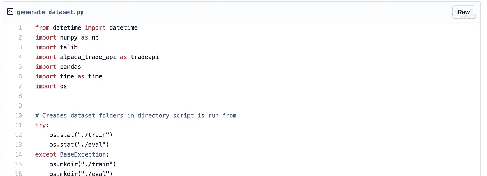
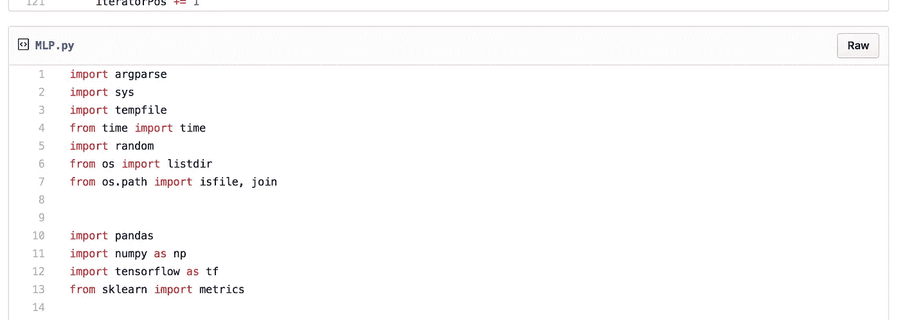
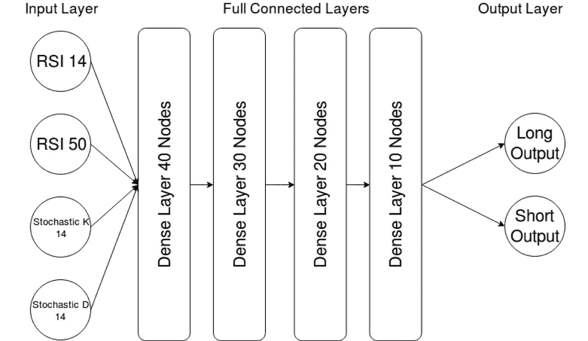
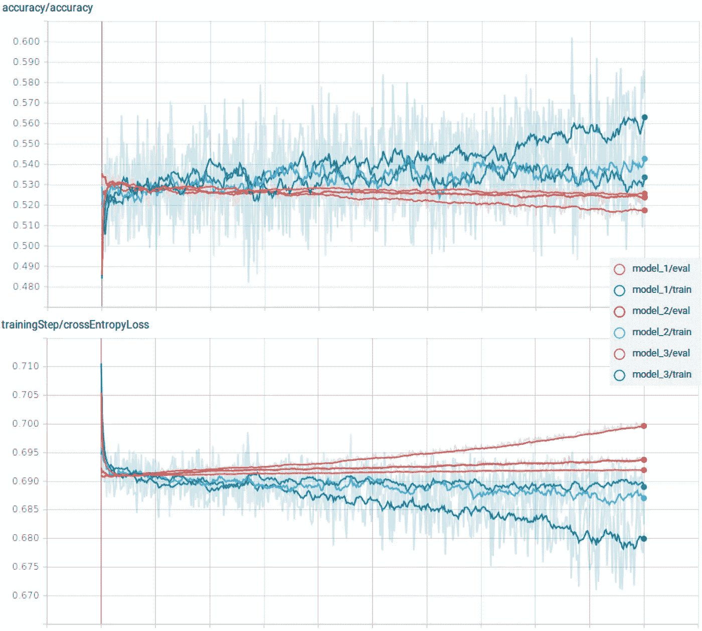

# 使用 Tensorflow 预测市场走势

> 原文：<https://medium.com/hackernoon/forecasting-market-movements-using-tensorflow-fb73e614cd06>

Photo by [jesse orrico](https://unsplash.com/photos/rmWtVQN5RzU?utm_source=unsplash&utm_medium=referral&utm_content=creditCopyText) on [Unsplash](https://unsplash.com/search/photos/machine-learning?utm_source=unsplash&utm_medium=referral&utm_content=creditCopyText)

# 多层感知器用于分类

有没有可能创建一个神经网络[来从一组标准交易指标中预测每日市场走势？](https://hackernoon.com/tagged/network)

在本帖中，我们将看到一个使用 Tensorflow 创建测试和开发框架的简单模型，以及一些初步结果和改进建议。

# ML 任务和输入功能

为了保持基本设计的简单，它设置了一个二元分类任务，预测第二天的收盘价是高于还是低于当前收盘价，对应于对下一个时间段做多或做空的预测。在现实中，这可以应用于一个机器人，它在交易日开始时计算并执行一组头寸，以捕捉当天的走势。

该模型目前使用 4 个输入特征(再次为简单起见):15 + 50 天 RSI 和 14 天随机 K 和 d。

之所以选择这些指标，是因为这些指标在 0 到 100 之间被归一化，这意味着资产的基础价格与模型无关，从而允许更大程度的泛化。

虽然可以根据任何数量的其他交易指标或其他指标来训练模型，但我建议坚持使用那些通过设计标准化或可以修改为价格或波动标准化的指标。否则，一个单一的模型不太可能对一系列股票有效。

# 数据集生成

(Code Snippet of a dataset generation example — full script at end of this post)

数据集生成和神经网络脚本被分成两个不同的模块，以便于修改，并且能够仅在必要时重新生成完整的数据集，因为这需要很长时间。

目前，生成器脚本设置有一个标准普尔 500 股票列表，用于下载 2015 年以来的每日蜡烛线，并将其处理为所需的交易指标，这些指标将用作模型的输入特征。

然后，一切都被分割成一组训练数据(2015 年 1 月-2017 年 6 月)和评估数据(2017 年 6 月-2018 年 6 月)，并作为 CSV 写入脚本运行目录中的“train”和“eval”文件夹。

然后，ML 脚本可以按需读取这些文件来训练和评估模型，而无需重新下载和处理任何更多的数据。

# 模特培训

(Code Snippet of model training — full script at end of this post)

在启动时，该脚本将“train”和“eval”文件夹中的所有 CSV 文件读入数据数组，以便在整个训练过程中使用。对于如此小的数据集，RAM 要求将足够低，不会保证额外的复杂性。但是，对于一个大得多的数据集，这将必须更新为一次只读取完整数据的一个样本，每隔几千个训练步骤轮换一次内存中保存的数据。然而，这将以更大的磁盘 IO 为代价，减慢训练速度。

神经网络本身也非常小，因为测试表明，对于较大的网络，评估精度往往会迅速偏离。

网络“长输出”和“短输出”被用作二元预测器，最高置信度值被用作下一天的模型预测。

架构中的“密集”层意味着每个神经元都连接到下一层中所有神经元的输出。这些神经元与“[金融机器学习简介(第一部分)](https://blog.alpaca.markets/blog/2018/7/20/intro-into-machine-learning-for-finance-part1)中描述的相同，使用 tanh 作为激活函数，这是小型神经网络的常见选择。

 [## 金融机器学习导论(第一部分)

### 由于神经网络可以用来学习数据集中的复杂模式，它们可以用来自动处理一些复杂的数据。

博客.羊驼.市场](https://blog.alpaca.markets/blog/2018/7/20/intro-into-machine-learning-for-finance-part1) 

一些类型的数据和网络可以在不同的激活函数下更好地工作，例如 RELU 或 ELU 用于更深的网络。RELU(整流器线性单元)试图解决更深层次架构中的消失梯度问题，而 ELU 则是这一问题的变体，以使训练更加有效。

# 张量板

除了在终端中显示每 1000 个训练步骤的预测准确性统计数据之外，ML 脚本还被设置为记录用于 TensorBoard 的摘要——使训练过程的图形化更加容易。

虽然除了标量摘要之外，我没有包括任何内容，但是可以记录从节点权重直方图到样本图像或来自训练数据的音频的所有内容。

要将 TensorBoard 与保存的摘要一起使用，只需将— logdir 标志设置为运行 ML 脚本的目录。然后，打开您选择的浏览器，在搜索栏中输入“localhost:6006”。一切正常，现在您有了一组自动更新的图表。

# 培训结果

Node layouts: Model 1 (40,30,20,10), Model 2 (80,60,40,20), Model 3 (160,120,80,40)

由于示例设计及其输入特性的简单性，结果不像预期的那样好。

我们可以看到明显的过度拟合，因为所有测试的损失/误差相对于评估数据集增加，尤其是在较大的网络上。这意味着网络只是学习特定训练样本的模式，而不是一个更一般化的模型。最重要的是，训练的准确率并不是很高——只比完全随机的猜测高几个百分点。

# 修改和改进的建议

示例代码提供了一个很好的模型，可以用来帮助理解一切是如何工作的——但是它更像是一个起始框架，而不是一个预测的工作模型。因此，这里有一些你可能想提出的改进建议和你可以测试的想法

**输入功能**

在当前状态下，数据集仅由 4 个输入要素生成，并且模型仅查看一个时间点。这严重地限制了你期望它能够学习的东西——你能在孤立的一天里只看几个指标值来交易吗？

首先，修改数据集生成脚本来计算更多的交易指标，并将它们保存到 CSV 中。TA-lib 的函数范围很广，在这里可以找到**。**

 **[## TA-Lib

### TA-Lib:TA-Lib 的 Python 包装器(http://ta-lib.org/)。

mrjbq7.github.io](https://mrjbq7.github.io/ta-lib/func.html)** 

**我建议坚持使用标准化指标，类似于 Stoch 和 RSI，因为这将资产的相对价格从等式中剔除，这样模型就可以在一系列股票中推广，而不是需要为每只股票建立不同的模型。**

**接下来，您可以修改 ML 脚本，读取最后 10 个数据周期作为每个时间步长的输入，而不仅仅是一个。这使得它可以开始学习振荡器随时间推移的更复杂的收敛和发散模式。**

****网络架构****

**如前所述，由于缺乏数据和示例任务的特征复杂性，网络很小。这将不得不改变，以适应额外的数据被补充的指标。**

**最简单的方法是更改节点布局变量，以添加额外的层或每层更多的神经元。除了完全连接之外，您可能还希望试验不同类型的层。卷积层通常用于图像的模式识别任务，因此在金融图表数据上进行测试可能会很有趣。**

****数据集标签****

**如果价格差异> =0，则数据集标记为“多头”，否则标记为“空头”。但是，您可能希望将阈值更改为等于数据长度上的中值价格变化，以提供一组更平衡的定型数据。**

**你甚至可能希望添加第三个类别“中性”,用于价格保持在有限范围内的日子。**

**除此之外，该脚本还能够改变价格上涨或下跌的预测期。所以可以用长期预测来检验。**

# **结论**

**随着建议的改进措施的实施，当然有可能对模型进行改进，使其可以作为基于标准规则的策略的补充交易指标。**

**然而，当涉及到这样一个简单的架构和培训任务时，应该降低期望值。[机器学习](https://hackernoon.com/tagged/machine-learning)真的可以通过更精细的网络结构和预测任务让自己脱颖而出。**

**因此，在下一篇文章中，我们将关注监督学习、非监督学习和强化学习，以及如何使用它们来创建时间序列预测器和分析数据中的关系，以帮助优化策略。**

# **完整脚本**

**马修·特威德**

****

## **请关注[羊驼](/@alpacahq)和[自动化世代](https://medium.com/automation-generation)关于金融市场、算法交易、技术的新帖子。**

## **你可以找到我们[@羊驼 HQ](https://twitter.com/AlpacaHQ) ，如果你用 twitter 的话。**

****

**如果你是一名黑客，并且可以创造一些在金融市场上工作的很酷的东西，**请查看我们的项目“** [**无佣金股票交易 API**](https://alpaca.markets/?utm_source=medium&utm_medium=blog&utm_campaign=strategy_list&utm_content=part1) **”,在那里我们免费提供简单的 REST 交易 API 和实时市场数据。****

**经纪服务由 FINRA/SIPC 成员 Alpaca Securities LLC([Alpaca . markets](https://alpaca.markets/?utm_source=medium&utm_medium=blog&utm_campaign=strategy_list&utm_content=part1))提供。羊驼证券有限责任公司是 AlpacaDB，Inc .的全资子公司。**