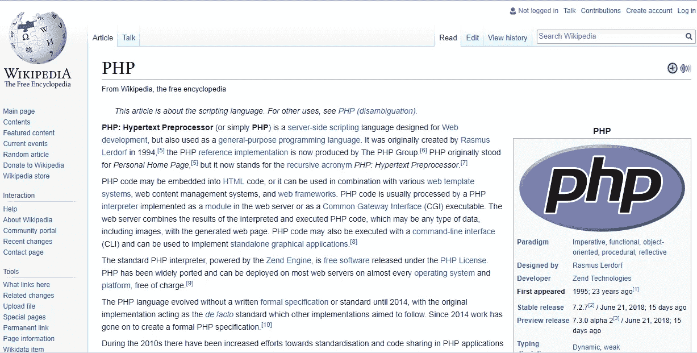

# 永远年轻的 PHP:为什么市场领导者仍然优先考虑它

> 原文：<https://medium.com/hackernoon/forever-young-php-why-market-leaders-still-prioritize-it-3767942f6123>

尽管历史悠久，PHP 仍然是使用最广泛的编程语言之一。尽管对其利弊进行了长时间的讨论，但 Slack、维基百科、Wordpress、Pinterest、Nvidia 和 Tumblr 等巨头的支持确实有一些价值。它拥有的广泛功能允许在 it 开发的几乎任何领域应用这种语言。让我们来看看 PHP 能做什么的一些鼓舞人心的例子。

# 1.PHP 网站

PHP 是专门为开发网页而设计的语言，它允许快速、轻松地构建高度直观且响应迅速的网站。难怪许多流行的网站都由 PHP 驱动。其中包括雅虎、Flickr、Digg 和其他网站。对我们来说，很高兴在这个列表中加入一家大型乌克兰主机提供商 [Nic 的网站。Stfalcon.com 研发的 Ua](https://stfalcon.com/en/portfolio/nic-ua) 。2018 年 5 月，Nic。Ua 在网站竞赛 Web Awards 中获得了一等奖——这是 PHP 成果的一个很好的证明。

是什么让 PHP 如此适合网站开发？它的功能是专门为网站设计的。它们包括与 HTML 的良好交互、与各种数据库的通信、安全性、用户友好性以及其他一些特性:

## 动态网站模板

在现代生态系统中，任何网页都需要高度定制，并且应该提供高度交互式的用户界面。因为 PHP 脚本在服务器上执行，所以可以动态创建生成 HTML 代码的页面。访问者在没有任何脚本概念的情况下处理定制的网页。

## 在线社区

借助 PHP BB、vBulletin、Pun BB 等 PHP 论坛构建[工具](https://hackernoon.com/tagged/tools)，你可以轻松构建自己的在线社区。它使网站更具互动性，对用户更有吸引力。

## 图像输出

使用 [PHP](https://hackernoon.com/tagged/php) ，可以输出不同类型的图像，例如借助 ImageMagic 软件套件。因此，基于 PHP 的网站就像你喜欢的那样明亮和生动。

# 2.PHP 在电子商务中的应用

电子商务是另一个大领域，PHP 提供了许多简单的方法来构建令人敬畏的体验。许多流行的电子商务平台，如 OpenCart、Zen Cart、Magento、PrestaShop 和 Ubercart，都是基于 PHP 的。

像 PHP CCVS、CyberMUT、Cybercash、Payflow Pro 和 VeriSign 这样的 PHP 函数有助于将电子商务特性体现到任何 web 服务中。

通过使用 Symfony、CodeIgniter、CakePHP 或 Zend 等框架，PHP 允许以快速简单的方式开发电子商务应用程序。因为这些 PHP 框架是开源的，所以它降低了开发和维护成本，增加了功能，提高了可伸缩性和响应能力，并提供了可靠和一致的用户体验。

一个很有根据的证明是另一个乌克兰获奖的解决方案，更新的 [Nova Poshta 转发服务](https://stfalcon.com/en/portfolio/npshopping-ua)。Nova Poshta 是乌克兰最大的快递公司。2016 年，它推出了国际转发服务，但由于几个原因，该网站的第一个版本并不太成功。该公司决定完全重启这项服务。除了完全重新设计，软件引擎也在 PHP 框架 Symfony2 中从头开始重新编写。它有助于改进网站功能，使其更加方便用户。

结果，之前在用户中相当不受欢迎的 Nova Poshta Shopping 在 2018 年赢得了乌克兰电子商务奖竞赛，并获得了提名“消费者选择”的第一名。

# 3.PHP 企业软件

企业软件包括内容管理系统(CMS)、[客户关系管理系统](https://stfalcon.com/en/blog/post/how-to-develop-custom-crm-for-large-business) (CRM)、[企业资源规划系统](https://stfalcon.com/en/blog/post/ERP-software-development) (ERP)以及管理组织资产的其他工具。由于 PHP 的灵活性、易集成性和多种支付方式，使用 PHP 开发企业软件的情况越来越多。

## 网络内容管理系统

构建 CMS 是 PHP 最流行的用途之一。它支持三大 CMS 引擎:WordPress、Joomla 和 Drupal。使用 PHP，您可以根据自己的业务定制这些 CMS，也可以从头开始构建自己的 CMS。一个好的 CMS 的主要特征之一是用户可以下载内容而不需要处理操作部分和 HTML。PHP CMS 开发减少了布局和内容的相互依赖。

## 客户关系管理系统

与 CMS 一样，您可以在多个基于 PHP 的开源 CRM 解决方案中进行选择，并根据您的需求对它们进行定制，或者开发一个内部 CRM。PHP 及其框架经常用于 CRM 开发，因为它们与几乎所有的软件都兼容。它的现成插件、模板和组件可以轻松集成并添加更多功能，如产品库存、多种货币接受、在线支付、轻松结账等。

## 企业资源规划系统

现代 ERP 系统相当复杂，应该满足高集成标准。在开发持久的 ERP 系统时，选择最相关的框架非常重要。PHP 提供了最大的框架选择来找到最适合你需求的框架。它还可以加快开发速度，而对于 ERP 来说，这可能需要数年时间。大多数 PHP 框架支持模型-视图-控制器(MVC)方法，允许程序员通过构建代码来优化应用程序的性能。它使得在同一个系统的不同模块上工作的几个团队之间组织更好的合作成为可能。

# 4.web 数据库应用程序的 PHP

数据库是网络生态系统的核心。它提供了动态内容创建和各种用户交互的方法。当使用一个特定于数据库的扩展或者连接到一个支持开放数据库连接标准的数据库时，编写一个支持数据库的网页是很简单的。PHP 如此受欢迎的原因之一是它支持众多的数据库，包括 MySQL、Oracle 和 MS Access(总共超过 20 个),并且可以用来创建新的数据库。也就是说，与数据库协同工作的网页是无缝生成的。

# 5.在移动应用程序开发中使用 PHP

移动应用的主要目的是让用户或合作伙伴参与到你的业务中。在这里，体验个性化和创造合适的环境是至关重要的。这就是为什么今天很少有商业移动应用程序是独立的，大多数都与后端服务通信。应用程序的服务器端负责聚合来自移动设备的各种数据、用户行为模式、用户设置保存等。PHP 的几个框架，像 Symfony 或者 Laravel，对于构建移动应用的后端功能是相当不错的。

例如，在为想要准备 SAT 和 ACT 的学生创建一个[应用程序时，我们选择 Symfony 作为开发的基础。做出这样的决定是因为这个框架最适合 REST API 的开发，在我们的例子中，REST API 是在 HATEAOS 架构上开发的。结合其他几种基于不同语言的技术，它创造了一个工作良好的产品。](https://stfalcon.com/en/portfolio/student-challenges-app-usa)

# 那么，PHP 能做什么呢？

有了完善的社区、广泛的功能和相当大的框架集，PHP 几乎可以做任何事情。收集数据、服务器端脚本、动态页面内容生成只是它的几个应用领域。PHP 可以在所有主流操作系统上使用，包括微软的 Windows、Linux、许多 Unix 变种和 macOS。它还支持大多数 web 服务器和数据库。

这些就是为什么 PHP 是构建、更改和操作成功项目的好选择的原因。很长一段时间以来，PHP 都没有被认为是一种足够严肃的语言来开发大型 Web 应用程序。它通常被认为是小型项目的一个好选择。最近，情况发生了显著变化。PHP 框架(Symfony，Laravel，CakePHP，Zend 等。)扩展语言的能力。

这就是为什么我们继续深化我们在 PHP 项目开发方面的专业知识，尤其是它的 Symfony 框架。我们很高兴能为[开源 PHP 项目](https://stfalcon.com/en/blog/post/open-source-projects-stfalconcom)做出贡献，并成为 PHP Fwdays(乌克兰最大的 PHP 开发人员年度会议)的永久黄金合作伙伴。我们可以用自己的经验来证明，如果使用得当，PHP 可以产生不错的结果。所以，保持冷静，跟随市场领导者——让你所有的 IT 业务项目成功。

*最初发表于*[T5【stfalcon.com】](https://stfalcon.com/en/blog/post/PHP-spheres-of-use)*。*