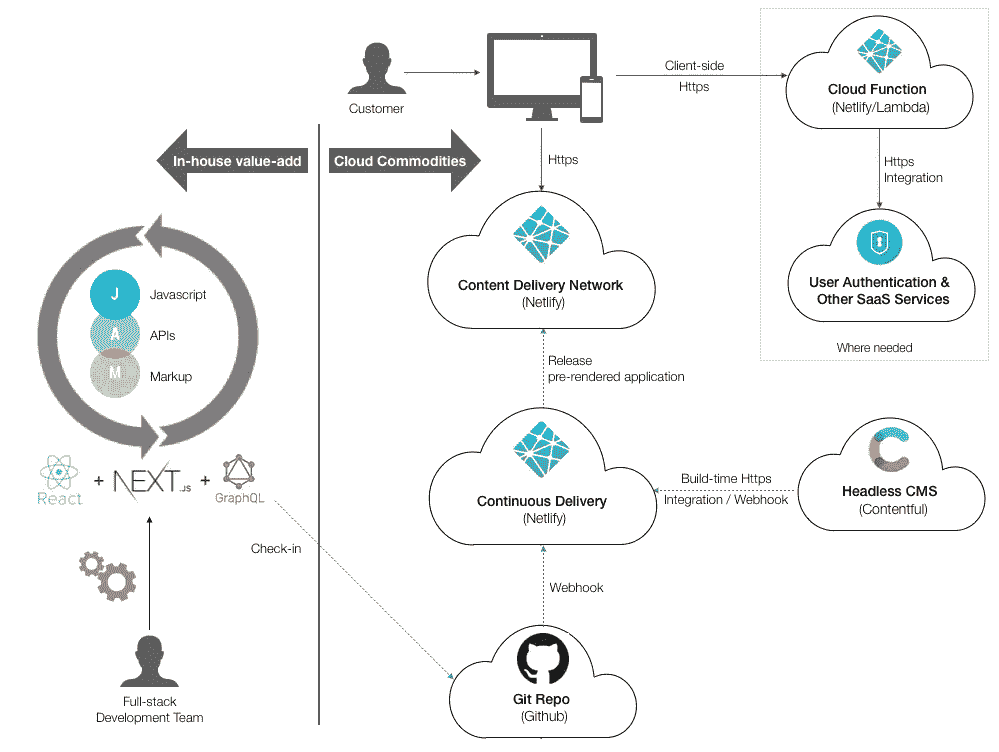

# 忘记 Docker 吧，未来是 JAMstack

> 原文：<https://medium.com/hackernoon/forget-docker-the-future-is-jamstack-aae5bcaf4616>

随着企业努力变得更加敏捷并保持相关性，[技术](https://hackernoon.com/tagged/technology)已经发展到支持它。忘记 Docker 吧，JAMstack 是现代 web 开发的下一个发展方向。

JAMstack 代表[、Javascript](https://hackernoon.com/tagged/javascript) 、API 和标记。这是现代技术、软件即服务和网络核心基础语言的完美结合。它提供:

*   降低的价格
*   更快上市
*   增强安全性
*   更高的可扩展性、可用性和可靠性
*   减少供应商锁定

Docker 等技术将继续在我们的数字未来中扮演重要角色，但应该对大多数企业越来越透明，并在幕后使用。直接为您自己的应用程序管理和支持基础架构应该成为过去。

> “集装箱赢得了这场战斗，但会输给无服务器”——西蒙·沃德利

如果您的核心业务不是提供云服务，那么这篇文章解释了为什么 JAMstack 应该站在最前沿，为大多数在线业务提供战略优势和增加敏捷性。

# 什么是 JAMstack

JAMstack 是可以静态托管在任何地方的 Javascript 和标记。它补充了无服务器技术，可以与无服务器云功能一起使用。传统应用程序的后端几乎完全是冗余的，取而代之的是，很多复杂性是在构建时通过 Javascript 工具链实现的。

它通常与静态站点生成工具一起使用，如 NextJs 或 GatsbyJs，后者取代了服务器端呈现的需要。这些工具可以在构建过程中与云服务集成，并将整个应用程序输出为预先呈现的网页。例如，它可以从一个无头内容管理系统中提取内容，并在几秒钟内将整个站点地图预呈现到静态页面中。然后，可以将这些页面的不可变时间快照部署到生产环境中，并在全球范围内分发。

Webhooks 可以用来触发任何下游服务的变化，并在几秒钟内触发新的发布，以拉入更新的内容。

尽管 JAMstack 应用程序是静态托管的，但这并不意味着应用程序本身的动态性或交互性比服务器端呈现的页面差。这些应用程序可以构建为与 web APIs 客户端集成，并且可以像任何传统应用程序一样提供动态内容和交互性。用户身份验证仍然可以实现，并逐步增强页面或解锁功能。

云函数可以用在需要提供额外后端功能的地方，并且可以用相同的 Javascript 语言编写。

Example JAMstack Architecture

# 为什么是 JAMstack

JAMstack 应用程序具有最少的活动部件或运行时依赖性，以实现最高的性能、可靠性、规模和安全性。这是因为它不需要应用服务器，因此使外围应用变得非常小。静态内容可高度缓存，并可通过任何云提供商轻松分发。这意味着最大限度地减少对特定供应商的锁定。

可以使用 JAMstack 构建企业解决方案，以更快的上市速度和更低的成本。这是因为它需要更少的资源来管理和支持生产和开发中的应用程序。它只需要一个由全栈开发人员组成的小型敏捷团队，一切都可以用 Javascript 和标记来完成。这不是 JAMstack 的先决条件，但是减少 web 交付所需的技能集是有意义的。

在传统的应用程序中，依赖关系的变化通常在运行时集成。这增加了下游依赖关系导致停机的风险。使用 JAMstack，大部分集成都发生在构建时，因此很少会出现影响用户的错误。

JAMstack 将云服务作为一种日益增长的商品。它符合使用 ReactJs 和无服务器云函数等技术进行 Javascript 和标记的全栈开发的趋势。它远离应用服务器和后端系统，如 SQL 数据库和应用服务器。它不再需要用于服务器端渲染和使用 Java/.NET 等编译语言的始终在线的基础设施。

JAMstack 在与 Netlify 这样的专业托管提供商配合使用时最为强大。Netlify 是一个完整的 JAMstack 云平台，直接连接到你的代码仓库。每次检入都可以在几秒钟内将您的应用和支持云功能无缝地版本化和部署到生产就绪环境中。

此外，它还提供了一个内置的内容交付网络，以实现最佳性能和大量其他支持增值功能，否则您将不得不自己构建或配置这些功能。

# 软件锁定

许多组织使用自托管的第三方软件，这需要庞大的团队来开发、部署和维护这些产品，然后你才能考虑开发自己的软件。有时这两者是不可分割的，这会降低你构建产品所需的最低技能。

内容管理系统(CMS)就是一个很好的例子。当这些功能不是您的核心业务时，投入时间和专家资源来升级、配置和支持它们就没有意义了。在某一点上，这是利用它们提供的附加值的唯一选择和可接受的牺牲。

软件即服务产品现在已经改变了游戏规则，在云中提供完全受管理、受支持、可扩展的解决方案，而且成本很低。Prismic 和 Contentful 是提供高度互操作的 web APIs 的无头 CMS 产品的例子。这消除了对专业内部技能的需求，并允许从 JAMstack 或任何语言中轻松集成。

同样，几乎所有需要的支持核心功能都可以在云中排序，或者构建在核心云服务上。这包括利用按需处理的完全托管的持续集成/部署服务。在大多数情况下，不再需要在本地或云中托管和管理自己的服务器。

# 软件商品

随着软件即服务产品将产品重塑为云商品，这需要组织制定战略并保持敏捷。

对于企业来说，了解战略格局并尽可能利用商品以降低成本并避免以更高的成本在内部复制这些广泛可用的资源的多余工作是至关重要的。

商品是指大规模、大批量和高度标准化的产品。商品适合特定的已知用途，并随着时间的推移从产品的复制和改进中发展。

在这种情况下，商品一词来自沃德利的映射技术，用于描述产品如何从起源发展到定制解决方案，再到产品，最后是商品。在根据这一演变过程以及与客户价值链的关系绘制业务组件时，您可以制定战略，确定企业应该将精力集中在何处，以最大限度地专注于您的独特卖点。

就 JAMstack 而言，它可以利用云商品，如下所示:

*   应用服务器上的静态文件托管
*   基于云的部署/集成超过内部能力
*   内部托管的第三方产品之上的软件即服务合作伙伴
*   通过始终在线的后端服务器实现按需无服务器云功能
*   多方面技能和语言的全栈 Javascript 开发人员

# 摘要

像 Docker 这样的技术是现代基础设施技术的顶峰。它们以高度的一致性和可靠性简化了资源的供应。

然而，除非你从事提供云服务的业务，否则专注于基础设施不再有意义。

内部产品开发的大部分基础设施复杂性源于支持核心依赖，例如内容管理系统。传统上，这需要提供第三方产品、支持这些产品的不间断应用平台的配置，以及内部开发、支持和维护这种环境的各种技能。这使得公司更加关注错误的基础设施和部署问题，而不是适应这些导致棘手问题的依赖关系。

JAMstack 作为替代传统 web 开发方法的模型是非常强大的，它允许小型敏捷团队快速前进。它消除了对基础设施和服务器的担忧。它还鼓励使用可互操作的 API 与其他软件即服务供应商集成，并远离需要额外专业团队的后端系统。

发布、支持和扩展 JAMstack 是微不足道的。这意味着高敏捷性、快速上市和更好的正常运行时间。企业发展缓慢，能够适应的企业将获得竞争优势。