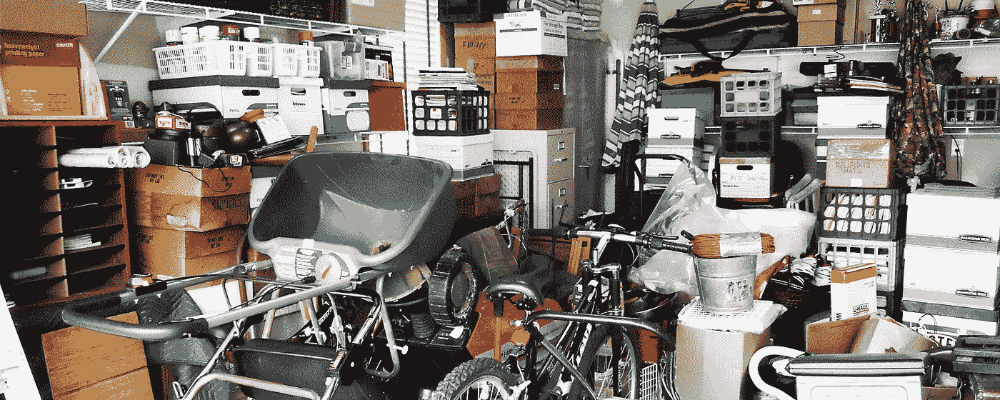

# 忘记所有权，专注于访问

> 原文：<https://medium.com/hackernoon/forget-ownership-focus-on-access-bc3420a6caef>

## 或者——为什么你不应该试图知道所有的事情

我最近真的迷上了播客——它们是可访问的，免费的，而且有很多。几天前，极简主义者引起了我的注意。播客作者传播如何用更少的资源过有意义的生活的想法。澄清一下——我根本不是一个极简主义者。如果有东西要买，我就买。然而，他们的一集，神秘地命名为[【访问】](http://theminimalists.com/p139)，把我完全吸了进去。这个话题深深影响了我，从那以后我就再也无法忘记它。

在前面提到的那一集里，主持人约书亚·菲尔兹·米尔本和瑞安·尼科德穆斯与来自 Omni 的瑞安·德尔克讨论了[对事物的所有权](https://hackernoon.com/tagged/ownership)和对事物的使用权。这个话题背后的基本思想是，我们这一代人试图拥有一切，却无法获得他们真正需要的东西。我认为这也是一个大问题，我相信这不仅限于我们购买的物品。

# 我们永远不会拥有一切

毫无疑问，对我们大多数人来说，拥有一切是不可能的。然而，不知何故，我们仍在尝试这样做。播客中提供了一个简单但非常准确的例子。想象一下——你拥有一栋带两辆车大小车库的房子。你还拥有很多你很少使用的东西——梯子、钻孔机、无人机、DSLR 等等。很明显，你把所有这些东西都放在车库里，因为你大部分时间都不需要它们。你的车库最终会超负荷运转，以至于没有空间放你的车。更糟糕的是——你即将去希腊旅行，你需要你的 DSLR，但它在你车库的深处，你没有足够的时间卸下所有东西来接近相机。这导致假期没有高质量的照片，这太糟糕了！

这完美地说明了拥有更多的同时拥有更少的悖论。我相信这也很适合我们的职业生涯。我们在工作中拥有的和我们想拥有的是知识。通常，我们希望尽可能多地参与到我们的业务中，而实现这一点的最直接的方法就是试图了解我们周围发生的一切。我们认为，有了更多的信息，我们将能够参加更多的会议，参与更多的决策。嗯——这并不完全正确。为什么？试着重新想象我们的车库情况，做一些改变——用你的大脑代替车库，把你接收到的每一条信息都作为一个单独的项目来看待。你会发现我们面临着同样的问题——我们的大脑超负荷运转，信息的可获取性下降。

我们的大脑并不是设计来记忆一切的，就像车库不是设计来容纳一切的。当今最著名的记忆研究者之一，伊丽莎白·洛夫特斯，已经确定了人们遗忘的几个原因。其中一个非常符合我们的情况——[干涉理论](https://en.wikipedia.org/wiki/Interference_theory)。这一理论表明，一些记忆会与其他记忆竞争和干扰，尤其是当信息片段彼此相似时。如果我们思考我们在工作时收到的信息，情况往往就是这样。所有这些都与我们的公司、我们的领域以及我们的日常问题有关。由于这个原因，我们的大脑无法访问特定的记忆，因为以前学习的信息阻碍了新的信息，反之亦然。

当我们的知识同时增加和减少时，大脑的这种和其他限制将我们带回悖论。通过了解更多，我们减少了获取自己知识的途径。这完全违背了我们变得更加投入的最初目标——我们实际上发现自己无法参与公司的流程，因为我们拥有的信息突然消失了。

# 建设基础设施

极简主义者认为这个问题的唯一解决方案是共享基础设施。只有当有其他方法可以获得我们需要的物品时，我们才能停止购买这么多东西。如果没有简单又便宜的方法为我们的希腊之旅得到 DSLR，我们会买下它，并在旅行后把它放在车库里。然而，如果我们可以租一个星期，甚至送货上门，我们甚至不会考虑购买它。为了让所有这一切成为现实，我们需要建立一个基础设施，它只需要两件事情就可以工作——服务提供商或工具，使我们能够获得东西，以及大量的爱好者，他们将使用这些服务，而不是购买。一旦人们停止购买，他们的车库就开始变得凌乱不堪。这并不意味着人们开始做出某种取舍，发现自己缺少什么。他们现在实际上拥有一切，因为他们可以在任何时候获得世界上任何可能的物品。

同样适用于我们的[知识](https://hackernoon.com/tagged/knowledge)。有了正确的基础设施，我们可能开始用头脑中更少的信息了解更多。我们不会变得懒惰，也不会开始变得冷漠和无知——我们只是学会了如何获取信息。知识共享基础设施可以用与项目共享基础设施相同的要素——人和工具——来成功构建。没有绝大多数同事的理解和信任，它永远不会成功。对于初学者来说，几个先锋可能就足够了，但思维模式最终必须全球化。

我注意到知识共享本身比借给别人东西要棘手一些。很容易从你的房间里拿出一架无人机，小心翼翼地放在你朋友汽车的后备箱里。但就我们的知识而言，我们必须知道如何有效地分享信息本身以及完整的背景。让事情变得更加困难的是，做这件事需要时间。我们可能几个星期以来一直在一点一点地收集信息，现在试图在一个小时的会议中一次分享所有信息。这就是正确的工具的来源。我们需要建立和使用工具，使共享和访问信息变得更加容易和几乎毫不费力。就像 Omni 在物品共享方面所做的那样——它们通过完全处理交付过程，消除了将物品从一个地方转移到另一个地方所需的所有困难和努力。我们的知识需要这样的东西。

# 投资于员工并奉献

为了建立一个基础设施，你应该做的第一件事就是在你的公司里拥抱高度信任的文化。你有许多聪明的人，他们可以帮助你避免让你的脑袋塞满你周围的信息。我发现，他们中的许多人非常乐意使用他们的“车库”来保存我们拥有的部分知识。所以，我们必须把我们的知识传授给他们，或者让他们在第一时间获得信息，并相信他们是信息的可靠存储。有时候，我们很难忘记自己，也很难让别人比我们知道更多。但是记住这一点——知道谁知道比不知道好得多。

你们中的一些人可能会问——我们如何跟踪谁知道什么？嗯，你需要做一些实验。你需要找出什么样的过程能帮助你最好地组织一切。实现这一目标的方法之一就是像我们一样奉献。我们有致力于特定知识的人员和/或团队。我们试图让至少一个人成为某种知识的所有者。让它成为一个业务领域，一个内部服务，一个工具甚至是一种思维模式。这给了我们获取知识的第一步。如果我们知道谁拥有最多的信息，我们就可以去找那个人或团队，得到我们需要的信息，或者至少得到进一步的指示。这有助于我们组织知识共享基础设施，并提高信息的可访问性。你可以把同样的东西引入你的公司，或者找到你自己的方式去做。只要你的分享知识有条理，就没有错路。

# 找到合适的工具

如果你已经想通了这一点，你已经大大改善了你的知识分享过程。然而，总有下一步。到目前为止，我们所拥有的是遍布整个公司并且组织良好的知识。但是我们仍然需要至少两个人才能接触到哪怕是最微小的部分。如果信息所有人正在度假呢？或者更糟——如果他要离开了，而新的主人正在献身呢？在某些情况下，我们的访问仍然受到限制，分享再次变得困难。通过选择正确的工具并让信息所有者使用它们，我们可以解决这些问题。

从本质上讲，我们必须选择一种方式，让我们的知识在某种程度上数字化。我们需要以某种方式将我们的知识转移到云端。没有一个正确的方法可以做到这一点。这很大程度上取决于你如何分享知识，你的工作流程是什么，等等。例如，如果您是一家软件工程公司，并且大部分信息都放在吉拉任务中，那么您可能希望专注于改进您的用户故事，一致地标记任务，并将任务链接到包含相关业务需求的详细文档的 Confluence 页面。您还可以创建一个决策日志，并将决策与任务相关联。另一个例子，如果你的公司通过演示和演示分享新信息，你可以把所有的幻灯片和手稿，或者录制的演示文稿放到谷歌文档中。在这两个例子中，您应该总是在数据项旁边标记所有者和利益相关者，这样其他人可以清楚地看到谁知道什么。

这实际上解决了我们之前发现的两个问题。如果知识所有者不可用，我们就不会被卡住。我们可以为我们的询问找到一个有记录的答案，或者找到其他可能有空的利益相关者。此外，在知识所有者离开的情况下，他不需要将其所有的知识转移给新的所有者。大多数情况下，他需要介绍他的文档的结构，并教新的所有者如何使用它。如果公司中的每个团队和每个人在记录文档时使用相同的模式，这个过程会变得非常快。然而，不应该强迫，因为不同的团队可能会比其他团队更好地找到独特的方法来数字化他们的知识。流程图是为开发团队记录信息的一种很好的方式。但是营销团队很可能会发现它们毫无用处。所以，让每个团队都有自己的工具，只要他们会用。

# 结论

知识共享一直是现代公司的一个重要方面。然而，人们犯了一个错误，试图在他们的头脑中保留尽可能多的信息。你不需要知道所有的事情，你只需要知道如何获取信息。你还需要知道如何让你的知识易于获取。极简主义方法可能是一个好的开始。