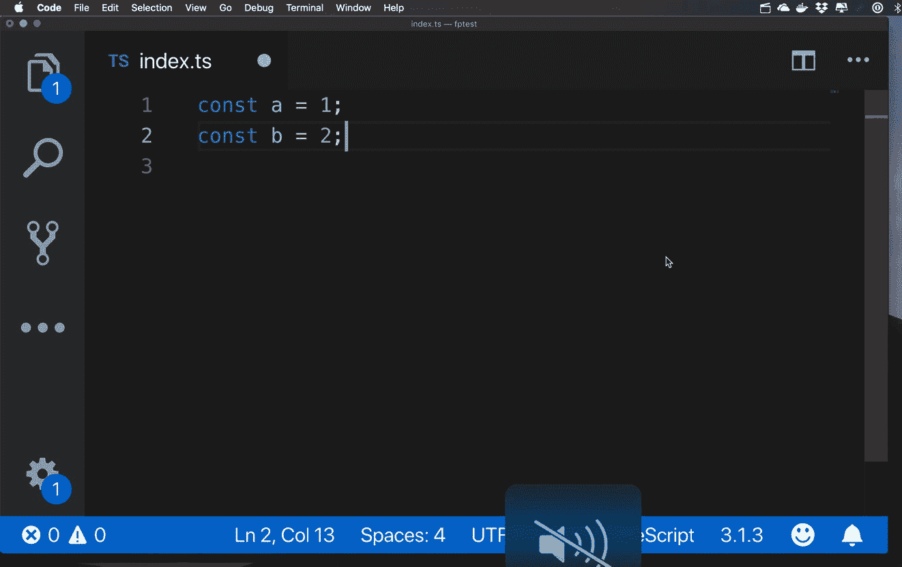

# 忘记在 nodejs 应用程序中设置环境变量

> 原文：<https://medium.com/hackernoon/forgetting-to-set-environment-variables-in-nodejs-apps-1f45ff113ce5>

## TL；博士`yarn add --dev faceplant`

你已经开发了你的杀手`express`应用。它通过了单元测试、集成测试、端到端测试...你如此满足，以至于你把代码打印出来，钉在冰箱上。您部署到生产环境中，但是几个小时后，您就收到抱怨，说该服务或多或少完全无用。您翻遍了调试日志，但毫无用处——没有明显的错误，测试也通过了，所以您的用户一定是夸大其词了。全部都是。

或者您可能忘记了在生产中设置环境变量。

从我的经验来看，这是经过充分测试的生产应用程序中服务失败的头号来源，这在 Meeshkan 也引起了 it 部门的不满。

为了解决这个问题，我们制作了`[faceplant](https://github.com/Meeshkan/faceplant)`，一个用于生产工作负载的 TSLint 插件。目标是用类似`tslint --project . && ts-node dist/server.ts`的东西替换类似`ts-node dist/server.ts`的启动命令，以便在生产环境中完成林挺步骤，如果 lint 检查没有通过，服务将很快失败。

这个包中的第一个规则`no-unset-env-variables`，允许您检查以确保您的 env 变量在开发和生产环境中都被设置了。有从`.env`文件读取或使用实际环境的选项。您甚至可以让它检查代码中不存在的变量。所有这些加起来就是更安全的生产代码和更愉快的开发体验。



Ah, linting. Saving Meeshkan’s production environment since 2018.

如果你以前从未开发过 TSLint 插件，那就太容易了。我们使用这个[伟大的样板](https://github.com/eranshabi/tslint-custom-rules-boilerplate)来开始，并弄清楚如何通过遵循[这个报告](https://github.com/cartant/rxjs-tslint-rules)中的约定使其为生产做好准备。

否则，当有疑问时，使用`[http://i-forgot-to-set-my-env-variable.com](http://i-forgot-to-set-my-env-variable.com)`。

```
axios.get(process.env.API_URL || "http://i-forgot-to-set-my-env-variable.com")
```

[拉动请求](https://github.com/Meeshkan/i-forgot-to-set-my-env-variable)欢迎光临！

