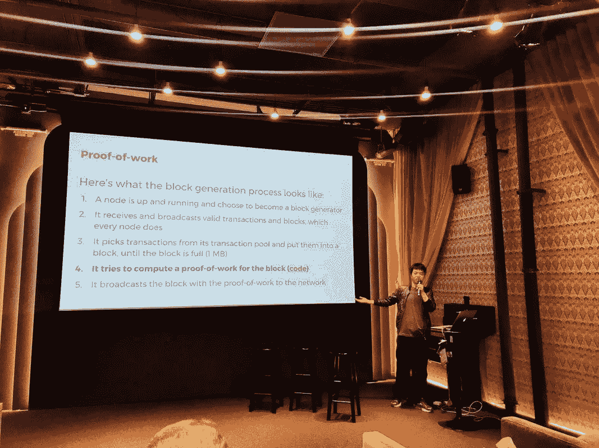
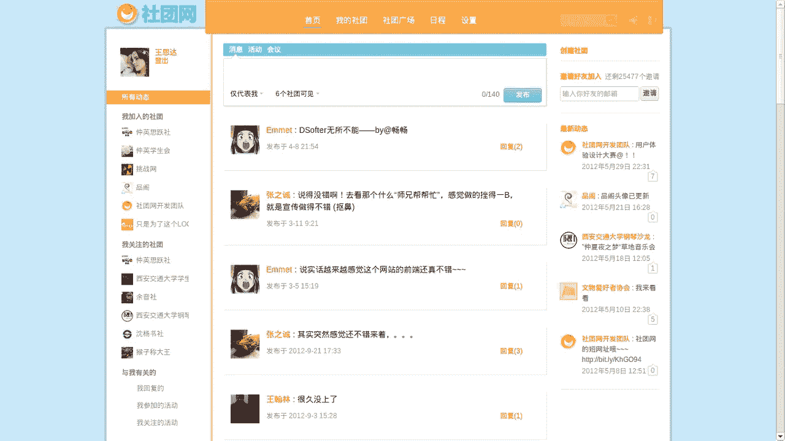
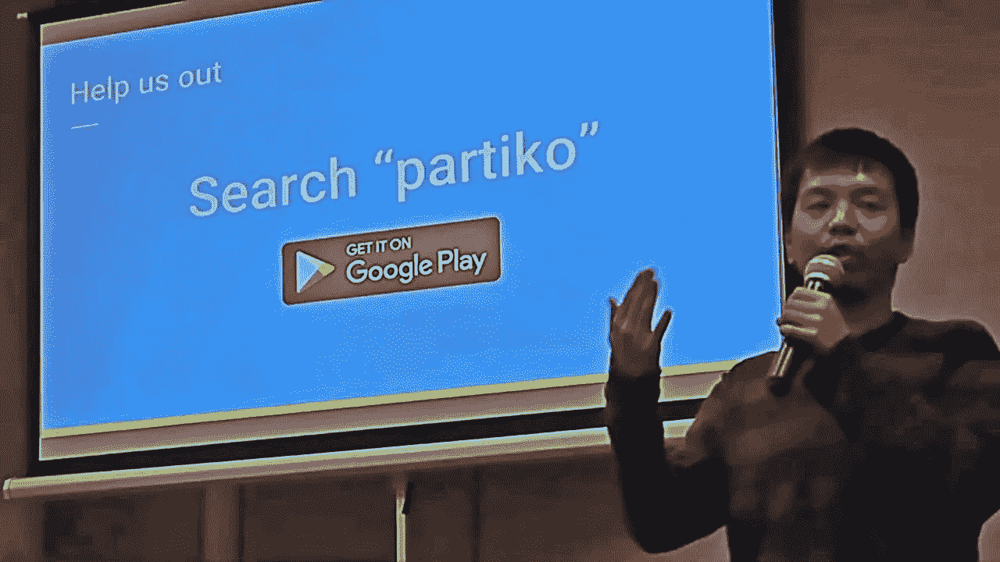

# 前 Airbnb 区块链领导者专注于主流加密

> 原文：<https://medium.com/hackernoon/former-airbnb-blockchain-leader-focuses-on-mainstreaming-crypto-8f09bf43a87b>

Sida Wang creator of Airbnb’s Blockchain community, Blockbnb

最近，我有机会采访了总部位于的 Partiko 的创始人 Sida Wang，你可能会惊讶地发现，他曾在 Airbnb 担任软件工程师。不仅如此，西达还是 Airbnb 的区块链社区 [Blockbnb 的创始人。](http://www.merinews.com/mobile/article/Technology/2018/7/20/software-developer-sida-wang-educates-silicon-valley-about-cryptocurrency/15931631)

Sida Wang 曾是旧金山 Airbnb 的一名软件工程师，直到最近，他决定全力投入他在区块链的初创公司 [Partiko](https://partiko.app/) 。

# 我很好奇他在 Airbnb 工作时学到了什么:

**Stellabelle:** 你编写的第一个程序是什么，当时你多大？

我 15 岁的时候用一种叫做 GV Basics 的语言编写了我的第一个计算机程序，那是一个贪吃蛇游戏。这个游戏在我的同学中流行起来，这激励我在高中期间开发更多的游戏。进入大学后，我开始学习 web 和 Android 编程，并为学生俱乐部建立了一个在线社区。

**Stellabelle:** 你最后是怎么加入 Airbnb 的？

**思达:**从莱斯毕业后，我收到了 Linkedin、脸书、谷歌和 Airbnb 的 offers。我不喜欢脸书出售用户数据的商业模式，所以它不适合我。此外，脸书、谷歌和 LinkedIn 太大了，我觉得我成长的空间会变小。另一方面，Airbnb 是一家快速增长的初创公司，正在颠覆酒店业务，我喜欢他们基于佣金的商业模式。他们产品的设计很吸引人，这引起了作为产品人员的我的共鸣。我觉得很幸运，我选择了 Airbnb，它后来成了我加密之旅的起点。

**Stellabelle:** 我刚刚得知你建立了 Airbnb 的区块链社区 Blockbnb，并邀请了比特币基地的首席执行官 Brian Armstrong 作为你的一次活动的演讲人。你是如何让布莱恩·阿姆斯特朗在你的活动上发言的？

**Sida:** Blockbnb 一开始是一个非常小的 Slack 频道，我和 Airbnb 的一群 crypto 朋友在那里谈论关于 crypto 的一切。后来，它变成了技术讲座、聚会和客座演讲，在那里，我能够与 Airbnb 的更多人分享我的知识和激情。

Brian 实际上不是我们在 Blockbnb 的第一位演讲嘉宾，在他之前，我邀请了 Ripple 的 Stefan Thomas、Scalar Capital 的 Linda Xie 和 Consensys 的 Alessandro Voto。我第一次见到布莱恩本人是在旧金山的一次聚会上，他在 Airbnb 的工作经历对他产生了巨大的影响，给我留下了深刻的印象。我觉得他是和 Airbnb 的人谈论 crypto 的最佳人选，会后我给他发了邮件，问他是否会来，他说会。

在 Airbnb 工作期间，你学到的最重要的东西是什么？

**Sida:** 在 Airbnb，我学会了如何打造和发展一个产品。我学会了如何为 Airbnb 的主流采用减少摩擦。我在 Airbnb 负责即时图书功能，我们看到它在主机上获得了巨大的成功。

**Stellabelle:** 你是如何以及为什么从 Airbnb 跳槽到区块链的初创公司 Partiko 做全职工作的？

**Sida:** 你可能知道，在我离开 Airbnb 之前，我建立了 [Partiko](https://partiko.app/) 移动应用程序作为一个附带项目。我从用户那里看到了如此好的反馈，它做得非常好，有 40%的保留率和 10%的周环比增长率，这非常令人鼓舞。制作 Partiko 是我帮助 crypto 成为主流的使命的延伸。

**Sida:** 一旦你意识到发送价值就像发送电子邮件一样简单，你就会明白它将如何改变一切。一旦你尝到了加密的潜力，你就再也回不去了。自从在 2016 年了解比特币以来，我知道我必须在帮助大规模采用加密技术方面发挥作用，我拥有担任这一确切角色的技能和记录。仍然有很多障碍，但只要正确关注用户体验，我相信这是可以做到的。

看看王思达的创业公司 Partiko: [的](https://partiko.app/)