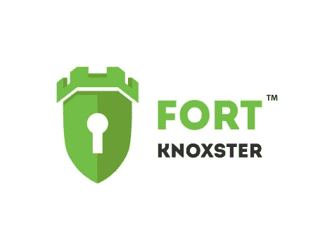

# Fortknoxster:去中心化、安全的通信平台，不收集区块链上的用户数据

> 原文：<https://medium.com/hackernoon/fortknoxster-decentralized-secure-communication-platform-that-does-not-collect-users-data-on-the-cbac4e9f81f6>

**什么是 Fortknoxster？**

Fortknoxster 是第一个分散的安全通信和协作平台，旨在允许参与者通过通话、msg、电子邮件、群聊、视频通话、附件和 p2p 文件共享来交换信息。

该平台利用区块链创建一个对等网络，在该网络中可以使用高度安全的端到端加密来发送数据，同时它的分散式 p2p 架构实现了一个透明、自给自足的生态系统，该生态系统可以由用户维护，然后用户可以对他们的努力进行奖励。

**福特诺克斯特解决了什么问题？**

Fortknoxster 旨在为所有互联网用户提供高度安全的加密通信服务，并取代免费服务，如脸书、谷歌、微软和苹果提供的收集用户数据并将这些信息出售给最高出价者的服务。

在当今时代，保护数据变得比以往任何时候都更加重要，随着物联网将几乎每台电子设备都连接到在线服务器，黑客利用有价值数据的机会越来越多。

例如，除了敏感数据在不使用加密的情况下很容易被截获之外，新一波连接到互联网的设备可以很容易地提供你的行踪、习惯和日常生活等信息。

尽管加密软件相对容易使用，但它通常与计算机科学家和技术极客联系在一起。Fortknoxster 旨在通过创建一种面向所有计算机和移动用户的加密服务来打破这种误解，无论他们的技术知识水平如何。

根据普华永道进行的一项研究，大型和小型企业都目睹了在线安全漏洞的急剧增加，超过 80%的企业经历过某种形式的攻击。考虑到针对一个拥有 500 名员工的企业的黑客攻击的平均成本据说总计约为。350 万美元，实施 Fortknoxster 可能节省的收入非常可观。

当前的加密服务采用集中式模型，其中一方负责保护数据。尽管这些数据可以被匿名存储和加密而不被利用，但是它仍然带来了很高的安全风险，因为任何试图获得对这些数据的访问的黑客都可以通过攻击单个实体来实现。

创建一个基于区块链技术的点对点平台分散了信任，并将其置于用户拥有的匿名数字身份的手中。这种透明且不可变的分类帐不能被修改，因此用户身份不能被泄露。

该平台还允许将安全责任分散到网络上的多个不同用户或节点。这样，任何希望获得数据访问权的黑客都需要同时攻击多个系统，以破坏安全性并暴露敏感数据。

【Fortknoxster 是如何工作的？

Fortknoxster 建立在以太坊区块链的基础上，使用智能合约来自动促进订阅服务的交易，并为参与维护平台的人发放奖励。

它在客户端浏览器中使用 RSA 密钥对、两组椭圆曲线(EC)密钥对和 6 个密钥保护器(每个私钥一个)的组合，以提供任何其他服务都无法比拟的安全级别。这些密钥对网络上的协议和服务进行加密，每个协议和服务都需要加密和解密密钥对。密码使用加密散列法加密，加密散列法将密钥扩展 10，000 倍以上，以创建极其强大的字符串。

所有的加密都发生在用户的设备上，任何通过 Fortknoxster 服务器发送的敏感数据都是在一个加密的密钥容器中完成的。

通过其高度安全的加密 FortKnoxtster 提供了一种安全的方式与他人沟通。系统功能支持以下形式的安全通信:

**电子邮件收件箱**

使用 Fortknoxster 发送的所有邮件都是端到端加密的。

**分布式文件存储**

云中服务器上的数据分类是通过加密完成的。

**聊天**

Fortknoxster 的加密技术还可以保护通过聊天发送的任何通信。这包括一对一聊天、语音消息、群聊等等。

**来电**

语音通话被加密以防止外部监控的窥探。

**群组通话和会议**

电话会议和文件共享也是加密的。

**屏幕共享**

屏幕共享是一个旨在帮助协作的附加工具，可以以安全可靠的方式完成。

**直观的仪表盘**

该平台的所有功能和加密工具都易于查看和访问查看仪表板 GUI 适用于 iOS、Windows、Android 和 Linux 上的桌面和移动设备。

该平台需要大量的云存储来运行，这些云存储将由用户自己通过对等网络上的 IFPS 来提供。用户将能够出租他们硬盘上的空间，并获得 FKX 令牌作为回报。

任何用户都可以成为存储矿工。它需要安装适用于 Mac、Windows 和 Linux 的软件，提供一个 ERC20 令牌钱包地址来接收付款，然后选择要分配多少磁盘空间。

用户还可以因其他行为而获得奖励，例如向其他用户推荐平台、持续使用服务以及报告可能出现的错误和/或其他问题。

**FKX 令牌**

Fortknoxster 平台上的所有服务都将使用 ERC20，FKX 令牌进行购买。将制造固定数量的 1.35 亿枚代币，其中 89.25 万枚将在 3 月 18 日结束的大拍卖中售出。