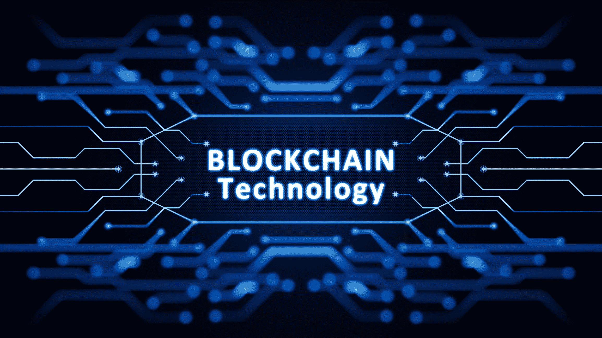

# 商业区块链论坛(B4B)

> 原文：<https://medium.com/hackernoon/forum-blockchain-for-business-b4b-6dccac88053a>

## **区块链作为一项创新技术，对公司来说也非常重要**

Image: [FHO Fachhochschule Ostschweiz](https://www.fho.ch/)

*André Matter 将于 2018 年 11 月 22 日在圣加仑举行的商业区块链论坛(B4B)上发表演讲，分享他关于 n'cloud.swiss ICO 拓展新市场的经验。*

业务经理和 IT 经理都在热烈讨论区块链这一热门技术。决策者越来越多地看到区块链有可能开发新的颠覆性商业模式并创造新的创新。基于区块链的应用程序的潜力和可能的好处是多方面的。如果你想把它们用于特定的应用领域，通常会出现一系列的问题。这包括基于区块链的应用程序在行业中的可实施性，还包括要考虑的数据的敏感性和技术限制。然而，关键问题是区块链技术如何真正帮助企业。第一个也是最著名的用例主要出现在数字货币比特币和流行的众筹方法初始硬币发行(ICO)的背景下。ico 代表了一种为世界各地的公司(及其项目)筹集资金的新方式。

Image: [Ethereum World News](https://ethereumworldnews.com/how-the-ethereum-eth-blockchain-is-powering-the-next-generation-of-pharma-innovation/)

为了回答开放的问题，填补空白，并以实用的方式指出区块链对公司的可能性，IFU-FHS 商业管理研究所于 2018 年 11 月 22 日组织了商业论坛区块链。在介绍过程中，将为随后的经验报告和实例创建一个知识库。全天的网络机会使得与各种专家互动和接触成为可能。

瑞士云提供商 n'cloud.swiss AG 的创始人兼董事长 André Matter 是演讲嘉宾之一，他将与他们的 ICO 分享向新市场扩张的经验。作为一家在 IT 和云解决方案领域进行国际化运营的高素质服务提供商，该公司已经在多个国家开展业务，并致力于在全球范围内成为领先云提供商(如 Amazon AWS 或 Microsoft Azure)的瑞士替代者。

Image: [n’cloud.swiss](https://www.ncloud.swiss)

创新、以解决方案为导向和远见卓识是 André Matter 的首要任务。2009 年，他创建了第一批欧洲“云”之一，名为 n'cloud，与谷歌和阿里巴巴同时出现。不出所料，该公司通过其创新中心支持合作伙伴实施新的 IT 和云技术，在多个业务线和用例中开展令人兴奋的项目。例如，这些项目包括区块链、机器学习、边缘计算、人工智能和大数据项目。

**注:**

“商业区块链”论坛将于 2018 年 11 月 22 日星期四上午 8 点 30 分在圣加仑大卫街 42 号的 Lagerhaus 餐厅举行。所有讲座都用德语。注册和更多信息，请访问

Image: City of St. Gallen, Switzerland