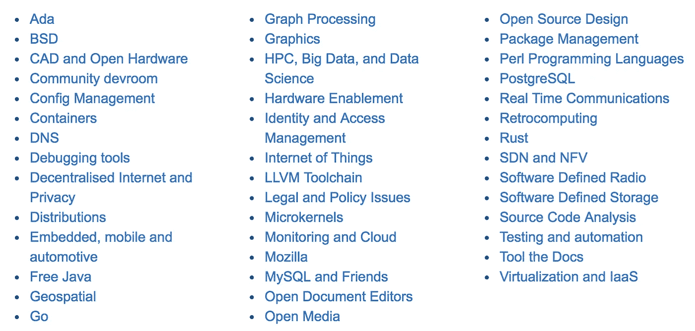
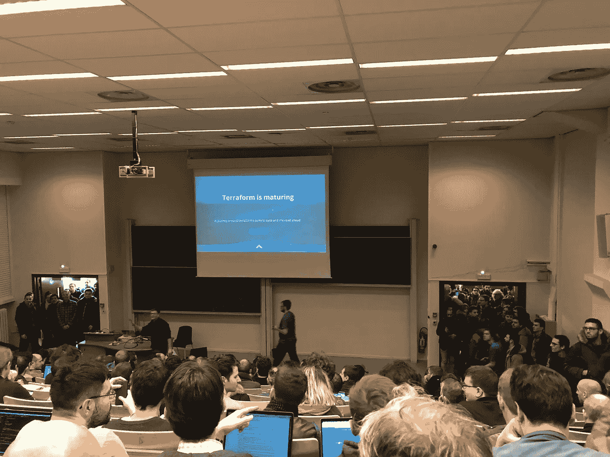

# 福斯德姆:比以往更受欢迎

> 原文：<https://medium.com/hackernoon/fosdem-more-popular-than-ever-87e886c2e4d2>

> 8000 个极客。
> 
> 42 间卧室。
> 
> 在布鲁塞尔呆两天。
> 
> 0 名名人励志演说家。
> 
> 零成本进入。

A popular talk in the main FOSDEM theatre.

这是我参加过的最轻松的科技会议。部分原因是因为它发生在周末，在你自己的时间里。但另一部分是因为它根本不是一个真正的会议，而是一个巨大的开源聚会。再深入一点，它实际上是大约 40 个全球开源社区聚集的地方。这些是 devrooms，其中的曲目由他们自己的开源社区组织。相遇的相遇。

42 devrooms

像其他会议一样，有一个严格的演讲时间表，但没有注册费和报名费。入场以先到先得的方式进行。而且还有很多爆满的房间。尤其是今年，我被 5 个房间拒之门外。但是也有很多人在闲逛，聊天，写代码，喝啤酒。所有这些都有助于增强放松的感觉。你还能见到好久不见的朋友。我和罗布·拉祖尔斯和朋友们聊得很开心(还吃了牛排)。

免费和开源软件给它一个完整的名称，或者对那些知道的人来说是 [FLOSS](https://www.gnu.org/philosophy/floss-and-foss.en.html) ，这就是这次会面的目的。正因为如此，它吸引了许多极客。也没有那么多穿西装的极客(或者如果你在美国工作，也许是穿斜纹棉布裤的极客)。与大多数科技会议不同，即使是企业极客也是少数。相反，会议的焦点吸引了为开源项目做出贡献的极客们。这带来了一种不同的氛围，有点像另类技术会议的氛围。我喜欢它。

所以 FOSDEM 是开源本身的一面镜子。它是免费的。都是关于基层的。它没有任何市场，但有很多价值。它有不同的内容。这是一个社区网络。它是由社区志愿者组织起来的。

一些最大的开源项目有商业组织出售围绕代码的服务。这些组织通过出售帮助和支持，有时还有独家的“企业”特性，帮助推动企业采用开源。你可以看到赞助其他会议的大公司，比如谷歌、RedHat 和 AWS。除此之外，他们的影响是微妙的。值得庆幸的是，没有像其他会议那样的“赞助式会谈”,就像为公司做产品植入广告一样。他们是 FOSDEM 社区中更自然的一部分。例如，一个社区的人做了一个关于 Terraform 的演讲，他将 Terraform 的成熟度与 Puppet 的成熟度进行了比较——但是在演讲过程中，他叫出了听众中的 Hashicorp CTO。

# 趋势开源

Everyone in the doorways were turned away from this one.

开源产品的流行可以与 FOSDEM devrooms 的流行相关联。从我今年看到的情况来看，这意味着加密货币、Go、Postgres、容器和配置管理是热门。这并不奇怪，

*   容器仍然是最受欢迎的技术之一。
*   有人认为，随着 Kubernetes 等容器编排工具的兴起，配置管理已经达到顶峰，但是容器管理的发展空间仍然很大。
*   Postgres 仍然是[最受欢迎的开源数据库](https://db-engines.com/en/ranking_trend),对关系存储、文档存储和企业需求具有强大的吸引力。
*   围棋是一个有趣的游戏。我还没有看到很多企业采用 Go。但是[的人气](https://opensource.com/article/17/11/why-go-grows)暴涨，似乎是开发商推动的[。](https://www.infoworld.com/article/3177310/application-development/googles-go-popularity-doesnt-translate-to-the-enterprise.html)
*   几乎可以肯定的是，加密货币是 2017 年被大肆宣传的技术，突破了技术圈，吸引了主流。

# Unix 历史的教训

我最近一直在思考软件行业的不成熟。这是一个非常年轻的职业，与医学等古老的职业相比，以及与汽车和公用事业部门等工业革命行业相比，都只是一个婴儿。我们在软件技术方面有非常大的变化。所以工程师们总是期待着下一个新事物。正因为如此，工程师不会花太多时间去思考软件的历史。但是福斯德姆有一整首歌都是关于历史的，我认为这是对科技狂热的一剂绝妙的解毒剂。

Unix talk 的历史是一个很好的案例研究。我们认为软件的半衰期很短。也许 5 年。最多 10 年。然而，第一个 Unix 代码是在 20 世纪 70 年代早期创建的。那是 45 年前的代码。[发表演讲的 Diomidis Spinellis](https://fosdem.org/2018/schedule/speaker/diomidis_spinellis/) 整理了一份 github repo，其中包含从 70 年代到最新 FreeBSD 的所有现存 PDP、Unix 研究版和 BSD unix 源代码历史。这个 [repo](https://github.com/dspinellis/unix-history-repo) 是 Unix 发展的一个迷人来源。

70 年代早期的许多思想仍然存在于今天的 Linux 发行版中——内核、文件系统、虚拟设备、管道、过滤器、shell、C、动态内存、虚拟机、正则表达式。显然一些代码仍然存在。通过比较今天的[架构图和 1971 年](https://dspinellis.github.io/unix-architecture/arch.pdf)的[研究版的架构图，你可以看到重叠之处。我们能从中学到什么？对我来说，这是加入许多更小更简单的东西的成功，以及对抽象和模块化的有效利用。](https://dspinellis.github.io/unix-architecture/arch-V1.pdf)

早期决定的不仅仅是好的设计或代码。由于早期关于手册页的决定，Unix 发行版中的文档仍然保持如此高的质量。早期的发行版强制要求提供这种文档，并强制删除任何没有手册页的用户命令。明显严厉但有效。

# Monero，比特币 2.0？

2017 年加密货币已经闯入主流。我们现在在[看到超过 100 种加密货币](https://coinmarketcap.com/all/views/all/)，它们可以被开采、交易、窃取，有时还可以用于购买。投资者吵着要投资下一个比特币。风险投资公司正在支持新的加密货币，独立硬币发行(ICO)已经进入投资者对话。当然[开源对加密货币](https://coincenter.org/entry/what-is-open-source-and-why-is-it-important-for-cryptocurrency-and-open-blockchain-projects)至关重要。

许多大型加密货币都是开源软件，以比特币为首。看看 GitHub 里的[比特币代码。鉴于以比特币为首的加密货币的目标是利用数学和独立分配作为信任，提供一个去中心化的货币系统，这是有道理的。开放增加信任。当然，这并不是说没有必要信任开源或加密货币。取而代之的是信任区块链、加密货币客户端或智能合约的开发者。这就是一个](https://github.com/bitcoin/bitcoin)[以太坊钱包漏洞如何让以太从他们的区块链](https://medium.freecodecamp.org/a-hacker-stole-31m-of-ether-how-it-happened-and-what-it-means-for-ethereum-9e5dc29e33ce)被“偷走”的。

总之回到 FOSDEM(很容易被加密货币分散注意力)。我(和其他数百名与会者一起)听了 Monero 的一位贡献者的精彩演讲。 [Monero](https://getmonero.org/) 是一种新的开源私有加密货币。XMR 目前的价格为 272 美元，按市值计算是第 13 大加密货币。但我们在福斯特姆不是为了钱。

在此之前我从未听说过 Monero。被形容为“比特币 2.0”。这不正是所有加密货币的目标吗？嗯。显而易见的是，比特币作为一种货币面临重大挑战。

比特币的供应量是有限的(这是设计出来的)。因此，社区内部进行了漫长而恶性的大规模辩论，不可避免地会有那些没有赢得辩论的人推出新的加密货币。它使用越来越大的工作量来挖掘(通过设计)。不利的一面是，这意味着我们正在使用越来越多的电力来创造新的硬币，这些硬币之所以有价值，只是因为信任(而不是因为它们开采起来有多困难)。[冰岛显然比国内更多地用于采矿。它的开采已经变得地理上集中:据说大部分比特币开采都在中国，使用专用硬件和廉价电力。中国的回应是最近取缔了。它也不是匿名的。比特币交易被公开存储在区块链上，当你与某人交易时，你会看到他们的身份以及他们之前用这个身份进行的所有交易。](http://fortune.com/2018/02/13/iceland-bitcoin-mining-electricity/)

Monero 希望通过一种匿名的私人数字货币来解决这些问题，这种货币与现金(隐私倡导者喜欢的原始匿名、限速纸币)非常相似。它使用环密钥而不是单个密钥来减少追踪交易到一个私钥的可能性。将来它将使用 i2p 多层路由来减少发送者 IP 追踪的可能性。他们的工作证明也设计为使用大量 RAM (2Mb ),试图阻止 ASIC 矿商大规模工作。

那么 Monero 会成功吗？不知道。毫无疑问，我们现在正处于加密货币的蛮荒之地。少数人是比特币百万富翁。更多的人想成为加密货币百万富翁。最终，真正有价值的加密货币的数量将会减少。我怀疑那些成功的人会有他们支持者之外的价值。如果 Monero 真的成为现金的数字等价物，并且保持匿名、私有和去中心化，这对许多人来说将是有价值的。*

# 继任计划

对于关心未来的企业高层领导来说，继任规划是一个必须讨论的话题。所以当我听到有人谈论自由/开源软件的接班人计划时，我感到很惊讶。当然，许多开源社区关心他们项目的未来，所以他们对继承感兴趣。但是对于开源来说，这不仅仅是领导层的更替，而是任何一个关键贡献者角色的更替。

精英管理是开源社区中经常提到的东西。 [Vicky](https://fosdem.org/2018/schedule/speaker/vm_vicky_brasseur/) 指出，尽管这很好，但如果没有对优点进行定义，并且没有允许他人成功的指导计划，精英管理就是隐性歧视。我认为这是一个很好的观点——精英管理需要明确和清晰的描述才能有效。[就像红帽做的](https://opensource.com/open-organization/16/6/presenting-framework-meritocracy)。

# 资助开源

XWiki 创始人 Ludovic Dubost 向我们讲述了他的[资金模式和开源](https://fosdem.org/2018/schedule/event/community_oss_in_small_company/)的商业模式。他描述了 XWiki 代码是如何开源的，被许可为 LGPL。但是他创建了一个盈利组织[来提供商业 SAAS XWiki。因此，如果你想自己开发，就使用开源代码，但是如果你想让别人来运营和管理云服务，你可以付费订阅。他们还提供一些付费模块(这在其他营利性组织中很常见)。这是一个有趣的模型，随着越来越多的软件转向云服务，看看这是否会变得普遍将会很有趣。Ludovic 还描述了他的公司如何获得非风险投资的资助，因为这与开源不兼容。他告诉我们，风险投资导致投资者赚钱的首要地位，这不是开源的意义所在。](http://www.xwiki.com/en/)

# 安全剧场

开源**对于信息安全来说是强制**吗？一位关于[安全剧院](https://en.wikipedia.org/wiki/Security_theater)的发言人认为是的。如今很少有人相信开源不安全——这种观点已经被[质疑很多年了。但是是不是*更*安全？我还没有看到任何证据来支持这一点，但我确实同意公开](http://www.zdnet.com/article/six-open-source-security-myths-debunked-and-eight-real-challenges-to-consider/)[编码有一个心理上的好处，那就是鼓励更好的安全实践(以及更好的实践)。](https://gds.blog.gov.uk/2017/09/04/the-benefits-of-coding-in-the-open/)

开放的确会让事情变得更好。公开编码的团队知道他们不能隐藏在晦涩的背后，所以这改变了他们的方法。开发人员知道其他人会查看他们的代码和提交注释，所以他们会以不同的方式处理。这是开源/公开编码的一大优势。

当然还有一些不太有趣的演讲。但我不会关注这些，因为这是每个科技会议都不可避免的。相反，我将用一个问题来结束我的演讲:

> 为什么比利时的薯条比其他国家的薯条好吃那么多？

mmm belgian frites double-cooked in horse/cow fat

你可以查看今年以来的所有福斯德姆演讲，或者在 YouTube 频道观看其中的大部分。