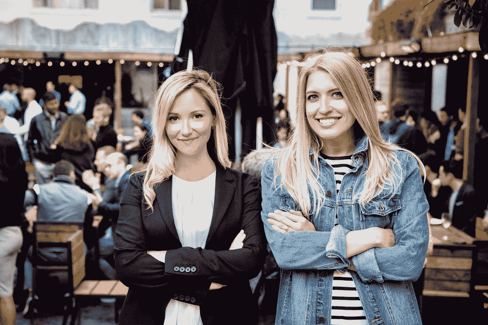

# 创始人大使馆为国际创业者打开硅谷大门

> 原文：<https://medium.com/hackernoon/founders-embassy-unlocks-silicon-valley-for-international-founders-5008cf3cbf59>

是时候让进入硅谷民主化了。这就是我们创办创始人大使馆的原因。这是第一个加速器，其使命是为国际企业家提供联系、资本和知识，以在美国或美国建立成功的公司。通常，这些资源是专为拥有常春藤教育背景的特权创始人保留的，他们看起来像是最后一批大 CEO。因此，我们在旧金山推出了一个为期两周的无股权训练营式加速器，为顶级全球创业公司提供了一个进入技术中心的入口。

我们的计划将于 2018 年 5 月 30 日推出第一批创业公司，提供三大类支持:金融资本、人力资本和社会资本。

初创公司每天都经历着排得满满的研讨会和活动。他们了解下一轮融资的来龙去脉，从关注哪些里程碑，到向风险资本家推销，再到谈判交易条款。我们的创始人会见招聘、移民、法律、管理、工程、销售和发展方面的专家，让他们获得运营优势。通过个性化的指导会议和下班后的社交聚会，他们将建立一个社区，在整个创业旅程中帮助他们。这一切在 6 月 5 日创始人大使馆的无国界峰会上达到高潮，在那里，他们将享受来自硅谷英雄的演讲，并向一群顶级投资者推销他们的创业公司。

Founders Embassy 是为种子期后、首轮融资前的初创公司设计的，这些公司已经巩固了他们的产品，并正在获得巨大的吸引力。它的独特之处在于，它不从参与公司那里获取股权，而是收取合理的现金费用。它也不需要长时间的停留，因为离开一个团队回家的机会成本可能是巨大的。被选中的公司并不需要 5 万或 10 万美元的支票来启动。他们正在寻求帮助，准备在下一轮融资中筹集 200 万、500 万或 1000 万美元。TechCrunch 欧洲自由编辑 Mike Butcher 写了关于我们的文章，指出“大多数加速器都需要大量的股权，如果一家公司的估值合理，比如 3000 万美元，那么这些股权对这些公司来说就是一大笔钱。相反，通过(创始人大使馆)向初创公司提供支付现金以被引入硅谷生态系统的机会，他们可以保留自己的股权。”

每个班的课程都是根据具体的行业和初创企业的需求量身定制的。我们为每家公司招募思想领袖和匹配导师，以便他们能够受益于领导者在其垂直领域的丰富经验，从物流市场到增强现实再到按需运输。除了硬技能，他们还将学习硅谷的规范和技巧。这意味着如何在微妙的网络竞争中胜出，以及该信任哪些投资者或合作伙伴。此外，作为一个逐年成长的俱乐部的一部分，创始人将与他们的同事建立终身联系。

要真正为每个人打造产品，科技行业必须拥有多元化的视角。作为两位女性创始人，爱尔兰公民 Andee Gardiner 和俄罗斯移民 Anastasia Crew，我们看到了进入这一领域有多难。我们之前运营了加拿大顶级加速器 C100，它将该国最好的新公司带到旧金山来筹集资金和接受指导。但在一起举办 50 多场活动时，我们发现每个国家都有创业者需要一座通往硅谷的桥梁。对于寻求刺激就业创造的投资者和政府来说，被忽视的国际创业公司是明天的增长机会。

## 遇见创始人大使馆 2018 年夏季班:

我们的创始计划欢迎来自世界各地的一批杰出的创始人。这些初创公司正在应对各自国家的严峻挑战，并开发适用于全球的解决方案。所有人都是种子期后投资，团队人数从 4 人到 15 人不等，他们已经准备好带领他们的公司进入下一个阶段:

[Load-Me](https://www.load-me.com/)

[BUSSI](https://www.bussi.com.mx/) (墨西哥，墨西哥城)——为通勤者创建众包路线以建立可靠的按需交通的 vanpooling 平台。

[Backpacker College](https://backpackercollege.com/) (加拿大多伦多)——Backpacker College 的业务是帮助学院、大学和专业住宿提供商销售空房，供旅行者预订，并帮助他们寻找和分享当地的美好体验。

[Myra Mirrors](https://myramirrors.com/) (美国/波兰)——Myra Mirrors 寻求重新定义增强现实，并改变开发者为智能表面创建应用的方式。

STEMN (澳大利亚悉尼)——科学与工程开源网络。面向团队协作的云原生开发者工具。

**它是如何工作的？**

鼓励国际创始人在创始人大使馆[网站](https://www.foundersembassy.com/apply/)上申请该项目。申请和面试由一个遴选委员会审查，该委员会由硅谷的风投、创始人和在种子期后评估公司方面有经验的高管组成。然后，被选中的创始人会被邀请和他们团队中最多一名成员一起参加这个项目，在此期间，创始人会在旧金山市中心的同一个屋檐下生活两周。

对于 2018 年夏季班，创始人大使馆将把创始人带到整个城市的独特空间。会议将在 Bespoke、Covo、500 Startups、WeWork 和 Runway 等场所举行。在这里，他们将会见他们匹配的导师，并参加由我们的[思想领袖](https://www.foundersembassy.com/thoughtleaders/)领导的投资者圆桌会议和研讨会。研讨会的例子包括“揭开硅谷的神秘面纱”、“构建网络的艺术和科学”、“如何发展你的初创公司——找到产品市场契合度的万无一失的方法”、“在初创公司预算上扩大国际销售团队”、“建立战略伙伴关系”、“从风险投资的角度看市场规模”等等。

除了为期两周的逗留，他们还将在 6 月 5 日举行的无国界峰会[上，面对超过 75 名硅谷投资者，以及来自湾区最知名公司的其他创始人和高管，进行“演示日”式的推介。](https://www.foundersembassy.com/borderless-summit/)

全天的峰会阵容将包括 Robinhood 创始人 Baiju Bhatt、Twitch 创始人 Justin Kan、Indiegogo 创始人 Slava Rubin、Omni 创始人 Thomas McLoed、Zum 创始人 Ritu Narayan 和 Anomalie 创始人 Leslie Voorhees Means 等。来自安德森·霍洛维茨、红杉、GGV、社会资本、地球村、通用催化剂、脱离电网和 Plexo Capital 的合作伙伴也将在舞台上加入我们。节目将解决全球创业社区目前面临的挑衅性话题和挑战，从关于当前政治格局和跨境合作的对话到融资机会、颠覆性技术和新兴市场。小组讨论和炉边会议包括:“风险投资的多样性”、“投资国际创始人”、“如何吸引客户”、“建立低于 1000 美元的国际供应链”、“新市场扩张剧本”、“区块链意味着全球机会平等”、“避免人力资本错误”、“城市化和共享经济”、“资本即服务:通过数据实现风险民主化”，以及其他内容，包括移民创始人的故事、创业演示和作为闭幕鸡尾酒会一部分的喜剧表演。

下一步是什么？

下一届创始人大使馆课程将于今年秋天登陆三藩市，[目前已经在这里开放申请。公司不需要考虑搬迁到美国，申请受到国际创始人和已经居住在美国的移民企业家的欢迎。](https://www.foundersembassy.com/apply/)

伟大的创业公司来自世界各地。我们想让他们尽最大努力发挥影响力。如果你想帮助我们建设一个更具包容性的硅谷，请在这里申请成为正式的创始人大使馆思想领袖。

申请 Founders Embassy 2018 秋季班或者推荐一家公司[在这里](https://www.foundersembassy.com/apply/)。

在此提议研讨会或会谈[。在此查询赞助机会](https://docs.google.com/forms/d/e/1FAIpQLSceRhafhQxzNbNJfum0QETVVVmytm_V3a-jah6u81p0kBgIMQ/viewform)[。](https://www.foundersembassy.com/contact/)

**在 TechCrunch** [**这里**](https://techcrunch.com/2018/05/15/founders-embassy-equity-free-accelerator-aims-to-unlock-the-valley-for-internationals/) **查看并分享我们的官方发布故事。**