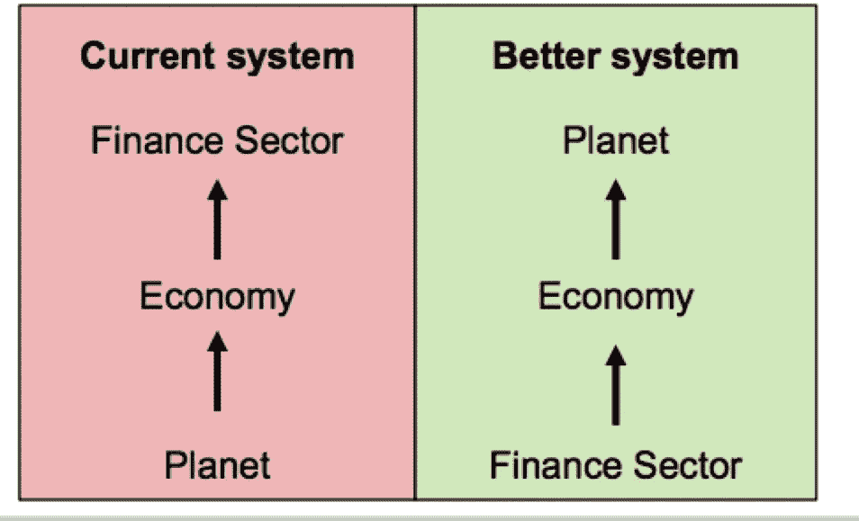

# 当前第四次工业革命的四大趋势

> 原文：<https://medium.com/hackernoon/four-major-trends-in-the-current-fourth-industrial-revolution-dd915145d69f>

我一直致力于一个项目，以确定 350 年后的大趋势。这是一个很好的练习，因为人们意识到我们通常不会考虑这样的时间框架，而这需要很多原创的想法。幸运的是，寻找当前第四次工业革命开始时的趋势，时间跨度约为 60 年，要求不那么高，但同样重要。自 18 世纪后期以来，有四种主要技术或相关技术被引入，成为创新和创业的典范(工业革命)。由于这些工业革命，自 1800 年以来，全球人均 GDP 增长了 14 倍，而人口仅增长了 7 倍。

本文的其余部分摘自我的新书《4IR 中的投资和创业机会》中的一章

在我们讨论代表最佳机会的行业之前，我认为我们需要首先确定将塑造 4IR 的重要社会、经济、政治和环境趋势。这些趋势是:

1.自然和人造系统之间的冲突

2.经济、社会、政治和环境角色背景下的变化中的城市

3.人类的进化

4.平台作为主导商业模式的出现。

**自然和人造系统**

罗马俱乐部强调了第一种趋势，如下所示。该图表提出，为了人类的生存，我们需要颠覆当前的价值体系。今天，我们利用地球上的自然资源来推动经济发展和创造财富。在这个系统中，回报和财富自然流向资本，即投资者。

诺贝尔奖获得者埃莉诺·奥斯特罗姆将这种情况描述为“公地悲剧”。“我们在世界上可以观察到的是，无论是国家还是市场，在使个人能够长期、有效地利用自然资源系统方面，都没有取得一致的成功。”尽管如此，在 21 世纪，如果我们不改变模式，我们很可能面临灭绝，可能的结果是我们需要将地球置于所有其他优先事项之前。从历史上看，由于我们在信息论中称之为信号问题，这种改变几乎没有进展。在这种情况下，信号问题是无法预见未来的事件。非洲的原始布希曼人只需要大约十分钟的时间范围…就能决定狮子是否会吃掉他。五十年的预测是不相关的，这也凸显了人类预测的风险(当你阅读这本[书的剩余部分时请记住这一点](https://hackernoon.com/tagged/book))。

因此，我们面临着灭绝，一个我们看不到的问题，而经济体系将投资者的回报放在了首位。现在你知道为什么马斯克和贝佐斯正在建造火箭作为撤离地球的后备策略了。

**城市角色的转变**

城市是社区的现代表现形式，其组织旨在提供社会和经济优势之间的平衡。联合国的预测显示，到 2050 年，城市人口将增加 25 亿。今天，54%的世界人口生活在城市地区，根据联合国的数据，这一比例预计到 2050 年将增加到 66%。据估计，2050 年全球人口将达到 99 亿，其中 65 亿将居住在城市。十个最大的城市中有八个位于沿海。对经济可行性的需求解释了为什么如此多的城市位于世界各地的海岸线上。城市在历史上和现在的成功都是围绕着它们在全球贸易中作为商业和金融中心的成功，全球贸易起源于海洋。这些沿海城市的活力解释了为什么大约 40 %- 50%的世界人口居住在海岸线 100 公里以内。

展望未来，我们看到世界上很大一部分人口居住在沿海城市，由于许多因素，他们会受到海平面上升、极端天气和洪水的影响。这些风险因素解释了为什么如此多的城市关注他们的恢复力。复原力方面的学术权威卡尔·福尔克斯将这个术语解释为:

“复原力方法强调非线性动态、阈值、不确定性和惊奇，渐变时期与快速变化时期如何相互作用，以及这种动态如何在时间和空间尺度上相互作用。”

复原力突出了保护城市在时间和空间方面的复杂性，随时受到不可预测的“黑天鹅”[【4】](#_ftn4)自然和社会事件的影响。许多城市位于海岸线附近，这使得情况变得更加复杂。芬兰社会学家埃斯科·基尔皮将成功的复原方法描述为:

“在复杂的环境中，通往活力和弹性的道路是成功元素的不断重组，以创造新的版本，其中一些可能会茁壮成长。”

问题变成了城市是否可以采用这种迭代方法来解决问题。

解决问题的新方法将因城邦的出现而变得更加复杂。今天，东京、雅加达或圣保罗周围的大都市人口通常超过 3000 万，大约相当于秘鲁的总人口。这种经济、社会和政治力量在数量上的集中，使得最大的城市有能力作为自治代理人或城邦行事。环境问题的压力只会促使城市更多地掌控自己的命运。

另一个鼓励城市控制的因素是，我预计联邦政府的控制范围将会缩小。如前所述，今天我们生活在一个实时信息的世界。服务和客户体验是在那一刻定义的，而不是在检查书面文件后的两周之后。在这个实时场景中，唯一有机会发挥作用的政府级别是市政府。联邦政府和州政府可以根据预期需求预先安排资源，但这种昂贵的替代方案可能被认为不切实际。

鼓励联邦和州政府缩减规模的是不断出现的多功能网络和更新的网络安全区块链。这些技术使当地居民有可能在不需要政府参与的情况下组织和执行地方法规。这种自我调节、自我监督的环境是埃莉诺·奥斯特罗姆在她关于自治社区的作品中探索的一个领域。在真正的自治能力的激励下，公民可能会将他们的治理范围从地方环境项目扩大到国家和全球贸易事务。在那里出现了一个新的城邦，一个由有动力、有权力的个人组成的网络系统，能够在世界范围内为个人和社区的自身利益服务。

**人类的进化**

4IR 的大部分故事是技术。4IR 的大部分风险是我们失去了人性。风险的性质很复杂。一方面，我们可能看不到自动驾驶汽车或使用机器人担任公司董事的道德问题。更微妙的是，我们可能看不到机器学习系统调整得如此之好以至于“控制”购买或推荐过于昂贵的假期有什么问题。现状偏见也很容易掩盖对某些社会生物学趋势的认识。例如，“美国人口普查局在 2000 年首次允许人们选择一个以上的种族类别来描述自己。从那时起，这个国家的多种族人口大幅增长。在 2000 年至 2010 年间，美国白人和黑人混血儿的数量增加了一倍多，而拥有白人和亚裔背景的成年人增加了 87%。据加州大学欧文分校的社会学家称，到 2050 年，混血人口将占到美国人口的五分之一。欧洲正在经历类似的趋势，但数据并不容易获得。随着世界权力向印度和中国转移，这个多种族的西方人口在许多方面可能是一个更有吸引力的合作伙伴。

类似于种族混合的变化，性别正在经历重新定义。自 20 世纪 90 年代以来，LGBTQ(女同性恋者、男同性恋者、双性恋者、变性者、酷儿)一词一直被用来提高对性行为多样性和非异性恋相关人群的认识。这种多样性有助于围绕繁殖提出一个相关的问题。自 20 世纪 20 年代以来，随着妇女权利的演变，女性对生育的控制力增强了。随着人们对性的理解越来越多样化，也许人们会被不同地归类。另一种可能性是，生殖将通过将胎儿转移到外部环境中生长和发育的技术来完成。在这种对繁殖的考虑中，技术已经达到了现在人类基因组可控的地步。在这个我们将权衡技术和道德的基因组问题上，干预人类基因组给了我最大的担忧。鉴于人类在管理环境方面的糟糕记录，是什么让人们认为我们会在基因组方面做得更好呢？有人甚至会问我们是否应该篡改基因组。许多人预见这个问题会减轻许多患有各种残疾的儿童的痛苦。也许更有可能的是，它将被用来解决老龄化问题。例如，65 岁以上的美国人的比例接近百分之二十。美国人现在通常能活到 100 岁，一些未来学家认为寿命可以达到 140 岁。这些老龄化人口，他们的护理和生活质量，是 4IR 中人类问题的另一个方面。基因组干预可能被用来解决老龄化问题。我开玩笑地说，我可能是“最后一代死去的人”。由于人口规模庞大，地球的资源变得捉襟见肘，环境问题挑战人类作为一个物种的生存能力，基因组干预可能就是沉船的问题。

**平台的出现**

在第四章“信息检索技术”中，我讨论了软件设计网络的重要性及其三种商业模式——平台、市场和社交网络。当我们展望未来时，我看到技术创造了一个更加平等的社会，允许个人从他们的信息、服务以及最终的生产中获取价值。最成功的模式将是“平台”，其中价值主要由供应商和客户共享，而不是由平台所有者共享。这一系列特征将支持微型企业的发展和传统上由大公司内部承担的职能的外包。网络的低成本、低进入壁垒特征将创造以个人为中心的经济生产力，类似于工业革命前的经济。那时，权力和财富都集中在君主国，而其他人都生活在匮乏之中，这需要个人关注经济福祉。今天，随着财富集中在 1%的人手中，99%的人可能会面临类似于 18 世纪或 15 世纪的稀缺。今天，唯一的区别将是微型企业将由技术而不是体力劳动来支持。

这种通过平台的微型创业的增长部分解释了亚马逊和阿里巴巴等公司的成功。在《哈佛商业评论》最近的一篇文章中，阿里巴巴员工曾鸣解释了他们的成功:

“我们意识到，阿里巴巴的特别创新在于，我们真正在构建一个生态系统:一个有机体(多种类型的企业和消费者)的社区，它们相互之间以及与环境(在线平台和更大的离线物理元素)相互作用。我们的战略当务之急是确保平台**提供在线业务成功所需的所有资源或资源访问权**，从而支持生态系统的发展。”

重点是我的，它强调平台不必直接提供所有资源。这种方法为平台提供了额外的灵活性，以管理生产力、效率和服务组合，从而最大限度地为供应商微型企业家和阿里巴巴创造价值和获取价值。

财务分析一章中的市场估值证明了这种模型的成功。亚马逊在 2017 年的市场估值中排名第四，阿里巴巴排名第七。虽然有人可能会说，我只是展示了成为 1%的一部分的途径，但我更愿意想到所有通过平台销售而受益的微型企业家。

根据所呈现的趋势，我们现在可以转向最有可能受到 4IR 影响的行业。

**本文表达的观点是我个人的观点，并不代表我所属的任何组织或项目的观点。**

[【1】](#_ftnref1)[http://www . un . org/en/development/DESA/news/population/world-城镇化-prospects-2014.html](http://www.un.org/en/development/desa/news/population/world-urbanization-prospects-2014.html)

[【2】](#_ftnref2)[http://www . un . org/en/development/DESA/news/population/2015-report . html](http://www.un.org/en/development/desa/news/population/2015-report.html)

[【3】](#_ftnref3)[http://www.oceansatlas.org/subtopic/en/c/114/](http://www.oceansatlas.org/subtopic/en/c/114/)

[【4】](#_ftnref4)黑天鹅(Black Swan)一词是纳西姆·塔勒布(Nassim Taleb)在一本同名书中创造的，用来描述大规模的随机事件，如 2007 年至 2008 年的金融危机。

[【5】](#_ftnref5)[https://www . Forbes . com/2010/02/01/移民-多种族-超级大国-观点-专栏作家-Joel-kotkin . html # 657 cc 529316 e](https://www.forbes.com/2010/02/01/immigration-multiracial-superpower-opinions-columnists-joel-kotkin.html#657cc529316e)