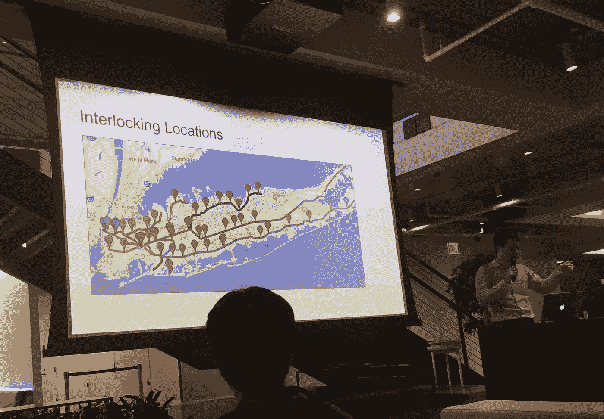
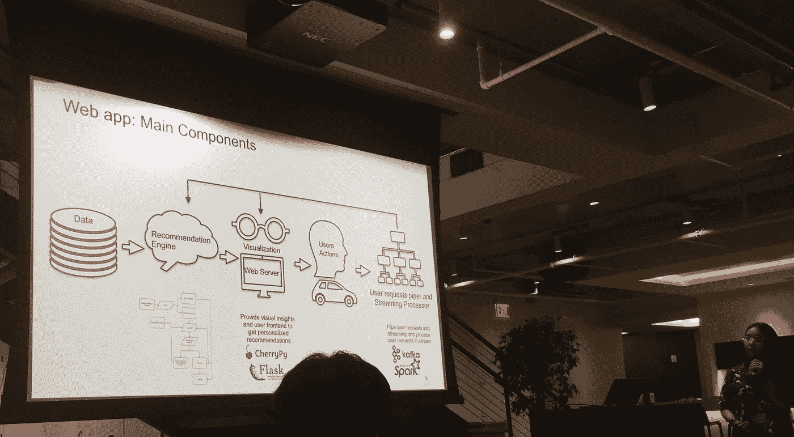
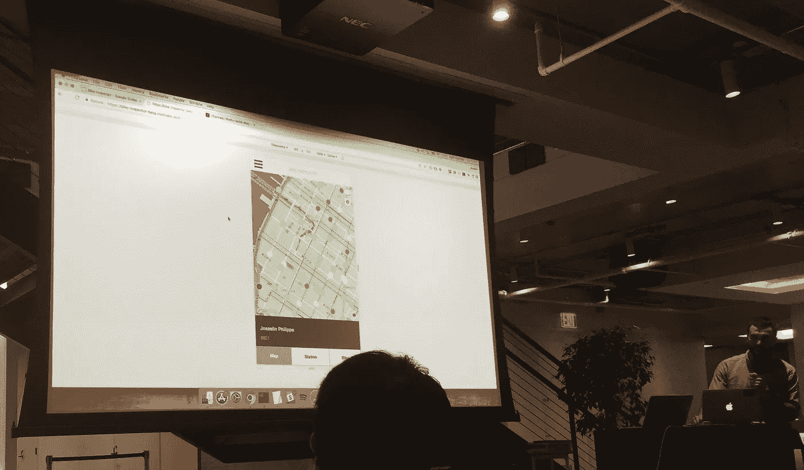
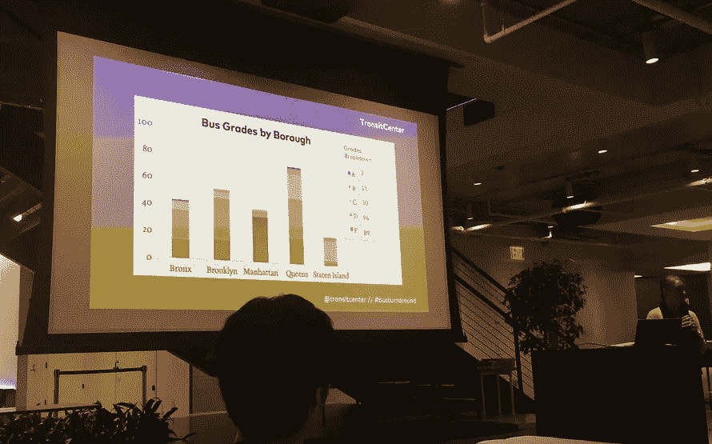
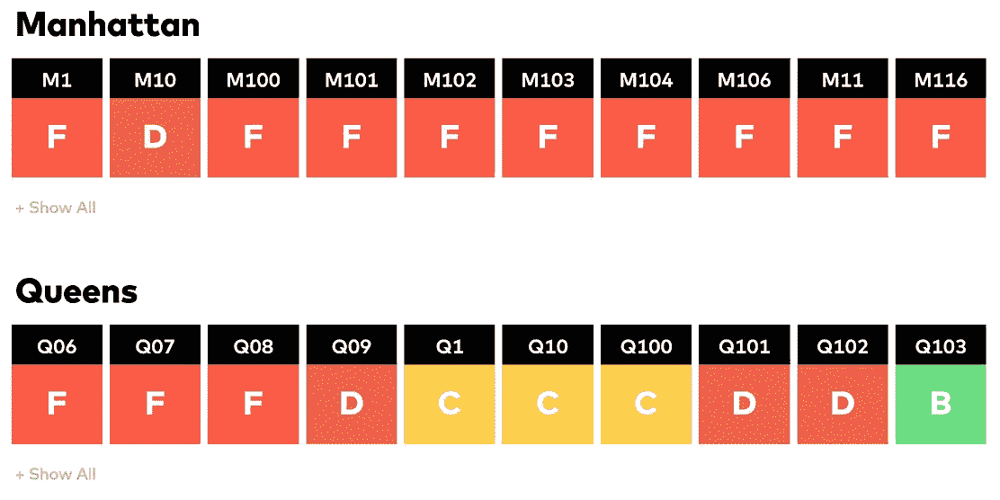

# 改善纽约市交通的四个项目

> 原文：<https://medium.com/hackernoon/four-projects-improving-transportation-in-new-york-city-905fb4cd8bac>

*快速回顾第二届*[*Transit Techies NYC*](https://www.meetup.com/Transit-Techies-NYC/)*Meetup:*[*第二大道 Segfaults*](https://www.meetup.com/Transit-Techies-NYC/events/249954509/) *，于 2018 年 7 月 11 日星期三举行*

纽约市的交通系统对数百万人来说至关重要。除了 MTA 的地铁和黄色出租车，通勤者和旅行者还依靠地区通勤铁路和 MTA 的公交网络进出城市。在过去的五年里，自行车共享计划和按需交通突然出现在纽约的交通领域。

这些都是第二届纽约交通技术会议的话题，会议在哈德逊码头的十字路口总部举行。大约 100 名交通技术人员聚集在一起，讨论和学习如何利用[技术](https://hackernoon.com/tagged/technology)改善纽约的交通系统。在一顿丰盛的晚餐后，我们开始了四场预定的会谈。下面是这次活动的简要回顾！

# LIRR 信号数据

[来自 MTA 的 Will Fisher](https://twitter.com/wafisher) 解释了长岛铁路(LIRR)如何与传统铁路信号系统合作，以更好地向员工和客户通报当前的列车性能。LIRR 是全国最繁忙的通勤铁路网，随着时间的推移，积累了许多互联系统来管理铁路信号。信号和联锁由七个系统控制，由不同的供应商在不同的时间实施。

LIRR 陷入了困境:这些关键系统中的一些不再被维护，也不能被修改以添加功能或提取数据。遗留系统很难使用，LIRR 不得不进行创新。

为了解决这个问题，Will 的团队正在开发一个程序，该程序使用光学字符识别(OCR)从实时图形用户界面(GUI)收集轨迹数据。然后，将轨道区段和联锁建模为图中的节点；然后，该图可用于计算和报告性能数据，如预期到达时间。

# 按需移动的目的地推荐器

NYU 大学的研究生 Assel Dimitriyeva 接下来介绍了如何构建一个动态推荐引擎来改进按需移动解决方案。无法使用常规公共交通的老年人或残疾人依靠辅助交通移动服务(例如，纽约市的乘车服务)在城市中出行。按需辅助运输服务极其昂贵，提高它们的效率可能意味着这些公民可以负担得起的流动性。

Assel 的项目使用[多臂强盗](https://en.wikipedia.org/wiki/Multi-armed_bandit) (MAB)方法和 Yelp 数据，为 paratransit 服务的用户推荐替代的、更近的目的地。动态推荐更接近用户的相似目的地可以减少旅行距离和成本。考虑一组用户旅行到一组目的地，该问题使用 MAB 建模。然后，Yelp data 提供目的地作为上下文感知推荐引擎的输入，该引擎解决了 MAB 问题，并推荐相关的替代目的地。

# **自行车检查员被激励**

来自美国 9 个城市的主要自行车共享运营商 [Motivate](https://www.motivateco.com/) 的 Alex Hill、David Bromwich 和 Josselin Philippe 展示了一款名为 Bike Inspector 的内部工具。在所有计划中，包括纽约市的花旗自行车，Motivate(最近被 Lyft 收购)负责 30，000 多辆自行车，这些自行车需要为骑行者保持安全和可操作性。这些自行车需要定期维修，或者当骑车人报告问题时。

然后，Motivate 的自行车机械师必须在现场或内部商店维修这些自行车；在大城市定位、检查和修理自行车是一项巨大的物流挑战。自行车检查员最初是由 Josselin Philippe 在他还是一名机械师时开发的，它为自行车机械师提供了一个直观的地图界面，供他们在现场使用。他们可以在 Bike Inspector 中查看哪些码头有需要维修的自行车，诊断问题，并报告维修情况。

有了 Bike Inspector，Motivate 可以更有效地派遣机械师到需要维修或检查的自行车码头。自行车检查员目前在纽约测试。

# 数据驱动倡导更好的纽约公交车

Right: [Report cards](http://busturnaround.nyc/#bus-report-cards) from Bus Turnaround Coalition

来自运输中心的 Mary Buchanan 讨论了纽约人如何联合起来倡导纽约市更好的公交车。四分之一的纽约人住的地方离地铁站不到几步之遥，他们依靠公交车出行。不幸的是，乘客人数多年来一直在稳步下降，可能是因为拼车服务赢得了客户。随着乘客人数下降，资金减少导致服务恶化，在恶性循环中将乘客人数推得更低。

与运输中心合作的一群纽约人组成的[公交周转联盟](http://busturnaround.nyc/)，正在利用数据来对抗糟糕的公交服务。该联盟使用 MTA 的实时公交数据来计算纽约市公交线路的速度、准点率和发车间隔。他们使用这些指标在公交系统上生成报告卡，给每条公交线路分配一个字母等级(A-F)。根据他们的方法，246 条公交线路中有 183 条(74%)获得了 D 级或 F 级。

如果你想支持公交车周转联盟，在这里了解更多关于帮助#公交周转运动[。](http://busturnaround.nyc/#take-action)

非常感谢[泰勒·格林](https://twitter.com/greent_tyler)和[高智晟](https://twitter.com/kohzy)组织这次聚会！你可以在这里了解(并加入)纽约交通技术公司[。](https://www.meetup.com/Transit-Techies-NYC/)

*如果您喜欢这份摘要，请👏下面这篇文章。请关注我的媒体简介，了解* [*未来*](https://hackernoon.com/tagged/future) *交通和可持续发展会议的概要！*

*看看我对第一次纽约交通技术会议的总结:*

*   [*#TransitTechiesNYC:就职聚会的快速回顾*](/@pranavbadami/transittechiesnyc-a-quick-recap-of-the-inaugural-meetup-b7c3a81428f2)