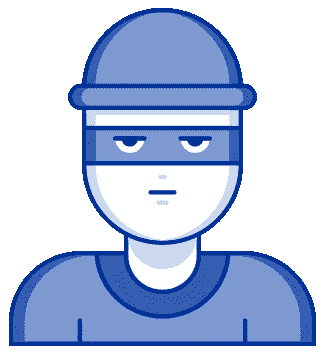

# 控制退款的四个技巧

> 原文：<https://medium.com/hackernoon/four-tips-to-get-chargebacks-under-control-81b361e4c7f2>

作为一个在线企业主，退款是你日常生活的一部分。但这并不意味着你必须接受它们并继续前进。事实上，有很多方法可以自动减少退款，而不必手动回复每一个案例。

首先，我们来详细讨论一下退款的工作原理和分类。**退款通常分为两种不同的类型:友好欺诈和刑事欺诈。**善意的欺诈通常只是买家的懊悔或健忘。有时候，这是否认——“我丈夫不可能看这种网站！”无论哪种方式，它都不是有组织的，也不总是恶意的。一位客户只是想要回他们的钱，他们已经与银行采取措施来得到这笔钱。

另一方面，刑事欺诈恰恰相反。有人想免费得到一些东西，或者想要你的钱，他们正在用非常有创造性的、不光明正大的方式追求。他们甚至可能向你发送大量交易以收取介绍费，然后撤销所有交易。他们甚至可能是你的竞争对手，试图抬高你的退款，降低你的利润，减少你的现金流。

**这不是妄想——这是经营高容量在线业务的现实。**你可以翻身，也可以反击。幸运的是，有非常有效的方法可以显著减少这两种类型的退款。你永远不会归零，但是通过策略和技术的正确结合，你将能够保持更多你辛苦赚来的收入。

# 让我们从刑事欺诈开始:

这里的游戏是在犯罪欺诈发生之前，在订单的时间。通过使用购买时提供的数据和自动评分方法来防止接受高风险订单，您可以显著降低退款百分比。以下是每笔交易中您需要关注的一些关键数据点:

*   **交易速度:**有多少次有相似的指纹(姓名、地点、信用卡号、IP 地址等。)在过去 5 分钟内是否被用于尝试订单？过去一小时？过去 24 小时？过去一周？
*   交易金额:交易金额是多少？欺诈风险较高的并不总是大额交易。
*   **交易属性一致性:**订单是从香港的 IP 地址发出的，但卡是在美国发行的，发货地址在非洲？当一些事情看起来不对劲时，它通常是不对的——寻找像这样的大的不一致是在你上当之前发现欺诈的一个很好的方法。

## 当我们谈到交易指纹和属性时，有几个关键标识符您应该特别关注:

**设备指纹:**每台电脑和浏览器组合都有自己唯一的指纹。即使欺诈性买家设法在交易之间更改或掩盖他们的 IP 地址(通过 VPN 服务和先进的重新路由技术)，他们的设备指纹将保持不变。

**为什么设备指纹很重要？**根据您提供的产品，客户在 7 天内进行多次购买可能是正常的，但同一设备指纹在 7 天内为 7 个不同的客户进行购买则非常不正常。发现这一点，你就可以停止欺诈。

**银行识别码(bin):**通常，这是信用卡账号的前六位数字。比如 464018 是在美国发行的 Chase Rewards Visa 卡。通过了解这些数字的含义，你可以寻找不一致的地方。

**GeoIP:** 如果由用户 IP 地址确定的地理位置与他们的运输和账单信息明显不同，您可能需要密切关注。

**付款和发货国家:**确保这些国家的情况与你收集的其他数据相似、一致，比如 GeoIP 和 BIN。

**交易响应:**订单审批后，再取消也不迟。如果同一张卡在几分钟后尝试另一个订单，并且您收到卡被盗的回复，您应该采取行动取消任何先前的费用并防止任何未来的费用。此外，确保您使用 AVS(地址验证服务)和 CVV 匹配检查(3 到 4 位数的卡验证值)进行所有交易。

**最后，考虑销售线索来源:**订单是通过什么活动来源、推荐链接、代销商或子代销商产生的？您是否注意到退款和销售线索来源方面的任何新兴或既定趋势？

# 黑名单和灰名单:自动对抗欺诈

自动化犯罪欺诈防范的最有效方法之一是通过黑名单和灰名单。创建并维护黑名单以添加交易标识符(信用卡号、设备 ID 等。)永久禁止向您购买。当客户试图使用您黑名单上标记的账号或指纹向您购买商品时，交易将被完全阻止发送到支付网关。

灰名单是相似的，但他们不是永久的。它们通常用于临时阻止弱属性，如经常变化的住宅 IP 地址。永久封锁住宅 IP 地址可能会阻止合法订单，因为该 IP 地址可能会在几天或几周内被重新分配给新的家庭。在这种情况下，对交易实施 7 天的封锁可能比永久封锁更有意义。

# 善意的欺诈:你最好的防御是一次好的进攻

捕捉和补救善意的欺诈可能有点棘手。偶尔是重复订单的结果。这意味着寻找连续发生的相同购买，并与客户核对，可以帮助防止可能成为退款的情况。

一些企业还注意到，在某些垃圾箱中，友好欺诈的倾向略高，这可能表明，具有类似行为和偏好的类似人员可能比其他人更有可能进行友好欺诈。这通常是对的，但是要小心不要做出笼统的假设。目标是防止欺诈，而不是歧视。

那么你能做什么呢？减少善意欺诈的最佳、最有效的方法是向你的客户提供如此多的价值，以至于他们不会后悔。不后悔，不反悔。具有竞争力的价格，提供卓越的服务，销售具有价值和质量的优质产品，您将比过度承诺和交付不足的竞争对手享受更低的友好欺诈率。

除了提供卓越的价值之外，您还可以遵循一套标准的业务实践，这也可以大大降低您友好的欺诈退款率:

**查看 TC-40 报告。**当 Visa、Mastercard、American Express、Discover 和其他主要信用卡品牌(方案)发现欺诈时，它们会在 TC-40 报告中进行报告。通常情况下，这些大型诈骗团伙还没有变成退款，但预计会变成退款。在它让你付出代价之前，抢先一步。

**在客户服务的第一线。**多达 80%的友军误击退款是因为客户懒得主动与商家解决问题，或者发现问题太难解决。让客户能够轻松处理退货和换货，并通过在线和电话解决争议。

*照片由* [*奎诺亚尔*](https://unsplash.com/photos/xhGMQ_nYWqU?utm_source=unsplash&utm_medium=referral&utm_content=creditCopyText) *上* [*下*](https://unsplash.com/?utm_source=unsplash&utm_medium=referral&utm_content=creditCopyText)

# 提供优质客户服务防止退款的四个技巧:

**快接电话，每次都是。**解决*每一个*问题——即使这意味着退款——在它变成退款之前。使用[好的呼入呼叫中心软件](https://www.softwareadvice.com/call-center/)，监控你的服务水平和解决方案，并对设定高客户服务期望保持警惕。(您可能想知道 2018 年及以后是否需要电话客户支持— [您需要](https://www.helpscout.net/blog/history-of-phone-customer-service/)！)

**审核您的客户体验。假装你是自己的顾客。跟随他们的旅程——从遇到你的广告或联盟活动，到购物和购买过程。完成几次购买，并确定您可能存在的不足之处，这些不足之处可能会影响、迷惑或误导客户。在改进流程和信息传递的过程中，寻找转化率和清晰度之间的最佳平衡点。**

**对交易响应代码采取行动。**“被盗卡”响应代码可能意味着您客户的卡被盗，或者他们就是小偷。不要等到退款时才发现是哪一个。在履行交易之前，就不确定的交易与客户联系，以避免不必要的费用和罚款。[点击此处](https://www.rebilly.com/five-decline-definitions-to-empower-retries/)了解更多关于响应代码以及如何对其采取行动的信息。

**也审核您的取消和降级流程。**客户取消你的服务有多容易？如果你很难取消，他们每次都会扣费，而且不仅仅是一次交易，而是经常是几个月的定期订阅费。尽可能多地保留，让他们更容易选择低价产品，或者干脆取消。

*本帖最初发表于*[*the Rebilly blog*](https://www.rebilly.com/blog/how-to-reduce-chargebacks/)*。*