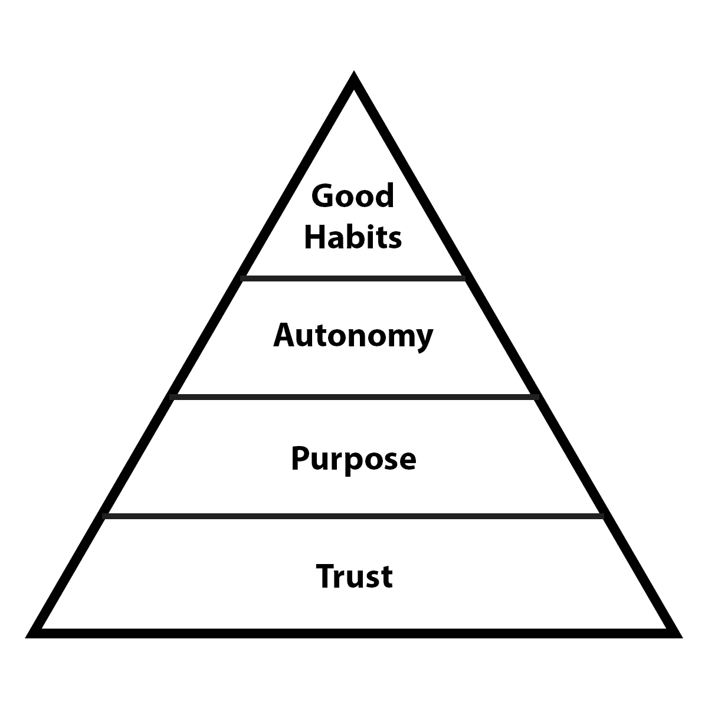
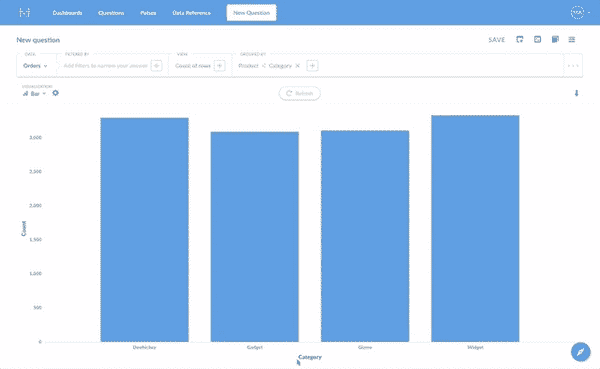

# 带领你的软件团队走向成功的四种方法💪

> 原文：<https://medium.com/hackernoon/four-ways-to-lead-software-team-to-success-43fa156719b4>

## 技术团队仅靠天赋是无法成功的

[Matteo Vistocco](https://unsplash.com/photos/Dph00R2SwFo)

这篇文章是写给任何想要提升团队绩效和凝聚力的人的。它讨论了运行团队时需要记住的 4 个关键要素。非常适合团队领导、经理、主管和首席技术官。此外，对于作为团队成员的工程师来说也很棒，他们不一定是处于领导地位的。一家公司最好的文化转变始于基层。

**长话短说:**

*   投入大量时间在你的团队中建立真正的信任。拥抱好的冲突和讨论，不要回避。
*   **给你的团队一个目标。衡量并分享团队在自身、产品和业务方面取得的进展。确保团队知道他们构建产品的*和*原因。**
*   **自主孕育了创造性的问题解决方式。雇佣合适的人，为成功建立支持结构。放弃控制。不要微观管理。**
*   向你的团队灌输良好的习惯，比如每日站立或每周回顾。团队的肌肉记忆和纪律为持续改进的文化奠定了基础。

作为一名在不同创业公司工作过的软件工程师，我经历了很多领导软件团队的方法。有些是由你的裤子座位飞，打破一切，最终代码完成。其他人则被大量的流程和程序搞得精疲力竭。

然而，有一小部分团队已经找到了灵活性和过程的正确平衡。这些团队能够在一致的基础上为他们的利益相关者提供[商业](https://hackernoon.com/tagged/business)价值。

> 很少有团队能达到这种平衡。

看到如此广泛的团队及其动态，我将围绕 4 个关键部分总结我在科技公司的团队管理哲学。

信任是伟大团队动力和讨论的核心基础。给你的团队一种总体商业目标的使命感将会为你的团队创造伟大的工作建立内在的动力。伟大的产品只会来自拥有创造性解决问题的自主能力的团队。好的习惯和过程可以帮助你的团队以一种有纪律的、简洁的、容易预测的方式前进，最终让你的团队更快地前进。

# 1.信任

> “伟大的团队不会互相牵制。他们不怕公开自己的丑事。他们承认自己的错误、弱点和担忧，而不害怕报复。”
> 
> [-帕特里克·兰西奥尼，一支球队的 5 次机能障碍](https://www.amazon.com/Five-Dysfunctions-Team-Leadership-Fable/dp/0787960756)

对团队的真正信任会导致健康的冲突、承诺、责任和无私。团队拥有的这些品质与产品的成功，甚至是整个企业的成功有着直接的联系。

# **你信任你的团队吗？**

问问你自己:

*   **我能相信我们会彼此脆弱吗？**
*   我能指望团队中的每个人都努力工作吗？
*   **我能相信团队中的每个人都和我一样对团队(以及整个公司)有着同样的热情和愿景吗？**

当一个团队相互信任时，他们可以坦然面对自己的脆弱。他们更愿意承担风险，或者谈论一个不受欢迎的观点。他们觉得为一个想法做贡献是安全的，即使这是高风险的。看到团队在分享时没有被评判的感觉，是多么的开放和诚实，这很令人兴奋。

作为一名领导者，你应该承认自己的弱点和局限性，表明你在团队中也是脆弱的。你的团队会对他们自己的局限性感到更自在，因此这些习惯将开始建立一个伟大团队的第一个基础。

## 🚀帮助您入门的专业技巧:

*   和你的团队去一个不在现场的地方，在那里你可以做一些锻炼，比如个人经历和/或团队效率。这些对话可以开始打破建立信任、处理冲突、相互承诺以及团队目标所需的障碍。
*   对拉请求的对等代码审查有助于建立一种对漏洞感到舒适的心态。

# 2.目的

> “伟大和近视是不相容的。有意义的成就取决于提升自己的视野，朝着地平线前进。”
> 
> [-丹尼尔·平克，司机](https://www.amazon.com/Drive-Surprising-Truth-About-Motivates/dp/1594484805)

你见过这样的工程师吗？他只是想让某个特性的规格不被干涉。你曾经是那样的人吗？

在我的职业生涯中，我有几次是那样的人，每次我都因为没有正确理解我工作背后的目的而烧伤了自己。我太专注于让我的单元测试通过，以至于我甚至不理解产品需求。

当我不理解产品，不理解我们为什么要做这个产品，最重要的是不理解客户时，这个阶段就注定了我最终会精疲力尽。

我们每天起床，完成工作，然后回家。由于这种重复性，我们很容易把我们的目的和客户想当然。

> 当一个团队理解他们的工作对特定业务成果的贡献时，他们可以找到比$更深层次的动机。

你的团队可以通过建立 *x* 后端系统来激励，然后通过 *y* 新客户来激励，然后通过颠覆 *z* 行业来激励。

这创造了一个内在的动力，让你的团队看到他们的工作最终将如何改变市场。

问你的团队这些问题，看看他们是否知道“这到底是谁的目的？”

*   我在公司的目的是什么？
*   **我的团队的目的是什么？**
*   **我们公司的宗旨是什么？**

[Metabase](https://www.metabase.com/) can be a powerful tool for your team.

## 🚀帮助您入门的专业技巧:

*   根据你的团队正在开发的产品类型，让他们站在客户或用户的立场上跑一英里。让他们体验用户将会体验到的 UX。
*   试试 Reich 的代词测试，你的团队是用“他们”还是“我们”来称呼他们的公司？
*   开诚布公地谈论公司的运营情况。像 [Metabase](https://www.metabase.com/) 这样的指标报告软件允许任何员工查看公司的 KPI(关键绩效指标)/烧钱率。

# 3.自治

> 当你像对待孩子一样对待别人时，你就得到了孩子的工作。
> 
> [**——杰森炸**，**返工**，](https://www.amazon.com/Rework-Jason-Fried/dp/0307463745)

现在有了一个相互信任的有凝聚力的团队，是时候让你的团队发挥创造力和企业家精神了。

作为技术领导者，不要在技术堆栈和架构上做临时决策，而是询问您的团队。让他们对软件设计决策达成共识(在合理的时间内)

> 人多总比一个好，对吧？

您将开始看到对技术和业务问题的更优雅的解决方案。

假设你雇佣了正确的人，你的团队会认真对待这种新的控制和责任。在这些讨论中，他们会对产品和业务有最大的兴趣。

虽然许多人努力保持团队的积极性，但将自治作为一种策略实际上会使团队更加前进。

当你放手让你的团队继续前进时，问你自己这些问题:

*   我是否给了我的团队方向和意图，以及用他们自己的方式解决问题的空间？
*   我的团队对创造性解决问题如何帮助业务感到兴奋吗？
*   我是否让我的团队参与了团队和公司 KPI 的目标设定？

通过给创造性地解决问题留有足够的空间，而不确切地说如何解决，你将会用比薪水更多的东西来激励人们。

Photo by [rawpixel](https://unsplash.com/photos/lRssALOk1fU?utm_source=unsplash&utm_medium=referral&utm_content=creditCopyText) on [Unsplash](https://unsplash.com/search/photos/purpose?utm_source=unsplash&utm_medium=referral&utm_content=creditCopyText)

> 如果你将现实的目标、实现目标的工具以及实现目标的目的感摆在团队面前，它们每次都会给你留下深刻印象。

## 🚀帮助您入门的专业技巧:

*   下次有问题需要解决时，不要告诉你的团队需要做什么，而是让他们想出解决方案。
*   召集您的团队，进行一次[“自主审核”](https://www.danpink.com/audit/)
*   允许你的团队每周/冲刺/每月在指定的时间内持续进行其他项目。只要你的团队觉得舒服就行。他们通常会致力于对业务有益的事情。

# 4.好习惯

> “虽然纪律要求控制和禁欲主义，但它实际上会带来更多的自由。当你有早起的纪律时，你会获得更多的自由。”
> 
> [——乔科·威林克，极端所有权](https://www.amazon.com/Extreme-Ownership-U-S-Navy-SEALs-ebook/dp/B0739PYQSS/ref=sr_1_1?s=digital-text&ie=UTF8&qid=1527370859&sr=1-1&keywords=extreme+ownership)

随着当今世界技术的发展，很难预测下一个角落会发生什么。搞清楚产品或业务的下一步可能会变得令人不知所措，充满压力。

许多团队在他们的工作流程中使用不同的过程和结构，试图在不断变化的市场中保持灵活性。

他们通常没有意识到的是，模糊性和过程的缺乏实际上会如何伤害团队交付代码的能力。它没有给团队更多的自由，它让团队陷入没有系统的工作方式的困境。

团队想要实现的灵活性最终将通过规范的过程得到提高。

一个训练有素的软件团队将创建过程，并遵守这些过程。这使他们能够以持续和可预测的方式提供商业价值。当团队变得可预测时，它提供了一个试验创新想法和特性的良好氛围。

> 一个有好习惯的软件团队也会很有纪律性。

这一规程将腾出时间来尽可能地自动化那些系统，以确保它们跟上团队/公司的发展。

## 🚀帮助您入门的专业技巧:

*   开始你自己的早晨惯例，并建立良好的习惯。使用[这个](http://charlesduhigg.com/wp-content/uploads/2014/04/Flowchart-How-to-Create-a-Habit.pdf)框架来帮助你开始。一旦你体验到了从日常事务中获得的力量和自由，就和你的团队讨论他们喜欢什么样的好习惯作为日常事务的一部分。
*   与您的团队讨论' [Done](/@dannysmith/the-definition-of-done-what-does-done-actually-mean-ef1e5520e153) '对于完整的产品、功能、更新或 bug 意味着什么。达成共识，记录和/或自动化流程。
*   和你的团队一起创建一个大家都同意的[拉动式请求模板](https://www.azavea.com/blog/2017/05/08/github-pull-request-template-workflow/)。让团队成员相互负责。

**长话短说:**

*   投入大量时间在你的团队中建立真正的信任。拥抱好的冲突和讨论，不要回避。
*   **给你的团队一个目标。衡量并分享团队在自身、产品和业务方面取得的进展。确保团队知道他们构建产品的*和*原因。**
*   **自主孕育了创造性的问题解决方式。雇佣合适的人，为成功建立支持结构。放弃控制。不要微观管理。**
*   向你的团队灌输良好的习惯，比如每日站立或每周回顾。团队的肌肉记忆和纪律为持续改进的文化奠定了基础。

## 📖寻找更多关于管理优秀软件团队的灵感？

*   [凤凰计划](https://www.amazon.com/Phoenix-Project-DevOps-Helping-Business/dp/0988262592)
*   [目标](https://www.amazon.com/Goal-Process-Ongoing-Improvement/dp/0884271951)
*   [优势](https://www.amazon.com/Advantage-Enhanced-Organizational-Everything-Business-ebook/dp/B006ORWT3Y)
*   [习惯的力量](https://www.amazon.com/Power-Habit-What-Life-Business/dp/081298160X)
*   [一件事](https://www.amazon.com/ONE-Thing-Surprisingly-Extraordinary-Results/dp/1885167776)
*   [驱动](https://www.amazon.com/Drive-Surprising-Truth-About-Motivates/dp/1594484805/ref=sr_1_1?s=books&ie=UTF8&qid=1513878328&sr=1-1&keywords=drive+daniel+pink)
*   [做得更多更快](https://www.amazon.com/Do-More-Faster-TechStars-Accelerate/dp/0470929839)
*   [加速](https://www.amazon.com/Accelerate-Software-Performing-Technology-Organizations/dp/1942788339)
*   [关于硬东西的硬东西](https://www.amazon.com/Hard-Thing-About-Things-Building-ebook/dp/B00DQ845EA)
*   [简介](https://www.amazon.com/Brief-Make-Bigger-Impact-Saying/dp/1118704967)

