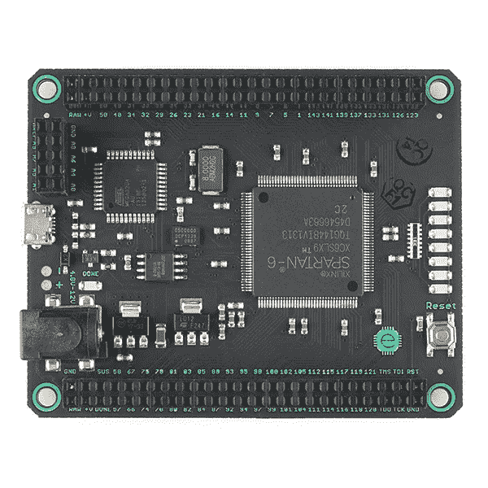

# FPGAs、SOC、微控制器——物联网设备概述

> 原文：<https://medium.com/hackernoon/fpgas-socs-microcontrollers-a-quick-rundown-of-iot-devices-c5a25c7290c6>

如果你是物联网领域的新手，你可能听说过许多术语和首字母缩写词，并想知道它们的区别，或者你是否应该购买 Raspberry Pi 或 ODROID。

Mojo FPGA board from SparkFun (randomly chosen to use as a sample board)

我对这些板如何互换使用感到好奇的主要原因是因为麻省理工学院嵌入式系统实验室的一些主要介绍…