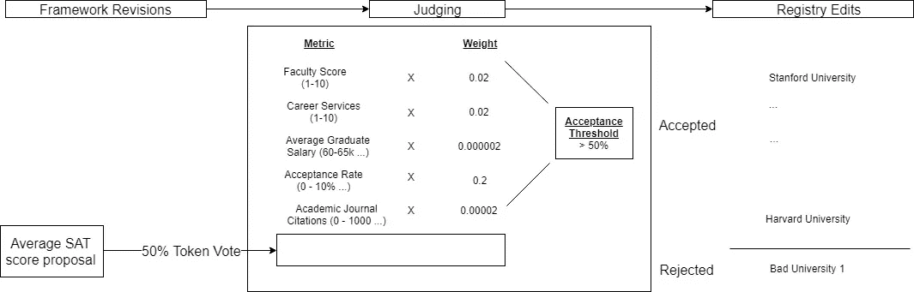

# 基于框架的令牌管理的注册中心

> 原文：<https://medium.com/hackernoon/framework-based-token-curated-registries-9691e83c2c4c>

最近，从劳拉·申对布莱恩·凯利的采访到 T2 的迈克·戈尔丁的作品，令牌管理注册中心的概念引起了广泛关注，这是有充分理由的。对于那些不熟悉 TCRs 概念的人，我强烈推荐 Mike Goldin 关于 TCRs 1.0 的文章，它提供了一个很好的入门，并深入了解了一些情况，因此您也可以理解其机制。迈克以如下方式简要描述了他们:

> 令牌管理的注册中心使用固有令牌来分配与持有令牌的实体的相对令牌权重成比例的管理权限。只要存在希望被管理到给定列表中的各方，就可以存在一个市场，在该市场中，理性的、自利的令牌持有者的激励被对准管理高质量的列表。令牌管理的注册中心是分散管理的列表，具有内在的经济激励，让令牌持有者明智地管理列表的内容。

这种类型的注册表远远超出了我们传统上认为有用的列表、最好的大学、最受通缉的罪犯和伟大的餐馆。我认为令牌管理注册机构(TCR)的未来是将[区块链](https://hackernoon.com/tagged/blockchain)从定量问题带入定性问题的方式。具体来说，今天最成功的区块链是那些最终只需要解决数学问题的人。比特币必须确保用户有余额要发送，以太坊必须确保计算正确执行，Sia 必须确保你的数据存储正确。所有这些问题都可以通过稍微复杂的数学运算解决，并由计算机验证。这很好，但并不完全符合许多人今天对区块链的看法。光靠计算无法阻止[芒果农给你的芒果喷农药](/@kaistinchcombe/decentralized-and-trustless-crypto-paradise-is-actually-a-medieval-hellhole-c1ca122efdec)。区块链和 TCR 的区别在于，正如 Ryan Selkis 所说的那样，他们需要人工证据。这意味着他们可以解决计算无法触及的人类问题。

就其核心而言，TCR 只是一个关于任何事情的二元决策模型。最终，二元决策通过投票过程留给令牌持有者。在实践中，这可能会导致令牌持有者使用各种各样的指标来做出决策。对于条目特征模糊或定义不清的列表尤其如此。想象一下顶级大学的 TCR。顶尖大学的定义是什么？适合判断一个学院好坏的指标有几百个；教师质量、学费价格、著名研究、学生 SAT 分数等。这并不一定意味着该列表将被不恰当地管理，但它确实意味着 TCR 将高度从众(由于理性令牌持有者做出最安全的投票)并具有模糊的效用。这是基于框架的 TCR 的基本思维过程。

# 基于框架的 TCRs

Mike Goldin 关于 TCR 的文章为它们应该是什么样子奠定了基础。本质上；一份实体名单，这些实体希望表明消费者的利益，并愿意为此承担风险或放弃资本，只由那些有财务动机做好这件事的人来策划。在他的版本中，令牌持有者是列表中的活动方，负责删除活动列表、质询申请人以及设置网络参数(申请长度、最低存款等。)**我提出了一种** **的新方法，基于框架的 TCRs (fTCRs)，它采用了一种不同的方法。**

在这种方法中，令牌持有者制定了一个高级审批框架，该框架由各种指标和权重组成，最终将决定申请人和列表人的命运。为了收集关于每个候选人的准确信息，针对每个指标进行投票过程，其中令牌持有者可以对是/否答案或某个值进行投票(该值可以被离散化以诱导投票合并)。)这些指标可以由多数或多数候选人最终确定，并在任何时候提交更新投票，以防被列名者发生重大变化。

fTCRs 和 TCR 的一个显著区别是处理上市挑战的方法。在 TCRs 中，挑战必须由承担资本风险的一方来实例化，在 fTCRs 中，挑战由框架中的变化来实例化。如果代币持有者投票将 SAT 分数作为衡量最好大学的标准，则必须在所有当前列表中累积该指标的数据，此时所有当前列表都将被更新；令牌持有者必须证明当前列表仍然符合新框架。图 1 概述了这种系统的一个例子。

Fig 1: An example of the decision process in a framework TCR

# 优势和潜在使用案例

*客观核算—* 在 fTCRs 中，我们可以看到上市方法公平地应用于所有参与者，而 TCR 可能并非如此。想象一下，一个可信数据聚合器的注册中心可以识别那些既聚合了大量客户数据，又负责任地处理这些数据并尊重消费者的公司。无论像 Equifax 或脸书这样的公司在这些方面取得了多大的进步，它们都可能永远不会出现在这个名单上。这并不是对这些违规行为发表意见，也不是以任何方式将它们混为一谈，这只是为了表明**人类在情感问题上的偏见是监管良好的 TCR**的一个重要问题(类似于戈尔丁概述的迷因攻击。)fTCR 抵消这些偏见的方法是向令牌持有者提出更简单的问题。而不是问“这家公司是值得信赖的数据聚合公司吗？”它会问，“这家公司的隐私政策包括‘X’条款吗？”或者“有多少人有权访问被没收的信息？”这种类型的问题比开放式问题更不受判断偏差的影响，因为这些问题应该以一种有事实答案的方式提出。

*降低预期申请成本* —由于 fTCRs 申请流程的客观性质，候选人的成本/收益分析发生了显著变化。与其被蒙在鼓里，不知道他们是否会被录取，候选人可以在申请前很好地意识到他们将如何填写标准。**这意味着好的候选人申请的动力更大，差的候选人申请的动力更小(假设框架质量高)**。然而，它也确实减少了从劣质苹果应用程序中分发给令牌持有者的价值。这意味着价值可能必须来自辅助来源，如被接受候选人的经常性上市费，这在 FINRA 等机构中已有先例。

# 困难

*攻击面大—* 在 TCRs 中，诚实的选民高度团结；只有两个答案，所以大多数诚实的选民很可能会选择同一个答案。这意味着它对拜占庭演员的容忍度更高。在 fTCRs 中，标准由离散值组成，尽管两个令牌持有者都是诚实的，但一个令牌持有者在“教师质量”上投票 8 而另一个投票 7 的情况并非不可能。最佳解决方案很难理论化，因为必须在实践中研究，但对此的一个潜在解决方案是简单地对每个标准使用二元分类。这降低了问题难度和诚实的投票分散，从而增加了容错性，同时保留了上述 fTCR 的特定优势。

*针对候选人的判断—* 也有可能一些 TCR 利用候选人来调整要应用的框架。虽然 fTCRs 将支持多种候选人，但滑动比例几乎不可能安全实施。这方面的一个例子可能是信用评分 TCR。在信用评分客户有明显不同的文件长度，这是判断信誉的主要标准。在这种类型的 TCR 中，令牌持有者可能希望在与具有长文件长度的客户端完全不同的框架上判断具有短文件长度的客户端，并在增量信息变得可用时将其合并到框架中。虽然通过 fCTRs 实现并非不可能，但为每个文件长度批准每个框架的投票过程可能会过于繁琐，无法增加净值。另一方面，这在你的基础 TCR 上相对简单；你只是让市场根据它的动机来决定。

*工作—* 在 fTCRs 中，为了确保合规性，令牌持有者需要完成大量工作。代币持有者必须进行研究，得出必要的数据点，而不是简单地投票。这可能导致网络的低参与度，从而更容易攻击注册中心。为了抵消这一点，网络必须将更高百分比的令牌供应用于管理注册中心。此外，虽然可能会有较低的参与，这也将增加任何个人参与者的奖励。归根结底，最重要的是策展人的质量，除了在交易所简单地出售代币之外，这可以通过许多方式来解决。

*欢迎对这些想法的所有反馈。欢迎在这里或推特上回复*[*https://twitter.com/CryptoDiplo*](https://twitter.com/CryptoDiplo)*。*