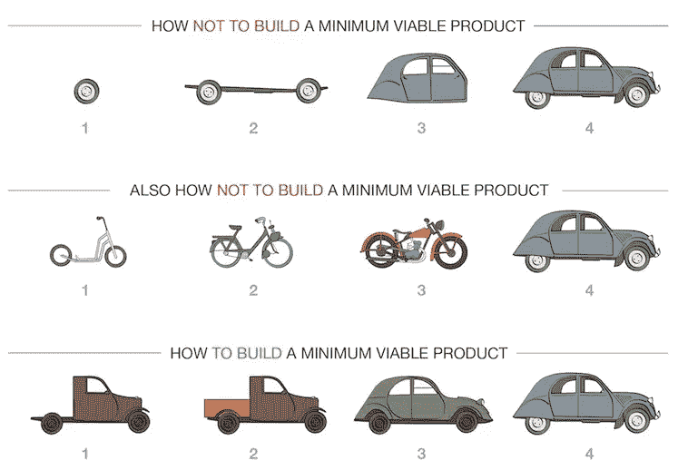

# 构建 MVP(最低可行产品)的框架

> 原文：<https://medium.com/hackernoon/framework-to-build-an-mvp-minimum-viable-product-d510d40bc165>

每个人都有想法，但开始是最令人困惑的，因为你试图围绕你的想法优化太多的变量。在这里，我将与您分享一个简单的框架，让您在预算紧张和周转时间非常快的情况下开始使用您的产品。我将重点给你一个数字产品的框架，但你可以用它来构思你可能有的任何产品。

它看起来是这样的:首先，也是最重要的，你决定你的产品应该具有的最基本的特性，这些特性使产品对用户可用，同时有助于将产品尽早推向市场。这背后的想法是收集用户对产品的反馈，而不浪费任何时间和金钱。这个版本的产品被称为 MVP——最小可行产品。

# 让我们来谈谈什么是 MVP。

Eric Ries 将 MVP 定义为“一个新产品的版本，它允许一个团队以最少的努力收集关于客户的最大量的有效的[学习](https://hackernoon.com/tagged/learning)MVP 作为一个概念已经被精益[创业](https://hackernoon.com/tagged/startup)方法论所普及。你可以在 Eric Ries 所著的《精益创业》一书中了解更多。

我们以 Whatsapp 为例，为了更好的理解 MVP。Whatsapp 是当今最受欢迎的消息应用程序之一，拥有超过 15 亿的用户群。2009 年，它作为一个应用程序推出，将一个人的当前通知发布到整个网络，这是当时应用程序中唯一可用的功能。这是为了利用苹果新推出的推送通知。

在 3 个月后发布的 Whatsapp 的下一个版本中，应用程序中引入了消息功能，这产生了巨大的影响。请注意，这只是短信，图像和视频的共享是后来才启用的。直到 2014 年，该应用程序才添加了语音通话功能。

Whatsapp 是一个精益创业的完美例子，在被脸书收购之前，工程团队只有 32 名工程师。他们与这个团队一起管理和服务了数百万用户，没有任何重大的停机或停机。

你今天使用的每个产品都会有一个类似的故事，脸书于 2004 年推出，直到 2009 年才推出移动应用程序。你今天使用的脸书并不是一次性建成并投入使用的！

# 制造人们想要的东西

构建产品的目标是构建用户会使用的东西。
**“做出人们想要的东西，这才是根本问题。Y-Combinator 的联合创始人保罗·格拉厄姆说，如果你死了，很可能是因为你没有做出人们想要的东西。**

为你的产品打造一个简洁的版本不仅有助于快速上市，还能让产品的营销变得更加容易。这有助于更快地获得用户反馈。您可以根据收到的反馈快速迭代产品，并立即投入使用。

这一方面节省了时间，另一方面也帮助你节省了成本，更快的周转确保你不会烧坏你的口袋。节省下来的钱可以用于更好的产品营销。快速构建、快速失败和迭代总是明智的。

# 在你建立 MVP 之前验证你的想法

当你的想法相对较新，并且想在全面投入之前先试水时，你应该建立一个 MVP。当想法没有被实际用户或客户验证时，最好从小处着手，并不断迭代地构建。

但是在你已经有产品市场契合度的情况下(你的产品有足够数量的用户交易来证明产品是终端用户所需要的。)，您不需要构建 MVP。

决定先建立一个 MVP 还是先有一个成熟的产品也取决于你的想法所处的阶段。对于一个成熟的产品创意，你显然不一定需要走 MVP 路线。

# 决定 MVP 内容的标准

现在，我会给你一些简单的标准，你可以根据这些标准来决定在构建这个版本的产品时需要构建和注意什么。首先列出你想在产品中拥有的所有功能。将这些特征分为两类，一类是“没有它，产品就不存在”，另一类是“对第一清单的有益补充”。这比任何人都更能让你了解你的产品提供了什么样的核心价值，在这里你的每一个决定都会变得更容易。产品的 MVP 将只有那些必须具备的特性，没有这些特性，就没有产品本身的存在。

在最初的日子里，你应该瞄准一组特定的客户，他们愿意使用产品并为之付费，这就是你为之开发产品的用户群。当脸书于 2004 年推出时，它只针对哈佛大学的学生。然后，在对其他人开放之前，他们转到了其他大学。这有助于获得有价值的见解，并有助于很好地服务于最初的一小部分目标受众。

你的 MVP 也取决于你的目标市场，我不是说地理位置，更多的是关于市场的成熟度。在一个已经提供服务的市场中，你所建立的东西将会与你的竞争对手已经建立的东西进行比较。而在一个尚未开发的市场，你不会被批判性地评判。

# 摘要

围绕 MVP 的一个常见误解是，它意味着一个不完整的产品。MVP 意味着较少的功能，你的用户流是完整的，但你专注于做一些正确的事情。

如果你需要根据用户反馈进行调整，产品营销成本会增加，时间会延长，因为你必须不断改变营销策略。当你建立的产品有明确的价值，并且已经有大量的用户交易时，建立一个 MVP 就是浪费。

MVP 为您提供了首先关注最关键特性的自由。当你开发后续功能时，你的想法会被用户进一步验证。因此，最终产品不仅在用户体验方面是一流的，而且还将为目标受众量身定制，因为它将考虑用户的反馈意见。

在 ModeStack 的博客[上阅读更多关于如何实现你的 MVP 的信息，点击这里](https://themodestack.com/missing-your-minimum-viable-product/?utm_medium=email&utm_source=network&utm_campaign=mvp)

**根据我们对创始人和企业家的经验，从 MVP 开始，并根据客户反馈进行调整，直到产品符合市场需求，这是一个好主意。**

*原载于 2018 年 6 月 20 日*[*sugoilabs.com*](http://sugoilabs.com/blog/startups/framework-to-build-an-mvp-minimum-viable-product)*。*