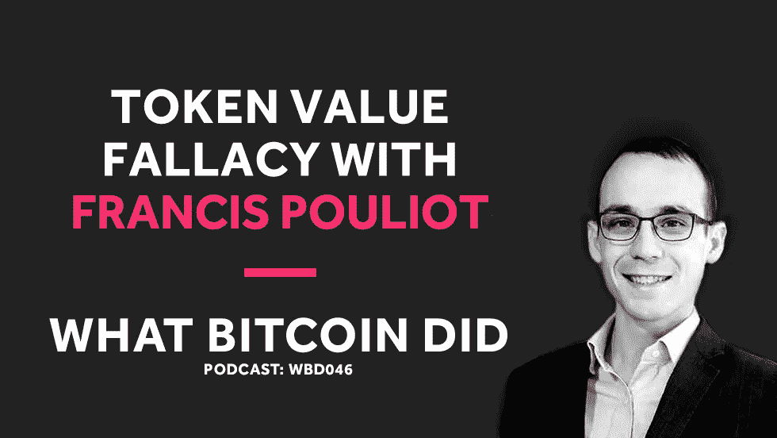

# Francis Pouliot 谈金钱的网络效应以及代币为何是骗局

> 原文：<https://medium.com/hackernoon/francis-pouliot-on-the-network-effect-of-money-and-why-tokens-are-scams-9f5f9c0af8b9>

## 音频采访转录— WBD046

***注:*** *以下是我采访 Satoshi Portal 首席执行官 Francis Pouliot 的笔录。我从翻译中使用 Rev.com，他们删除了嗯，错误和半句。我已经检查了转录，但如果您发现任何错误，请随时发送* [*邮件给我*](http://hello@whatbitcoindid.com) *。你可以* [*在这里收听*](https://www.whatbitcoindid.com/podcast/francis-pouliot-on-the-network-effect-of-money-and-why-tokens-are-scams) *的原录音。*

*你可以在这里订阅播客* [*听所有剧集*](https://www.whatbitcoindid.com/podcast/) *。*

在这一集里，我将与 Bylls.com 的首席执行官 Francis Pouliot 对话。在他与 Brendan Eich 在 Twitter 上的辩论之后，我们讨论了代币、金钱的网络效应、为什么 BAT 不适合 Brave 以及为什么比特币基地不适合比特币。

联系比特币做了什么:
听:[**iTunes**](https://itunes.apple.com/gb/podcast/what-bitcoin-did-podcast-bitcoin-crypto-trading-strategy/id1317356120?mt=2)|[**Spotify**](https://open.spotify.com/show/0mWUJuONiilW5JSBBFZ0s7?si=5qcbjpjYSRyKpi8wycEZUw)|[**Stitcher**](https://www.stitcher.com/podcast/what-bitcoin-did)|[**SoundCloud**|](https://soundcloud.com/what-bitcoin-did)[**YouTube**](https://www.youtube.com/whatbitcoindid)|[**TuneIn**](https://tunein.com/radio/What-Bitcoin-Did-p1079869/)关注: [**网站**](https://www.whatbitcoindid.com/)

# **采访记录**

**面试日期:2018 年 11 月 7 日星期三**

> **"人类需要发现什么是最好的货币形式."**
> 
> **弗朗西斯·波利奥特**

**[**彼得·麦科马克**](https://twitter.com/PeterMcCormack) **:** 你好弗朗西斯。**

**[**弗朗西斯·普利奥**](https://twitter.com/francispouliot_) **:** 你好彼得，你好吗？**

**[**彼得·麦科马克**](https://twitter.com/PeterMcCormack) **:** 我很好。很高兴终于见到你了！我在推特上看到了很多你的东西，所以很高兴终于能和你说话了。我不知道你的背景，我不总是做起源故事，但我不知道你的完整背景。我知道……我知道一些事情，比如，你在加拿大创建了第一个比特币交易所吗？**

**[**Francis Poul IOT**](https://twitter.com/francispouliot_)**:**好吧，所以我的背景不是作为一个科技人。我是蒙特利尔一家自由市场研究所的经济和政策分析师。所以我获得了政策分析的硕士学位，我开始了学术生涯，写报告，为政客代笔。我非常热衷于自由市场，奥地利经济运动。**

**[**Francis Poul IOT**](https://twitter.com/francispouliot_)**:**2013 年，在我的研究所，作为一名自由主义者，在我们参与的圈子和我们正在做的一些倡议中，我与一些比特币早期采用者成为了朋友。我们说服我的研究所发表一些关于比特币的报告，我们的研究所有点像…想象一下像英国经济事务研究所的卡托研究所，我也在那里实习过。这就相当于。**

**[**Francis Poul IOT**](https://twitter.com/francispouliot_)**:**这是一个相当知名的研究所，开始写那篇关于比特币的研究报告，我真的掉进兔子洞了。一旦我完成了，我的朋友，比特币早期采用者，他们发起了一个叫比特币大使馆的东西，这是一个……想象一下一个硬币中心的混合体，一个倡导团体，旨在做公共事务，公共关系，出现在议会听证会上，诸如此类的事情。但它也是苹果商店的混合体，因为我们在蒙特利尔市中心有一栋四层楼的建筑，所以我们有一个大凸窗，这种地方就像一家服装店，对吗？比如市中心。**

**[**弗朗西斯·普利奥**](https://twitter.com/francispouliot_) **:** 人们走进来，我们有一张桌子，人们会走上前来询问关于比特币的问题。最终，人们会问的第一个问题是，“我能在这里买一些吗？”所以我们……一开始就像，不。我们是积极分子，我们经营着一个封闭的空间，我们在楼上有一些办公室，里面有一些初创企业。这里买不到比特币。**

**弗朗西斯·波里奥 **:** 然后人们就像这样，“哦，我再给你百分之五。”不，还有“哦，我会多给你百分之十。”就像，好吧，让我汇些钱过去，看看我们能做些什么。**

**[**弗朗西斯·普利奥**](https://twitter.com/francispouliot_) **:** 所以最终，是的。我们在比特币大使馆开了货币兑换处。我们称之为 Satoshi 计数器。这在当时是一个相当大的交易，所以那是在 2014 年末。这是…这是一种独特的安排，这真的让我们有…这是独特的，这种第一手的接触。与底层比特币用户面对面。**

******:**我很清楚令人难以捉摸的比特币用户不在 Twitter 上做什么。我见过他的许多迭代，普通比特币用户，这也是为什么当规模辩论发生时，我决定加入的原因之一，因为每个人都在谈论比特币用户。我当时想，好吧，你们中的很多人在设计应用程序时都拘泥于价值。****

****[**Francis Poul IOT**](https://twitter.com/francispouliot_)**:**比特币用户不是鸡尾酒会上的其他人。还有数百万其他人，当你在谈论比特币用户时，我真的不认为你知道自己在说什么。****

****[**弗朗西斯·普利奥**](https://twitter.com/francispouliot_) **:** 是的，我们建立了这个物理交换，那很有趣。背景故事是，很多人在推特上关注我，他们看到我非常非常反对山寨币。有毒。有些人认为痴迷，有些人说嗯，是的，当然。我的意思是，我尽量不去想替代硬币，但当你有一个实体货币兑换柜台时，所有陷入困境的人都会立即来找你。****

****[**Francis Poul IOT**](https://twitter.com/francispouliot_)**:**这不仅是勒索软件受害者的情况，也是失去比特币的人的情况，但这也涵盖了所有被山寨币诈骗的人。这也是我与 BAT 创始人布伦丹·艾奇在 Twitter 上辩论的原因之一，如果你想称之为辩论的话。然后，他在说，就好像他甚至没有领会到有人在最后买了蝙蝠，就像一个物理人买了它，拿着它，用他一生的积蓄投资，因为我看到人们在哭。他们失去了他们一生的积蓄，因为狗屎硬币，因为骗局，因为这些泵和转储欺诈。****

****[**Francis Poul IOT**](https://twitter.com/francispouliot_)**:**我见过孩子们从他们祖母的账户里取钱去投资狗屎硬币，从而失去家庭财富。我见过这东西，很多，对吧？这些人哭着来，他们的生活被毁了。有附带损害，这些东西是真实的。如果你看看所有 alt-coins 的市值图，它从 5000 亿，到我不知道现在是多少，可能是 200 或什么的。****

********:**这并不是说 3000 亿美元的价值蒸发了。真正的经济学不是这样运作的。这些只是图表上的数字，但是很多人损失了很多钱。这就是柜台与人们的接近真正给我的东西，这种意识，即这些不是你资产负债表上的数据条目。归根结底，这些都是人。******

****[**Francis Poul IOT**](https://twitter.com/francispouliot_)**:**是的，从那里开始，我接手了一家名为 Bills 的公司，这是我在比特币大使馆的一个朋友创办的，他没能继续做下去。他想搬到另一个国家，所以我买下了这家公司，它是加拿大第一家支付处理器，现在仍然是加拿大最大的支付处理器。****

****[**Francis Poul IOT**](https://twitter.com/francispouliot_)**:**我们有这些…我们的客户是比特币持有者和用户，他们用比特币支付或拥有比特币，他们会用比特币支付账单，或者他们会寄钱给其他人支付发票，或者他们会用比特币支付房东。所以我们有了这个用户群。我们的应用程序只接受比特币，我们还运营另一项名为比特币商店的网络服务，有点像比特币基地。****

****[**Francis Poul IOT**](https://twitter.com/francispouliot_)**:**你喜欢你的银行账户，你购买比特币，它们被直接发送到你自己的比特币钱包。我的公司运营入口和出口应用。我们从实物货币兑换和自动取款机开始。我们在 2015 年停止了这样做，因为它不可扩展，现金业务也不好玩。这是一次又一次的努力。****

****[**Francis Poul IOT**](https://twitter.com/francispouliot_)**:**所以我们决定开发可扩展的应用，这也是我们今天一直在做的事情。因此，我公司的 Satoshi 门户，如 Bills 和比特币商店是应用程序和品牌，我们还建立了另一个软件项目，称为 Cyphernode。Cyphernode 是一个开源项目，旨在让开发者和高级用户真正轻松地与比特币互动。所以把它想象成一个介于比特币核心、比特币协议、闪电、所有这些核心技术和一些用户友好的应用程序或其他服务之间的中间件。****

****[**Francis Poul IOT**](https://twitter.com/francispouliot_)**:**如果你想从一个……如果你不是技术人员的角度来考虑，我们正在构建一个类似于开源的 info 区块链，或者开源的 BitPay 后端之类的东西。所以有很多初创公司，特别是 blockchain.info folk，比特币基地，BitPay，BlockCypher，BitGo，他们为你运营笔记，他们为你运营钱包，作为一个应用程序或服务。****

****[**弗朗西斯·普利奥**](https://twitter.com/francispouliot_) **:** 你连接到他们的服务，这就像一个许可模式。你按使用付费什么的。这意味着那些初创公司基本上是在告诉你，作为一个…假设我像一个支付应用程序一样运行账单，我想知道我收到了一个用户的比特币支付。使用比特币核心并不容易，所以大多数人只是连接到 blockchain.info，blockchain.info 告诉他们收到了比特币。****

****[**Francis Poul IOT**](https://twitter.com/francispouliot_)**:**所以我们做的是开源 blockchain.info 的后端，让人们自己运行它。因此，这有点像他们在做他们过去一直在做的事情，连接到 blockchain.info 或比特币基地，但他们连接到自己的自托管后端，有点像[Nikola Delhi 00:07:48]对 BTC 服务器所做的那样。****

****[**Francis Poul IOT**](https://twitter.com/francispouliot_)**:**很抱歉我的介绍很长，但那是……是的，那是我的工作。****

****彼得·麦科马克:这个介绍非常有趣，有几个原因。我的播客每周播出两次，分别在周二和周五播出。今天播出了一集，我让你们猜猜嘉宾是谁。****

****[**弗朗西斯·普利奥**](https://twitter.com/francispouliot_) **:** 显然是布兰登，对吧？****

****彼得·麦科马克:布兰登今天上了播客。这非常有趣。我的节目中有很多比特币创造者，我们谈论了很多关于比特币的话题。但是我有一些关于代币的问题要问你，因为我认为这对人们来说很有教育意义。但我确实想从比特币开始。****

****[**彼得·麦科马克**](https://twitter.com/PeterMcCormack) **:** 我要在这里引用你的话，因为我发现这条推文真的很有趣。“比特币是狼，生于北部苔原，随着寻找更大的猎物，它不断壮大并向南迁移。”那是从哪里来的？****

****[**Francis Poul IOT**](https://twitter.com/francispouliot_)**:**这句话来自……我想我是从 Dan Held 的一条推文中得到灵感的。这就像是，我想我看到漩涡转发它，就像是，“比特币是金钱的顶级掠夺者。”****

********:**所以，某种背景是，我已经从系统理论的角度分析比特币很长时间了。我是[听不清 00:08:59]实验室的忠实粉丝。我一直是紧急秩序和奥地利经济学派的忠实粉丝。试着把比特币想象成有机的东西，试着把货币想象成赢家通吃的游戏。因此，我经济学背后的一个基本观点是，就货币而言，由于网络效应，我真的认为它们是赢家通吃的协议。******

****[**Francis Poul IOT**](https://twitter.com/francispouliot_)**:**我试图向很多人解释这一点，比如他们会说，哦。他们会看一个代币，他们不会看到这个代币在和比特币竞争。忘记产品，代币不是产品。代币就是钱。代币是被创造出来支付某些东西的货币，它与比特币竞争。****

****[**Francis Poul IOT**](https://twitter.com/francispouliot_)**:**是的，按照我过去的想法，我开始谈论语言，这样人们就能明白为什么……为什么人们会说某种语言，以及语言进化的方式，例如。其中一个类比是，如果你把一千个来自不同国家的人放在一艘去另一个星球的宇宙飞船上，他们将在五代后到达那里，每个人都将在三代后说英语。几代人之后，没有人会说他们的母语。他们会说他们当地的胡言乱语。****

****[**弗朗西斯·普利奥**](https://twitter.com/francispouliot_) **:** 只是因为从一个网络到另一个网络的成本，持有一种货币相对于另一种货币的风险是如此巨大。这些网络效应是巨大的，巨大的引力。人们真的被它吸引了。我最喜欢的一句话是保罗·斯托尔茨说的，“金钱是最强的网络效应，因为如果你在错误的网络上，你最终会死。”****

****[**弗朗西斯·普利奥**](https://twitter.com/francispouliot_) **:** 如果你上了金钱的错误网络效应，它变得一文不值，你就再也吃不下了。所以你有一个很强的…比如从脸书转到 Myspace。这些是不同的层次。那里的风险更大。****

****[**弗朗西斯·普利奥**](https://twitter.com/francispouliot_) **:** 我也相信创新和进化的消极观点。这是一个你可以在纳西姆·塔勒布的书中找到的概念。纳西姆·塔勒布对我影响最大。我试着把他的伦理运用到现实生活中，把他的分析运用到比特币上。如果你想了解所有这些东西是从哪里来的，大部分是来自纳西姆·塔勒布。****

****[**彼得·麦科马克**](https://twitter.com/PeterMcCormack) **:** 所以你才会经常在比特币的游戏中谈论皮肤。****

****[**弗朗西斯·普利奥**](https://twitter.com/francispouliot_) **:** 对，对，没错。没错。游戏中的皮肤是一种实用的、道德的方法，让你在这些不道德的行业中导航。这是…在密码行业很容易变得不道德。不道德的同辈压力不存在。不道德是有回报的，它在创新和制造产品的时髦词汇下被颂扬。****

********:**通过负面手段……人类需要发现什么是最好的货币形式，因此多种货币同时并存总是好的。需要有一个选择的过程。这是反复试验。人们困惑于为什么黄金同时在世界不同的地方被自发地采用为货币。各种各样的理论，比如外星人，你知道，什么的。******

****弗朗西斯·普利奥特 **:** 但实际上，人类是在同一时间进化的，我们几乎在同一时间开始了世界各地的文明。随着时间的推移，每个人都尝试了不同形式的钱，这很简单。没有最好的货币形式的人不能长期保持他们的财富，不能做生意，不能繁荣。他们最终消失了，他们的生活方式最终消失了，取而代之的是那些能够随着时间的推移保持财富并繁荣发展的人。其他的钱都消失了，剩下的就是黄金。****

****[**彼得·麦科马克**](https://twitter.com/PeterMcCormack) **:** 你看过杰瑞米·索尔尼尔的《抱紧黑暗》吗****

****[**弗朗西斯·普利奥**](https://twitter.com/francispouliot_) **:** 我没有。****

****彼得·麦科马克:我应该把那个寄给你，因为那是关于狼的。最近才出的。我会把它发给你…****

****[**弗朗西斯·普利奥**](https://twitter.com/francispouliot_) **:** 所以狼，本来可以是任何东西，但是狼是顶点的想法，对吧？这是一个想法，你可以有各种各样的生物，比如货币，如果没有竞争，那么你只是被动地，分析性地看着它们。你是根据货币的规格来判断货币，但实际上你需要考虑的是，这些事情，有一天…人们很难理解货币竞争的主要原因之一，以及一种顶级货币占主导地位的可能性，这就是比特币最大化，对吗？****

****[**Francis Poul IOT**](https://twitter.com/francispouliot_)**:**所以比特币极大主义不是比特币极大主义。这是单一货币最大化主义，其结果是对比特币的强烈押注。人们会说，“好吧，看看这个世界。有 200 种货币。你的理论显然是不正确的，因为世界上有数百种货币。所以我们生活在一个多货币的世界里。你有一个令人难以置信的要求。”****

********:**人们需要思考的是，你不能再限制市场了。你曾经能够…你拥有这些货币的原因是，没有自由的货币市场。有 170 个货币发行者，他们在其管辖范围内有法定货币，有法律强迫人们接受它作为债务和服务。******

****弗朗西斯·普里奥 **:** 在加拿大，我们有货币法案。你不接受加拿大元的商品和服务是非法的。所以对比赛有限制。因此，政府无法阻止本国人口转向比特币。一旦你打破了自由市场的准入门槛，你就有了一个事实上的货币自由市场，因为人们可以进入比特币。交易所可以被审查。****

****[**Francis Poul IOT**](https://twitter.com/francispouliot_)**:**如果你打破壁垒，这有点像你在这个生态系统中释放狼。纸上的规格已经不重要了。这是一场生死之战，在这场比赛中没有太多的空间留给一个以上的赢家。****

****[**彼得·麦科马克**](https://twitter.com/PeterMcCormack) **:** 加拿大挺亲 crypto 的吧？****

****[**弗朗西斯·普利奥**](https://twitter.com/francispouliot_) **:** 耶！加拿大就像一个…很多人都有…这个问题很多年来每个人都问我。就像“为什么加拿大这么亲比特币？为什么比特币是加拿大的东西？”****

****[**Francis Poul IOT**](https://twitter.com/francispouliot_)**:**如果你去参加比特币大会，问人们来自哪里，他们可能听起来像美国人，但那里有一群加拿大人。****

****彼得·麦科马克 **:** 尽管从各方面来看，你都是一个进步的国家。你有一个伟大的首相，贾斯廷·特鲁多？你是这么说他的名字的吗？****

********:**我不是贾斯汀的粉丝。******

****彼得·麦科马克 **:** 我想对于外界来说，他确实给人一种……与世界上所有其他领导人相比，他可能是最优秀的领导人之一。****

****[**Francis Poul IOT**](https://twitter.com/francispouliot_)**:**是的，加拿大是一个自我感觉良好的国家，但是基本上……我的意思是，我们有一个……加拿大是一个大规模的社会主义政府，对吗？大规模的社会主义国家，尤其是在魁北克，但也包括加拿大的其他地区。我是说，这是最高税率。你可以认为加拿大有点像斯堪的纳维亚，那里的人们以纳税和支付一切费用为荣，但这并不是因为感觉良好。****

****Francis Pouliot **:** 但是关于保密条例，我认为与加拿大的议会制度有关。但这也是因为不久前采取的迅速而果断的行动。所以加拿大对加密这么好的原因是 ML 规则非常好。几乎世界上所有国家都有……在比特币存在之前，就有反洗钱法律和防止恐怖融资的法规。****

********:**这同样适用于游客去的市中心的货币兑换处。这些货币兑换机构不能只接受一袋现金，而将欧元兑换成美元。他们有限额，他们有 KYC，他们需要记录交易，如果有可疑情况，他们需要报告。所以已经有这些东西存在了，我们从美国得到了 Bit 许可证的第一缕气息，我们就像“地狱不。这不会在这里发生。”******

****[**Francis Poul IOT**](https://twitter.com/francispouliot_)**:**所以比特币许可证就像是一部新法律，就像是一个专门针对比特币的新框架。那是我的工作。我被雇用了…我是公共事务主管，我去了参议院，我就是这么做的。然后，我们让政府在预算法内通过，这是一项重要的年度法律，一项几乎在 EML 框架内将虚拟货币业务作为单行事物添加进来的修正案。那真的很好。这意味着……在过去的四年里，监管机构一直在与我们来回沟通，起草实际的监管规定。所以还没有强制执行。****

********:**但本质上这意味着，比特币业务就像货币交易所或支付处理器。我们对 KYC 的要求很简单……可能是一天一千美元，或者一天三千美元，超过这个价格我们就需要去 KYC。现在自动提款机并没有真的做 KYC，他们将不得不这样做。******

****弗朗西斯·普里奥 **:** 所以在 KYC 这方面很轻松。但是，是的，就证券法规而言，这是关于代币的另一点，这很搞笑。Bat 的创始人布兰登发了一条推特。我告诉他加拿大的证券法规，他假装是一个在法律分析上犯了大错的律师。****

****[他们不需要适用象征性的法律或法规。](https://twitter.com/francispouliot_)****

****[**Francis Poul IOT**](https://twitter.com/francispouliot_)**:**在加拿大，就是这样。加拿大证券…哦，你叫它什么？加拿大证券… CSA，它就像是所有省级证券监管机构的管理机构，因为在加拿大它更像是省级的。他们确定…他们有 11 种使用情形的指导原则，所有代币在加拿大都是证券。这是毫无疑问的。他们甚至有具体的段落谈论 SAFT 协议之类的东西，就像…这很明确，但字里行间就像无论你有多复杂的 Rube Goldberg 设置，通过 ICO 和其他东西的四个不同步骤，都没有关系。这是一份投资合同。****

****[**彼得·麦科马克**](https://twitter.com/PeterMcCormack) **:** 你对证券法有什么看法？你同意他们的观点吗？****

****弗朗西斯·普里奥 **:** 这确实是个好问题。我是相当自由的，所以我实际上不相信证券法。我有点矛盾，因为我不相信证券法。我相信一个更强大的司法系统，一个更强大的法庭系统。我希望普通公民能够更容易地私下起诉他人，而不是制定全面的法规。基本上，我相信一个比法规更强大的司法体系。****

****弗朗西斯·普里奥 **:** 从哲学上讲，我并不喜欢证券法。当然，如果你看加密，即使作为一个自由主义者，我也不禁会想…附带损害是相当大的。这些人是他们自己的错，但同时，有如此巨大的文化 ICO 炒作是如此阴险和巨大，有很多人是这件事的受害者。所以很难调和。****

****[**Peter McCormack**](https://twitter.com/PeterMcCormack)**:**我想这是我要问你的问题，或者我要说的观点……这并不是想陷害你……但他们可能是在一月份投资比特币的人，他们损失了一大笔钱。我发现一个矛盾是，你倾向于发现比特币最大化，比特币创造者是自由主义者，不倾向于同意证券或认证规则，因为它有限制性，对吗？它限制人们投资，但与此同时，当他们对代币持有异议时，他们会利用代币是一种……他们创造了一种未注册的证券作为攻击媒介。你能看出我在那里看到的矛盾吗？****

****[**弗朗西斯·普利奥**](https://twitter.com/francispouliot_) **:** 我看不出同样的矛盾。可能…不在我脑子里。对其他人来说可能是，但我真的不使用或不想使用…我不希望 SEC 打击代币。我认为这肯定会发生，我要告诉他们的一件事是，你的律师避免它的狗屁计划，毫无意义。我是安大略省证券监管机构的顾问，受金融科技公司委托。****

****[**Francis Poul IOT**](https://twitter.com/francispouliot_)**:**这些只是客观的集会，我只是告诉人们现在是什么时候。我不希望他们这样。然而，有些事情，像这些人在游戏中没有皮肤。为什么我在推特上这么 aggro？这是因为没有平衡，他们做的任何事情都不公平，因为如果你再看看这个完美的例子，对我来说，BAT token 是 ico 中最糟糕的。****

****[**Francis Poul IOT**](https://twitter.com/francispouliot_)**:**他们卖这个东西，我不知道你现在想不想进 BAT，但是其中一个原因，比如我在 Twitter 上很多是因为一般他们觉得后果为零。他们没有缺点，只有优点。如果他们的事情进展顺利，他们就是亿万富翁。如果他们的事情搞砸了，那么，这就是自由市场，竞争，创新。我们尝试了这种新模式，但没有成功，诸如此类。那不是我们的钱。一般来说，从技术的角度来看，这也不是你创造创新的方式。****

****[**彼得·麦科马克**](https://twitter.com/PeterMcCormack) **:** 嗯那好吧。让我们开始吧。所以你真的转发了这个。所以不是蝙蝠才是勇敢。你喜欢勇敢，你认为它是一个好的浏览器。我喜欢勇敢。我现在很勇敢。我猜你很欣赏他们在广告屏蔽和改变广告模式方面所做的努力。****

****[**彼得·麦科马克**](https://twitter.com/PeterMcCormack) **:** 但是蝙蝠令牌……我也看到了两个主要问题。第一个问题是他们如何运行 ICO，第二个问题是…嗯，有三个问题。他们如何运行 ICO，反正不相信令牌，第三，令牌在 Bat 内部增加了用户体验的摩擦。****

****[**彼得·麦科马克**](https://twitter.com/PeterMcCormack) **:** 那么让我们一个一个来。再来说说 ICO。它本质上是一种未注册的证券。但更重要的是，你称之为庞氏骗局。那么我们来谈谈 ICO。你对此有何感想？****

****Francis Poul IOT**:**我想我会把它归类为传销，因为……庞氏骗局意味着他们通过使用别人的钱来要回钱，直到钱用完为止。他们拿不回任何钱。只是传销而已。我经常交替使用庞氏和金字塔，但这绝对是一个金字塔计划，因为没有人看到任何回报。****

****[**Francis Poul IOT**](https://twitter.com/francispouliot_)**:**首先，我根本不想专注于 BAT，这整件事是从有人说开始的，我认为是 Hassu 说了类似“哦，我真希望这些做 ICOs 的好产品中的一些意识到他们的错误，纠正它，然后专注于开发好的产品。”****

****[**弗朗西斯·波里奥**](https://twitter.com/francispouliot_) **:** 我当时就想，“哦，请勇敢一点吧。”我想那是…是的。那是我的两个…请勇敢一点。因为 Brave 是一个很好的例子…当 Brave 说，“哦，我们要做一个浏览器，我们要用比特币支付广告商，人们将在浏览器中有一个钱包，人们将发送小额付款，”我就像哇，这是下一个级别。会很棒的。JavaScript 的发明者就是这么做的。哇，太棒了。我会调查这件事。哦，这就像是…哦，太好了。我爱勇敢。****

****[**Francis Poul IOT**](https://twitter.com/francispouliot_)**:**然后当他们做一个 ICO 的时候，我就想，“哦，有点像电报 ICO。就像啊，是个扯淡的 ICO。”我想“我希望他们不会让人们在浏览器中使用令牌。”显然，当他们宣布的时候，我读了白皮书。我当时想，呃，这是最糟糕的事情了。我只是忘了这件事。****

****[**弗朗西斯·普里奥**](https://twitter.com/francispouliot_) **:** 但后来我和勇敢的创始人开始了这场争论，因为我真诚地说“哦，我真的希望……”我一开始非常真诚，我想，“你真的应该进入闪电。勇敢和闪电是很明显很明显的契合。你可以成为闪电的先行者，你可以成为闪电的主流。你将是超级史诗，你将是未来的证明。勇敢是伟大的，不要在令牌上浪费时间。令牌基本上是一个他妈的了。”有点友善，试着…还不算太晚，你知道。你可以回到比特币。****

****弗朗西斯·普利奥特 **:** 然后他就对我大发雷霆。所以我就想，我会研究一下条款，我会研究一下这个。我以前已经这样做过很多次了，看看这些东西的条款和条件。这是如此糟糕，如此非常非常糟糕，法律…这是一个骗局，一个巨大的骗局。我注意到的第一件事是，如果你看…那么一切都在他们的 FAQ 页面上。但是 FAQ 页面真的很难读，你需要点击每个问题来解开它，就好像没有人读它一样。****

****[**Francis Poul IOT**](https://twitter.com/francispouliot_)**:**但它实际上是在销售税免税。如果你看这一段，它说…商品及服务税的含义，它说，“勇敢的人不相信自愿捐款，”所以这是什么，“受商品及服务税的基础上，他们代表纯粹的捐赠，并没有联系到任何利益的自愿捐款。”****

****[**Francis Poul IOT**](https://twitter.com/francispouliot_)**:**这在法律上属于捐赠。你在无偿捐赠你的资金。这是法律规定。他们实际上在 30 秒内得到了 3000 万美元。30 秒内就有 3500 万。所以这就像，我们应该相信人们在 30 秒钟内捐赠了 3500 万美元而不期待任何回报吗？当然不是！****

****[**Francis Poul IOT**](https://twitter.com/francispouliot_)**:**我曾在[听不清 00:27:11]证券委员会讨论过这个具体问题。我们的金融科技顾问委员会之一，然后我称之为 ICO wink。我告诉他们关于 ICO wink，wink wink，这是…这是一个“捐赠”航空报价，wink wink。每个人都知道这个游戏，对吗？每个人都看白皮书上的免责声明，他们就像啊，他们必须做一些法律诡计，无论什么。****

****[**弗朗西斯·普利奥**](https://twitter.com/francispouliot_) **:** 谁都知道其扯淡。这不是捐赠。你买进是为了高价卖出，赚很多钱。每个人都知道。然后，你有另一个部分，好的。那么 BAT 代表了什么？我在寄钱作为捐款，但我仍然得到一些东西。我得到了一个象征，一把 ERC 20。那么它代表了什么呢？****

****[**Francis Poul IOT**](https://twitter.com/francispouliot_)**:**它们是实用令牌，首先是打算在 BAT 平台上使用。因此，它们的主要目的是在 BAT 平台上使用，以支持平台的使用和交互。所以你需要代币，条款上是这么说的。你需要令牌来使用平台。这是一种获得的手段，它说“获得服务并实现使用和与平台交互的手段”，如果显然成功部署的话。****

****[**Francis Poul IOT**](https://twitter.com/francispouliot_)**:**然后下一个短语是“代币不代表或授予任何所有权或股份、股份或证券，或[听不清 00:28:30]权利，或任何获得未来收入份额或知识产权的权利，或任何与 BAT 平台和 Brave 或其附属公司相关的参与形式。它们是不可退款的，它们不是数字货币、证券、商品或任何类型的金融工具。”****

****[**弗朗西斯·普利奥**](https://twitter.com/francispouliot_) **:** 所以那就超级诡异了。****

****[**彼得·麦科马克**](https://twitter.com/PeterMcCormack):那么他们是什么呢？****

****[**弗朗西斯·普利奥**](https://twitter.com/francispouliot_) **:** 他们是什么？嗯，我已经把它们分类了。我称之为……这是一个新事物，太神奇了。这叫做象征性可交易捐赠收据。****

****[**彼得·麦科马克**](https://twitter.com/PeterMcCormack) **:** 太酷了。比特币基地可能会有一份清单。****

****[**弗朗西斯·普利奥**](https://twitter.com/francispouliot_) **:** TTDR。TTDR，我要去注册商标。****

****[**弗朗西斯·普利奥**](https://twitter.com/francispouliot_) **:** 所以我给蝙蝠钱，我得到一个代币。代币本来就是要在平台上用的，从 Brendan 自己的口中我们也看到了…我不敢相信他在 Twitter 上这么说。但不是在用平台，用了也没意义。没有人会使用它，人们只是使用一个支持钱包，它只是…它只是很好的菲亚特。他们根本不用。****

****[**Francis Poul IOT**](https://twitter.com/francispouliot_)**:**所以这是一张捐款收据。你捐款是为了得到收据，然后你得到了这张没有任何作用的收据，它没有给你任何权利，它对 Brave 没有任何影响，你根本不能在 Brave 平台上使用它。你需要有一个体面的钱包，并把你的球棒放在里面。你不能使用 ERC 20，它只是一个后台内部的总账移动。可能有一种不用大量使用它的方法，我现在不这么认为。****

****[**Francis Poul IOT**](https://twitter.com/francispouliot_)**:**那个东西，他卖了 3000 万，这些真的只是……再说一遍，它们是捐款收据。他们只给你捐赠的证明。那是他们的法律……那是客观现实。这些捐赠收入的总和价值 8 亿美元。这怎么可能不是骗局呢？这是一个巨大的骗局，如此之大，如此厚颜无耻，其规模令人难以置信。****

****[**彼得·麦科马克**](https://twitter.com/PeterMcCormack) **:** 现在让我们给他们一点怀疑的好处，让我们说在那个时候，ICO 的事情…我认为自从去年年底在今年更广泛的社区中的传言以来，人们已经变得更加意识到他们有多糟糕，他们的问题有多严重。****

****彼得·麦科马克 **:** 但让我们假定他们是无辜的，他们当时认为这是一个好主意，这是一种创造某种货币令牌的方式，它可以在我们的浏览器中运行，类似于比特币，但它更快，费用更低。我们先假定他们是无辜的。****

****彼得·麦科马克 **:** 他们现在能做什么呢？因此，如果他们拒绝英美烟草并说“我们不会再使用它了”，这对英美烟草的所有持有者意味着什么？因为那是非常有害的，对吗？不是说这不是正确的做法，但这对任何握着球棒的人来说都是非常有害的。****

****[**Francis Poul IOT**](https://twitter.com/francispouliot_)**:**首先，我认为我们不应该假定他们是无辜的，因为这是不对的……犯错是可以的，但拿别人的生计做决定，而自己却不能置身事外，这是不对的。因此，即使他们可能真的相信通过投资让每个人都变得富有和成功，他们还是把自己……他们创造了一个系统，在这个系统中，他们与自己行为的后果隔离开来。所以这是错误的，尽管他们不想欺骗人们。****

****[**Francis Poul IOT**](https://twitter.com/francispouliot_)**:**不道德不一定就是恶意，对吧？所以我不想让他们在这点上有所怀疑。但是他们现在能做什么呢？也就是说，从一般的角度来看，为什么我把这些人称为骗子作为一种启发，而他们可能是偶然的骗子？他们可能无意成为中央银行，凭空创造货币，出售作为希望和梦想的商品。但是他们后来可能意识到了，或者他们可能首先想到了研发，而没有真正花太多时间去考虑钱从哪里来。****

****[**弗朗西斯·普利奥**](https://twitter.com/francispouliot_) **:** 但是他们现在能做什么呢？他们能做的第一件事，实际上有人专门从事这项服务，就是如何将 ico 转换回非 ico。它可以做很多事情。实际上，我已经向他们建议了几个。我不太记得了。我可以举出几个。****

****[**Francis Poul IOT**](https://twitter.com/francispouliot_)**:**首先，你可以……首先，你可以把它们买回来。你真的想把它们从…买回来，它们在平台上用不到。基本上只需要退款就可以了。你发行了这些本该在你的平台上使用的代币，没有人会去使用它。没人会买，所以你可以把它们买回来。****

****[**Francis Poul IOT**](https://twitter.com/francispouliot_)**:**你可以允许 BAT 持有人将其转换为股票，这对每个人来说都很讨厌，你需要成为合格的投资者，但也许有些人会在二级交易所的市场上将其转换为 BAT 股票。基本上你可以决定分红。你可以向 BAT 持有者发放比特币交易的红利。你可以说，无论谁是蝙蝠持有者，你都可以使用一些加密方案或其他什么，我们会给你发送比特币，到你的蝙蝠地址。我们会给你一些曝光率。****

****弗朗西斯·普里奥 **:** 他们可以做一些事情。但这有点像出租车牌照，对吧？就像城市发行了这些出租车牌照，现在你有了优步，他们就像“哦，妈的，我们该怎么办？”你把它们买回来，让它们变得没用，或者干脆破产什么的。蝙蝠持有者不会看到任何东西，勇敢也不欠蝙蝠持有者任何东西。球棒持有者彻底完蛋了。他们什么都没有。****

****[**弗朗西斯·普利奥**](https://twitter.com/francispouliot_) **:** 我甚至……勇敢能做什么？我不知道。说对不起，努力还钱给人，赔罪，真的真的努力，不在平台用 BAT，做点别的就好。****

****[**彼得·麦科马克**](https://twitter.com/PeterMcCormack) **:** 好吧，我们也来谈谈这个问题，因为……我曾经在数字广告领域工作过，我知道这个市场的问题，它是如何被彻底打破的。我钦佩他们正在努力做的事情，我完全支持他们。我和 Bat 有过一次戏，我报名了，我是内容创作人吧？****

****[**弗朗西斯·普利奥**](https://twitter.com/francispouliot_) **:** 嗯嗯(肯定)。****

****彼得·麦科马克:也许我可以得到一些代币。在使用它的过程中，我赞同布兰登和你所说的部分内容。所以我同情 Brendan 的第一件事是，虽然比特币会很棒，会很棒，但大多数可能使用该平台的大型出版商不会想要比特币，不会想要额外的一层摩擦。****

****彼得·麦科马克 **:** 但我确实看到了前端用户可能会想要它。我们在英国有一个网站，实际上可能是一个全球性的网站，叫做 Quidco。这是一个返现网站，所以如果你继续，你买一个假期或预订一个酒店房间，如果他们是返现网站的一部分，你会得到一点钱回来。挺搞笑的。我估计光是用它，我一年就赚了大约 1000 到 1500 英镑。每年支付一次假期的费用。这很好，我只是得到了这个小总数。****

****[**Peter McCormack**](https://twitter.com/PeterMcCormack)**:**所以我想象我作为一个用户希望广告被屏蔽，但会有一个选项说“我将允许这些类型的广告使用这些数据”，并且在浏览器中有一个小东西向我显示总计的金额。但是如果我能接受比特币的话，那就太酷了。一个或另一个，都完全适合我。****

****[**彼得·麦科马克**](https://twitter.com/PeterMcCormack) **:** 我认为，在后台，最有可能的是大型出版商只想要以英镑支付。也就是……或者美元，这绝对没问题。你相信他们应该用比特币做所有的事情吗？****

****弗朗西斯·普里奥 **:** 首先我想说的是，我同意你的观点，勇敢者试图做的事情是伟大的。作为浏览器，作为公司，作为平台。首先，当我们谈论这些硬币时，很容易迷失在谈论这个平台有多好，它的功能和它试图解决的问题上。因为这是两个完全不相干的、分离的东西。****

****[**Francis Poul IOT**](https://twitter.com/francispouliot_)**:**你可以批评一个平台中令牌的使用，这个平台可以绝对伟大。代币可以是一个彻头彻尾的骗局，也可以是一个骗局，平台仍然可以很牛逼。所以让我生气的一件事就是这个。忘记这个事实，这是一个巨大的骗局，因为他们真的扰乱了行业，他们正在做的事情真的很好。****

****[**Francis Poul IOT**](https://twitter.com/francispouliot_)**:**像 Brave 这样的浏览器，他们正在解决的问题是微支付。这就是他们试图解决的问题。这并不真的…这不是一个巨大的根本区别，无论是在广告商和内容创作者和用户之间。最终，他们想做的是让人们为内容付费和/或为某些东西付费，并为一些曝光和跟踪点击或其他事情付费。跟踪平台的使用情况，跟踪广告的印象，并相应地向人们支付报酬。****

****弗朗西斯·普里奥 **:** 所以他们可以做两件事。首先，他们可以直接使用比特币进行小额支付。那真的很棒。他们可以做的第二件事就像几乎任何其他应用程序一样，它可以让人们为浏览器中的电子钱包提供资金，它可以以比特币计价，但也可以以美元计价，对吗？****

****[**Francis Poul IOT**](https://twitter.com/francispouliot_)**:**那么，为什么不在 BAT 中设置一个电子钱包呢？当你是一个用户或某个人，你看到一些广告或任何东西而获得报酬时，你只需积累一小笔美元余额。所以 1 美元，2 美元，3 美元，4 美元，5 美元。****

********:**有点像 earn.com 做的事情。******

****[**弗朗西斯·普利奥**](https://twitter.com/francispouliot_) **:** 是啊，是啊，有点。然后一旦你说，“好吧，我有价值 5 美元的比特币，我会把它取出来。”你可以提取，你只需给出你的比特币地址，他们就会把它转换成比特币，然后发给你。或者你说，“你知道吗，我不介意直接拿着它当比特币余额。”你在浏览器中有自己的钱包，它可以是浏览器中的客户端钱包。它是不同步的，但金额很小，然后你从你的在线钱包里取出比特币。****

********:**所以他们没有使用分散的服务器，他们不需要一致的算法，没有复杂的事情。他们所需要做的就是在他们的系统中有一个简化的支付方法。令牌不负责跟踪版税或任何东西，这是软件。这就是商业逻辑。你不需要以太坊来做到这一点，你不需要任何区块链技术来做到这一点。在这种情况下，区块链技术就是支付。是支付方面，用比特币就好。******

****[**Francis Poul IOT**](https://twitter.com/francispouliot_)**:**如果你不打算使用比特币，就使用一种集中式的数据库系统。不难。你有用户…你有一个勇敢的帐户，你有用户余额。如果你不想让人们有账户，就我而言，你可以使用法币。为什么不呢？我不是一个巨大的法币…法币的粉丝，我认为有一个集中的资产负债表会容易得多。****

****[**Francis Poul IOT**](https://twitter.com/francispouliot_)**:**但是如果你不想有一个集中的资产负债表，就使用一个与美元挂钩的法币钱包。我认为最糟糕的 UX 可能是有这种不稳定的细价股，因为…没有人希望这样。这只会扼杀用户体验。****

****彼得·麦科马克 **:** 你确实说过他们可能是比如说闪电的倡导者。但是你不认为现在就开始用闪电工作可能有点冒险吗？因为它本质上仍处于测试阶段，对吗？****

****[**弗朗西斯·普利奥**](https://twitter.com/francispouliot_) **:** 好吧，如果以太坊的风险更大。很多人说闪电还没准备好，谁在用 Iota？谁在生产中使用 EOS？谁在真正使用这些东西？这些区块链都不是现成的产品。在区块链，唯一可以投入生产的东西是比特币。因此，比特币已经可以投入生产，它可以工作，不会失败，它是一个好软件，一个好系统，它可以维持一万亿美元的经济。****

****坦率地说，就区块链而言，闪电是最好的。你看所有的东西都在使用…嗯，没有人在使用以太坊。每个人都在用以太币。没有人真的…没有很多项目实际上使用…是建立在有用户的以太坊之上的。但如果你看看闪电网络，它肯定比 Bats 令牌或以太坊令牌更适合生产。****

****Francis Poul IOT**:**所以无论如何我都不买那个论点。这些被认为是扰乱处于领先地位的公司。他们就像“哦，好吧，闪电还没准备好。”你知道吗？当像你们这样的公司整合并使用 Lightning，并找出他们希望如何与用户一起使用它时，lightning 就准备好了。这东西就是这么运作的。这不像你只是在等待一批货，就像盒子里的闪电，你会把它放进你的生意里。如果你想成为这个领域的创新者，你需要建立你需要的系统，你想在你的平台上使用这些系统。****

****[**弗朗西斯·普利奥**](https://twitter.com/francispouliot_) **:** 这不是借口。闪电确实有用，人们现在可以使用它了。好吃吗？不，这不好。很难。你需要有一个闪电节点，你需要在线，UX 必须得到发展。但是对于所有其他的硬币和其他的系统来说也是一样的。所以我不同意这个观点。****

****[**彼得·麦科马克**](https://twitter.com/PeterMcCormack) **:** 所以在我听来很现实，对他们来说现在最好的选择就是让人们用他们的信用卡捐款，就像帕特里翁一样。对他们来说，这可能看起来是一个更明智的途径，如果他们确实想用加密做任何事情，那么比特币可能是最好的选择。****

****[**弗朗西斯·普利奥**](https://twitter.com/francispouliot_) **:** 对，我就是这个意思。这取决于他们想做什么。他们可能做到的一个方法是，要么他们自己掌握着人们的平衡，就像帕特里翁一样。他们可能有浏览器插件，你有第三方电子钱包，如果你有一个 Venmo 账户或比特币基地账户或 PayPal 账户，你可以链接到你的浏览器进行支付。他们可以走传统路线。他们不是与谷歌竞争，而是同时与谷歌和比特币竞争。他们在对付互联网浏览的巨人，同时也在对付新资金的巨人。****

****[**彼得·麦科马克**](https://twitter.com/PeterMcCormack) **:** 奇怪的是，我们似乎有……我说‘我们’。但我所说的加密空间，似乎已经建立了这个价值数十亿美元的产业，它本质上是一个骗局，所有的代币都是骗局，它们都完全没有用，没有理由拥有它们中的任何一个。然而，我们似乎有很多基金，非常著名的基金，投资于代币，由非常著名的传统科技投资基金支持。我们有相当杰出的人在公开谈论这些基金，但这些人将不得不依赖，很可能，这些代币的零售采用，以便他们能够实现他们的投资。你认为我们是如何走到这一步的？****

****[**弗朗西斯·普利奥**](https://twitter.com/francispouliot_) **:** 这真是个好问题。我认为你在这里也提出了一个关于道德风险的重要观点，因为在这一点上，人们有如此沉重的包袱，在这个行业中有如此大的利益，他们没有真正的出路。这个节目必须在加密行业继续下去，对吗？并不是每个人都会说，“好吧，我们只是…我们意识到我们犯了一个错误。”****

********:**人们持有大量的机构资金，持有这些加密货币，他们拼命想办法脱手。如果有人买，唯一的脱手方式，也是唯一的有人会买的方式，是他们相信它会更值钱。这就是为什么我们会在这些公司中看到这些合作关系、这些公告、这些整合。******

****[**弗朗西斯·普利奥**](https://twitter.com/francispouliot_) **:** 今天公布的恒星就是一个很好的例子。****

****[**彼得·麦科马克**](https://twitter.com/PeterMcCormack) **:** 我看到了。****

****[**Francis Poul IOT**](https://twitter.com/francispouliot_)**:**block chain . info 刚刚宣布他们将赠送价值 1.25 亿美元的 Stellar。我的意思是，在这一点上我甚至不想去想。我只是对此很反感。为什么他们会给价值 1.2 亿美元的这种波纹叉，这是完全无用的？你看起来…恒星是另一个完全无用的令牌。****

****[**弗朗西斯·普利奥**](https://twitter.com/francispouliot_) **:** 显然，对我来说，我看到了这一切。这刺激了我们的零售经济，所以我们可以逐渐卸下我们的大包。这是唯一的解释。那么我们是怎么到这里的呢？那是为了一个，可能是社会学硕士或者博士论文，但是还有很多东西。我认为，第一个要素是区块链是比特币背后的技术。我追踪了很多这些…这种歇斯底里和这个，你想怎么称呼它？这个泡沫到这篇特别的去经济学家的文章，它有这个…像比特币一样的轮子，像自行车装置一样的链条，就像，“区块链，比特币背后的技术。”****

****从根本上来说，这是一个如此吸引人的短语，以至于人们立即围绕它建立了一个完整的思维框架，即比特币是这个东西，但是在比特币这个东西之下，有一点是不被社会所接受的，那就是如果我在我的公司或其他地方整合它，我就有失去工作的风险。****

****[**Francis Poul IOT**](https://twitter.com/francispouliot_)**:**还有另外一个东西，它是比特币的核心，但它可以改作他用，这就是区块链技术。区块链的现实是，比特币是区块链背后的技术。我和均富合伙做了一年半的区块链顾问。****

****[**Francis Poul IOT**](https://twitter.com/francispouliot_)**:**我做了很长时间的区块链咨询，我试图告诉人们的一件事是，区块链不是一项技术。区块链是真实存在的。你把它下载到你的电脑上，它是一个文件夹，文件夹里有块，它是某个东西的输出。它是一种物理的、有形的东西。这不是一项技术。****

****[**Francis Poul IOT**](https://twitter.com/francispouliot_)**:**区块链是如何产生的？区块链是由收益理论、工作证明、中本聪共识、自发秩序和涌现以及经济激励产生的。这些就是区块链背后的技术。****

****[**Francis Poul IOT**](https://twitter.com/francispouliot_)**:**第一件事是，创造了区块链技术是一个东西的想法，但它不是。区块链技术不存在。这是一个抽象的术语，它只是一些非常传统的加密东西的集合，这些东西是在一个开源项目中产生的，使用了某种东西，比如共识流行词系统。但是他们没有…区块链技术并不存在。****

****[**Francis Poul IOT**](https://twitter.com/francispouliot_)**:**第二件事就是，我不知道他们怎么会有这么大的影响力。大约三个月前，我第一次阅读了脂肪协议理论。****

****[**彼得·麦科马克**](https://twitter.com/PeterMcCormack) **:** 哦，作者乔尔·莫内格罗？****

****[**弗朗西斯·波里奥**](https://twitter.com/francispouliot_) **:** 我不知道是谁写的。****

****[**彼得·麦科马克**](https://twitter.com/PeterMcCormack) **:** 对，是乔尔·莫内格罗和联合广场风险投资公司。****

********:**是的，所以我读了那篇文章，那是我读过的最荒谬的东西……我当时想，“这真的是每个人都这么想的吗——”我问了周围其他感兴趣的人，他们更……我不……我研究 altcoin investments base。我不…我试着说尽可能地远离我实际交易生活中的替代硬币。******

****Francis Poul IOT**:**所以我想，“人们真的相信这个理论吗？”这就像是哦，是的，这是目前投资领域的头号理论。这是一年半前的肥胖协议理论。****

****Peter McCormack**:**是的，我认为它现在已经被揭穿了，现在被广泛地揭穿了，因为它是基于你投资比特币会比投资比特币基地更好的模型。但我不认为这能延伸到其他的加密领域。所以我认为这一论点已经被广泛揭穿了。但你知道吗，它确实存在。我们也有克里斯·伯恩斯克关于代币经济学的书。****

****[**彼得·麦科马克**](https://twitter.com/PeterMcCormack) **:** 所以有很多这样的东西，实际上，我不怪克里斯。我认为他努力并诚实地写了一本他认为有价值的书。我真的很想知道…我很想现在就和他谈谈，看看他对此有什么感觉。同样有趣的是，我最近发的一条推文是，我相信这些基金中的一些可以在他们投资的项目失败的同时盈利。****

****弗朗西斯·普里奥 **:** 是的，是的，当然。但是这些基金也…所以当你说它已经被揭穿了，我的意思是，它已经被正在研究这件事的精英阶层揭穿了。它已经在一个可能有几千人的圈子里被揭穿了，这些人是密码分析师或其他什么的狂热爱好者。也许有一万人。但是一个巨大的投资基金，占据了前 30 名的位置，他们不能回头，因为这个理论已经被揭穿了。****

****[**弗朗西斯·普利奥**](https://twitter.com/francispouliot_) **:** 然后有一次……那是许多理论中的一个，我就像这些……这些分析师中的很多人……公平地说，我正在对比特币做同样的事情。就像什么都没发生一样。好吧，所以我们对 fat 协议的看法是错误的，这本质上是…你说他们将比特币推广到其他东西是正确的，因为这是你出售你的东西所能做的最好的推销。就像，它会像比特币一样，对吗？这就像比特币，但这次你不会因为错过比特币而错过，但你不会错过这个。****

****[**Francis Poul IOT**](https://twitter.com/francispouliot_)**:**理论上，这些协议与我们在协议方面所见过的所有协议不同，其价值不在于应用和业务，而在于协议本身。就像协议本身有价值一样。但是比特币，这个协议是一个非常非常小众的货币通信协议，作为一个记账单位和存储价值。****

****[**Francis Poul IOT**](https://twitter.com/francispouliot_)**:**当你投资比特币时，你不是在投资一个协议。你投资的是可靠的资金，就像投资稀缺的数字资产一样。这不像 HTTP 或 TCPIP，理论是没问题的，所以这些其他协议允许我们进行分散计算或智能合约，将与比特币一样。该值在协议内，而不是在应用程序内。不要！****

****[**弗朗西斯·普利奥**](https://twitter.com/francispouliot_) **:** 你投资这些东西就好像你投资比特币一样。但当你投资比特币时，你投资的是稳健的货币。但是，当你投资于这些其他协议时，你就是在投资于将在其上构建的应用程序的效用。所以这是完全不同的，将比特币的胖协议方面外推至这些其他东西是没有意义的。****

****[**Francis Poul IOT**](https://twitter.com/francispouliot_)**:**然后当他们在 fat 协议上出错的时候，就变成了关于效用令牌。最终就像“哦，哇。”Altcoins 死了，现在是实用令牌时间。我认为，这可能是近代史上最大的脑残，每个人都像这样，“让我们回到前文明时代，在那里我们有大规模的物物交换，我们……让我们回到物物交换，然后让我们也卖那些物物交换的东西。”****

****[**弗朗西斯·波里奥**](https://twitter.com/francispouliot_) **:** 人所需要的精神体操……我不知道这到底是怎么发生的，为什么会发生。但是它似乎…因为，我的意思是，实际上人们创造货币是有原因的。因为筹集资金很难，找到商业模式很难。那么，为什么人们创造货币作为一种融资机制，是因为唯一的其他选择是，他们将在他们的系统中收取交易费。没有别的办法了。****

****[**Francis Poul IOT**](https://twitter.com/francispouliot_)**:**要么……如果你想创建一个去中心化的系统，你需要引导它。人们需要得到报酬，人们需要得到报酬是因为有人在付钱。钱从 A 点流向 b 点。它不会…你不能只是…当你凭空创造钱的时候，你不是在为自己创造钱。你会得到比特币。你在向某人出售空气。你会得到比特币。你不是在创造金钱，你是在卖东西赚钱，真正的钱。****

****[**彼得·麦科马克**](https://twitter.com/PeterMcCormack) **:** 你知道最可悲的是什么吗，因为你说……因为人们觉得他们错过了比特币。我听了穆拉德的采访盛况前几天。很棒的采访，比特币一号，我不确定你有没有…嗯，你可能没听过，但你需要听听。****

****[**彼得·麦考马克**](https://twitter.com/PeterMcCormack) **:** 比特币的现实是，比特币的价值不太可能停留在目前的水平。它要么会大幅下跌，因为在全球推广和发展大型比特币生态系统存在困难。或者它成功了，因此价格会高很多。我只是认为单价有点吓退了人们，但实际上，我认为从长期轨迹来看，作为投资组合的一部分，它仍然是一项值得投资的投资。因为 10 年后，它的实际价值可能会大大增加。****

****[**弗朗西斯·普利奥**](https://twitter.com/francispouliot_) **:** 是啊，还有人搞错了。我认为加密投资领域最危险的词是“效用驱动价值”我认为这完全是一种错误的方式来看待这些加密资产和比特币。推动比特币价值的是其稀缺性。效用只是拥有价值的先决条件。****

****[**弗朗西斯·普利奥**](https://twitter.com/francispouliot_) **:** 这不是……如果你有……如果你有一棵棕榈树，它有很多效用。你可以用棕榈树做很多事情。但是它没有价值，因为创造一棵棕榈树并不难。你只要把地上的椰子种在它旁边，就能得到另一棵棕榈树。****

****[我认为这是根本错误的。那么比特币为什么稀缺呢？这是另一个话题。很多人会说，恒星很稀少，或者 EOS 很稀少。它的数量有限。有一种货币政策。但比特币并不稀缺，因为 Satoshi 将上限设定为 2100 万，他还创建了通胀时间表。比特币之所以稀缺，是因为让比特币有价值的属性不是来自代码。](https://twitter.com/francispouliot_)****

****Francis Poul IOT**:**这就是人们用硬币得不到的东西，这就是为什么我…我把狼和口袋妖怪卡片比作，人们交易…他们看硬币就像看口袋妖怪卡片一样。他们有这些规格，他们比较这些假想的规格，然后交易。但是货币和加密货币的规格并不是来自于密码。如果你看什么…以太坊和比特币真的是很好的例子。****

****[**Francis Poul IOT**](https://twitter.com/francispouliot_)**:**是什么让比特币变得真正独一无二？我认为比特币的独特之处主要有三点。一个是审查阻力，这是因为它是分散的，基础设施的建立方式是不可能实际阻止比特币工作，阻止比特币交易发生，阻止人们下载和使用比特币核心节点和交易以及所有这类事情。****

****[**Francis Poul IOT**](https://twitter.com/francispouliot_)**:**审查阻力不像是代码中的一个特性。这是一种方式……这是一种制造工具的人的心态，他们制造用户正在使用的工具。这是经营企业的人的心态和影响。这是系统设计的方式，这是赛博朋克的精神，所有的一切。****

****[**Francis Poul IOT**](https://twitter.com/francispouliot_)**:**所以比特币抵制审查，而且它是……现实中唯一的一种。最接近去中心化的是以太坊，正如我们所见，它在某些方面并不抵制审查，因为如果你想使用以太坊，你必须在这一点上通过共识。你要经过亚现实才能使用以太坊节点，还要经过不同的公司。****

****[因此，就像你不能知道你收到了以太坊付款，因为你不能运行比特币…以太坊节点，你可以用比特币，你可以审计从 A 到 z 的整个轨迹。它也是不可改变的，这是比特币的核心功能。](https://twitter.com/francispouliot_)****

****[**弗朗西斯·普利奥**](https://twitter.com/francispouliot_) **:** 还有其他功能，比如系统是抗脆弱的。这个系统，如果比特币有一个漏洞，如果有一个大的交易所使 multi-sig 崩溃，这些硬件钱包变得流行，它就在进化。这些不是代码规格，所以你不能分叉。那么它们来自哪里呢？它们来自于涌现的秩序，自发的秩序，草根，这些随着时间的推移而产生的重叠和网络效应。它来自于这种程度的采纳。****

****[为什么人们相信货币政策或规则不会改变？这是因为像 UASF 这样的事情。Segwit2x 之类的东西。因为参与者指导行动的人都非常非常投入，而这是你无法复制的。](https://twitter.com/francispouliot_)****

****[**Francis Poul IOT**](https://twitter.com/francispouliot_)**:**所以当你看这些的时候，比如说涟漪。为什么 Ripple 虽然技术很棒却一文不值？因为 Ripple 是一个开源软件项目。一致认为安全性，Ripple 的所有功能只是一个独特的节点列表，这是由 Ripple 赞助的。如果你想创建 Ripple 2，你只需要分叉 Ripple，你创建你的新的，唯一的节点列表，你得到完全相同的属性，完全相同的特性。****

****[**Francis Poul IOT**](https://twitter.com/francispouliot_)**:**如果你可以免费复制你的硬币的特征，那么即使一个区块链内的硬币数量有限也没关系，因为你可以有多个其他的区块链做同样的事情。在比特币中，这是主要的区别，它的稀缺不是因为有 2100 万。是因为为了得到同样的东西，你需要重现比特币的整个历史和工作。这就是为什么 Dash 没有价值，这就是为什么 BCash 没有价值。****

****[**弗朗西斯·普利奥**](https://twitter.com/francispouliot_) **:** 所以效用并不驱动价值。效用仅仅是一个先决条件，因为如果它有价值，人们就会想创造更多。如果人们创造更多，他们会降低价值，最终会趋于零。这些硬币现在不会变成零的原因是因为没有人真正使用它们。根本没有竞争。这些只是密封的实验室实验。****

****[**Francis Poul IOT**](https://twitter.com/francispouliot_)**:**如果存在对类似 Brave 的小额支付浏览器的实际需求，你可以绝对肯定，第一个创造出 Brave 克隆体的人将会占领市场份额，这种克隆体拥有菲亚特钱包和比特币闪电网络交易功能，与 Brave 完全相同。因为它会比……同等的产品少一个摩擦力，那就是不需要通过这个蝙蝠令牌切换，也不需要使用支持。****

****Francis Poul IOT**:**所以如果真的有竞争，额外的摩擦会让它输。这就像这些硬币的哲学是，他们不稀缺。无论你投资什么都不稀缺，任何人都可以复制它，它没有任何好处。最终，比特币最大主义是一种实用的世界观，但它也有道德成分。如果我可以结束我对硬币和代币相对于比特币的想法，那就是…是的，因为我已经…我今天花了太多时间思考代币。我想我两周内都不会谈论代币了。不，我开玩笑的。****

********:**总结一下，从伦理角度来看，为什么比特币不是传销？为什么比特币不是金字塔？我开始思考这个问题，我想可能是在我的 BAT 评论之后，我把它叫做金字塔，然后我开始把所有东西都叫做金字塔，然后菲亚特也是金字塔。******

****[**弗朗西斯·普利奥**](https://twitter.com/francispouliot_) **:** 有一天晚上，我走在回家的路上，心想，“为什么比特币不是金字塔？”因为现实来看，路德维希·冯·米塞斯的比特币回归定理价值理论就像货币的价值是……一种货币现在的价值是持有人未来的预期购买力，相对于其时间偏好而言。****

****[**Francis Poul IOT**](https://twitter.com/francispouliot_)**:**我之所以把比特币估值到今天的某个价位，是因为没有好的。没有商品和服务来支持它，是因为相对于我现在想要多少钱，我期望以后拥有的购买力。所以我宁愿将来有更多的购买力，我相信将来会有更多的购买力。所以这就是我看重它的原因。****

****[**弗朗西斯·普利奥**](https://twitter.com/francispouliot_) **:** 如果你考虑购买力，那么，它只有在我要把它倾销给别人的时候才有价值？我不像其他人一样坏吗？我们知道，除了你将来可能会把它卖给别人以外，BAT 没有任何价值。和比特币不是一回事。****

********:**这是一个我有点……有点困扰我的问题，因为我想，“哇。我这里有逻辑不一致吗？”我的结论有点激进和怪异。是的，是的。作为一名 4X 经纪人，我是一名专业的 4X 经纪人货币兑换商，那是…我从[听不清 01:01:25]差价中赚钱。我就是干这个的。这是一个绝对的零和游戏。4 倍交易绝对没有创造任何价值。只有价值被破坏了，因为这是一个零和游戏，还有租金榨取。******

****[**弗朗西斯·普利奥**](https://twitter.com/francispouliot_) **:** 也许我会喜欢……在 30 秒交易课上，当有人在交易中把一种货币卖给另一个人时，有人在亏损。绝对有……是绝对的零和游戏。就购买力而言，这种贸易绝对不可能是互利的。因为举例来说，如果你以美元出售比特币，而比特币的价格上涨，一个人的购买力就会下降。如果另一个人…如果发生了别的事情，另一边的另一个人也会这样。****

****[**Francis Poul IOT**](https://twitter.com/francispouliot_)**:**所以不像互利贸易。我开始思考的是，这些硬币只有在……它们实际上以比特币的价格出售时才有价值。人们把这些山寨币卖给比特币，或者把这些山寨币卖给法币。他们不倾倒…现在没人买汽油，比如乙醚。没有人买以太，因为他们会想“哦，我可能会想在五年内每月花 150 美元，当我在以太坊上开我的…我不知道，我的智能车时。所以我现在要预购一些以太坊气体，这样当我将来需要使用它的时候，我就能够……我会以更便宜的价格购买气体。”没人这么想，对吧？****

****[而比特币持有者，他们就像“我现在要购买比特币，因为我想在未来为自己购买比特币，现在它们更便宜了。不是因为我将来一定会把它们卖给其他更高的人，”而是很多比特币持有者会想，好吧，我现在就买比特币，因为我现在用一美元能买到的比特币比我将来用钱能买到的比特币还多。](https://twitter.com/francispouliot_)****

****[**弗朗西斯·普利奥**](https://twitter.com/francispouliot_) **:** 我开始意识到，是的，金钱交易……金钱很难合乎道德。做伦理钱真的很难。这就像道德货币是一个奇迹。这真的真的很难，如果比特币成为唯一剩下的货币，从 4X 开始就没有零和游戏交易了。没有道德风险的人从 4X 交易和发行这些货币并凭空出售中赚钱，因为你不是在向别人倾销比特币。你在使用你的购买力，而这是在双方都获得一些价值的交易中。****

****[这是一个共同的…这是一个很好的，合乎道德的交易。所以如果只有一种货币，又不能倒向其他人，那就不是传销。当只有一个时，它就不再是传销了。当你不能把它丢给一个失败者。](https://twitter.com/francispouliot_)****

****Francis Poul IOT**:**所以这就是我看到它的伦理成分的地方，这不仅是回到前文明的物物交换不切实际，而且也是伦理的，我认为，试图不抵制单一货币将占主导地位的想法，因为它有好的效果。它消除了这些奇怪的 4X 市场和印钞欲望，你知道我的意思吗？我认为道德的这个组成部分不可忽视。****

********:**这就是为什么比特币最大化不仅仅是一个观察，我认为它也是我所看到的一个处方。我们应该以此为目标，以我所看到的自然选择和进化的方式，今天我们正在保护 DNA 弱的弱者，我们正在关心人类，例如，在一万年前的野外，人类会很快死亡，因为我们作为一个物种，已经达到了顶点。我们不再需要外部性，进化的附带损害，因为我们有了药物，所以我们可以照顾弱者，如果我们有坏的 DNA 和坏的基因也没关系，坏的基因不会被过滤掉。挺好的。我们已经到达了顶点。******

****弗朗西斯·普里奥 **:** 这也是我们应该保护动物物种的原因。所以我们现在控制了环境，我们有可能，渡渡鸟没有理由灭绝。我们不希望鸟类进化出这些正在变化的气候条件。没有理由。我们可以保护动物。****

****[**Francis Poul IOT**](https://twitter.com/francispouliot_)**:**与货币不同。我们已经用黄金解决了这个问题，金钱有特定的属性，金钱是一种协议，最终它会被吸引到一个地方，人们被吸引到的那个地方是最难复制的，它有一些特征，也是最容易被不可信地验证的地方。****

****[我看不出有什么理由让我们袖手旁观货币竞争的附带损害，只是为了实验，让这些货币碰撞到死亡，只有一个出现。我不认为这是必要的。所以当我谈到 altcoins 的时候，人们可以自由地做他们想做的事情。我只是认为，我们不需要经历这段货币竞争时期，这不可避免地会导致一个赢家。但人们看不到的是附带损害。](https://twitter.com/francispouliot_)****

********:**是的，我只是不认为我们需要这种附带损害，我宁愿不看到它，也不愿在推特上谈论它。我并不反对进入这个行业的人，但客观上，人们不得不经历这个巨大的财富损失期，这对人类是一个巨大的负面影响。******

****[**彼得·麦科马克**](https://twitter.com/PeterMcCormack) **:** 哇，好吧。虽然这感觉像是一个很好的结束点，但我确实还有最后一件事想和你谈谈。我的……12 月 16 日，我需要买一些比特币来为我妈妈在网上买些东西。我找到比特币基地了。在那之前我不知道。我认为这是一次美妙的经历，我认为这真的很好。是的，它可能会更贵一点，是的，它不是本地的比特币，但在那个时候，对于像我这样没有什么经验，没有什么技术经验的人来说，这是一次购买比特币，进行转账的绝佳体验。****

****彼得·麦科马克:然而，我一直是比特币基地的大力支持者，我总是对人们说，开一个账户，试试看，买 50 英镑的价值，我过去常说，坚持住。然而最近，我越来越关注他们，把他们作为一个企业，关注他们正在做的一些事情。最近，Hassu，顺便说一下，他创造了我在比特币和加密领域读到的一些最好的内容，他指出，Bat 的交易对，唯一的交易对是 USDC 币…我正在努力记住这个名字。这是稳定的硬币，你实际上不能…他们没有比特币的交易对手，我开始觉得这些稳定的硬币是对比特币的攻击，比特币基地和布莱恩·阿姆斯壮可能会反对比特币。****

****彼得·麦科马克 **:** 你对此有什么想法？****

****弗朗西斯·普里奥 **:** 是的，我对此有很多想法。你知道，这是…我认为，我是一个特别喜欢谈论比特币基地、BitPay 和 blockchain.info 的人，我把这三家公司放在一个类似的篮子里，它们是最初的比特币公司，随着时间的推移变得有点糟糕。****

****[**Francis Poul IOT**](https://twitter.com/francispouliot_)**:**我认为比特币基地曾经是一个非常好的产品和公司，我们很多人都很自豪地推荐它。BitPay 也是一样。Blockchain.info 我认为很多人并没有花很长时间就意识到这是一个糟糕的产品，大概在 2014 年左右，人们已经意识到他们只是比特币的一个糟糕产品。但是，是的，我一点也不喜欢他们做的事情。我认为他们正在做很多坏事，我认为他们正在做的坏事不会…我认为他们过去做的好事不一定能弥补他们正在做的坏事。****

****[**Francis Poul IOT**](https://twitter.com/francispouliot_)**:**他们用球棒做的事情，把这些硬币一个接一个地列出来，我认为这有点像锅炉房，因为他们在抽取这些硬币。他们不只是列出来。比特币基地是代币经济背后的驱动力，是 ERC 20 经济背后的驱动力，是象征一切的想法背后的驱动力，是像比特币基地意识形态这样的多币意识形态的驱动力。****

****[**Francis Poul IOT**](https://twitter.com/francispouliot_)**:**我认为比特币基地一开始并不一定是一家比特币公司。我认为他们更像一家初创公司，像一家涉足比特币的金融科技初创公司，当他们推出比特币时，比特币就像是一个伟大的平台。但他们不是比特币制造者。我不认为比特币基地是一家比特币公司。我认为这是一家使用比特币推出自己的金融科技公司，就像硅谷的许多其他公司一样。****

****[**Francis Poul IOT**](https://twitter.com/francispouliot_)**:**不，我认为他们根本没有把比特币的最佳利益放在心上。例如，你看看他们对 BCash 做了什么，这可能只是一个愚蠢的或某种被遗忘的事情，但他们对 BCash 做了一些非常糟糕的事情。他们把现金列在最上面，你可以买也可以不卖。他们创造了一个 20% BCash 泵。整个 BCash 列表和人们对它的卸载是非常粗略的。这是非常非常粗略的东西。****

****[**弗朗西斯·普利奥**](https://twitter.com/francispouliot_) **:** 法币这件事，我认为比特币基地最终只会成为文莫。他们在重新包装……他们最终会把菲亚特重新包装成一个新的、更闪亮的包装。我一分都不相信他们，我认为他们本质上是新银行。他们只是一家新银行，而且他们…是的。他们只是重新包装菲亚特。很可惜吧？但这是…他们没有…如果你是一家公司，你没有价值观和承诺，你将无法保持在正确的道路上。****

****弗朗西斯·普里奥 **:** 我不认为他们有任何公司价值观，我认为他们只是在追求最赚钱的东西，我认为他们是迫于同行的压力，来自硅谷同行的压力，认为比特币是有毒的，比特币不好。重要的是创新和开放的社区建设。但与此同时，他们也获得了价值 10 亿美元的利润。****

****[**Francis Poul IOT**](https://twitter.com/francispouliot_)**:**完全不是粉丝，不仅如此，他们还差点毁了比特币。我特别反对 blockchain.info、比特币基地和 BitPay 的很多原因是，他们在闭门会议上积极密谋推动一个新的开发团队取代比特币核心，我也参加了其中的一些会议。这是在你发明比特币之前，彼得。这是 2015 年，2016 年，或者更早。然后和 2017 年的 Segwit2X。****

****[**Francis Poul IOT**](https://twitter.com/francispouliot_)**:**于是他们试图接手比特币的开发。他们试图清除比特币核心团队。他们试图组建自己的团队，他们雇佣了一个叫杰夫·加齐克的比特币人，在比特币基地的支持下开发比特币的这个分支，他们打算把它列为比特币，最终，如果他们如愿以偿，唯一阻止他们这么做的是比特币密码朋克，也就是现在的推特加密人。****

****[**彼得·麦科马克**](https://twitter.com/PeterMcCormack):卢克·达什 jr？****

****是的，卢克·达什 jr，但是你今天在推特上看到的很多比特币狂热分子，我们都互相认识，我们都是朋友，我们互相转发是有原因的，因为我们聚在一起，在推特上相遇，对抗比特币基地，对抗 blockchain.info，对抗 BitPay 的比特币之叉。如果他们如愿以偿，他们正在推广的软件实际上失败了。****

****[**Francis Poul IOT**](https://twitter.com/francispouliot_)**:**他们没有得到他们的分叉过去，我们阻止了它，但实际的软件，当分叉计时发生时，它失败了。它坏了。所以比特币会崩溃，比特币会因为这些人而下跌。正因为如此，对我来说，他们所做的一切都带有某种恶意。我非常非常怀疑他们，我认为他们已经失去了比特币社区的支持，所以他们会去其他地方寻求支持。****

****[**Francis Poul IOT**](https://twitter.com/francispouliot_)**:**我不确定他们的计划是什么，但我认为他们现在试图做的是让比特币与替代币经济形成循环。他们试图…他们需要建立一些可信的否认，我认为，合法地为他们一直在做的泵。推广多令牌经济的想法是这种改变世界的技术运动，对开放金融有好处，我认为这是一个很好的合法保护自己的故事，推广它。****

****[**弗朗西斯·普利奥**](https://twitter.com/francispouliot_) **:** 所以耶，我不是粉丝。我认为这是非常明显的，他们已经用比特币做了一些非常非常棒的事情。他们真的可以成为比特币标准的基础设施，从菲亚特过渡到现在，他们只是真的变成了菲亚特 2.0。****

****彼得·麦科马克 **:** 你果然如我所料带来了激情。****

****弗朗西斯·普里奥 **:** 没错。这就是没有投资者和老板的好处。****

****[**彼得·麦科马克**](https://twitter.com/PeterMcCormack) **:** 耶。这太棒了。这真的非常非常好，我认为我们可以轻松地就比特币进行一次长谈。我认为我们已经通过谈论代币对比特币进行了长时间的讨论。****

****[**弗朗西斯·普利奥**](https://twitter.com/francispouliot_) **:** 绝对。****

****彼得·麦科马克:通过帮助人们理解代币，你帮助人们更多地理解比特币，你让人们意识到这些投资中涉及的一些风险。这不会阻止人们，但我确实感觉有一种远离代币的趋势，或者人们对代币有足够的担忧，以至于人们开始质疑他们是否应该投资代币。我当然是，我已经走了很长很长的路，弗朗西斯。****

****[**彼得·麦考马克**](https://twitter.com/PeterMcCormack) **:** 如果你曾经听过我的一些播客，我建议你只在开头和中间做一个，接近结尾时你会看到一个进展。我想这只是需要时间，你知道的。在最大化主义上，我有时会纠结的一件事是，他们中的一些人，一些铁杆最大化主义者可能会…这可能会令人生畏，而且会…你需要非常快速地理解许多新概念。****

****[**弗朗西斯·普利奥**](https://twitter.com/francispouliot_) **:** 是啊，肯定的。你是正确的。****

****彼得·麦科马克 **:** 但是像这样的事情会是……尝试向人们解释什么是最大化主义的一种受欢迎的方式。这不是一个邪教运动，这是一个硬和健全的钱，关于保护你的财富，你的收入和你的投资。我认为它非常有用。****

****[**彼得·麦考马克**](https://twitter.com/PeterMcCormack) **:** 最后，你可以让人们知道如何与你联系，你正在做的工作，他们可以在哪里查看，以及你可能希望收到谁的来信。****

****[**弗朗西斯·普利奥**](https://twitter.com/francispouliot_) **:** 对，绝对是。只是为了我们的观众，在 2015 年，我有…我想是 2014 年，我在 YouTube 的某个地方有这个视频，我希望没有人找到它，我的一个朋友在那里做音乐应用程序的 ICO，它在 Bitshares 上，我非常乐意推广它。当我第一次进入 crypto 时，我是它的粉丝。当安德烈亚斯·安东诺普洛斯说每个人的生日聚会都会有一种货币，人们会在任何地方制造货币，是的。我接受了，很酷。****

********:**你完全正确，彼得，说很多比特币的最大化主义者，他们只是精疲力尽和恼怒。他们非常尖刻，他们的论点非常枯燥。它表现得非常糟糕，它表现得…就像如果你是一个新人进入这个领域，它表现得非常傲慢和自大。但实际上，这是一个年复一年、年复一年、数十亿美元到处被浪费的因素。早期采用者有一种固有的挫败感。******

****[**Francis Poul IOT**](https://twitter.com/francispouliot_)**:**如此绝对，比特币最大主义者往往是干巴巴的，但背后，绝对是长长长长的反思。Twitter 上的一些比特币狂热分子，我已经认识他们很多年了。我并不是为所有的比特币乐观主义者担保，但我认识的许多人已经连续多年不断地思考这个问题。****

****[**弗朗西斯·普利奥**](https://twitter.com/francispouliot_) **:** 所以耶。如果你发现自己很难理解这些事情，那也没什么。学习这种东西需要时间和精力，每个人都必须经历它。这是无法逃避的。****

****[**彼得·麦科马克**](https://twitter.com/PeterMcCormack) **:** 也许是时候把接力棒交给第二轮更新的马克思主义者来接手这场辩论，并帮助说服和向人们解释这些概念了。****

****[**弗朗西斯·普利奥**](https://twitter.com/francispouliot_) **:** 对，绝对是。我认为大多数最大化主义者已经进入了他们在比特币领域的第五年和第六年。我认为，这肯定是导致这些可感知的毒性的因素之一，人们已经在这一行待了很长时间，在比特币中是非常疲惫的。所以我绝对欢迎…进入比特币 2017 的人，你们有很多能量，你们是绿色的。出去宣传比特币，因为有些老家伙需要休假。****

****[**弗朗西斯·普利奥**](https://twitter.com/francispouliot_) **:** 那么人们在哪里可以找到我呢？嗯，只有你在加拿大，我才和你有关系。你可以用我的 bylls.com 服务来支付你的账单。你可以用我的应用 bitcoinoutlet.com 购买一些比特币。我的网站是 satoshiportal.com，所以如果你想知道我们参与的项目，你可以去那里。如果你是一名开发人员，你想从事比特币开源项目，我们有 cyphernode.io，我们是一些合作者，我们在那里从事开源代码的工作。这真的很有趣，我们肯定会尝试让一些人来构建实际的核心项目，并在此基础上构建开源应用，比如开源应用生态系统。所以一定要去看看。我有一个中号博客，所以如果你使用中号，你可以在中号上关注我。很明显，我一直是个推特迷。你可以在@francispouliot_ 找到我，我有一个 Twitter 认证的标记，所以小心赠品。****

****[**Francis Poul IOT**](https://twitter.com/francispouliot_)**:**我没有赠送任何东西，不像 blockchain.info，我没有在 Twitter 上赠送一百或一百万枚硬币。所以，请不要上当受骗。****

****[**彼得·麦科马克**](https://twitter.com/PeterMcCormack) **:** 这已经很神奇了。非常感谢您的到来，弗朗西斯，我真的真的很喜欢这个节目，我期待着看到周五播出时人们的反应。****

****[**Francis Poul IOT**](https://twitter.com/francispouliot_)**:**好的，很高兴见到 Peter，我一定会关注你所有的其他播客。我真的很喜欢这次采访，非常感谢您抽出时间。****

****联系比特币做了什么:
听:[**iTunes**](https://itunes.apple.com/gb/podcast/what-bitcoin-did-podcast-bitcoin-crypto-trading-strategy/id1317356120?mt=2)|[**Spotify**](https://open.spotify.com/show/0mWUJuONiilW5JSBBFZ0s7?si=5qcbjpjYSRyKpi8wycEZUw)|[**Stitcher**](https://www.stitcher.com/podcast/what-bitcoin-did)|[**SoundCloud**|](https://soundcloud.com/what-bitcoin-did)[**YouTube**](https://www.youtube.com/whatbitcoindid)|[**TuneIn**](https://tunein.com/radio/What-Bitcoin-Did-p1079869/)关注: [**网站**](https://www.whatbitcoindid.com/)****