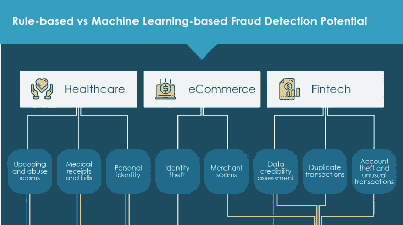
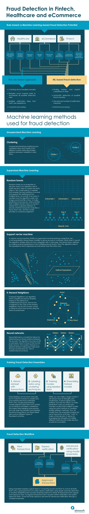

# 金融科技、医疗保健和电子商务中的欺诈检测

> 原文：<https://medium.com/hackernoon/fraud-detection-in-fintech-healthcare-and-ecommerce-ff9f248e18cb>

早在 12 月，我们发布了一份白皮书，涵盖了金融科技、医疗保健和电子商务行业中用于[欺诈检测的机器学习方法。这一次，我们将在一个简明的信息图中总结主要的欺诈检测用例、机器学习方法和途径。如果你想要更详细的细目分类，请查阅原始材料。](https://www.altexsoft.com/whitepapers/fraud-detection-how-machine-learning-systems-help-reveal-scams-in-fintech-healthcare-and-ecommerce/?utm_source=MediumCom&utm_medium=referral)

# 资料来源和进一步阅读

防止应用欺诈的有效方法—[http://www . Experian . no/assets/fraud-analytics/Experian % 20 fraud % 20 analytics % 20 overview . pdf](http://www.experian.no/assets/fraud-analytics/Experian%20Fraud%20Analytics%20Overview.pdf)

检测银行欺诈的最佳实践—[http://www . cbai . com/news/Best _ Practices _ for _ Detecting _ Fraud _ white _ paper . pdf](http://www.cbai.com/news/Best_Practices_for_Detecting_Fraud_white_paper.pdf)

用于检测保险索赔欺诈的机器学习技术的比较分析—[https://www . wipro . com/documents/comparative-analysis-of-machine-learning-techniques-for-detecting-insurance-claims-fraud . pdf](https://www.wipro.com/documents/comparative-analysis-of-machine-learning-techniques-for-detecting-insurance-claims-fraud.pdf)

揭开银行业机器学习的神秘面纱—[https://hollandfintech . com/WP-content/uploads/2017/03/desmitifying-Machine-Learning-for-Banking-feed zai-Report-March-2017 . pdf](https://hollandfintech.com/wp-content/uploads/2017/03/Demistifying-Machine-Learning-for-Banking-Feedzai-Report-March-2017.pdf)

通过决策树和支持向量机检测信用卡欺诈—[http://www . iaeng . org/publication/imecs 2011/imecs 2011 _ PP 442-447 . pdf](http://www.iaeng.org/publication/IMECS2011/IMECS2011_pp442-447.pdf)

身份证诈骗点击量创历史新高—[https://www . javelin strategy . com/sites/default/files/17-1001j-2017-LL-Identity-Fraud-Hits-Record-hights-javelin . pdf](https://www.javelinstrategy.com/sites/default/files/17-1001J-2017-LL-Identity-Fraud-Hits-Record-Highs-Javelin.pdf)

万事达卡在其全球网络中推出人工智能—[https://news room . master card . com/press-releases/master card-Rolls-Out-Artificial-Intelligence-Across-its-Global-Network/](https://newsroom.mastercard.com/press-releases/mastercard-rolls-out-artificial-intelligence-across-its-global-network/)

面向银行和资本市场公司的下一代欺诈管理解决方案—[https://www . capgemini . com/in-en/WP-content/uploads/sites/6/2017/07/next-Generation _ Fraud _ Management _ Solutions _ for _ Banks _ and _ Capital _ Market _ Firms . pdf](https://www.capgemini.com/in-en/wp-content/uploads/sites/6/2017/07/next-generation_fraud_management_solutions_for_banks_and_capital_market_firms.pdf)

监督学习用例:面向企业的数据科学中的低挂果实—[https://www . altex soft . com/blog/business/supervised-Learning-Use-Cases-Low-hang-Fruit-in-Data-Science-for-business/](https://www.altexsoft.com/blog/business/supervised-learning-use-cases-low-hanging-fruit-in-data-science-for-businesses/)

合成身份欺诈在 2016 年使银行损失 60 亿美元:Auriemma 咨询集团—[http://markets . business insider . com/news/stocks/Synthetic-Identity-Fraud-Cost-Banks-2016 年损失 60 亿美元—Auriemma-Consulting-Group-1002222563](http://markets.businessinsider.com/news/stocks/Synthetic-Identity-Fraud-Cost-Banks-6-Billion-in-2016-Auriemma-Consulting-Group-1002222563)

**喜欢这个故事吗？鼓掌让我们知道，这样更多的人可以找到它！**👏
最初发表于 AltexSoft 的博客:*[*金融科技、医疗保健和电子商务领域的欺诈检测*](https://www.altexsoft.com/infographics/fraud-detection-in-ecommerce-finance-and-healthcare/?utm_source=MediumCom&utm_medium=referral)*