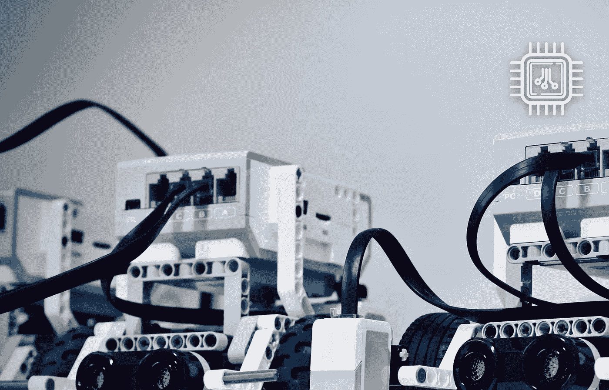
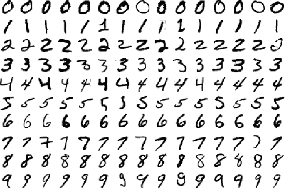
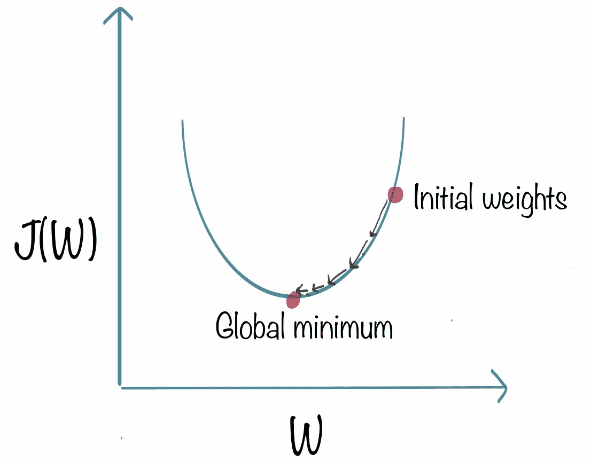
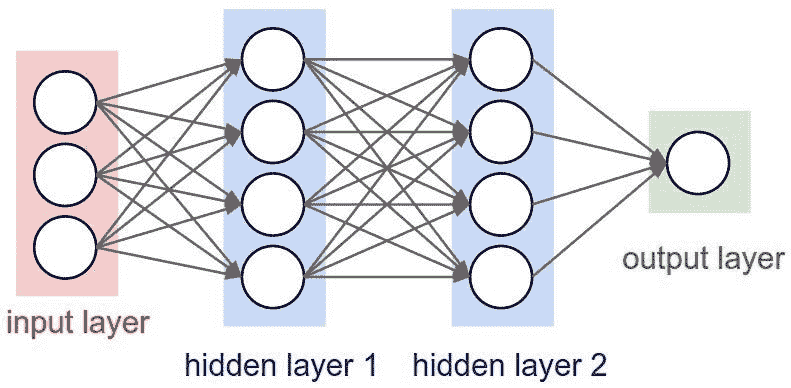

# 学习机器学习的免费 29 部分课程

> 原文：<https://medium.com/hackernoon/free-29-part-course-to-learn-machine-learning-c707beb0bdc7>

Click [here](https://www.commonlounge.com/discussion/aba2c26138cf40b080a1f0d03fc4eabc) to open the course in a new tab so you can follow along with this post

[机器学习](https://hackernoon.com/tagged/machine-learning)无处不在。像数学和计算机科学一样，它正迅速成为一种工具，被广泛用于使一切事情更加有效和高效，从网站到医疗诊断。

今天，我很高兴地宣布[在 Commonlounge](https://www.commonlounge.com/discussion/aba2c26138cf40b080a1f0d03fc4eabc) 上的免费机器学习课程。除了关于 ML 概念和算法的教程，课程还包括端到端的后续示例、测验和动手项目。

一旦完成，你将对机器学习有一个极好的概念和实践理解，并对在你的项目和工作中应用机器学习思维和算法感到舒适。

以下是本课程的简要概述:

# 第 1 部分:机器学习概念(第 1-9 课)

## 第一课:什么是机器学习？为什么是机器学习？

本教程介绍什么是机器学习。特别是，它解释了 ML 与一般编程的不同之处。它解释了*学习*的含义，以及为什么它是解决某些问题的更好方法。

## 第 2 课–第 4 课:梯度下降的线性回归

我们介绍线性回归机器学习模型(第 2 课)，这是现存的最简单的 ML 模型。事实上，这非常简单，可以通过求解一些方程来找到最佳模型。

然而，我们不会这样做，因为这对于更复杂的 ML 模型来说效果不好。相反，我们将*使用梯度下降(第 3 课)来训练*模型，这是一种更通用的用于训练机器学习模型的*优化方法*。

虽然上述两个课程都包含许多方程，但它们也提供了大量的直觉来帮助你理解和可视化正在发生的事情，这与许多其他课程不同。

在第 4 课中，您将通过使用梯度下降实现线性回归来训练您的第一个机器学习模型。

Illustration of Gradient descent for Linear Regression

## 第 5-6 课:过度拟合和正则化

在第 5 课中，您将学习过度拟合和正则化的概念。过拟合是机器学习中最关键的思想之一。简而言之，*过拟合*是指 ML 模型开始将数据中的噪声视为信号。

所有的 ML 模型在某种程度上都过度拟合，完全避免过度拟合是不可行的。这就是*正规化*的用武之地。这是减少 ML 模型*过度拟合*的过程。

第六课是关于这两个主题的测验。

## 第 7 课:对 ML 概念的视觉回顾

本课有一个简短的视频和一个来自 [r2d3](http://www.r2d3.us/visual-intro-to-machine-learning-part-1/) 的漂亮的可视化效果，这两者都是复习到目前为止所学概念的好方法。

## 第 8-9 课:ML 问题的类型

第 8 课介绍了各种类型的 ML 问题。它们是——监督学习、非监督学习和强化学习。一些例子将帮助你更好地理解它们:

**监督学习**——预测一封邮件是否是垃圾邮件，预测股票价格。(给定输入 X，预测值 Y)

**无监督学习**——根据用户的行为发现相似用户群。(给定一些数据，找出数据中的模式)。

**强化学习**——训练机器人玩像国际象棋或围棋这样的游戏(通常我们在一个*世界*中执行一系列*动作*，每一步之后都会发生变化)

第 9 课是关于这个话题的测验。

# 第二部分:有监督的洗钱活动(第 10-20 课)

## 第 10-19 课:监督 ML 的算法

我们的课程主要关注监督学习，因为这些方法在当前的应用中是最成功的，也是最广泛使用的。本节讲述了五种流行的 ML 算法，即:

*   逻辑回归
*   k-最近邻
*   支持向量机
*   朴素贝叶斯
*   推荐系统

其中每一种都是不同的 ML 算法，各有利弊。影响哪种算法最有效的因素包括可用数据量、每个数据样本中的变量数量、数据类型(文本还是数字)等等。此外，它们在计算和内存需求方面也有所不同。

该部分包括两次测验和四次动手作业，因此你可以充分练习使用上述算法解决问题。例如，我们将看到如何对手写数字进行分类，根据情绪(积极或消极)对推文进行分类，以及根据之前评级的电影推荐电影。

Famous cheat sheet (click to enlarge) by [scikit-learn](http://scikit-learn.org/stable/tutorial/machine_learning_map/index.html), the most popular python ML library. We’ll learn most of the ML algorithms mentioned in the image.

## **题外话:课程的主要目标**

请注意，没有必要学习课程涵盖的每个 ML 算法(总共 8 个)。然而，我建议至少学习五种。课程的**主要目标**是

*   学习核心 ML 概念
*   学习一些 ML 算法(最少 5 个)
*   从头开始实现 ML 算法(最少 2 个)
*   对预测任务应用最大似然算法(最少 2 个)
*   做一个更广泛的 ML 项目(至少 1 个)

## 第 20 课:学习=表现+评估+优化

本节的最后一课名为**“学习=表示+评估+优化”**概述了每个 ML 算法的*组成。到目前为止，我们所学的每种算法都对模型如何被*表示*，模型如何被*评估*，以及模型如何被*优化*做出隐式或显式的选择。*

# 第三部分:深度学习(第 21-23 课)

虽然这门课没有太深入[深度学习](https://hackernoon.com/tagged/deep-learning)，但是没有这个本质的、革命性的话题，任何一门机器学习课都是不完整的。

在第 21 课中，我们讨论了什么是深度学习以及它与机器学习的关系。然后我们看一看神经网络(第 22 课)。第 23 课是关于深度学习和神经网络的测验。

A neural network with two hidden layers

# 第四部分:无人监管的 ML(第 24-26 课)

在本节中，我们将介绍另外两种机器学习算法:

*   k-均值聚类，以及
*   主成分分析

这些算法用于*寻找数据中的模式*(与基于输入预测目标值相反)。此外，我们还介绍了*维数灾难*和*维数约简的概念，这两个概念都是将 ML 应用于真实世界数据集的重要概念。*

# 第五部分:项目和临别笔记(第 27-29 课)

我们已经学习了重要的 ML 概念，并使用 ML 算法解决了一些问题。现在，我们将关注更大的项目和大局。

## 第 27 课:端到端示例:预测糖尿病

作为总结，我们给出了一个应用 ML 预测患者是否患有糖尿病的端到端示例。除了 ML 之外，该示例还经历了 ML 工作流的各个典型阶段，例如*数据探索*和*解释 ML 模型*。

## 第 28 课:ML 项目创意

这是一个项目想法的列表(带有数据集)，因此你可以选择一个更广泛的项目。毕竟，实践和构建自己的模型是唯一真正的学习方法😏

## 第 29 课:*民间智慧*

这节课是著名的 ML 研究员 Pedro Domingos 教授的一篇精彩论文的总结。它讨论了 ML 从业者多年来学到的一些重要经验。这是结束课程的一个很好的方式，触及到各个部分并讨论它们之间的关系。当你继续你的 ML 之旅时，这也是你必须拥有的智慧！🙂

我希望你能坚持到课程结束。如果你做到了，你应该得到热烈的掌声！你将会在你的工具箱中增加一个重要的工具，并且你所做的每一个项目，你将会很好的运用这个工具来更好的解决你的问题。

去吧，开始上[机器学习课程](https://www.commonlounge.com/discussion/33a9cce246d343dd85acce5c3c505009)，愿你所有的问题都有大数据集！😄