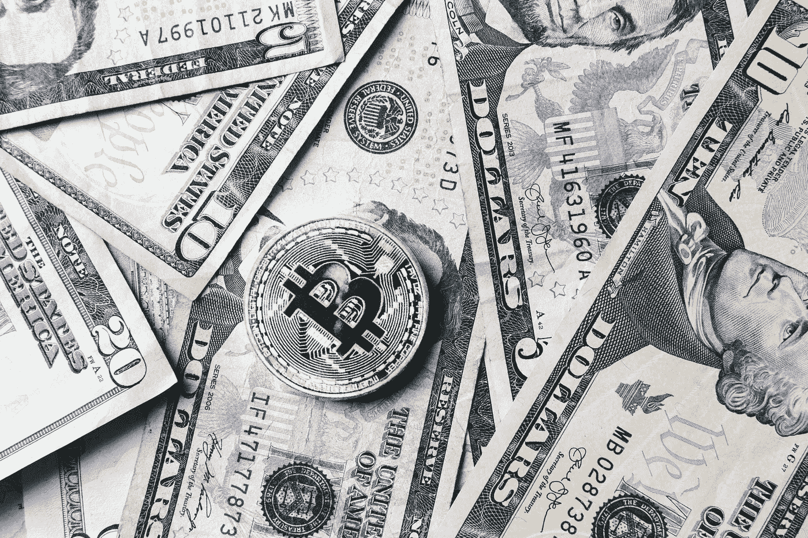

# Burst & Hacker Noon 提供的免费比特币图片收藏

> 原文：<https://medium.com/hackernoon/free-bitcoin-image-collection-by-burst-hacker-noon-4e292524ff47>

What’s that? Free Bitcoin images are available?!

# 为了帮助世界各地的现代设计师、博主、营销人员和企业家， [Burst](http://burst.shopify.com) 与[黑客 Noon](http://hackernoon.com) 合作，创建了专注于区块链和加密货币的股票图片集。

本系列的下一个系列展示了区块链的加密货币比特币(又名 BTC)的图片。浏览比特币投资者阅读最新市场新闻、加密爱好者在交易所买卖、交易分散货币以及人们开采 BTC 的高分辨率图像。**下载我们收集的** [**免费比特币图片**](https://burst.shopify.com/bitcoin) **供你下一个项目使用！**

查看以下图片集中的精选图片。

[**访问 Burst 免费浏览下载全集**](https://burst.shopify.com/bitcoin) **。**

> 黑客正午看比特币新闻的人| [下载高分辨率](https://burst.shopify.com/photos/man-reading-hackernoon-bitcoin-article)

> 比特币钞票上的比特币| [下载高分辨率](https://burst.shopify.com/photos/bitcoin-coin-on-bills-of-cash-money)

> 笔记本电脑上震惊的比特币投资者| [下载高分辨率](https://burst.shopify.com/photos/shocked-bitcoin-investor-on-laptop)

> 比特币 ATM 和卡| [下载高分辨率](https://burst.shopify.com/photos/bitcoin-atm-and-card)

> 屈指可数的比特币加密货币| [下载高分辨率](https://burst.shopify.com/photos/handful-of-bitcoin-cryptocurrency)

> 比特币成存钱罐| [下载高分辨率](https://burst.shopify.com/photos/bitcoin-into-piggy-bank)

## 什么是爆裂？

Burst 是一个由 Shopify 支持的免费图片网站。我们的图书馆包含 [1000 张高质量且免版税的图片，可供免费下载](https://burst.shopify.com/)。Burst 旨在帮助设计师、开发人员、博客作者和企业家创建令人惊叹的网站、营销活动和项目。

## 黑客正午是什么？

[黑客中午](https://hackernoon.com)是黑客如何开始他们的下午。这份在线出版物有 5，000 多名投稿作者，180，000 多名每日访客，& 8，000，000 多月浏览量。他们发表各种各样技术领域的高质量故事:[人工智能](https://hackernoon.com/artificial-intelligence/home)，[区块链](https://hackernoon.com/blockchain/home)，[比特币](https://hackernoon.com/bitcoin/home)， [javascript](https://hackernoon.com/javascript/home) ，[编程](https://hackernoon.com/tagged/programming)，[软件开发](https://hackernoon.com/tagged/software-development)，[自动驾驶汽车](https://hackernoon.com/tagged/self-driving-cars)，[风险投资](https://hackernoon.com/venture-capital/home)和[更多](http://hackernoon.com/latest)。

## 我如何下载照片？

要下载照片，请右键单击以上任何图像，然后选择“保存图像”。对于照片的高分辨率版本，单击链接，您将被定向到我们的下载页面。

## 我可以用这些照片做什么？

你可以将这些图片用于任何事情——你的博客或在线商店上的英雄形象、学校项目的背景、社交媒体活动的照片、客户工作等等。可能性是无限的！有了比特币收藏，这些图片将非常适合加密社区、比特币市场趋势的博客文章、比特币最新暴涨或暴跌的文章等等。

## 我能编辑照片吗？

是的。你可以随意编辑这些照片，比如添加文字或滤镜。欢迎您添加您的徽标或品牌，并制作您自己的照片。

## 我需要信任网站或摄影师吗？

由于我们的免版税许可证，没有必要归功于突发或摄影师。但是，我们鼓励您尽可能以原始照片页面链接的形式提供署名(例如“Sarah Pflug 拍摄的照片”)。

## 我可以将这些照片用于商业目的吗？

是啊！事实上，我们非常鼓励这种做法，因为我们的许多产品系列都是以企业家为设计理念的。你可以在你的网上商店、产品包装或任何你喜欢的地方使用这些免费照片。你甚至可以用这些照片来制作 t 恤、杯子或其他产品。

> Burst 为您的下一个项目准备了数千张高分辨率、免版税的图像。
> 
> [浏览照片](https://burst.shopify.com/free-images)