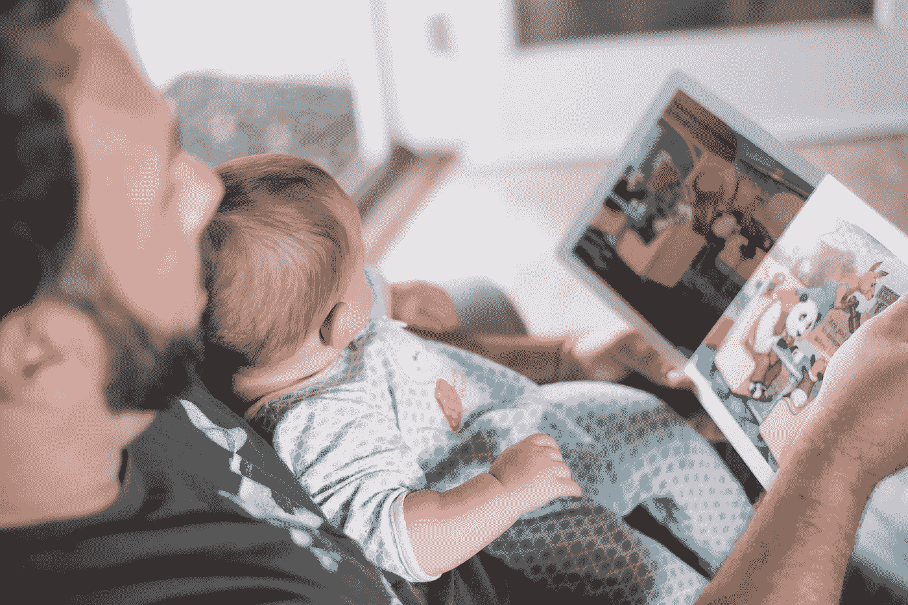

# 空闲时间永远是难以捉摸的

> 原文：<https://medium.com/hackernoon/free-time-is-permanently-elusive-2da3a1c8c94b>

在我的生活中，我做出了一些决定，拒绝了一些薪水更高但要求我工作更长时间的工作机会。原因是我会有更多的空闲时间去追求我感兴趣的其他事情，比如每天写一篇博客，或者每周读一本新书，或者写笑话和表演单口喜剧。

我知道很多人都做过类似的决定——把空闲时间看得比金钱更重要(在某一点之后)。有几项研究也得出了同样的结论——收入超过一定数额(在美国为每年 75000 美元)对人们的幸福感几乎没有影响。之后，他们利用时间做的事情会显著影响他们的幸福水平。

现在，让我们说，每个人都这样优化他们的生活。找到报酬丰厚的好工作，直到他们达到那个门槛(相当于美国的 75000 美元)，然后用剩下的时间做他们更喜欢的事情。

当人们宁愿每天花两个小时和他们的孩子在一起读书，也不愿通过每天额外工作两个小时每年多赚 25000 美元时，你会认为世界会变得更幸福。

但是，人们放弃的 25000 美元不会花在他们并不真正需要的东西上。消费下降导致生产这些人们并不真正需要的东西的公司增长乏力，因为它们的利润开始下滑。结果，经济的总市值以及 GDP 开始下降。

这导致其中一些公司削减成本、裁员和/或压低工资。只有当那些决定花两个小时陪孩子和读书而不是额外工作两个小时的人，现在不得不额外工作两个小时来达到最初的门槛(相当于 75000 美元)时，才能达到平衡。

如此循环往复。

我们的经济结构不允许人们工作几个小时，然后有更多的空闲时间。我们对 GDP 增长的不断需求导致了这样一个社会，在这个社会中，人们需要不断地最大化他们的[生产率](https://hackernoon.com/tagged/productivity)，并尽可能地用工作填满他们的时间。

如果我们不重视我们可以通过加班或不加班赚到的额外的钱来购买的东西，这真的没有关系。我们需要额外工作几个小时来维持我们社会和经济的运转。

总会有一小撮人对额外的工作和额外的钱说不，支持额外的空闲时间，而绝大多数人崇拜他们，希望成为他们那样的人。

但是他们不能这样做。因为，一旦他们这样做了，他们就把平衡转移到一个新的地方，再次导致少数人和大多数人像以前一样站在对立面。

对大多数人来说，空闲时间永远是难以捉摸的。除非，我们能找到一种方法来重组我们的经济，让它变得可以被抓住。

## 在你走之前…

如果你喜欢这个，请支持我的工作。你需要做的就是鼓掌。

[*跟我讨论美好生活的错综复杂。*](http://eepurl.com/cqwJZT)

[*读我的书*](https://www.amazon.com/s/ref=nb_sb_noss?url=search-alias%3Daps&field-keywords=mayantuyacu)