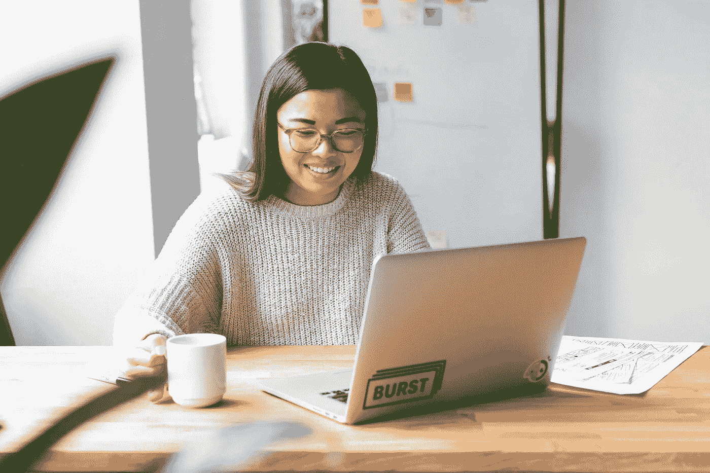
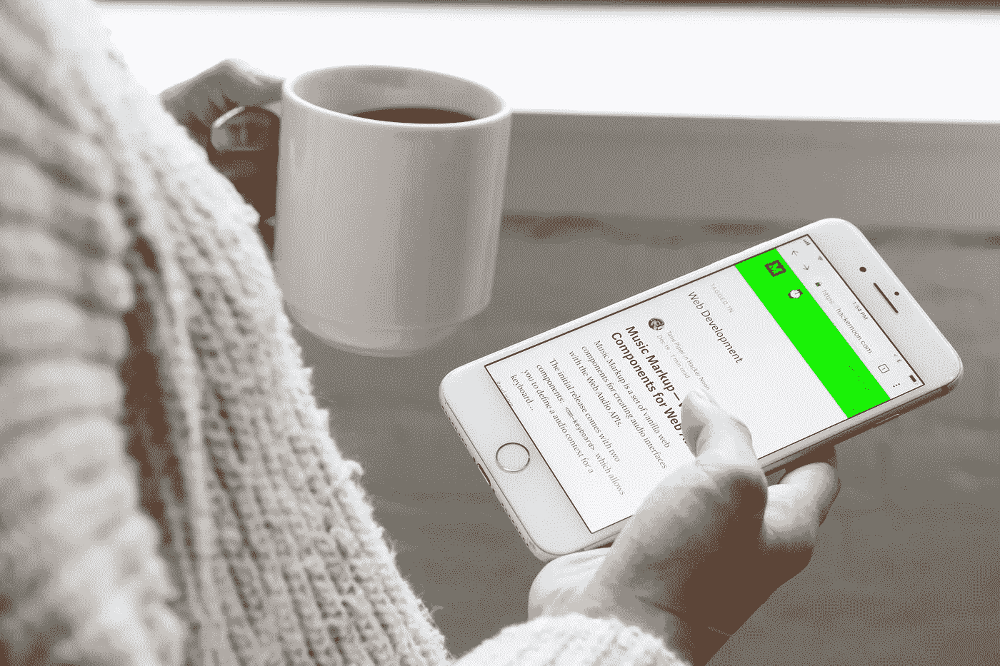
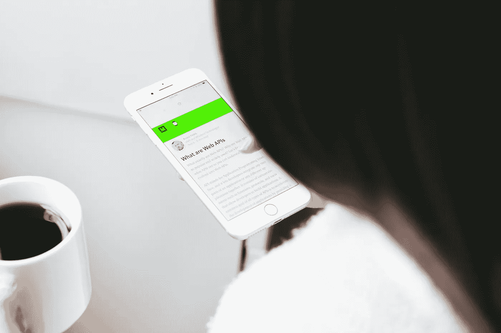
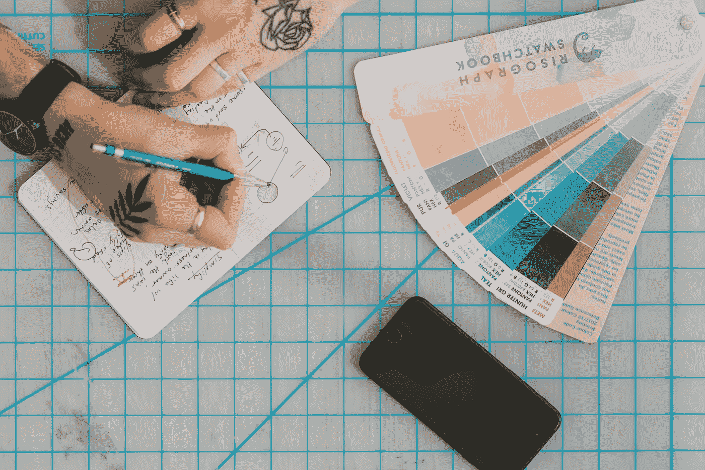
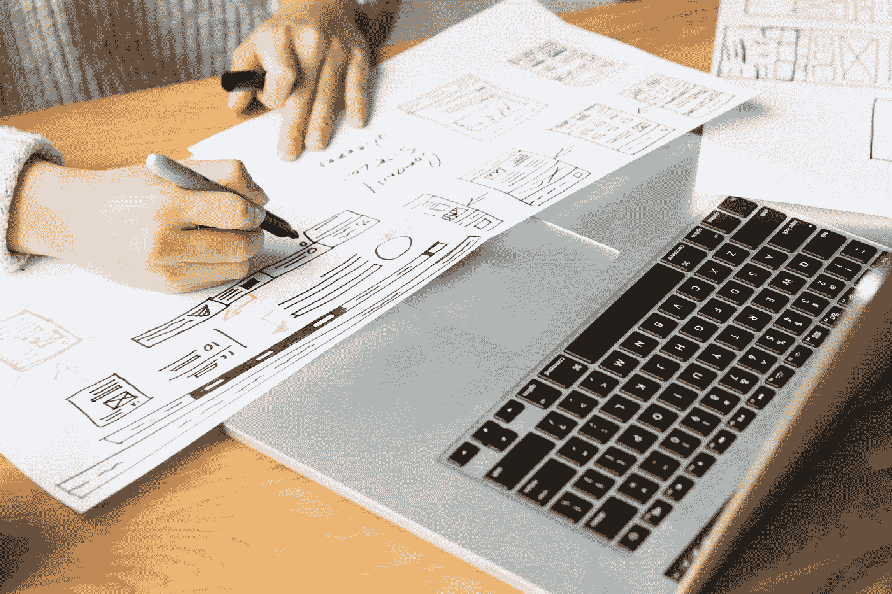
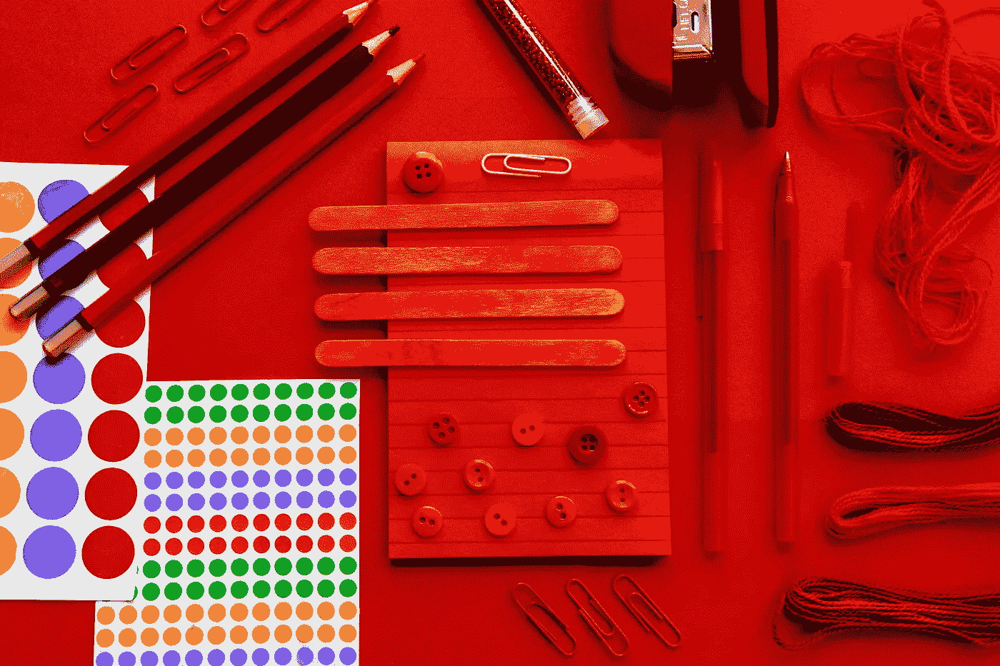
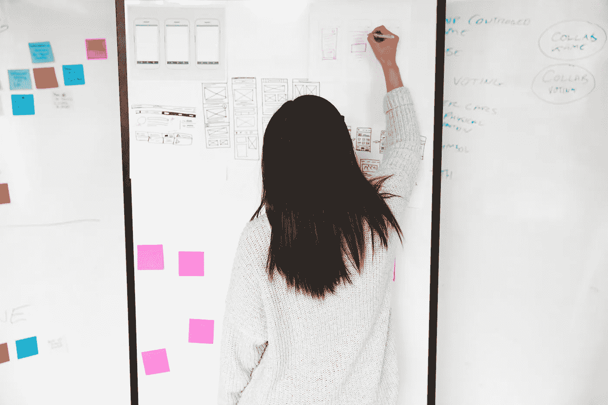
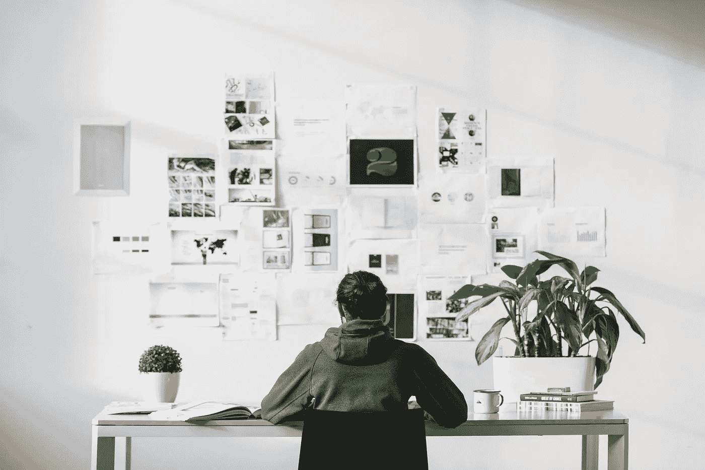
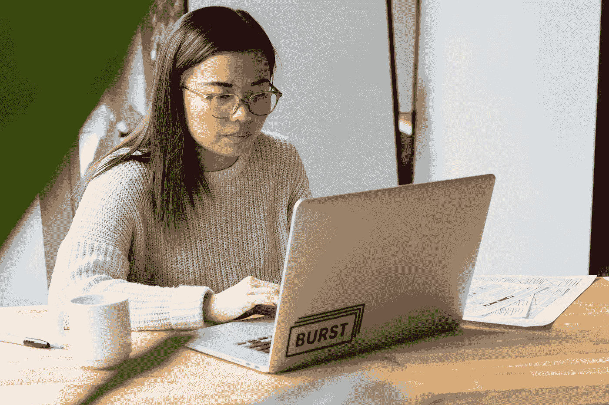

# 突发和黑客中午免费网页设计股票照片收集

> 原文：<https://medium.com/hackernoon/free-web-design-stock-photo-collection-by-burst-hacker-noon-33ec8c79a8e2>

# 为了帮助世界各地的现代设计师、博主、营销人员和企业家， [Burst](http://burst.shopify.com) 与[黑客 Noon](http://hackernoon.com) 合作，创建关注新兴技术的库存照片集。

这个系列的第一个系列展示了产品、图形和网页设计师的日常工作。你可以在这里查看该系列，浏览设计师头脑风暴、创意团队在办公桌前工作以及自由职业者绘制 UX 模型的高分辨率图片。

查看以下图片集中的精选图片。[访问 Burst 免费浏览下载全集](http://burst.shopify.com/graphic-designer)。

> 在手机上阅读黑客正午| [下载高分辨率](https://burst.shopify.com/photos/reading-web-design-blog-hackernoon-on-phone)

> 网页设计模型| [下载高分辨率](https://burst.shopify.com/photos/feedback-for-web-design-mockups)

> 黑客正午上的网页设计博客| [下载高分辨率](https://burst.shopify.com/photos/web-design-blogpost-on-hackernoon)

> 带咖啡和线框的设计师办公桌| [下载高分辨率](https://burst.shopify.com/photos/designers-desk-with-coffee-and-wireframes)

> 带颜色选项的创意作品| [下载高分辨率](https://burst.shopify.com/photos/creative-work-with-color-options)

> 设计师绘图网站样机| [下载高分辨率](https://burst.shopify.com/photos/designer-drawing-website-mockup)

> 用红色创作| [下载高分辨率](https://burst.shopify.com/photos/creating-with-reds)

> 在白板上绘制网站模型| [下载高分辨率](https://burst.shopify.com/photos/drawing-website-mockups-on-whiteboard)

> 桌面设计师| [下载高分辨率](https://burst.shopify.com/photos/designer-at-desk)

> 在笔记本电脑上工作的自由设计师| [下载高分辨率](https://burst.shopify.com/photos/freelance-designer-working-on-laptop)

> 男人写作| [下载高分辨率](https://burst.shopify.com/photos/man-writing)

> 网页设计师开始她的一天| [下载高分辨率](https://burst.shopify.com/photos/web-designer-starting-her-day)

## 什么是爆裂？

Burst 是一个由 Shopify 支持的免费图片网站。我们的图书馆包含 [1000 张高质量和免版税的图片，可供免费下载](https://burst.shopify.com/)。Burst 旨在帮助设计师、开发人员、博客作者和企业家创建令人惊叹的网站、营销活动和项目。

## 黑客正午是什么？

[黑客中午](https://hackernoon.com)是黑客如何开始他们的下午。这份在线出版物有 5，000 多名投稿作者，180，000 多名每日访客，& 8，000，000 多月浏览量。他们发表各种各样技术领域的高质量故事:[人工智能](https://hackernoon.com/artificial-intelligence/home)、[区块链](https://hackernoon.com/blockchain/home)、[比特币](https://hackernoon.com/bitcoin/home)、 [javascript](https://hackernoon.com/javascript/home) 、[编程](https://hackernoon.com/tagged/programming)、[软件开发](https://hackernoon.com/tagged/software-development)、[自动驾驶汽车](https://hackernoon.com/tagged/self-driving-cars)、[风险投资](https://hackernoon.com/venture-capital/home)和[更多](http://hackernoon.com/latest)。

## 我如何下载照片？

要下载照片，请右键单击以上任何图像，然后选择“保存图像”。对于照片的高分辨率版本，单击链接，您将被定向到我们的下载页面。

## 我可以用这些照片做什么？

你可以将这些图片用于任何事情——你的博客或在线商店上的英雄形象、学校项目的背景、社交媒体活动的照片、客户工作等等。可能性是无限的！有了 design collection，这些图像将非常适合作为 UX 专业人士生活的媒体文章、关于网页设计趋势的博客帖子、设计师脸书小组的封面照片等。

## 我能编辑照片吗？

是的。你可以随意编辑这些照片，比如添加文字或滤镜。欢迎您添加您的徽标或品牌，并制作您自己的照片。

## 我需要信任网站或摄影师吗？

由于我们的免版税许可证，没有必要归功于突发或摄影师。但是，我们鼓励您尽可能以原始照片页面链接的形式提供署名(例如“Sarah Pflug 拍摄的照片”)。

## 我可以将这些照片用于商业目的吗？

是啊！事实上，我们非常鼓励这样做，因为我们的许多产品系列都是以企业家为理念的。你可以在你的网上商店、产品包装或任何你喜欢的地方使用这些免费照片。你甚至可以用这些照片来制作 t 恤、杯子或其他产品。

> Burst 为您的下一个项目准备了数千张高分辨率、免版税的图像。
> 
> [浏览照片](https://burst.shopify.com/free-images)