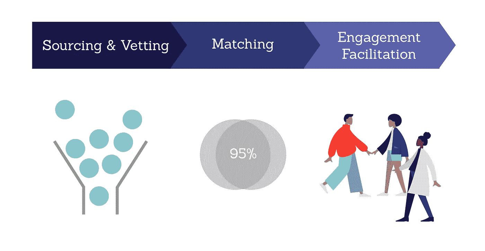
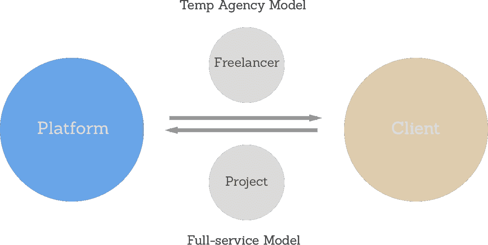
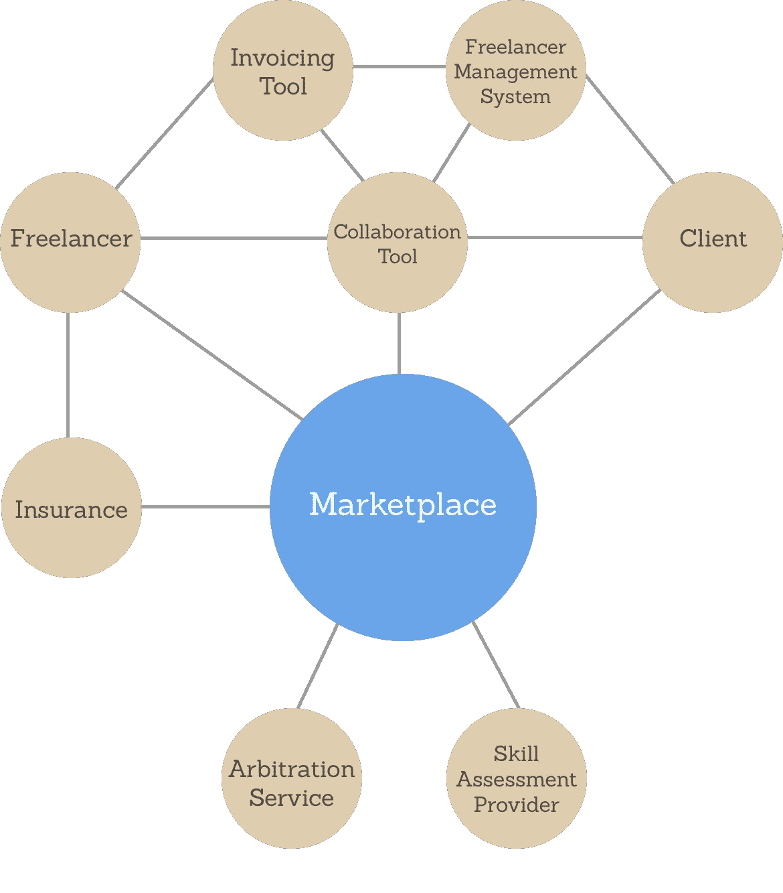

# 自由职业者市场 2.0:工作的未来发生在哪里

> 原文：<https://medium.com/hackernoon/freelance-marketplace-2-0-where-future-of-work-happens-1a92ada76725>

> **📖*原载于***

*除非你一直生活在岩石下，否则你很可能听说过“自由职业者经济”这个术语——它目前占美国劳动力的 35%，预计到 2027 年将达到 50.9%。*

*面向高技能工作者的在线自由职业市场，如 [Upwork](http://upwork.com) (最近上市的[)和](https://techcrunch.com/2018/10/03/upwork-pops-more-than-50-percent-in-nasdaq-debut/)[Freelancer.com](http://freelancer.com)，已经成为塑造自由职业生态系统的关键角色。他们当然不会错过前面的机会。随着新平台的出现，旧平台试图留在游戏中，我们可能会在未来 2-3 年内看到这一领域的新一轮创新浪潮。*

*作为软件开发人员的自由职业者和一对一导师市场[共同导师](http://codementor.io)的前产品经理，我很乐意分享一些关于这个快速增长领域的个人观察和预测。*

> *👋嘿，你也可以在我的博客上看这篇文章:[**austinyang.co**](https://austinyang.co/freelance-marketplace-2-0/)*

# *自由职业者市场解释道*

*让我们首先来看看自由职业者市场的关键功能。如果您已经熟悉它们，请随意跳过这一部分。*

**

## *采购和审查*

*73%的自由职业者通过在线市场寻找工作的首要原因是可以立即接触到大量的客户。如果没有平台的采购和审查功能，这是不可能的。*

*寻源是指平台致力于增加其整体供需池的用户获取努力，而审查是指平台建立的确保其用户基本质量水平的机制，如技能测试和背景调查。*

## *相称的*

*然而，如果客户不能很快为他们的项目找到合适的自由职业者，那么拥有充足的供给和需求是没有用的。这就是平台匹配功能的用武之地。有效连接双方的能力将好的平台与坏的平台区分开来。它包含了大量用户看不到的幕后工作。*

*举个例子，当我在为公司雇佣精英自由开发者的平台 [CodementorX](https://hire.codementor.io) 工作时，每个请求都要经过四个匹配步骤:*

1.  *招聘顾问和客户之间收集需求的电话*
2.  *基于最大似然法的算法，通过结构化数据，如专业知识，可用性，时区，时薪等对自由职业者进行排名*
3.  *专门的匹配者根据定性因素(包括软技能、个性、工作经验等)筛选出三名候选人*
4.  *雇佣顾问来促进客户和候选人之间的面试*

*事实证明，这一流程可以将高级自由开发人员的平均招聘时间从 4–8 周缩短到不到两周。*

***但这里有一个问题**——对于高质量的自由职业者和客户来说，平台匹配功能的价值随着时间的推移而贬值。他们在生态系统中呆的时间越长，就越容易通过推荐找到对方。这就是为什么一个平台必须提供价值，而不仅仅是连接自由职业者和客户，以最大化他们的 LTV。*

## *参与促进:*

*超过 90%的自由职业者市场通过收取平台交易的佣金(通常在 10-25%之间)来创收。因此，除了重罚之外，他们最好给用户强烈的动机不去规避它们。提供 SaaS 工具和简化的物流来促进持续的参与是这样做的一种方式。*

*一般来说，通过平台工作可以减少客户和自由职业者在文书工作和支付方面必须处理的麻烦，尤其是当雇佣是跨境的时候。也可以在发生纠纷时提供一定程度的保护。*

*但是这些真的足以防止规避吗？*

*答案:**看情况**。你必须考虑诸如项目规模、替代方案的成本以及客户和自由职业者之间的信任等因素。以我的经验来看，使用自由职业者进行短期项目的大公司通常会从通过平台工作中受益最大，因为物流方便。*

# *观察*

*现在，让我们深入探讨一下我在过去两年中所做的一些有趣的观察。*

## *1.越来越关注企业客户*

*Intuit 2020 报告估计，80%的大公司计划在未来几年增加对自由职业者的使用。埃森哲还指出 [20%的财富 500 强公司已经在使用 Upwork](https://www.accenture.com/t20170321T032507__w__/us-en/_acnmedia/Accenture/next-gen-4/tech-vision-2017/pdf/Accenture-TV17-Full.pdf?la=en) (如果算上其他平台，可能更多)为劳动力转型做准备。*

*过去几年来，越来越多的针对企业客户的自由职业平台和服务很好地支持了这一趋势，例如 2016 年推出的 [Upwork Enterprise](https://www.upwork.com/blog/2016/02/upwork-enterprise/) 和 [Upwork Pro](https://www.upwork.com/blog/2016/02/upwork-pro/) 。这些服务的诞生有一个显而易见的原因——企业客户支付更多费用。多得多。*

*在 Upwork 的案例中，2018 年上半年其 1.219 亿美元收入的 10%来自单一客户——只有企业客户才能获得这一预算。*

*尽管中小型企业出于各种原因雇佣自由职业者，但企业公司通常会为需要高度专业化技能的一次性或实验性项目雇佣自由职业者。如果自由职业者是顶尖的，他们很乐意支付高额报酬。如果你考虑在一家大公司雇用一名资深全职员工所涉及的时间、资源、机会成本和相关风险，150-300 美元的时薪相比之下就像是零花钱。*

*然而，仅仅提供顶级人才是不够的。企业客户还希望平台能够提供出色的白手套服务，以证明其高价的合理性。目前，面向企业客户的平台大致可以分为两类:*

***全方位服务模式** —专注于完成可交付成果。负责项目的整个生命周期。*

*   ***举例:**[Gigster](https://gigster.com/)([2017 年重点转向企业](https://techcrunch.com/2017/08/29/gigster/))[剧组](https://crew.co/)(被[运球](https://dribbble.com/hiring)收购)[Paro](https://www.paro.io)[Contently](https://contently.com)[Povio](https://pov.io/)[Rev](https://www.rev.com/)*

***临时代理模式—** 专注于提供最优秀的人才。最大限度地参与交付。*

*   ***举例:** [Toptal](https://www.toptal.com) ， [CodementorX](https://hire.codementor.io) ， [Upwork Pro](https://www.upwork.com/pro/) ， [ScalablePath](https://www.scalablepath.com/) ， [Credo](https://www.getcredo.com/) ， [X-Team](https://x-team.com/)*

**

*尽管企业市场看起来利润丰厚，但过时的企业实践仍是平台需要克服的一大挑战。大多数公司都没有为自由职业者建立合适的工作制度。例如，自由职业平台应该被视为个体承包商还是供应商？分类将决定支付条款、计费方法和法律责任。这两类似乎都不理想。如果平台想在企业市场占有更大的份额，它们必须开发业务流程和产品特性来适应这些问题。*

## *2.混沌生态系统的四骑士*

*自由职业会像预测的那样在 2027 年取代传统职业吗？在目前的情况下不太可能。*

*可悲的是，自由职业者的世界仍然是一个混乱的地方。每一个成功的约定，都会有三个失败的约定，原因是延迟付款、自由职业者失踪和合同纠纷。然而，这些问题纯粹是四个潜在挑战的“症状”:*

*   ***缺乏监管:**除了纽约市在 2017 年推出的[自由职业者不自由法案](https://www1.nyc.gov/site/dca/about/freelance-isnt-free-act.page)，专门为自由职业者设计的立法几乎不存在。尽管所有的自由职业者市场都有基本的规则，但它们很少足够全面有效。*
*   ***进入门槛低:**与传统的就业市场不同，自由职业市场向更广泛的人口统计和使用案例敞开大门。准入门槛低，让骗子、不合格用户、wantrepreneurs 更容易参与市场。*
*   ***无国界市场:**虽然自由职业不一定等同于远程工作，但大多数热门领域的工作——软件开发、设计、内容营销——都可以在没有实体存在的情况下轻松完成。地缘政治限制的取消带来了一系列新挑战，如合同执行(或缺乏执行)、文化误解以及发达和发展中经济体自由职业者之间的竞标战。*
*   ***主观成功**:与订餐不同，你可以通过查看正确的订单是否及时送达来确定成功，自由职业项目的成功往往是主观的。当无法客观定义成功时，争议自然会接踵而至。*

# *预言*

*那么，高技能自由职业者市场的下一步是什么？以下是我的预测。*

## *1.平台将在教育市场方面发挥更大的作用，尤其是在供应方面*

*如果说自由职业者市场消息不灵通，这是一种保守的说法，因为即使是最有经验的参与者也可能对以下话题一无所知:*

*   *我应该为`expertise`支付/收取多少费用？*
*   *如何增加我雇佣一个好的自由职业者/被雇佣的机会？*
*   *如何评价一个潜在的自由职业者/客户？*
*   *订婚前要讨论和商定什么？*
*   *如何预防和解决纠纷？*

*这为平台提供了一个巨大的机会，通过为用户提供信息来改善他们的漏斗下端指标。用户可以期待看到更多的教育计划被嵌入到产品体验中。例如:*

*   *入职期间的强制性自由职业 101 课程。*
*   *定价指导——“你的价格高于在`location`工作`#`年`expertise`的自由职业者的 80%”，或者“具有类似要求的项目通常花费在 5k-8k 美元之间。”*
*   *关于市场趋势、面试技巧和远程工作的网络研讨会。*

*在供应方面，教育的影响尤其明显。尽管自由职业者是各自领域的专家，但许多人低估了与客户打交道所需的商业技能。通过提供最佳实践和技能培训，这些平台将提高自由职业者的可雇佣性，从而提高转化率和参与成功率。*

## *2.垂直平台将击败竞争对手*

*自 21 世纪初以来，我们都见证了简单 B2C 服务的垂直市场的崛起，如优步和 Instacart。通过为各自的垂直行业打造无缝的产品体验，这些平台要么 1)推翻其类似 Craigslist 的前辈，要么 2)将以前无法提供的服务数字化。*

*我预测同样的趋势也会发生在自由职业者市场。*

*对于一个普通的自由职业者市场来说，为每一个工作类别创造垂直化的体验不仅是一项昂贵的投资，也是一场运营噩梦。相比之下，由于特定于垂直行业的市场只为一种工作类别提供服务，因此它有能力构建特定于工作的功能，从而创造出卓越的用户体验。例如，一个专注于软件开发的平台可能会为客户构建一个代码编辑器来进行现场编码访谈。*

*然而，由于高技能自由职业的复杂性，执行起来说起来容易做起来难。当使用打车服务时，只有几个变量:上车地点、下车地点和车辆类型，而雇佣软件开发人员涉及无数变量:专业知识、项目细节、雇佣期限、雇佣时间表、行业等。一刀切的体验注定是平庸的。每个平台都必须进一步细分其垂直市场，并优先考虑最有价值的(战略上和金钱上)用例。*

*在一天结束时，这是所有关于服务一个利基比其他人更好。能够做到这一点的平台将更有机会实现可防御和可伸缩性。*

## *3.日益一体化的生态系统和市场网络的兴起*

*除了自由职业市场，自由职业生态系统还包括更多的组成部分。仅举几个例子:*

*   ***自由职业者管理系统:** [伽罗](https://kalohq.com/)，[入围名单](http://shortlist.co)，[劳务市场](https://www.workmarket.com/)*
*   ***全栈自由职业解决方案:** [和 CO](https://www.and.co/)(by Fiverr)[Bonsai](https://www.hellobonsai.com)*
*   ***付款:** [条纹](http://Stripe.com)，[转账](https://transferwise.com/)，[付款人](https://www.payoneer.com)*
*   ***开票&会计:** [波](https://www.waveapps.com)，[中豪发票](https://www.zoho.com/invoice/)， [FreshBooks](https://www.freshbooks.com/)*
*   ***时间追踪:** [Toggl](https://toggl.com/) ，[收获](https://www.getharvest.com)， [HubStaff](https://hubstaff.com) ， [TopTracker](https://tracker.toptal.com/tracker) (按 Toptal)*
*   ***背景检查:** [检查器](https://checkr.com/)*
*   ***争议解决:** [公平索赔](https://www.fairclaims.com/)*
*   ***技能考核:** [技能考核，](http://codility.com) [技能考核](https://www.capterra.com/p/171669/HireVue-Assessments/)*
*   ***培训&教育:** [Lessonly](https://www.lessonly.com/) ， [Looop](https://www.looop.co/)*
*   ***责任保险:** [小艇](https://getdinghy.com/)， [Hiscox](https://www.hiscox.com/partner/freelancersunion)*

*随着公司和高技能工人将自由职业作为一种正式的做法，针对自由职业经济的新产品和服务将继续出现。由于这些服务相互补充，因此它们构建互利的集成来加速增长是有意义的。*

**

*A simple representation of an integrated freelance ecosystem*

*例如，想象一下在一个自由职业者管理系统中创建一个工作，只需点击一下就可以将工作交叉发布到多个自由职业者市场，并在同一个系统中审查所有申请。这种整合不仅会为市场提供一个额外的用户获取渠道，还会增加自由职业者管理系统在客户眼中的价值。*

*此外，我们甚至可能会看到自由职业者市场网络的出现，在这里自由职业者、客户、代理和第三方服务提供商可以相互交流。成为一个市场网络将放大一个平台的网络效应，使其收入来源多样化，并可能解决所有自由职业者市场固有的一个问题——雇佣自由职业者是一个低频用例——通过社交或生产力功能推动更多的参与。*

# *展望未来*

*随着 Upwork 的 IPO，自由职业经济正式进入新时代。虽然我怀疑自由职业者会很快取代传统就业，但如果有可能的话，它将不可避免地重新定义我们所知的“工作”,实现更高效的按需劳动模式。我很高兴看到自由职业者市场将如何支持这种转变，并将“工作的未来”变成现实。*

## *取得联系*

*喜欢这篇文章？随时查看我的博客【austinyang.co】T3[T5](https://austinyang.co/)*

*如果你有兴趣聊聊工作的**前景**、**自由经济**、**市场创业**、**产品**或**成长**，请随时通过 [**Twitter**](https://twitter.com/IamAustinYang) 或 [**LinkedIn**](https://www.linkedin.com/in/austinyang91/) 联系。*

**