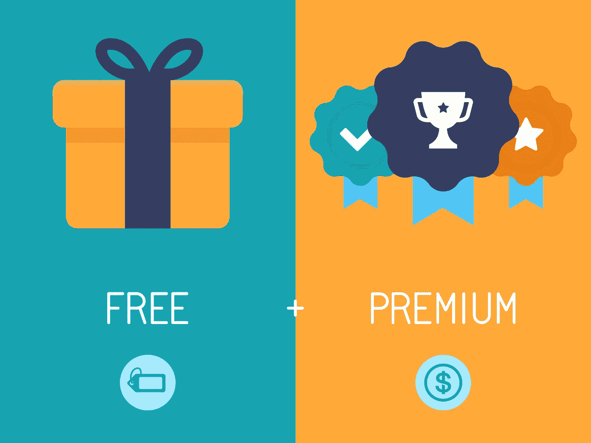
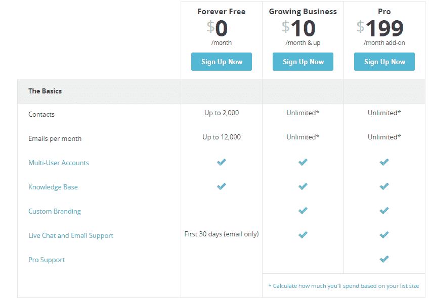
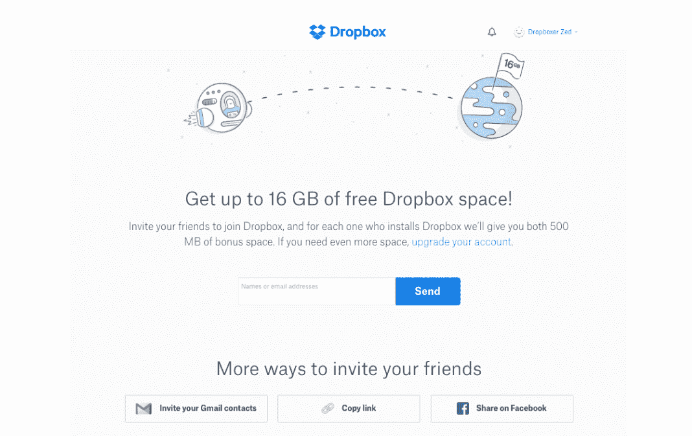
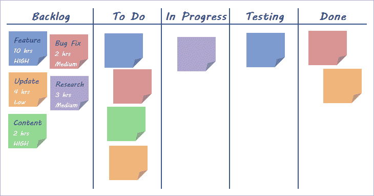
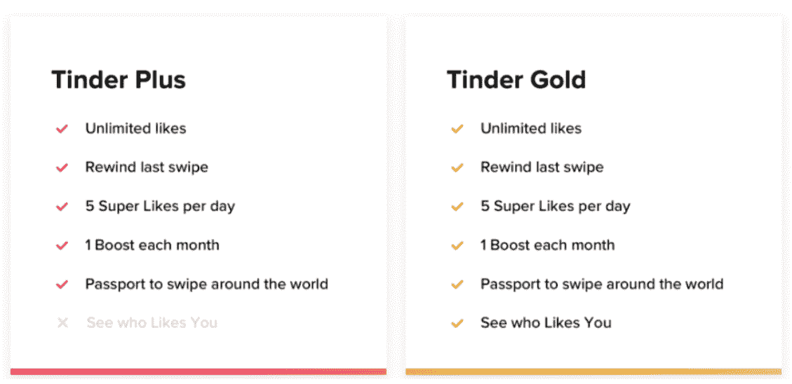
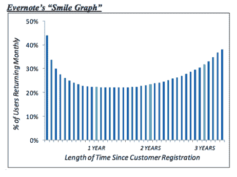

# 免费增值和互联网:天作之合…或者地狱

> 原文：<https://medium.com/hackernoon/freemium-and-the-internet-a-match-made-in-heaven-or-hell-d80dd0e4824>

[Source](https://www.inclaninteractive.com/uncategorized/the-freemium-model-what-is-it-and-how-can-you-use-it-effectively/)

尽管术语“免费增值”最近才被引入商业行话，但其背后的中心思想并不新鲜:向客户免费提供产品/服务，希望影响她购买另一种产品。19 世纪末，吉列[在现代工业化世界开创了这一理念，免费提供剃须刀，但对一次性刀片收费，以收回剃须刀的成本。并由此建立了一个拥有强大护城河的品牌，这个品牌存活了 100 多年。](https://www.wired.com/2008/02/ff-free/)

如今，你可以看到许多相同商业模式的例子，其中付费产品交叉补贴免费产品:通过签署两年每月 60 美元的手机合同，免费获得价值 700 美元的手机；免费获得一个方形读卡器，并在每笔交易中支付固定的%ge。

当软件在实体店以光盘形式销售时，这种交叉补贴的策略在数字世界也很有效。即便是现在，在游戏行业，游戏发行商也要按照售出的 PS4 或 Xbox 游戏光盘的固定比例向微软和索尼支付费用。

但是互联网的发明改变了一切。它颠覆了关于软件产品如何交付和消费的假设，因为边际成本——销售额外单位的产品或服务所产生的成本——显著下降。

1.  *销售商品的成本*为零，因为软件只是一段可以无限复制的代码。
2.  *分销成本*——将产品送到顾客手中的成本——也变得几乎为零，因为软件可以通过互联网交付，也可以在商店购买 CD。
3.  *交易成本*，即执行和支持交易的成本，也变得非常高效。不需要去实体店；不需要销售人员带你参观；不需要收银员帮忙交易。你所需要做的就是输入你的信用卡信息，一切都准备好了。你可能一辈子都不会和公司的任何人打交道。

随着上述所有可变成本的大幅下降，软件企业提供产品的免费版本变得更加诱人，希望获得大量客户，并在以后将其转化为付费客户。

但是说起来容易做起来难。软件产品的历史充满了这种方法不成功的例子；那些没有对基本原则进行足够深入思考的公司，或者即使他们进行了思考，当他们意识到已经为时太晚，无法进行任何方向的修正。

为免费增值创造有利环境的原则/条件是什么？事不宜迟，让我们开始吧:

## **这是免费的，但仍然很好**

正如我之前所说，免费增值在软件世界的核心目标是获得尽可能多的用户，并希望在以后的某个时候将他们转化为付费用户——因为边际成本非常低，所以你有能力这样做。但是，只有当用户能够从中获得在其他地方无法免费获得的价值时，他们才会到来并留下来。

在免费版本中提供低于标准的体验，并希望客户会转向付费，更好的版本对你的业务弊大于利，因为客户会以比他们进来时更快的速度避开你的产品。他们不仅会离开，还会阻止其他顾客尝试该产品。

所以，没有噱头；没有次优产品；请不要有不好的用户体验。客户必须能够从免费产品中获得足够的价值，即使他们从未决定升级。

[**邮件营销和营销自动化公司 MailChimp**](https://mailchimp.com/) 就是一个光辉的例子。9 年前，它推出了免费增值服务。阅读链接博客博斯特。太好了！

通过它的免费版本，用户可以向多达 2000 个联系人发送电子邮件，或者每月最多发送 12000 封电子邮件。免费和付费版本的产品工作方式相同。除此之外，自从推出免费版以来，它一直通过增加你可以发送电子邮件的联系人数量来增加免费产品的价值。一开始有 500 个联系人，后来增加到 1000 个，最后增加到 2000 个。

(Source: Mailchimp.com)

另一方面，我讨厌**苹果的 iCloud 存储**。不仅整个产品漏洞百出，不直观，而且免费版也很糟糕。你可以免费获得微不足道的 5GB 存储空间。自 2011 年推出以来，这一点从未改变过，尽管你用手机拍摄的图像/视频数量和质量/分辨率都发生了巨大变化。

iCloud Photo Stream 是解决这个问题的一个半生不熟的尝试，因为它会在删除之前将您最近的照片/视频保存在云中 30 天。相比之下，谷歌的新手机 Google Pixel 允许无限存储通过手机拍摄的照片和视频。如果我转用 Android，iCloud 肯定是最大的原因之一。

## **非常大的市场，有一定程度的病毒式传播**

根据 Tomasz Tunguz 的说法，免费增值产品的转化率通常在 2%到 4%之间。一个简单的数学练习表明，要实现 1 亿美元的年度经常性收入(ARR)，一家公司需要 100 万名每年向你支付 100 美元的客户。假设平均转化率为 3%，公司需要 3300 万免费和付费用户。这实际上已经很多了，这意味着要取得成功:

*   这种产品需要在巨大的市场中运作。
*   公司需要找到一种非常便宜的方式来获得这些客户，因为付费获取渠道不是一个选项；商业经济学将毫无意义。因此，产品需要有正确的挂钩/激励机制，才能像病毒一样传播，并通过有机方式或推荐方式吸引客户。

[**Dropbox**](https://www.dropbox.com/) 就是这样一家人人津津乐道的稀有公司。它总共有 5 亿用户，其中只有 2%是付费用户。Dropbox 能够取得这样的成就是因为:

*网络效应*——每当用户在 Dropbox 上与没有安装 Dropbox 的人分享文件时，其他人就倾向于尝试一下。随着越来越多的人使用 Dropbox 并分享文件，Dropbox 对每个人的价值都在增加。

*病毒式推荐增长*——Dropbox 通过激励客户为他们推荐给 Dropbox 的每个新用户提供免费存储空间，从而赢得了数亿用户。有了这个简单的黑客技术，用户就成了他们的福音传播者。

(Source: Dropbox.com)

DIY 网站建设者 wee bly wee bly wee bly wee bly wee bly wee bly wee bly wee bly wee bly wee bly wee bly wee bly wee bly wee bly wee bly wee bly wee bly wee bly wee bly wee bly 是一家 DIY 网站建设者，它努力实现可持续免费增值模式所需的规模，最终以低于上一轮融资的估值被出售给 Square。

需要明确的是，以数亿美元(确切地说是 3.65 亿美元)的价格出售你的[创业公司](https://hackernoon.com/tagged/startup)是一项不小的壮举，从任何标准来看都不算失败。我只想强调，让数百万中小企业使用你的产品——即使是免费的——是非常困难的，如果不是不可能的话。

首先，Weebly 没有合适的成分来传播病毒。免费网站显著地展示了*“由 Weebly 提供动力”*的广告，多少暗示着这项业务可能很便宜。没有一个寻找专业网站的客户会愿意与这样的形象联系在一起。此外，大多数竞争网站的建设者提供了类似的免费产品。没有什么独特的东西能让它们与众不同并获得病毒式传播。第二，它在品牌美元上的花费无法超过 Wix 或 GoDaddy，因此无法获得免费客户。通过被一家大公司收购而优雅地退出是非常有意义的。

## **服务客户的成本需要非常低**

到目前为止，该公司已经创造了一种有价值的免费产品，并找到了一种廉价获取客户的方法。但这还不够。要成为可持续发展的企业，服务/支持客户的成本应该非常低。就 Dropbox 而言，5 亿用户中只有 1100 万人付费，但该公司的自由现金流是正的。

[**Typeform**](https://www.typeform.com/) ，一个调查/表单生成器工具，是说明这一点的另一个很好的例子。与 MailChimp 一样，他们的免费版本也受到每月免费调查数量或调查中可以发送的问题总数的限制。一个对网络世界有初步了解的人可以在没有任何人员帮助的情况下创建并开始发送调查。此外，发送/管理调查的成本(带宽和存储成本)几乎为零。

而音乐流媒体应用程序 Spotify 则与这一原则背道而驰。在最近提交 IPO 申请时，它拥有 1.58 亿月平均用户和 7000 万付费用户，这意味着近 9000 万免费用户。

Spotify [为每个播放的音乐流向版权所有者支付](https://www.theverge.com/2015/12/7/9861372/spotify-year-in-review-artist-payment-royalties)0.0006 到 0.0084 美元的版税。假设一个免费用户每月平均每天播放 5 首歌曲，这些免费用户每年至少要花费 Spotify 大约 1 亿美元。这是支持免费用户的一大笔钱。有各种行业动态对如此高的成本负责。稍后，我会在另一篇博客文章中讨论这个问题。

## **从免费升级到付费的强烈动机**

即使一家公司刷到了目前为止的所有要点，如果没有令人信服的理由让客户升级到付费服务，所有的努力都将付诸东流。为此，你不仅需要明智地决定在免费版本中保留哪些功能，还需要不断创新，不断改进付费版本。

[**Wix**](http://www.wix.com) ，一个让你免费托管网站的 DIY 网站建设者，拥有 1.3 亿注册用户和 350 万付费用户。免费用户获得一个后缀为*.wixsite.com 的域名，只有 500MB 存储空间& 1GB 带宽，没有网站分析，网站上有 Wix 品牌——如果一个人想要一个“专业外观”的在线身份，这种强大的约束足以促使她升级。

[**Trello**](https://trello.com/) ，一家让看板无处不在的公司，努力将免费用户转化为付费计划，因为在[付费计划](https://blog.trello.com/introducing-trello-gold-board-backgrounds-stickers-and-more)中没有足够的价值。付费计划中的所有内容都是定制看板背景、使用贴纸/表情符号或上传大文件的能力。当免费产品可以完成同样的工作时，没有多少人愿意为这些细微之处每月额外支付 5 美元。

(Kanban Board, Source: Vertex4)

更困难的是，他们的竞争对手复制了看板格式(就像 Instagram 从 Snapchat 复制 Stories 格式一样),阻碍了 Trello 的发展。结果 Atlassian 以略高于 4 亿美元的价格收购了一家价值数十亿美元的公司。

约会应用 Tinder 去年推出了 Tinder Gold，在现有付费产品 Tinder Plus 的基础上仅增加了一项功能。Tinder Gold 允许用户查看谁喜欢他/她的个人资料，而不需要在无数的个人资料中向右滑动来找到匹配。它完全改变了 Tinder 的业务轨迹，在推出后的短短一个季度内增加了 47.6 万用户，总用户数从 200 万增加到 250 万。

[Source](https://www.help.tinder.com/hc/en-us/articles/115004487406-Tinder-Plus-and-Tinder-Gold-)

## **收购只是开始；交战结束游戏**

客户流失是任何业务不可避免的一部分。与付费用户相比，免费用户更不愿意留下来，这使得客户流失更加难以管理。

成功的公司试图克服这一挑战，方法是让 onboarding 超级流畅，以便用户可以尽快体验产品的核心用例，并随着时间的推移帮助她从产品中获取越来越多的价值，使其难以转换或离开。

笔记和分享应用程序 Evernote 的著名“微笑图”很好地说明了这一想法。正如你从下图中看到的，由于用户流失很少，返回应用程序的用户比例首先下降，但在第二年，随着越来越多的用户将 Evernote 作为其专业/个人工作流程的一部分，用户比例开始上升。

(Source: [Techcrunch](https://techcrunch.com/2012/11/04/should-your-startup-go-freemium/))

大致就是这样！总而言之，我认为互联网使得免费增值模式成为可能，这在以前是不可能的。但是你需要有正确的要素——一个有价值的免费产品，具有一定程度病毒式传播的非常大的市场，为免费客户服务的低成本，客户升级的强大理由，以及免费和付费用户的保留——才能让它运转起来，否则你最终会亲手为你的企业写讣告。

你知道其他有有趣的免费增值模式的产品/公司吗？请在评论中告诉我。

感谢 [Karan](https://www.linkedin.com/in/krgandhi/) 和 [Pooja](https://www.linkedin.com/in/poojaprasanna/) 阅读草稿并提出编辑建议。