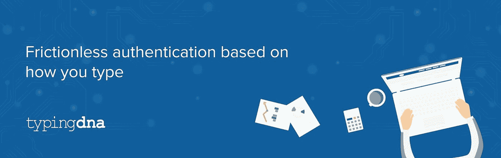
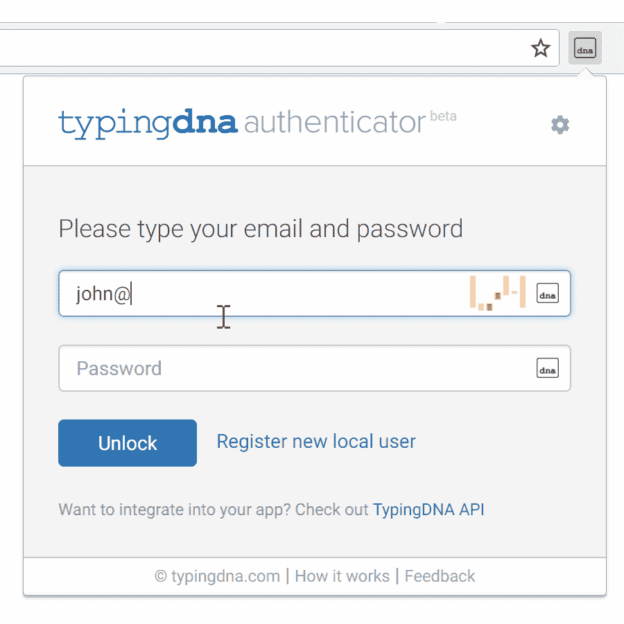

# 基于输入方式的无摩擦认证

> 原文：<https://medium.com/hackernoon/friction-less-authentication-based-on-how-you-type-f7c8218d5775>

[**打字 DNA**](https://www.typingdna.com/) 提供专有的基于人工智能的打字生物识别技术(又称击键动力学)，通过用户在键盘上打字的方式来真正识别用户。

[凯文·威廉·大卫](https://medium.com/u/8ea7bd91b1a4?source=post_page-----f7c8218d5775--------------------------------)采访了[**打字员**](https://siftery.com/typingdna) 的首席执行官劳尔·波帕以了解更多。

## 嗨，劳尔，给我们讲讲 DNA 分型吧？

简单来说，打字 DNA 通过人们打字的方式来识别他们。你在键盘上打字的方式(在 PC 和移动设备上)是独一无二的，可以用来进行身份验证。这类似于通过指纹、声音和其他行为特征等其他生物特征来识别一个人。输入生物认证的酷之处在于它可以在后台使用，为用户创造了一个无摩擦的体验。

## 告诉我更多关于你为什么要建立这个的信息？

仅靠传统的用户名和密码是不够的。我们在我们日常使用的平台上看到越来越多的攻击和黑客行为，这些平台包括听音乐、支付、与他人聊天等等。

我们认为，真正安全的登录身份验证是只有合法的人知道的东西(登录凭证)和(生物特征)的组合，没有 UX 妥协。我们设计了典型 DNA，让开发人员可以很容易地做到这一点。

## DNA 分型与市场上已经存在的有什么不同？

第一，相比其他类似短信的 2FA(迄今为止使用最多的一个)，用户体验大大提升。你不必再切换设备，接收延迟的短信，在国外时支付额外的费用等等。

其次，我们的客户在他们的独立测试中发现，与他们尝试的其他公司相比，我们的匹配准确度更高。此外，我们可以在只看到用户的 1 或 2 个以前的打字模式后实现类似的匹配准确性，而其他公司必须至少查看 5 到 10 个以前的样本。最后但同样重要的是，我们的客户喜欢我们构建的易于集成的 API。

类似的公司有[**key TRAC**](https://siftery.com/company/keytrac-1)[**behaviorsec**](https://siftery.com/behaviosec)[**bio catch**](https://siftery.com/company/biocatch)。他们开发了类似的技术。同时，我们还面临着 2FA 行业中使用 SMS 或任何其他 2FA 方法的间接竞争对手。

## 谁会使用 DNA 定型？您的客户在他们的公司中担任什么样的角色？

在网上银行、在线[学习](https://hackernoon.com/tagged/learning)以及需要第二因素认证的情况下，输入 DNA 用于防止身份欺诈。从开发人员到 CEO，角色各不相同，但可以肯定的是，大多数人都有技术背景。B2D 实际上是我们的走向市场战略，而且很有效。

## 有什么早期的“成长秘诀”或策略促成了你现在的成功吗？

我们最近推出了 [TypingDNA Authenticator](https://www.typingdna.com/authenticator) ，这是一个免费的认证器，可以在您的浏览器中生成 2FA OTP 验证码(无需切换到您的手机)，并受到您的“TypingDNA”模式的保护。这是第一个以消费者为导向的应用程序，使用打字生物识别作为安全功能。我们相信有很多教育要做，因为很多人不知道这样一个功能的存在。最终，这将为我们打开一个新的市场。它在 [ProductHunt](https://www.producthunt.com/posts/typingdna-authenticator) 和 [TechCrunch](https://techcrunch.com/2018/03/14/typingdna-authenticator-chrome/) 上被列为头号产品，为我们带来了大量曝光和注册。

## 你加入的最有趣的整合是什么？有什么对你特别有影响的吗？

我们与监考公司的集成非常有趣，我们可以在在线考试中自动进行身份验证，这一事实非常有价值。一些最大的大学正在通过整合我们的监考公司使用我们的技术。成为新兴在线教育的一部分，并帮助它变得更安全、更实惠，肯定是有影响力的事情。

## 最后，你运营公司所依赖的产品是什么&你如何使用它们？

对于营销，我们使用类似 [**Hubspot**](https://siftery.com/hubspot-marketing-hub) (入职、电子邮件活动、CRM 等)的应用。)、 [**SEMrush**](https://siftery.com/semrush) (SEO 追踪)以及所有流行的社交媒体做广告(无论开发者在哪里)。

*最初发表于*[*siftery.com*](https://siftery.com/stories/friction-less-authentication-based-on-how-you-type)*。*