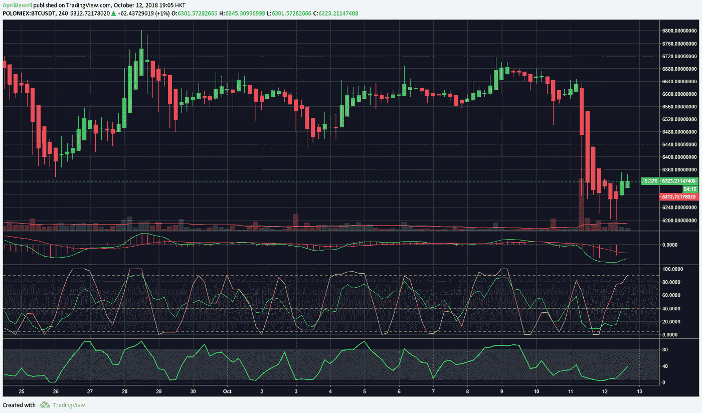
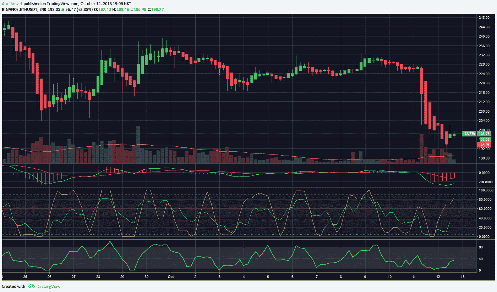

# 周五仍然是红色的，加密市场回到等待游戏

> 原文：<https://medium.com/hackernoon/friday-still-in-the-reds-crypto-markets-back-to-waiting-game-faedab702ee8>

在昨天暴跌之后，加密市场还没有出现任何反弹。前 100 名密码板实际上是红色和一些绿色的混合，但硬币和代币没有大的变化。

市值与昨天几乎处于同一水平，为 2010 亿美元，但在当天早些时候，它曾跌至 1960 亿美元，然后摆脱束缚，回到目前的水平。交易量保持不变，目前为 30 亿美元，BTC 的主导地位仍为 54.1%。

比特币价格目前为 6323 美元，正在以 40 亿美元的价格积累一些交易量，但仍无法在亚洲市场早些时候进一步上涨。早些时候，在进行向上修正之前，它曾低至 6200 美元。在 4 小时图上，MACD 正在轻微恢复熊市区域，RSI 仍然低于 40。资金流动指数(MFI)将会上升，目前已超过 50。短期来看，上涨趋势可能会继续，但随着周末的临近，上涨可能会受到限制。

以太坊大幅下跌，目前交易价为 198 美元。昨天，它从 220 美元下跌到 200 美元，然后进一步下跌到 189 美元，然后进行向上修正。在图表上，MACD 仍处于深度看跌区，与比特币一样，RSI 仍低于 40 美元，MFI 正在上升，但仍低于 40 美元。

前 10 名替代硬币与昨天的故事情节相同，大多数都失去了过去一个月的任何收益。在昨日平均下跌 10%后，多数股指已回升至最低水平。EOS 今天又下跌了 2.35%，目前交易价格为 5.20 美元。Monero 当日下跌 1.61%。今天唯一一个绿色的是 XRP，它赢得了超过 3.40%的涨幅，但仍然是 0.42 美元，与上周的 0.53 美元相比仍然很低。

前 25 名在比特币基地上市后翻了 10 倍。它目前的交易价格为 0.776 美元，当天上涨了 17.94%。0x 本周上涨 22%，领先于过去一个月持续上涨的 altcoin 兄弟公司。然而，除了 0x 之外，前 25 名仍处于亏损状态，延续了昨天的颓势。以太坊经典还在输，又输了-4.92%。Tezos 也是大出血，当天亏损-3.45%。其余的损失在 0-3 %,并可能在周末进一步下降。

我们有几个指标开始复苏，但目前仍太低。英美烟草的股价为 7.45%，交易价格为 0.172 美元。分散的土地以 6.35%的速度增长。织机网络，星云，永恒令牌都是绿色的，今天早些时候上涨了 4%。另一方面，MOAC 和 Hypercash 仍然亏损严重，跌幅为-10%，Bytecoin 的情况也不好，跌幅为-8.82%。

总的来说，市场在经历了巨大的下跌后保持了稳定。看起来市场已经对恐慌症免疫了。虽然空头仍然在很大程度上控制着局面，但我们基本上又回到了等待游戏。