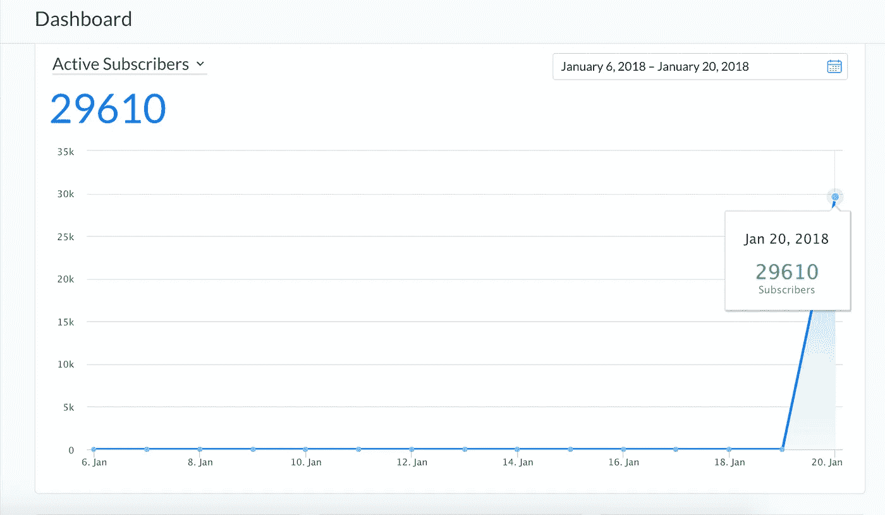
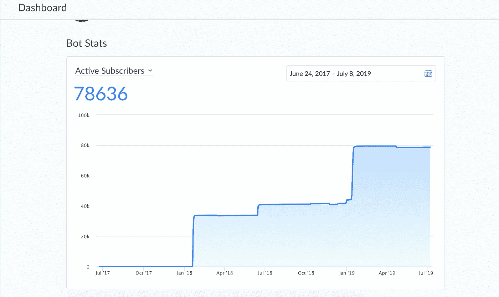
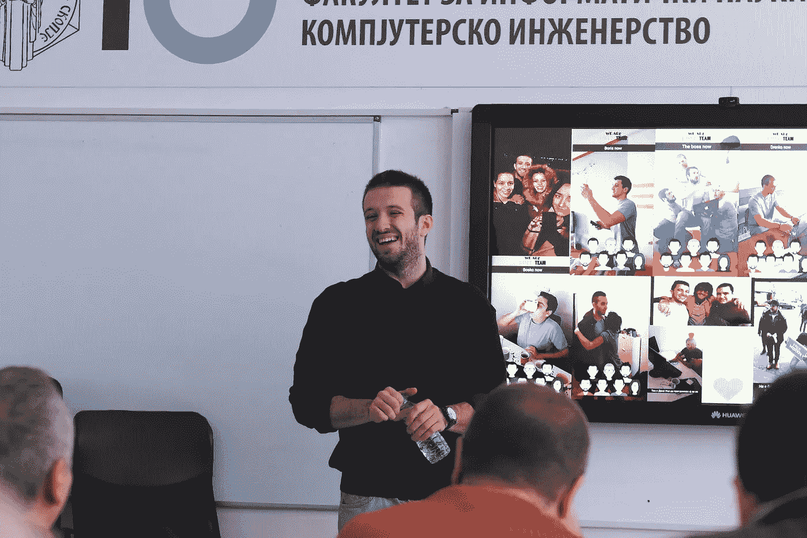

# 在不到 24 小时的时间里，Messenger 用户从 0 增加到 29 610，广告支出为 6 美元

> 原文：<https://medium.com/hackernoon/from-0-to-29-610-messenger-subscribers-in-less-than-24h-with-6-in-ad-spend-7fcdc1ac4a05>

我对机器人的迷恋始于马克·扎克伯格在 2016 年 4 月左右宣布它们之前。像 Kik 和微信这样的应用程序已经有了机器人，看到消息应用程序如何变得更加有趣是很有趣的。市场上有很多应用程序可以很容易地被聊天机器人取代。

这是足够的历史，我相信你知道什么是聊天机器人，他们是如何工作的。我希望你从这篇文章中得到的是 Facebook messenger 的价值和未开发的领域。所以让我们从我是如何发起这场运动开始。

## 挑选合适的销售线索磁铁

一切都始于激励。你能提供什么，这对你的目标人群重要吗？在我的例子中，我提供了价值 300 美元的会议门票。没什么特别的，但我真的没有要求那个标准(喜欢，分享，评论)来得到它。你所要做的就是点击广告，一旦聊天开始，回复“是”。值得一试。

## 提升到最有激情的位置，让他们开始病毒循环

作为脸书营销人员，我们可以做两件事。哭诉脸书是如何运行 FB 页面的，或者转向尚未开发的东西。这并不像你的脸书主页在过去几年里提供的结果，是吗？这意味着，你应该找到一个真正的利基受众，他们真的想得到你提供的奖励，并付钱向他们推销帖子。我很幸运，因为我知道谁是我最热衷的用户。一旦我们获得了 30-40 名首批订户，我们就可以开始病毒循环。

## 增长工具

Manychat’s Growth Tools

我想做的是让人们真正参与聊天变得超级简单。所以，我使用了 manychat 的两个成长[工具](https://hackernoon.com/tagged/tools)。如果你不熟悉 [manychat](http://manychat.com) ，这是一个 facebook 机器人服务，在创建你的机器人的所有其他平台之上。Manychat 的定价方案和功能是其他服务无法比拟的。但是让我们回到我们的设置。

*   我使用的第一个工具是“评论”增长工具，如果人们对你的帖子发表评论，它会自动让人们参与聊天。我们一会儿就会明白为什么我要用这个。
*   本次促销活动中使用的主要增长工具是“Messenger Ref URL”。该工具的作用是设置一条选择加入消息以及用户选择加入后要遵循的消息序列。一旦我们的用户点击广告中的帖子，就会打开 messenger，让他们参与聊天。嘣！点击查看如何使用该工具的教程[。](http://help.manychat.com/manychat-advanced/growing-audience-with-growth-tools/messenger-ref-url-growth-tool)
*   您页面上的欢迎信息必须与您现在正在推广的产品相匹配。请记住，有些人会打开你的脸书页面，而不是直接点击广告。虽然规模很小，但我们必须确保也能吸引这些观众。
*   每个增长工具上的选择加入消息和欢迎消息必须使用相同的 CTA。让用户说“是”。所以我的选择加入消息是这样的:“嘿{{First Name}}，你想得到这张免费票吗？”。

就是这样。三个成长工具是完成任务的关键。继续前进。

## 病毒循环

现在有三种可能发生的情况:

1.  用户点击你的帖子，就会收到我们的 Messenger Ref URL 窗口小部件的问候。如果他/她在聊天中回复，我们就把他作为订户。
2.  用户在你的《脸书邮报》上发表评论，机器人会自动弹出，问你和第一个成长工具一样的问题。一旦他们输入“是”或其他任何东西，他们就成了你的订户。
3.  有人想加入聊天，点击你的脸书页面上的主 CTA 按钮，在这种情况下应该是“发送消息”。一旦他们这样做，他们会自动受到我们的机器人的欢迎，如果他们回应，他们就加入了。

现在，这里是我们如何做这些病毒循环。

**病毒循环 1:** 一旦他们从 1 号或 2 号增长工具做出回应，我们就可以发送跟进消息。这实际上可以是任何东西，所以让我们明智地使用它。我所做的是这样的后续:“为了确保您获得更多积分并增加获胜的机会，请将以下链接发送给您的朋友(更多朋友=更多积分)。 [https://www.m](https://www.messenger.com/t/1848080518776645/?messaging_source=source%3Apages%3Amessage_shortlink) 。我/xxxxx”。此链接是到您的 messenger 页面的直接链接，无论谁点击它，都会收到我们的欢迎消息，并选择加入聊天并成为我们的订户。如果他们真的参与了，那么他们也会收到这个信息等等。你明白我的意思了。如果一个用户带来 10 个用户，而这 10 个用户又带来 10 个用户，我们就有了指数增长。注意:我没有真正计算“点数”,尽管我确信这是可以做到的。

**病毒循环 2:** 成为订户 2 小时后，我想再次加倍病毒传播。这就是神奇之处。在 manychat 中，有一个向所有或部分用户发送广播的选项。首先，我们必须确保某个用户不会每两个小时收到相同的广播，所以在我向一批用户发送广播后，我会标记他们，下一次广播会发送给所有未标记的用户。这个超级简单。转到受众- >批量操作- >标记用户。现在你的广播应该是这样的:“我们给你一个建议:在帖子上标记用户实际上会给你带来更多的分数”。这就是为什么这是令人震惊的可怕。首先，一旦他们标记了他们的朋友，你的帖子就会有很多的自然传播，甚至会有更多的人选择加入。第二，被标签的朋友倾向于回复标签并评论它。好吧，令人惊讶的是——我们的评论小部件会对他们做出回应，并让他们也在聊天中选择加入。如果他们这样做了，他们会受到我们的病毒环 1 的欢迎，如此等等。酷吧？

基本上就是这样。花在广告上的 6 美元只是为了让前 30-40 人选择加入，然后病毒循环就开始了。请明智地使用这一点，不要垃圾邮件。

附言:我是一名工科学生，为了成长而离开了编码。让我们在 facebook 上连线[。](https://www.facebook.com/nikola.sokolov.12)

## **更新 2019 年 7 月**

感谢大家在过去的一年里对这篇文章惊人的喜爱。对于所有担心脸书 ToS 的人，如果这打破了他们，这里是我的回应:

My chatbot after a few more experiments

Me getting my Bachelor degree last month. Totally not related to the post — I just like the pic.

**P.P.S .鼓掌仪 10- >🙂20 - >😀30 - >😁40 - >🤩50 - >🤪**