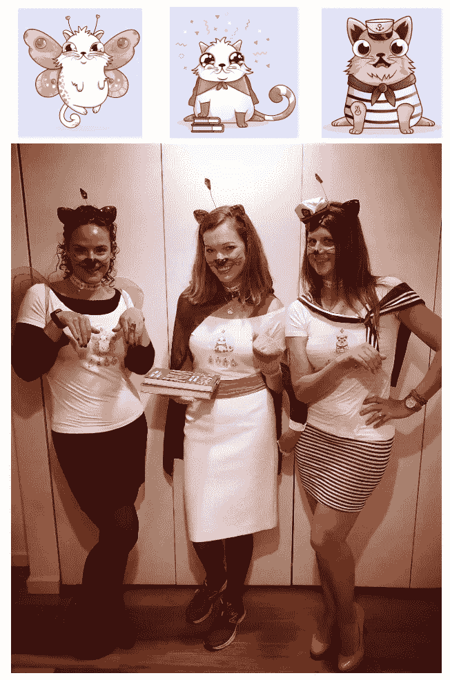
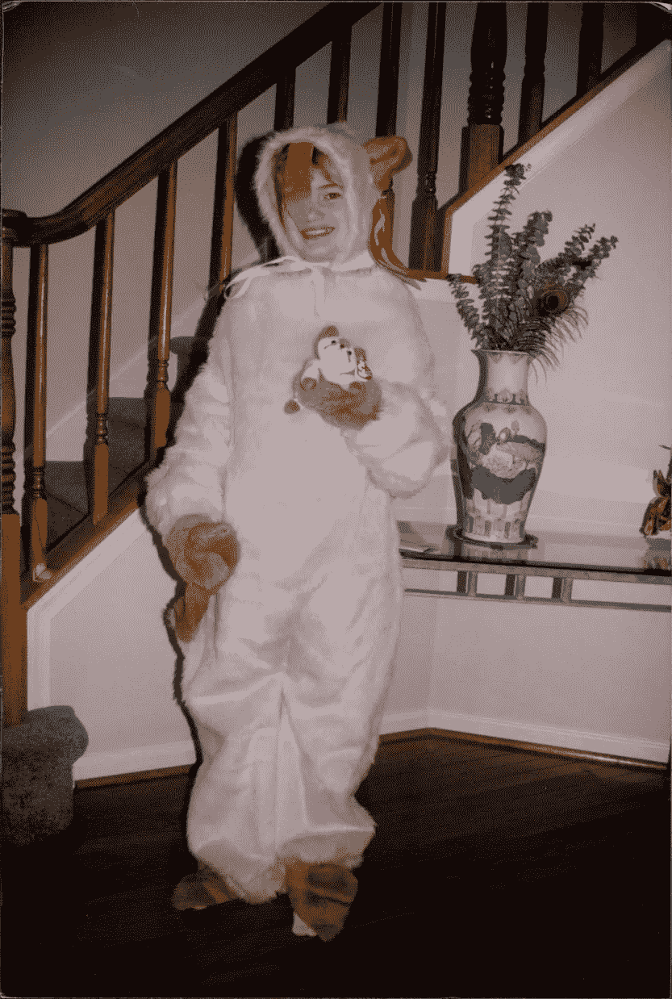

# 从豆豆娃到密码猫

> 原文：<https://medium.com/hackernoon/from-beanie-babies-to-cryptokitties-c504f4095303>

2018 Hype: CryptoKitties at Halloween

去年万圣节，我和其他几位科技界的女士一起打扮成一只神秘小猫。整个晚上，在向布鲁克林威廉斯堡的人们解释我们的服装时，我得到了[无尽的娱乐](https://www.cryptokitties.co/)。

有趣的是，我的一个朋友描述 Cryptokitties 的一种方式是“就像豆豆娃，但不是 T4 区块链 T5。”

虽然我确实对这种过于简化的做法有些畏缩，但说实话，我并不擅长这种东西背后的技术细节。在某种程度上，她是对的。豆豆娃背后的狂热和狂热被称为“世界上第一次网络轰动”至于隐猫，它们肯定是区块链最先引起广泛关注的物种。

回到 90 年代末，你们可能都不会惊讶我对豆豆娃如此着迷。每个周末，我都会像钟表一样打开电话簿，给当地每一家出售豆豆娃的玩具店、霍尔马克商店、礼品店和精品店打电话，列出一份完整的清单，列出谁收到了哪些玩具。我会将这些清单与我自己的收藏进行比较，我们会围绕挑选分配给我的 2-3 个新玩具来设计一个每周购物狂欢。

在某种程度上，甚至麦当劳也加入了这一潮流，在他们的欢乐套餐玩具中提供青少年豆豆娃。在那个时候，这些快餐店会循环通过 Teenie Beanie 婴儿如此之快，以至于他们不得不在一天之内默认回到他们的标准经典麦当劳玩具。队伍里会挤满了想要得到这些小小的收缩包装玩具的人。我的家庭也不例外。我亲爱的老父亲会在麦当劳开一整个下午的店，每次他们骑自行车经过一个新的动物时，都要一次又一次地排队等候，然后再买两份快乐套餐——一份给我，一份给我弟弟。(我记得至少有一个周末，他成了邻里英雄，每天下班时给我们街区的孩子们带去快乐餐。)

但并没有就此止步。我订阅了《豆豆世界》杂志，参加了豆豆娃博览会，研究了最受欢迎的玩具的最新价格情况。

为了最大化自己收藏的价值，我拒绝打开任何麦当劳玩具，拒绝给 11 岁的自己带来新玩具的乐趣。我把我最“珍贵”的玩具([和平熊](https://www.ebay.com/i/232420209810?chn=ps)、[戴安娜王妃熊](https://www.ebay.com/i/153208419098?chn=ps)和翠绿色的[艾琳熊](https://www.etsy.com/listing/559883572/ty-beanie-baby-erin-1st-irish-bear?gpla=1&gao=1&&utm_source=google&utm_medium=cpc&utm_campaign=shopping_us_patricks_day_Jewelry&utm_custom1=8ddee663-cd19-49a3-8d76-dacbd9a714cc&utm_content=go_1054592156_54633745394_249874152215_pla-294682000766_c__559883572&gclid=CjwKCAjw39reBRBJEiwAO1m0ORT4ijQbd5dXsOmSBBkDO-8h7keDL_waNknhEvF8D0uhOrY_H00D0hoCN0cQAvD_BwE))放在有标签保护装置的透明塑料盒里。我会渴望地看着它们放在我卧室的书架上，想知道是否有一天我能够用我收藏的利润资助我的整个大学教育。当我看到人们在客厅里玩这些玩具，摘下耳朵上的标签时，我会对自己笑。我认为他们只是在浪费金钱。总有一天，我会成为百万富翁。但是每个人都知道你需要留下标签，这样它们才有价值！

当然[事实并非如此](https://www.usatoday.com/story/life/entertainthis/2017/08/16/how-much-is-the-princess-diana-beanie-baby-worth/552426001/)。尽管近年来有人声称戴安娜王妃的小熊已经卖到 50 多万美元，但事实是这个市场已经不复存在了。我的朋友们，很抱歉这么说，但我们错过了机会。

在全盛时期，我确实从一个豆豆娃身上赚了大约 300 美元——但后来我哭了一下午，诉说我与我最喜欢的朋友之一分手是多么难过。(记得:我当时 11 岁)回想起来，我甚至不知道我的家人为我和我哥哥在这个 90 年代末的时尚上花了多少钱。在家里的某个地方，我有几盒未开封的麦当劳玩具，仍然在它们的收缩包装里，等待它们的价值增长到足以让我用它们做点什么。但我知道这永远不会发生。你可能会把“豆豆狂热症”视为我的第一堂经济学课。我的第一笔种子投资。啊，好吧。

Me, dressed at Snip the Cat, circa ~1998.

比起豆豆娃狂热时期，我现在进入 Cryptokitties 市场更明智了。是的，虽然我确实拥有一些，但我不敢假设我会因为拥有一些这样的数字资产而在未来几年生活富裕。或许这是值得学习的一课。

如果没有别的，我在万圣节服装的选择上表现出惊人的一致性。

我想到头来没什么变化。