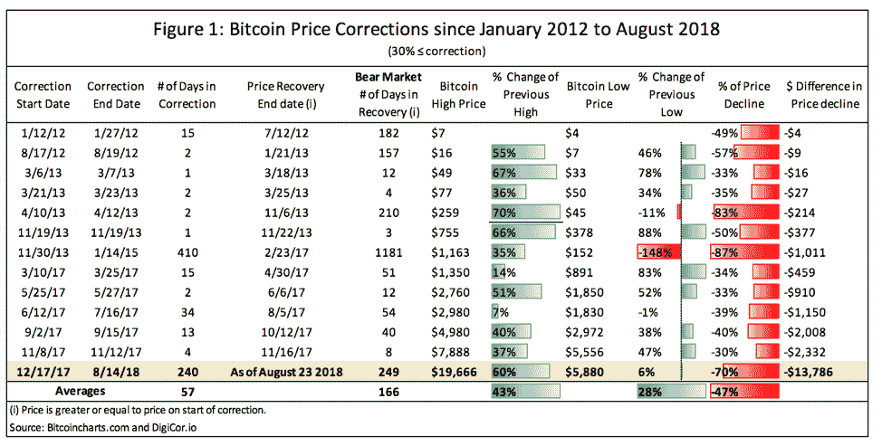
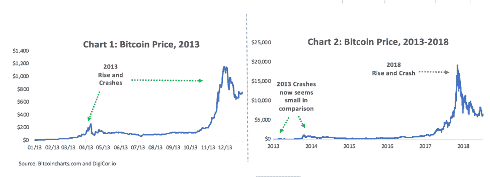
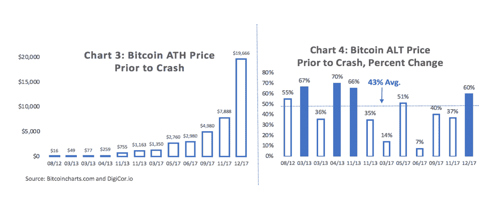
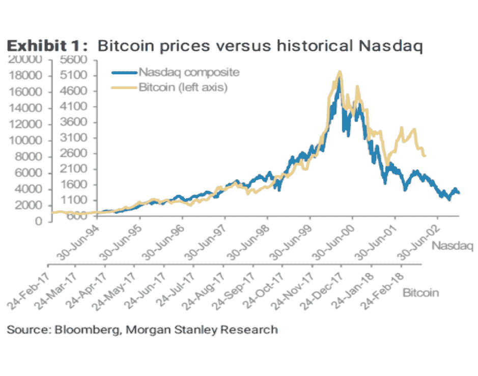

# 从熊市到牛市，看看比特币的价格周期

> 原文：<https://medium.com/hackernoon/from-bear-to-bull-a-peek-into-the-price-cycle-of-bitcoin-96ff25045743>

虽然牛市和熊市在金融界并不新鲜，但 2018 年 2 月的加密抛售让许多投资者认为加密货币的日子即将结束。许多曾经看好 crypto 的投资者突然担心这一事件与以往不同。尽管崩盘对投资者来说可能是痛苦的，但重要的是退后一步，将最近的调整与之前的调整进行比较，以更好地理解它的实际意义。原因在于，无论你持有的观点是[比特币](https://hackernoon.com/tagged/bitcoin)只不过是一个泡沫，还是坚持认为比特币是一种加密货币，推而广之，比特币将会继续存在，值得探索比特币经历的极快的贬值和同样快速的复苏。

截至 8 月 23 日，比特币交易价格刚刚超过 6500 美元；然而，2017 年 12 月 17 日，比特币达到了令人瞠目结舌的 19666 美元，短短 5 周涨幅 60%。一个月后，比特币跌至 1 万美元以下，到 2018 年 2 月 6 日，比特币跌至略低于 6000 美元，在 51 天内下跌了 70%(见图表 1)。许多业内人士声称 [**比特币已死**](https://99bitcoins.com/bitcoinobituaries/) ，再过几个月比特币将跌至 0。

许多人经常忘记的是，自 2012 年以来，比特币已经暴跌和上涨了 13 次，其中许多跌幅的百分比大于 2018 年的最新修正(见图 1)。例如，2013 年，比特币以低于 50 美元的价格开始交易。到年底，比特币的回报率超过了 100 倍，经历了 4 次抛售，其中两次抛售超过了 80%(见图表 1)。在这次回调期间，价格持续下跌了一年多，直到 2017 年初，价格才重拾升势。尽管这次崩溃是当时最大的崩溃之一，但当你将 2013 年的下跌与图表 2 中更大的比特币价格进行比较时，你会意识到这一事件并不罕见。比特币的价格波动仍然是其 DNA 的一部分，在未来一段时间内也可能如此。因此，重要的是不要从最近一次崩盘的角度，而是从年复一年的价格角度来看待比特币的价格。

# 比较比特币的历史最高价格水平

当比较每次崩盘前比特币的历史最高(ATH)价格水平时，你可以观察到一个有趣的数据点。2012 年 8 月，比特币的价格触及 16 美元的 ATH，随后在短短两天内暴跌至 7 美元。一年后，2013 年 2 月，比特币价格达到 49 美元的新 ATH，随后在一天内暴跌至 33 美元。在每次熊市之前，比特币的价格都会越来越高，这种趋势是我们可以在比特币的整个生命周期中观察到的一种发展(见图表 3)。虽然比特币的价格稳步上升，但价格峰值之间的百分比变化是波动的。查看图表 4，可以发现 2017 年只是比特币价格在峰值之间上涨 60%的四个时期之一。平均而言，比特币在价格峰值点之间上涨了 43%。还有，你可以注意到，一般来说，比特币的熊周期持续 5 个月左右，比特币的牛周期持续 3 个月左右。当前的熊市周期已经持续了 9 个月，比平均水平长得多。

根据摩根士丹利的策略师贾芳·沙阿的说法，虽然平均而言，比特币价格在每次熊市中都损失了约 47%的价值(见图 1)，但比特币价格的表现与 2000 年纳斯达克的 [**惊人地相似，除了类固醇**](https://www.bloomberg.com/news/articles/2018-03-19/bitcoin-bust-reminds-morgan-stanley-of-nasdaq-crash-but-faster) 。在给客户的一份报告中，贾芳写道:“纳斯达克从 2000 年开始的熊市有五次价格下跌，平均跌幅惊人地接近 44%。”她还指出，纳斯达克指数在 2000 年 3 月达到最高点的反弹中，在 519 天内上涨了 278%，而比特币在最近一轮反弹的最后一段时间里，在 35 天内飙升 248%，达到 19 美元，这是 12 月份的高点，根据**的报道。**她提到，比特币和纳斯达克的唯一真正区别在于，比特币的涨势“大约是其速度的 15 倍”

# 包裹

最终，最新的 2018 年比特币抛售并无异常。历史表明，在过去几年中，顶级加密货币在更短的时间内遭受了更快的损失，并没有阻止长期投资者。然而，鉴于比特币和其他加密货币的价格仍然在很大程度上由零售市场驱动，投机性上涨加上外部冲击，如重大黑客攻击或宣布的新法规，可能会继续动摇加密货币社区的信心。然而，如果纳斯达克综合指数能预示比特币的未来，随着加密市场继续增长、成熟并引入更多机构资金，市场最终会稳定下来，并回报长期投资者。

**By Solomon Stavis，DigiCor 资产管理公司首席财务官** [**推特**](https://twitter.com/solomonstavis) **&** [**领英**](https://www.linkedin.com/in/solomon-stavis/)

*原载于 2018 年 8 月 30 日*[*blog . digicor . io*](https://blog.digicor.io/from-bear-to-bull-a-peek-into-the-price-cycle-of-bitcoin/)*。*