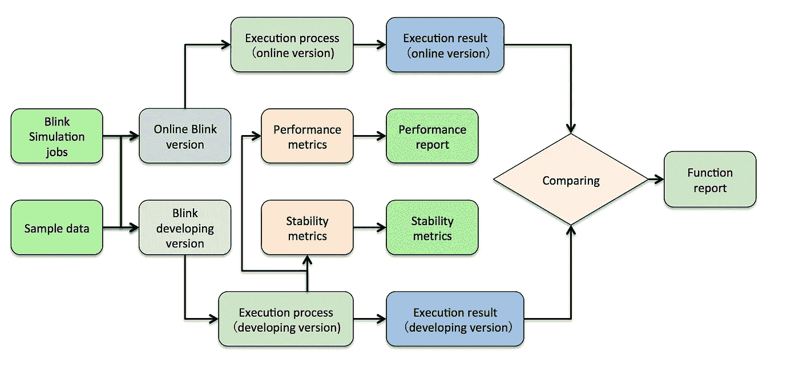

# 从代码质量到集成:优化阿里巴巴的 Blink 测试框架

> 原文：<https://medium.com/hackernoon/from-code-quality-to-integration-optimizing-alibabas-blink-testing-framework-dc9c357319de>

## *阿里巴巴仅用一年时间就完成了革命性分布式开源计算框架的测试和优化。*

*本文是* [***阿里巴巴旗下 Flink 系列***](/@alitech_2017/a-flink-series-from-the-alibaba-tech-team-b8b5539fdc70) *的一部分。*

随着对网络设备和基础设施需求的增长，人们越来越需要功能强大的解决方案，以便在某些组件出现故障时仍能正常运行。作为一种这样的解决方案，分布式计算框架通过在整个网络上分散负载来有效地克服潜在的网络停机时间。

Blink 是一个用于数据流处理和批处理的分布式开源计算框架，支持阿里巴巴集团数千项服务的大数据实时处理。为保证其可靠性，2017 年成立了 Blink 测试团队，从零开始建立完整的 Blink 测试体系，保证 Blink 的质量。

在本文中，在详细探索 Blink 测试平台之前，我们先看看开源计算框架的基础。

# 开源计算框架

Apache Flink 是一个广泛使用的分布式开源计算框架，用于数据流处理和批处理。2016 年，阿里巴巴以 Flink 为基础，开始创建 Blink 框架。2017 年，阿里巴巴整合其整个流计算产品，决定基于 Blink 打造全球领先的实时计算引擎。

对于 2017 年 11.11 全球购物节，Blink 通过同时运行数千个实时计算作业，支持了 20 多个业务部门和团体，每秒处理的日志达到了惊人的 4.7 亿条。因此，保证 Blink 的可靠性和稳定性变得极为重要。为此，Blink 测试团队建立了一个全面的测试系统，在短短一年多的时间里，从代码质量进步到持续集成和预测试，并大大提高了 Blink 的质量。

# 眨眼测试平台

测试团队已经定制了 Blink 测试平台以优化其质量，如下图所示:

如上所述，Blink 测试平台由三个测试阶段组成。

首先，在代码质量验证中，执行静态代码扫描、单元测试和基于 minicluster 的测试。

第二，在集成测试中，执行功能测试、性能测试和破坏性稳定性测试。

最后，在预测试中，通过模拟用户的工作进行模拟测试，在发布前进行最终版本兼容性测试。

该平台选择测试集合的一部分来包含在预提交验证中，以尽早检测代码中的问题。同时，大规模的功能、性能和稳定性测试通常被用作日常构建的集合。此外，Blink 测试平台建立了较为完善的质量衡量体系。除了代码覆盖率的统计分析和变化分析，系统可以一键生成测试报告，横向比较不同版本的质量。

## 代码质量验证阶段

代码质量验证阶段是整个 Blink 质量保证的基础。它主要包括单元测试、代码风格扫描以及基于 minicluster 的独立集成测试。只有 Blink 代码通过了这三项测试，才允许提交到项目 git，如下图所示:

# 功能测试

Blink 功能测试框架使用 Defender，源自 pytest，支持 Blink SQL 测试的特性和第三方插件的引入。此外，它可以用于在测试集群中对场景进行端到端的精确测试(如下图所示)。它支持 IDE 和 Jenkins 两种触发模式；案例运行有三种调度模式:yarn_job、yarn_session 和 local。执行后，以网页或邮件的形式显示结果，并对结果进行持久化。其优点包括:

**1。案件统一调度和精细化管理**

目前 Blink 在防御者上有 12 个场景超过 4000 个案例，可以每天固定时间执行 dailyrun。如果某类案件发生问题，可以单独执行该案件，并在页面上显示详细情况。

**2。满足不同场景测试需求的三种运行模式**

其中，yarn_session 模式更适合模块中存在 sql case 的场景，因为它可以大大减少与 yarn 的交互时间。

**3。灵活的机箱配置**

它不仅可以支持系统配置，还可以单独配置每个用例集或集群其他配置所需的资源(插槽、内存等)。

**4。一个案例可以支持批处理和流类型的处理**

**5。客户端类型的灵活扩展**

现有数据存储和服务的集成和扩展是可能的。现在支持多类型数据存储读写服务、yarn_session 启动、Blink 作业交互等等。

# 特性试验

作为实时大数据处理引擎，Blink 对单位时间的数据处理能力和数据处理的实时性提出了非常苛刻的要求。所以性能测试是整个 Blink 测试中非常重要的一部分，是衡量一个新版本的 Blink 能否发布的核心标准之一。

Blink 的性能测试主要包括操作员性能测试、SQL 性能测试、运行时性能测试:

## 操作员绩效测试

运算符指的是构成 SQL 语义的原子操作，如 Sum、Aggregate 等，不能再拆分。操作符性能测试主要用于监控单个操作符在整个开发过程中的性能变化，以确保局部处理的优化和改进。目前，操作员测试分为单个操作员的性能测试和操作员组合的性能测试。操作员测试以日常运行的方式反馈性能变化。

## SQL 性能测试

这主要用于监控单个 SQL 在版本开发过程中的性能变化。TPCH 和 TPCDS 是行业 SQL 标准性能测试集，分别有 22 个和 103 个测试用例。测试平台将其引入 Blink 性能测试，更全面地衡量 Blink 的性能变化。

## 运行时性能测试

这主要是为了保证运营层面的业绩没有退步。主要包括端到端性能测试和模块性能测试。端到端性能测试首先要搞清楚测试场景，关注每个场景在指定数据量下的作业处理时间。模块性能测试主要包括网络层性能测试、调度层性能测试、故障转移性能测试等。它更关注特定场景下的作业处理时间。

性能测试的未来计划是集成 E2E 性能测试、模块级性能测试和参数调整，使它们能够更好地帮助开发性能问题的根本原因并查看参数调整效果(如下所示)。

# 稳定性试验

对于支持高并发、多节点和复杂物理环境的分布式系统，很难避免物理节点异常，如磁盘满和网络延迟。作为一个高可用的分布式系统，Blink 必须保证系统的稳定运行和异常情况下数据的正常输出。通过采用“避免失败的最佳方式是不断失败”的方法，该团队模拟了 Blink 任务运行期间所有可能的异常，从而验证了 Blink 的稳定性。

异常场景分为两类:

首先与运行环境有关，包括机器重启、网络异常、磁盘异常、CPU 异常等等。这些异常主要由 shell 命令模拟。

第二个与 Blink 作业有关，包括 RPC 消息超时、任务异常、心跳消息超时等，主要通过 byteman 软件的集成来实现。在稳定性测试中，那些预先定义的异常场景将被随机选择并组合起来进行测试。

稳定性测试设置为迭代循环。每一轮迭代都包括发布异常场景、提交任务、等待作业恢复和验证。验证主要是检查检查点、容器和槽资源是否符合预期。如果检查失败，将发出警报。一旦验证成功，通过审批，则开始下一次迭代，验证任务在长期运行下的稳定性。

稳定性测试架构分为四层(如下图所示):

组件层主要包括测试 Blink 作业、monkeys 和 dumper。

动作层包括作业启动、状态检查、输出检查等。

执行层包括服务、异常场景操作等，异常场景基于 SSH 对特定机器进行操作。

顶层是用户界面。

# 预测试

Blink 预测试阶段主要通过在线克隆真实的任务和数据来测试复杂的业务逻辑和大数据量。因此，Blink 预测试是对代码质量验证和集成测试的补充，是一个 Blink 版本发布前的最后一道防线。

Blink 预测试分为模拟测试和兼容性测试。

## 模拟测试

模拟测试进一步测量基本测试指标，如 Blink 的功能性、性能和稳定性，并将开发版本与当前在线版本进行比较。因此，模拟测试可以在早期识别与功能、性能下降和稳定性相关的各种问题，从而提高在线版本的质量。

模拟测试分为三个阶段:环境克隆、环境适应和测试运行。

## 环境克隆

环境克隆是实现整个仿真测试的基础，包括在线任务的选择和克隆，以及测试数据的采样(如下图)。

Blink 的在线任务数量众多，分散在许多不同的项目中。尽管每个在线任务都有自己的内部业务逻辑，但不同的任务可以根据其主要处理逻辑进行分类，例如基于 Agg 运算的任务集或基于 Sum 运算的任务集等等。所以眨眼模拟测试需要区分线上任务，选择最有代表性的。

模拟测试的测试数据集是当前在线任务输入数据的样本，只是数据规模不同，可以根据测试需求动态调整，从而实现对测试目标的精确测量。

# 环境适应

环境适应是仿真测试过程中的初始化阶段，主要是修改测试用例，使其正常运行。该过程包括两个主要步骤:改变测试数据输入源和测试结果输出地址以及更新任务的资源配置。

# 试运转

测试运行是模拟测试过程中的实际执行模块，包括测试用例运行和结果反馈。

Blink 模拟测试包括功能测试、性能测试和稳定性测试。不同的测试模块有不同的度量和反馈方法。这些测试模块的测试结果，以及代码质量检查和集成测试的结果，形成了 Blink 测试的结果集(如下所示)。

性能测试和功能测试使用模拟任务和样本数据作为输入，来比较和分析任务在不同执行引擎上的执行和输出。性能测试重点关注执行过程中不同执行引擎的资源利用率、吞吐量等性能指标；而功能测试比较执行的最终结果。需要注意的是，在功能测试中，假设网络版的运行结果为真；即，当在线版本的执行结果与开发版本的执行结果不同时，开发版本的执行被认为是错误的，需要修复开发版本中的错误。

稳定性测试侧重于模拟任务在在线克隆环境、大数据量和长时间运行条件下的稳定性。它使用 Blink 开发版本作为唯一的执行引擎，并在执行期间测量稳定性指标，如资源利用率、吞吐量和故障转移。

# 兼容性测试

Blink 兼容性测试主要用于发现新旧 Blink 版本之间的兼容性问题。目前兼容性测试主要分为静态检查和动态执行检查两个阶段。

# 静态检查

静态检查主要用于分析在线任务在不同执行引擎下生成的执行计划的差异，包括两个方面:

新执行引擎生成的执行计划的正确性和生成时间的长短。

新旧执行引擎分别生成的计划的兼容性。

如果新的执行引擎不能正确地生成执行计划，或者如果生成执行计划花费的时间比预期的长，则静态检查可以被认为是失败的，这表明新版本的 Blink 中存在异常或缺陷。当新版本可以正确生成执行计划时，如果新版本执行引擎生成的执行计划与旧版本生成的执行计划不兼容，则需要将比较结果反馈给开发人员，以确定执行计划的改变是否是可预期的；如果执行计划是兼容的或者变化是可预期的，那么运行时测试可以直接为新版本运行。

# 动态运行时测试

Blink 动态运行时测试使用模拟测试中的功能测试模块运行任务，是升级新版 Blink 前的最后一轮测试。如果任务能够正常启动且测试结果符合预期，则认为任务能够自动升级；否则，需要手动干预进行手动升级。

# 观点

经过短短一年多的努力，Blink 的整体质量有了很大的提升，测试方法和工具也日趋成熟。随着 Blink 用户群的增长，Blink 服务开发者对其服务任务质量保证的需求也在急剧增加。展望未来，Blink 测试团队旨在提供更多的质量保证和开发工具，以进一步提高 Blink 开发人员的工程效率。

**( Original article by Zhao Li 赵丽)**

*本文是* [***阿里巴巴旗下 Flink 系列***](/@alitech_2017/a-flink-series-from-the-alibaba-tech-team-b8b5539fdc70) *的一部分。*

# 阿里巴巴科技

关于阿里巴巴最新技术的第一手深度资料→脸书: [**《阿里巴巴技术》**](http://www.facebook.com/AlibabaTechnology) 。Twitter:[**【AlibabaTech】**](https://twitter.com/AliTech2017)。