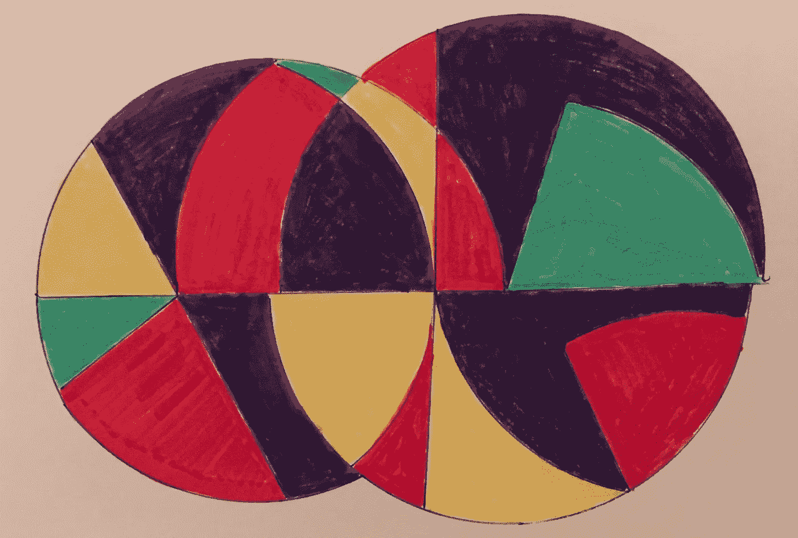

# 从决策者到决策支持者

> 原文：<https://medium.com/hackernoon/from-decision-maker-to-decision-supporter-8b163a1ecf67>

My dad gave my new son a book of fun pen/marker doodles. I’m using them in posts.

## 作为一名产品经理，你的责任是确保做出最好的决策…而不是一定要做出这些决策。

有时候你会有*最好的想法，*尤其是在需要深入领域知识的领域。很多时候，你不会，也不一定是思想的最佳仲裁者/审判者。为了引出更好的想法——为了做出更好的决策——团队中有才华的人(包括你)需要背景、数据、空间、重复和改进想法的机会、减少认知偏差的策略，以及访问促进/决策框架。你甚至可能偶尔会被要求打破僵局，尽管最好是建立一个对所有人开放的框架来为你做到这一点。判断“成功”也是如此——最好建立一个模型/框架，而不是高高在上、垂头丧气。

你会发现一些组织有不同的想法。他们的项目经理会因为处于“音高模式”、“大胆果断”和拥有所有答案而受到奖励。在这些环境中，结果几乎无关紧要。这完全是关于剧院和安全毯。

在其他组织中，团队“太忙”而没有时间做决策。"首相能把他们的行动组织起来并制定一个好的路线图吗！"与此同时，项目经理被功能需求/想法所困扰(因此分散的、不一致的路线图充满了其他人的想法)。这是一个两败俱伤的局面。这两种模式都不是好模式——rock star pitch-machine-PM 或作为团队能力拍卖人的 PM(以及作为不情愿收票人的团队)。

难道不是项目经理拥有问题，而团队拥有解决方案吗？嗯。“问题”仍然是，典型地，决定把重点放在哪里。为什么*的那个*问题代替了其他无数的问题？这是最好的决定吗？我们怎么知道？当你意识到每个问题都是一个更高层次问题的嵌套解决方案时，问题与解决方案的二分法很快就失效了。

再说一次，当涉及到手头的特定决策时，首相可能是房间里最精明的人。如果是这样，项目经理的重点应该是分享他们决策背后的背景和理由，并邀请团队(和客户/用户)积极地对他们的想法进行压力测试。大多数情况下，你会发现创意非常便宜。

总的来说……在给定的当前约束条件下(比如时间),总是努力支持最高的决策质量。支持团队[合理决策吞吐量](https://hackernoon.com/cost-per-reasonable-decision-cprd-ed1ca8c6147)的工作。重视持续学习和环境建设…否则团队可能会抛硬币。你的产品会受益。从长远来看，你的事业也是如此。

你真的有最好的想法吗？证明一下。