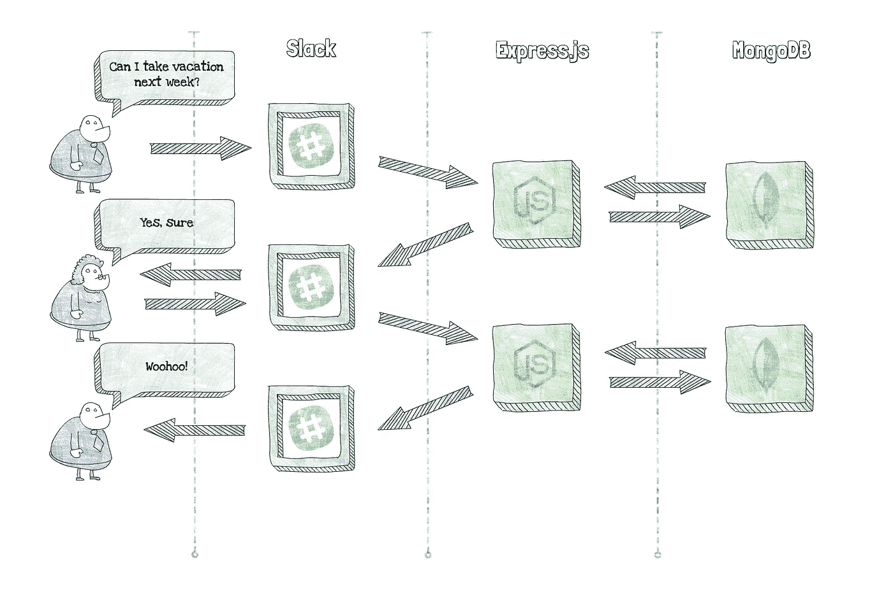
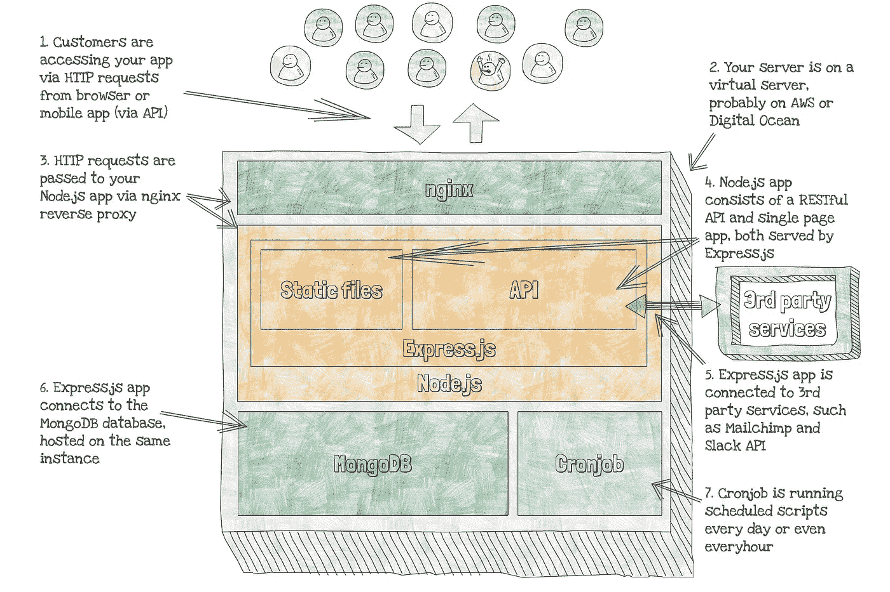
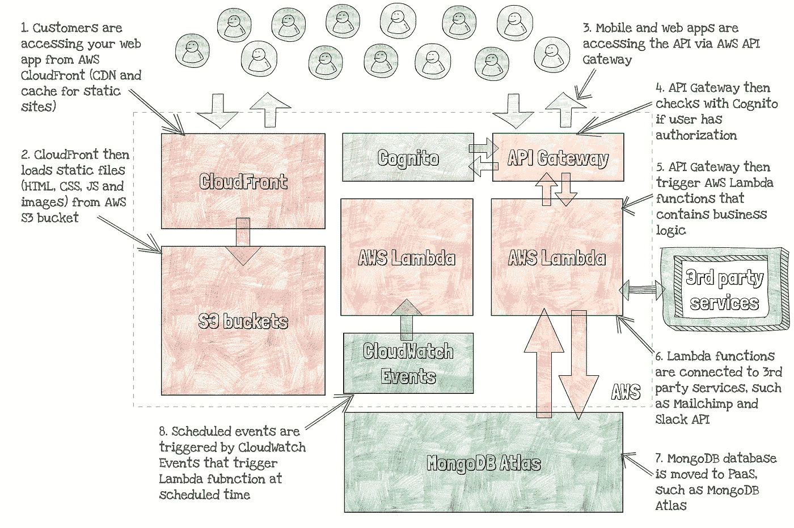

# 从 Express.js 到 AWS Lambda:将现有 Node.js 应用程序迁移到无服务器

> 原文：<https://medium.com/hackernoon/from-express-js-to-aws-lambda-migrating-existing-node-js-applications-to-serverless-7473041ecc56>

无服务器架构使得一些设计应用程序的良好实践过时了。从头开始构建一个无服务器的应用程序需要思维的转变，但是一旦你开始以无服务器的方式思考，所有的点会很快连接起来。在 Claudia.js 等[工具](https://hackernoon.com/tagged/tools)的帮助下，开发和部署周期短而容易。

但大多数时候你不能只是从零开始。相反，你有一个有几千行代码和几千个每日活跃用户的应用程序，有一个由业务请求或其他问题引起的可疑决策的历史，这些问题以特定的方式塑造了你的代码。

您是否能够并且应该将这样的应用程序迁移到无服务器环境中？答案并不简单，因为它取决于您的应用程序的具体情况、您的团队的结构以及许多其他因素。但是在大多数情况下，无服务器对遗留应用程序是有益的。

假设您正在开发一个漂亮而简单的 Node.js 应用程序。比如一个类似于[的休假追踪机器人](http://vacationtrackerbot.com/)的 app，一个简单的管理团队休假的 Slack 工具。

Vacation tracker flow

这个应用程序本身很简单。大部分交流都是通过 Slack 进行的，但也有一个不错的网络仪表盘。当您正在构建 MVP 时，您不想在它上面花费太多的资源，所以您创建了一个新的数字海洋实例，并将所有东西都打包在其中。此时，如下图所示，您的应用程序包含以下内容:

*   使用 nginx 的 Ubuntu droplet
*   提供静态页面(SPA 仪表板)和 API 的 Express.js 应用程序
*   MongoDB 数据库
*   发送预定消息的 Cronjob

Simple Express.js and MongoDB app

但有时你的应用程序有一个很大的使用高峰，你需要考虑扩展。更不用说你还需要很多其他的东西，比如监控、SSL、开发和生产环境等等。

对于第一批用户，你有趣的项目很快变成了另一件你需要花几个小时来维护和配置的事情。it 成本越来越高，即使用户仍然不为此付费。一点都不好玩。

您听说了无服务器，并决定尝试一下。但是，如何将传统的 Node.js 应用程序转换为无服务器应用程序呢？你应该把一切都装进 [AWS Lambda](https://hackernoon.com/tagged/aws-lambda) 吗？

> *万一你不熟悉 serverless，或者你还觉得是用仓鼠轮子而不是服务器来运行 web apps 的某种魔力，请看* [*这个解释*](https://livebook.manning.com/#!/book/serverless-apps-with-node-and-claudiajs/chapter-1) *。*

# 分步解决

虽然将所有东西都放入 AWS Lambda 技术上会使你的应用程序无服务器，这可能是一个很好的第一步，但要获得无服务器的全部好处，你需要付出更多的努力，通过将你的应用程序分成小服务来拥抱无服务器平台。

在我们了解如何操作之前，您可以获得哪些好处？

一些最重要的好处是:

*   您的应用程序将自动缩放。它的速度很快，不到几秒钟就能从 0 增加到 1000 个并行用户。
*   只有当有人使用你的应用时，你才需要付费。零用户花费你 0 美元。随着用户数量的增加，成本也会有所增加。比如 MindMup 每月 100 美元，月活跃用户 40 万，印象深刻吧？点击了解更多信息[。](https://livebook.manning.com/#!/book/serverless-apps-with-node-and-claudiajs/chapter-15)
*   如果没有人使用，拥有尽可能多的类似于生产的环境不会让你付出任何代价。运行实验和测试比以往任何时候都更容易和更便宜。
*   更快的开发和部署周期，因为您的应用程序被分成更小的单元，即使是几乎没有后端经验的前端开发人员也可以部署生产就绪的应用程序。

你是怎么做到的？简单(但有时不容易)。

你可以从把你的单页应用和静态内容转移到 AWS S3 开始。是的，就是你用来存储文件的那个 S3。如果你把它和 AWS CloudFront 结合起来，你会得到一个强大的无服务器的静态网站托管和 SSL 和缓存。你可以手动或使用 [Scotty.js](https://github.com/stojanovic/scottyjs) 等工具来配置你的静态网站[。](https://www.josephecombs.com/2018/03/05/how-to-make-an-AWS-S3-static-website-with-ssl)

下一步是将数据库移出数字海洋水滴。如果您希望将 MongoDB 作为一个数据库，您可以将其迁移到 MongoDB Atlas，这是一个云托管的 MongoDB 服务，由构建 MongoDB 数据库的同一个团队设计和运行。另外，可能更好的选择是将您的内容迁移到 AWS DynamoDB 数据库，这是一个由 Amazon Web Services 提供的无服务器 noSQL 数据库。

既然您的静态文件和数据库已经退出了游戏，那么您可以开始从 Express.js 应用程序中提取其他服务。例如，预定消息(每周团队休假通知)是一个很好的首选。由于你不能在 AWS Lambda 中运行 cronjob，你将需要另一个服务的帮助:CloudWatch 事件可以在预定的时间触发你的 Lambda 函数，正如这里所描述的。

最后，您必须迁移您的 API。为此，您可以将您的逻辑拆分成多个 AWS Lambda 函数，并将 API 网关放在它们前面，因为 Lambda 函数不能由 HTTP 请求直接触发。你应该如何分割你的 API？这取决于您的用例，但是最简单的方法是将它分成业务逻辑单元。例如，一个 Lambda 函数将处理 Slack slash 命令，另一个将处理 Slack 事件 webhooks，一些其他函数将服务于仪表板 API。由于您有一些 Node.js 经验，您可以使用 [Claudia.js](https://claudiajs.com/) 轻松创建、部署和管理 web APIs。

由于您的一些 API 端点将需要 auth(直接或通过社交登录)，您可以用 AWS 无服务器 auth service Cognito 替换 passport.js 之类的工具。有了 Cognito，没有有效授权的请求永远不会触发您的 Lambda 函数，所以您将付出更少的代价。

迁移后，您的应用程序可能如下所示:

Structure of serverless Vacation tracker app

如果您想看到实际效果，请点击这里:

 [## 休假跟踪系统-管理员工的缺勤和休假

### 假期跟踪器是一个简单的 Slack 机器人，帮助你管理你的团队的假期，病假和休息日。报名参加…

vacationtrackerbot.com](http://vacationtrackerbot.com) 

# 后续步骤

许多团队已经在生产中使用无服务器 it，根据[最近由 Cloudability](http://www.zdnet.com/article/serverless-computing-containers-see-triple-digit-quarterly-growth-among-cloud-users/) 发布的 AWS 客户调查，无服务器的采用在一年内增长了近 700%。

如果你想了解更多关于构建和迁移无服务器应用的知识，以及上面提到的每一项服务，[亚历山大·西蒙维奇](https://twitter.com/simalexan)和我为曼宁出版社写了一整本书。你可以在这里得到这本书并阅读免费章节:

 [## Node 和 Claudia.js 的无服务器应用程序

### 使用 Claudia.js 进行无服务器部署的精彩介绍

www.manning.com](https://www.manning.com/books/serverless-apps-with-node-and-claudiajs) 

本书还将告诉你更多关于其他团队如何在生产中使用无服务器的信息。例如，要了解 MindMup 如何通过两人团队和 100 美元的 AWS 账单为 400，000 名月活跃用户提供服务，或者一个小型 CodePen 前端开发团队如何使用 AWS Lambda 为每小时 200，000 个请求提供服务，请直接跳转到案例研究章节[此处](https://livebook.manning.com/#!/book/serverless-apps-with-node-and-claudiajs/chapter-15)。

*原载于 2018 年 3 月 29 日*[*effortless-serverless.com*](https://effortless-serverless.com/serverless/claudia/migration/2018/03/29/serverless-migration/)*。*