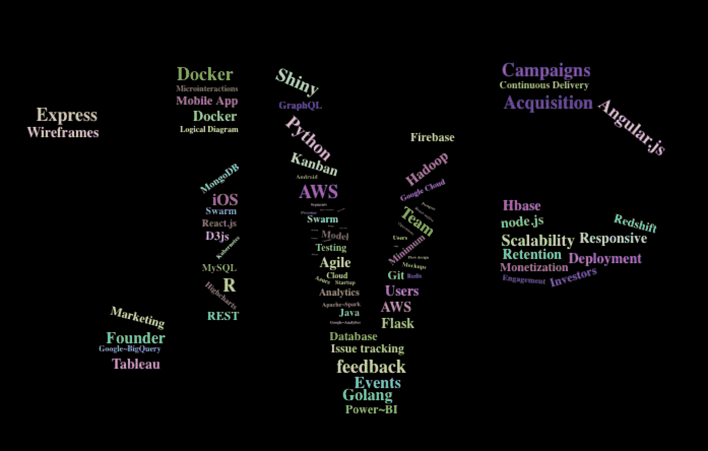
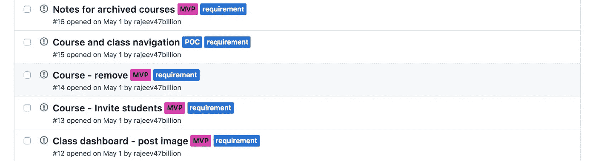
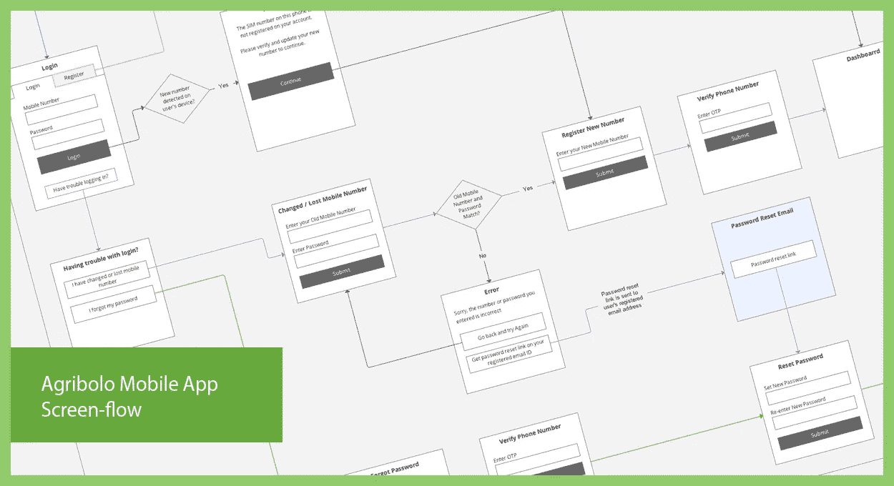
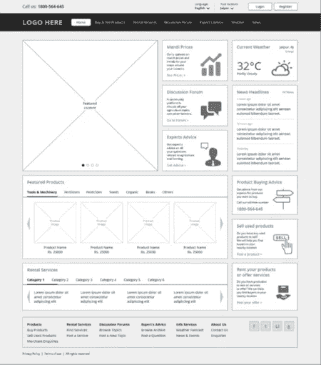
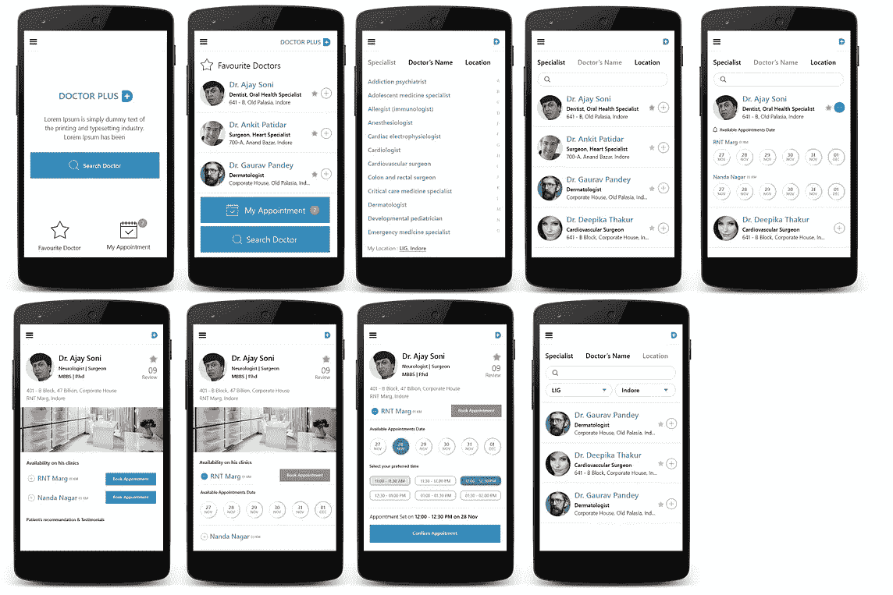
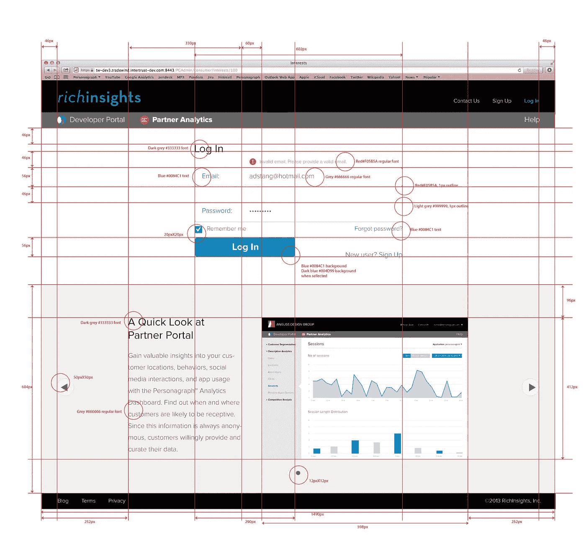
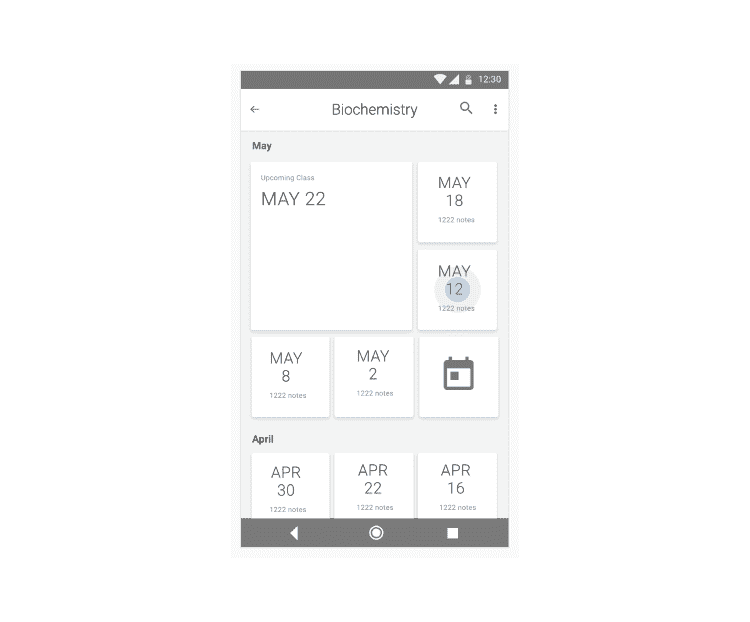

# 从创意到 MVP——第一部分

> 原文：<https://medium.com/hackernoon/from-idea-to-mvp-part-1-6a0376712ba2>

**Building MVP**

对于一个渴望将自己的想法转化为最小可行产品(MVP)的首次创业者来说，快速成功推出产品的路径并不十分清晰。需要注意的方面很多。在开发 MVP 的同时，创始团队必须考虑用户获取和运营策略。创始人通常会陷入“如果你开发，他们就会来”的陷阱，并且低估了产品开发之外的许多方面。任何成功的企业都需要像开发应用程序或网站软件一样关注产品分销战略和运营。在创业初期，创始人在建立 MVP 的同时，大部分时间应该用来和潜在用户交谈。初次创业者，尤其是来自技术背景的创业者，有时会被产品开发的细节冲昏头脑，忘记与用户互动，直到 MVP 完全准备好。MVP 应该被认为是一种快速验证你的论点的方法，关注你的用户，同时最小化你的成本。

有一种倾向是在没有任何初始准备的情况下一头扎进编码中。从长远来看，几周的准备可以节省宝贵的时间，为你的产品打下坚实的基础。在 MVP 周期中，简洁的产品规格、设计精美的用户界面、分离良好的面向服务的架构、可扩展的软件堆栈、定义良好的自动化开发流程、熟练的团队和深思熟虑的营销策略为您的产品的长期成功奠定了坚实的基础。

我和许多企业家一起工作，把他们的想法变成现实，我提出了一个 5 步方针来建立一个成功的软件 MVP。

## 1.产品定义

产品定义为所有利益相关者提供了一个背景和你正在构建的东西的公共视图。

*   ***规格***

这份文件描述了一个高层次的商业想法或投资论点，以及它是如何被产品支持的。它还应该描述你对市场的了解，也就是大多数人的逆势观点，简而言之，你的差异化。应简要描述目标细分市场、用户渠道(手机应用、网站、语音界面等)。)、主要功能、产品分布、参与度和货币化策略。它还应该清楚地说明你的 MVP 的目标，从假设用户行为的验证到 MVP 发布 6 个月后的目标付费用户数。

> 在整个 MVP 周期中，将规范作为用户、团队和投资者的共同指南。

*   ***用例***

用例从用户的角度描述 MVP 功能。每个用例都是对用户行为的简短描述，包括他们的角色和相应的响应:“作为一个终端用户，我可以向我的聊天机器人发送‘你好’并接收问候”。每个用例应该足够短，以便快速实现，并且最好定义用户可见的功能。您还可以编写非功能性用例，定义响应时间、可伸缩性、成本等特征。

> 定义用例以阐明 MVP 行为，将功能分解成小块，缩小关注范围并进行简化。

***Use Cases with labels in Git issues (*Source:** [**47Billion**](http://47billion.com)**)**

## 2.用户界面设计

MVP 是客户和潜在投资者对你的产品的第一印象。因此，开发简单、实用、美观的用户界面非常重要。专业的用户界面设计师或团队可以帮助设置 UI 的基调，然后可以扩展到产品的后续版本。

虽然下面的步骤描述了传统的图形用户界面设计，但是它们同样适用于基于语音和聊天机器人的对话界面设计。对于一个简单的用户界面设计，交互式高保真样机可以直接开发，同时记住最初的步骤。

*   ***信息架构***

信息架构定义阶段是可选的，但是在深入研究流程和交互之前，它有助于为用户界面建立适当的结构。

在这个阶段，产品经理或用户体验设计师可以帮助定义用户角色、角色、信息相似性、各种操作和流程。这个阶段可用于做出决策，例如基于类别还是基于流的信息呈现。

> 使用信息架构围绕要呈现给用户的信息开发一个简单的结构。

*   ***流程图***

在静态流程图中可视化整个用户流程有助于在流程的早期组织和优化用户交互。对于使用自然语言的对话界面，您可以为最常用的交互设计用户对话。

> 使用静态流程图简化信息组织和用户转换。

**User Interface Flow (Source:** [**47Billion**](http://47billion.com)**)**

*   ***线框***

线框用于在屏幕上布局信息。一个好的线框基于类型和重要性来定位内容。如果在一个页面上要显示多种类型的内容，线框允许在设计高保真实体模型之前专注于设计干净整洁的布局。

> 使用线框排列页面上的内容布局。

**Wireframe (Source:** [**47Billion**](http://47billion.com)**)**

*   ***高保真样机***

高保真实体模型密切模仿用户界面的最终外观。在这里，品牌方针、颜色、字体、图标、微交互等决策被引入线框，以展示最终的丰富用户界面。在信息架构阶段定义的上下文和人物角色以及线框应该用作高保真度模型的输入。如果 UI 设计需要在移动浏览器上正确显示，则需要使用网格布局开发实体模型。

> 设计高保真实体模型，以可视化用户界面的详细外观和感觉。

**High Fidelity Mockups (Source:** [**47Billion**](http://47billion.com)**)**

**Redlined high fidelity mockup (Source:** [**47Billion**](http://47billion.com)**)**

*   ***互动模型***

交互式模型结合了用户流和高保真静态模型，为用户提供了早期的导航体验，无需等待整个开发结束。您可以使用这些模型向潜在用户和投资者进行演示，以评估他们的反应、兴趣并获得有价值的反馈。

> 使用互动模型从你的用户和投资者那里获得对你的服务的早期反馈。

**Interactive Mockups using Adobe XD CC (Source:** [**47Billion**](http://47billion.com)**)**

*在本系列的* [*第二部分*](https://hackernoon.com/from-idea-to-mvp-part-2-5fadad8f38d1) *中，我会谈到为你的 MVP 定义架构、选择软件栈、建立敏捷开发流程和营销实践。*

> 在 MVP 开发周期中，你还使用过哪些技术？

如果您需要帮助来实现您的想法，请联系我们 info@47billion.com 公司。