# 从创意到 MVP——第二部分

> 原文：<https://medium.com/hackernoon/from-idea-to-mvp-part-2-5fadad8f38d1>

在这篇文章的第一部分 *中，我谈到了将你的想法转化为 MVP 的五个步骤中的前两个。本文详细阐述了剩余的步骤:定义架构、建立开发过程和初始营销策略。*

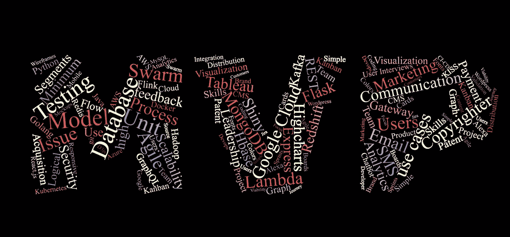

在我们进入这些步骤之前，我想重申一下:“在 MVP 阶段不要忘记你的用户。”。在 MVP 开发的早期阶段，大多数有技术背景的创始人都不愿意面对他们的潜在用户。似乎更容易深入产品开发的舒适区，而不是在产品-市场匹配的灰色区域探索未知。如果你不断提醒自己，MVP 不仅仅是关于开发技术，也是为了确定关键业务差异的可行性，那么在完成 MVP 后，你将为开始全面的产品开发做好充分的准备。

> 在 MVP 阶段，在开发产品的同时，应该同样关注发现业务运营、内容开发和上市方面的未知因素。

说到这里，我们来详细看看 MVP 开发接下来的三个步骤。

## 3.体系结构

为 MVP 定义一个复杂的架构可能看起来有些矫枉过正。典型的想法是，MVP 只是为了快速验证想法，一旦我们决定开发一个完整的产品，软件可以重写。太多的初次创业者陷入了这个陷阱。当 MVP 有牵引力时，重写似乎是破坏性的、耗时的和昂贵的。与此同时，在这样的软件之上构建很快就会产生意大利面条和臃肿的代码，很快变得难以维护和扩展。

在 MVP 阶段花几天时间在高级架构上，为产品打下坚实的基础。

*   ***逻辑组件设计***

逻辑组件设计允许围绕产品的所有内部服务可视化定义良好的边界。它还有助于澄清这些服务之间结构良好的契约。有了合适的微服务架构，您可以在将来轻松地用另一个实现替换服务的一个实现。可以基于功能封装、可伸缩性特征、实时与非实时需求、CPU 或 I/O 限制操作等来定义服务。每项服务都可以独立部署和扩展。

典型的逻辑组件图显示了产品的内部和外部逻辑构建块，例如用户和管理界面、应用、SDK、认证和授权服务、适配器、网关、队列、聚合器、处理引擎、调度器等。

> 使用逻辑组件设计来清楚地定义您的内部和外部服务。

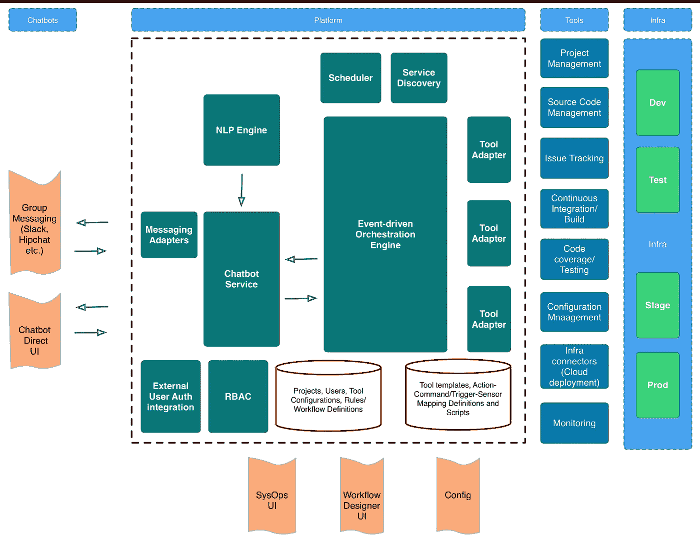

**Logical Component Diagram (Source:** [**47Billion**](http://47billion.com)**)**

*   ***事件流***

事件流显示服务之间的请求/响应和异步事件。为一些涉及多个服务的复杂特性绘制事件流是很有用的。它们有助于澄清各种服务之间的责任，还可以通过在服务之间转移功能来帮助识别和降低复杂性。通常涉及第三方、认证和授权的流以及一些常见的请求/响应流是事件流图的良好候选。

> 使用事件流来识别复杂的交互，并重新划分边界以简化服务交互。

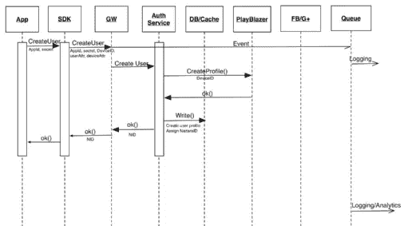

**Event Flow (Source:** [**47Billion**](http://47billion.com)**)**

*   ***实体关系模型***

定义实体关系模型是架构定义阶段最重要的任务之一。您可以参考在产品定义阶段编写的用例，并列出所有实体以及它们之间的关系。这个阶段可以用来发现新的实体或新的关系。您可以基于这些新的见解来修改用例。

ER 模型是一种逻辑表示。实体可以直接映射到一个表，或者您可以根据这些实体的读、写属性反规范化和组合多个实体。

> 使用 ER 模型来显示核心实体并定义它们之间的关系。

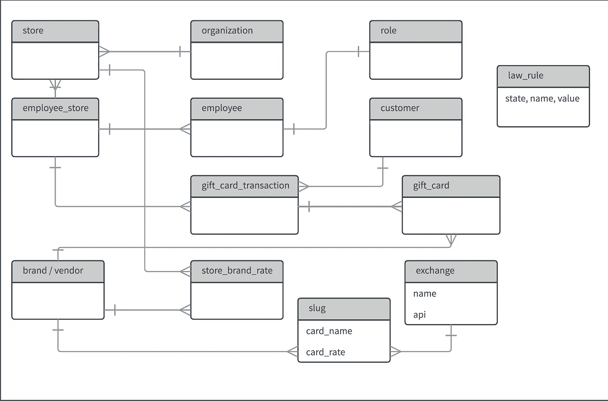

**Data Model (Source:** [**47Billion**](http://47billion.com)**)**

*   ***技术叠加***

在 MVP 阶段，很容易陷入将技术视为产品和过度工程化的陷阱。因此，现在有一种反向映射的趋势，而不是将用例映射到产品特性再映射到技术。很容易将机器学习和区块链视为功能，而不将其映射到最终用户的用例中。重要的是要记住，技术仅仅是你的整体商业理念的推动者，你选择的技术栈对你的最终用户是完全透明的。

话虽如此，在 MVP 阶段精心选择的堆栈对开发速度、稳定性、可靠性、性能和成本都有重大影响。另一个常见的陷阱是假设 MVP 栈可以很容易地在以后被更健壮的产品栈所取代。但是很有可能，你的 MVP 栈将成为你的产品栈，至少在最初几年是这样。因此，在这个阶段选择正确的堆栈可以减少产品开发后期的大量返工。

前端、中间件和数据库的软件堆栈的选择取决于多种因素。与其争论不同软件堆栈的优缺点，下面是选择堆栈的一些广泛的指导原则。

*   通过定义良好的 API，在前端和后端之间进行清晰的分离。
*   权衡使用 native、 [React native](https://hackernoon.com/mobile-app-react-or-not-to-react-that-is-the-question-88663aad50e3) 或 Progressive Web 应用程序开发应用程序的优缺点。
*   基于逻辑架构和事件流为每个后端服务公开定义良好的 API。
*   坚持使用一种或两种编程语言，以减少学习曲线和整体复杂性。
*   当您进行大规模部署时，您选择的无状态应用服务器框架(如 node . js+Express/Apollo(JavaScript)、Flask (Python)、Slim (PHP)、SparkJava (Java))可能会显著影响以后的托管成本。
*   有了正确定义的面向服务的架构，您就可以灵活地为正确的服务使用正确的工具。这意味着您的 API 服务器可以用 node.js 编写，计算密集型分析和机器学习代码可以用 Scala、Java 或 Python 编写。
*   数据库的选择应基于许多因素，如 ACID 要求、最终一致性、读写负载、频率、关系、时间序列、搜索等。有各种数据库可供选择，如关系数据库、文档数据库、列数据库、键值数据库、反向索引数据库、图表数据库。在 MVP 阶段，很容易低估部署的复杂性和成本，并选择多个数据库。但是您可能会发现，考虑到现代数据库中支持的重叠特性，单个数据库很容易满足您的需求。例如，简单的图关系可以在 MongoDB 或 SQL 数据库中建模。
*   选择社区积极贡献的流行开源框架。
*   使用外部 PaaS 服务缩短上市时间。这个决定会极大地影响您的 MVP 的上市时间。您的核心优势和围绕它的服务最终会成为您的知识产权(IP)。你希望这是你的竞争对手无法轻易复制的。您应该在流程的早期确定这些领域，并在内部开发它们。
*   基于满足您需求的核心 PaaS 服务选择单一云提供商，这样您的部署就不会分散到多个云提供商。比如手写识别服务的 Azure，Alexa skill services 的 Amazon，BigQuery 的 Google。
*   从一开始就为水平扩展设计所有服务。
*   开始收集尽可能多的有用的用户原始数据。除了作为真理的来源，它还可以在以后被挖掘用于额外的见解和机器学习模型训练。
*   [逐步增加机器学习能力](https://hackernoon.com/for-startups-how-to-progressively-build-your-product-to-incorporate-machine-learning-e646dc868386)。
*   最重要的是，根据您团队的专业知识和技能选择堆栈。

> 根据团队的技能选择软件堆栈，同时牢记生产中部署和扩展的挑战。

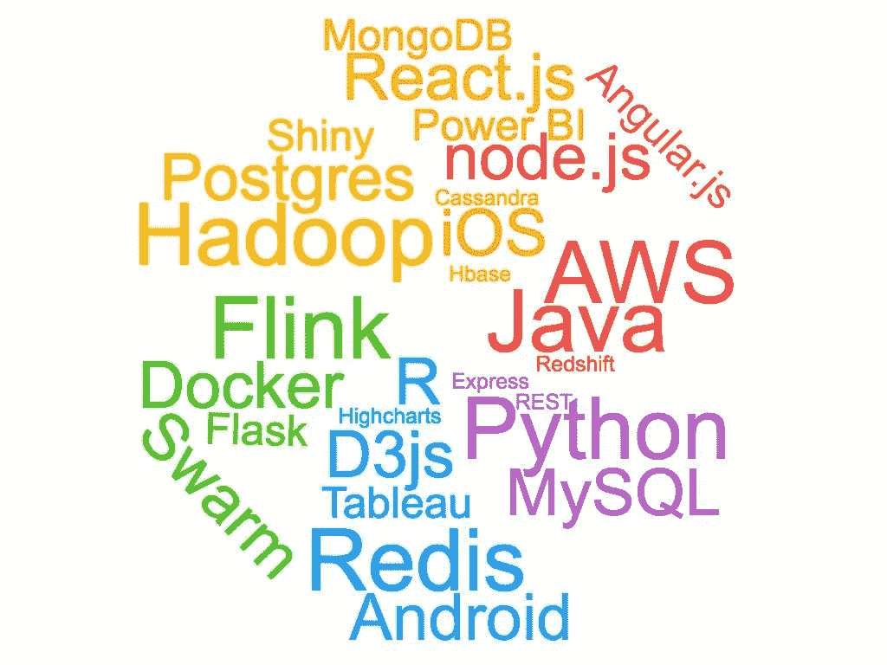

**Software stack (Source:** [**47Billion**](http://47billion.com)**)**

*   ***编码***

有许多关于“编程艺术”的文章和书籍。这里有一些重要的指导方针-

*   写模块化代码。
*   保持一致。
*   选择简单而不是早期优化。
*   将测试作为代码的一部分来构建。

> 编写模块化、一致且简单的代码，严格遵循所选框架的理念和结构。

*   ***部署***

在 MVP 阶段考虑部署架构有助于设计长期的可伸缩性和高可用性。它还有助于权衡 IaaS 和 PaaS 服务的成本和上市时间。

*   PaaS 服务可缩短上市时间，并减少 MVP 期间的开发运维难题。但是它们也引入了供应商锁定，降低了灵活性并增加了成本。有了正确设计的架构，在 MVP 完成后，您总是可以用内部开发的服务替换这样的服务。
*   使用容器(docker with Kubernetes)进行开发和部署。使用容器后，整个部署自动化变得更加容易。不受云供应商限制的部署和增强的可移植性带来的额外优势。
*   使用 AWS Cloudwatch、Crashlytics for Apps 等服务添加基本监控。添加适当的日志记录来帮助调试任何问题。为早期采用者推出 MVP 时，快速检测并修复任何服务中断或应用崩溃非常重要。
*   数据库服务器和任何后端服务都应该在 VPC 后面得到保护。

> 使用部署设计来规划您的部署，以实现水平扩展和降低成本。

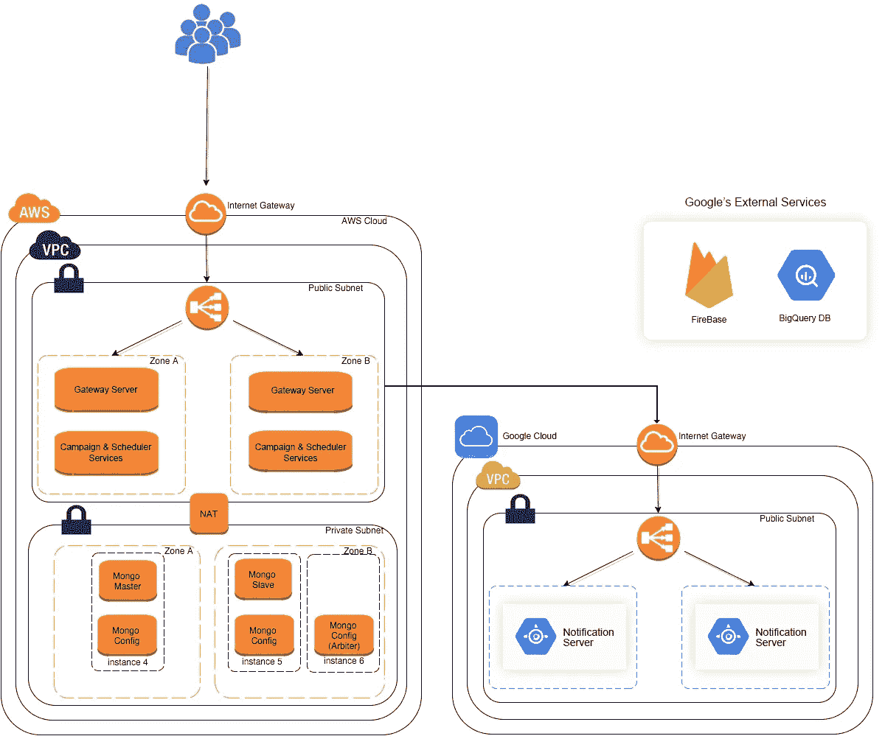

**Multi Cloud Deployment Diagram with AWS and GCP (Source:** [**47Billion**](http://47billion.com)**)**

## 4.过程

在 MVP 开发过程中，企业家通常会陷入两个极端的陷阱之一:认为敏捷没有计划，或者在不了解团队动态的情况下过早地过多关注过程。两者之间的适当平衡允许关注真正的可交付成果，而没有太多的开销，并提供持续的反馈。在开始时花几天时间来计划和设置持续集成和部署过程将对顺利执行大有帮助。

*   ***策划***
*   从一个日期开始回溯到 MVP。相应地缩小范围或拆分发布，以适应可用的时间。这给人一种紧迫感，并有助于关注基本功能。典型的首次发布应该在开始后的 3 到 4 个月内进行规划。
*   用户可见的高影响力功能可以优先于后端操作。
*   使用简单的计划工具，比如看板，将用例与每个 sprint 关联起来。使用这样的工具很容易维护 backlog 并跟踪 sprint 的进展。
*   计划两周一次短跑，每天站立。团队应该致力于在每个 sprint 结束时演示最终用户可见的功能。在 sprint 结束时进行 sprint 回顾有助于改进后续的 sprint。

> 使用计划工具关注核心功能并跟踪进展。

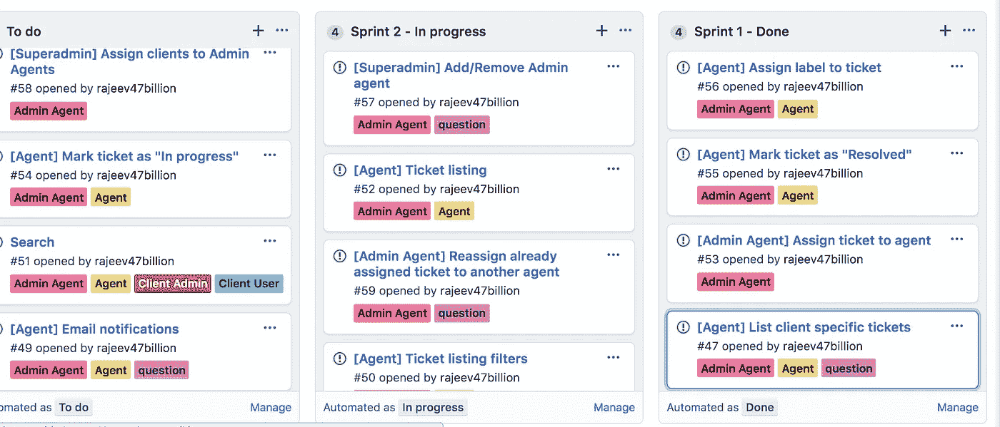

**Kanban board in Github (Source:** [**47Billion**](http://47billion.com)**)**

*   **持续集成(CI)**

用适当的工具执行的良好设置的持续集成过程有助于平稳的 sprint 交付。

*   创建一个源代码库，为每一个新特性创建一个新的分支，在 sprint 结束时使用 Pull 请求来合并代码。
*   “拉式请求审查”允许开发人员在合并拉式请求之前，对拉式请求中提出的变更进行评论、批准变更或请求进一步的变更。

> 使用工具设置持续集成流程，以确保顺利交付。

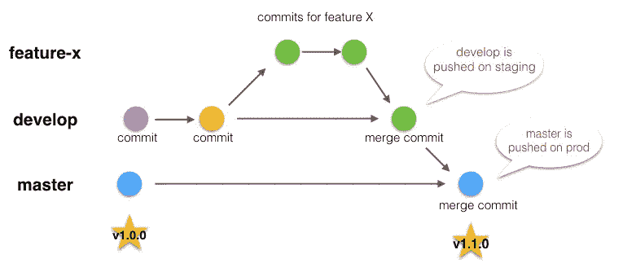

**Continuous Integration (Source: Jelle)**

*   **连续部署(CD)**

连续的自动化部署流程提供了对团队工作的即时可见性。

*   设置开发、试运行、生产部署环境。
*   在签入时设置自动构建和自动部署。
*   容器和可信注册表的使用。
*   对每个版本进行编号，以便可以追溯到代码库。
*   尽早开发简单的迁移脚本，以处理 MVP 部署后的模型变更。
*   向团队的消息传递系统或电子邮件发送构建和部署通知，有助于及早发现问题。

> 设置 CI-CD 流程，但确保您没有花费宝贵的时间来维护流程本身。

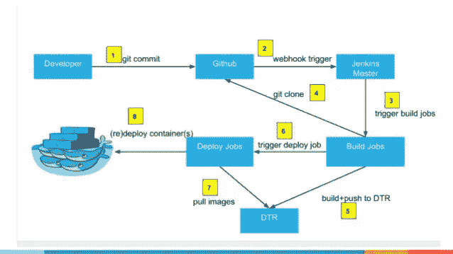

**Continuous Delivery using Docker and Jenkins**

## 5.营销

在 MVP 开发阶段，应该同等重视用户获取和运营策略。一般认为，除非你有一个工作原型，否则很难接近潜在用户。虽然在某种程度上这是真的，但是你可以通过谈论产品或者给他们一瞥交互模型来衡量早期用户的兴趣。在 MVP 开发阶段，您应该开始整合产品分销、上市和定价策略。如果产品涉及到运营，在 MVP 阶段组建一个运营团队可以让你在 MVP 完成后立即投入使用。

*   ***网站***

早期建立单页营销网站有助于产生早期兴趣。可以在网站上添加一个注册表单，在产品发布时通知用户。当 MVP 准备就绪时，该页面可以包含应用程序商店中应用程序的链接或注册和登录门户网站的入口点。使用像 WordPress 这样的 CMS 来营销网站，可以让非技术人员的创始人灵活地改变内容。表格，电子邮件，搜索引擎优化等插件。也可以杠杆化。

> 为早期注册开发一个单页营销网站。

*   ***内容***

为营销网站、应用程序、门户网站、用户入职、产品内用户沟通(如电子邮件、营销沟通、社交媒体帖子、博客、投资者推介)编写的内容与视觉设计非常契合。一个好的文案或有写作天赋的团队成员可以在 MVP 阶段承担这项工作。

如果你的产品是以内容为中心的，这是时候制定一个可靠的内容计划和团队，他们的全部精力都集中在为你的产品的不同用户群生成及时的内容上。

> 好的文字和视觉效果的结合描绘了你的公司和产品的形象。

***分析学***

重要的是要衡量用户获取渠道的有效性、用户参与度和行为，并在部署 MVP 后采取纠正措施。与 Google Analytics 的简单集成让您能够深入了解用户行为。您还可以在 S3 等低成本存储中收集活动日志，用于定制分析。

> 整合分析以衡量上市策略和产品特性的有效性。

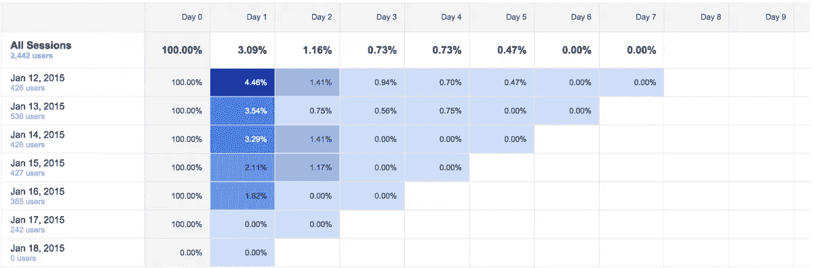

***Google Analytics Retention (Source: Amazeemetrics)***

*   ***战役***

一旦部署了 MVP，重点就转移到获取新用户，防止你已经获得的用户离开，并让他们积极使用你的产品。实现这一点的方法之一是在你的产品中集成活动管理软件，如 Amplitude，MixPanel，CleverTap，Google Firebase。至少，你的早期产品应该包括发送有针对性的推送通知的方式，并带有深度链接，以留住用户并吸引用户。

> 将营销活动管理集成到您的 MVP 中，以保持用户忠诚度和参与度。

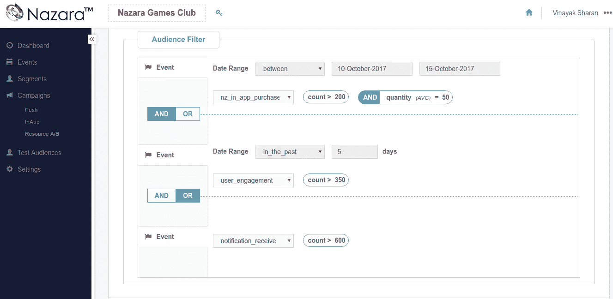

**Campaign Manager (Source:** [**47Billion**](http://47billion.com)**)**

这五个步骤中描述的几个星期的前期准备可以帮助你开发一个成功的 MVP，并为你的产品打下坚实的基础。一旦 MVP 启动，您就可以开始获取早期采用者，并进一步调整产品和上市策略。

> 在这篇文章中，我根据我的经验描述了开发 MVP 的广泛指南。成功的 MVP 有很多不同的方法。在 MVP 阶段，什么对你有效，什么不有效？

如果你需要帮助来实现你的想法，请联系我们 info@47billion.com 公司。