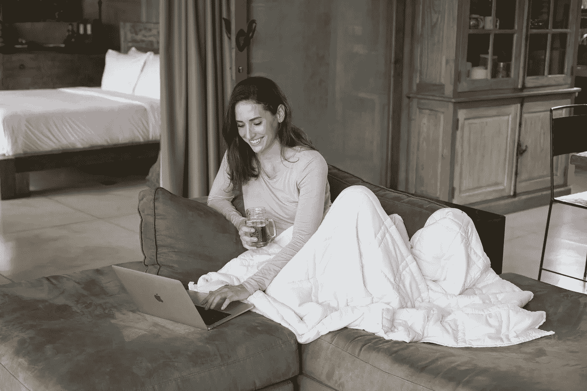
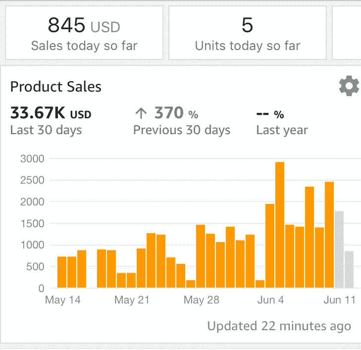
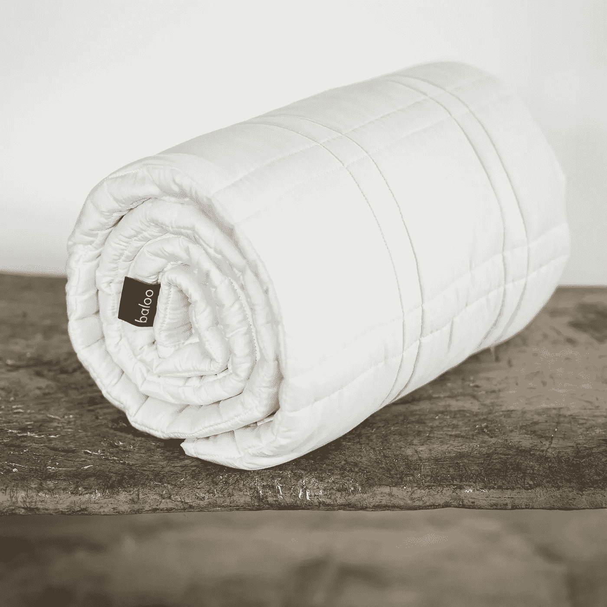
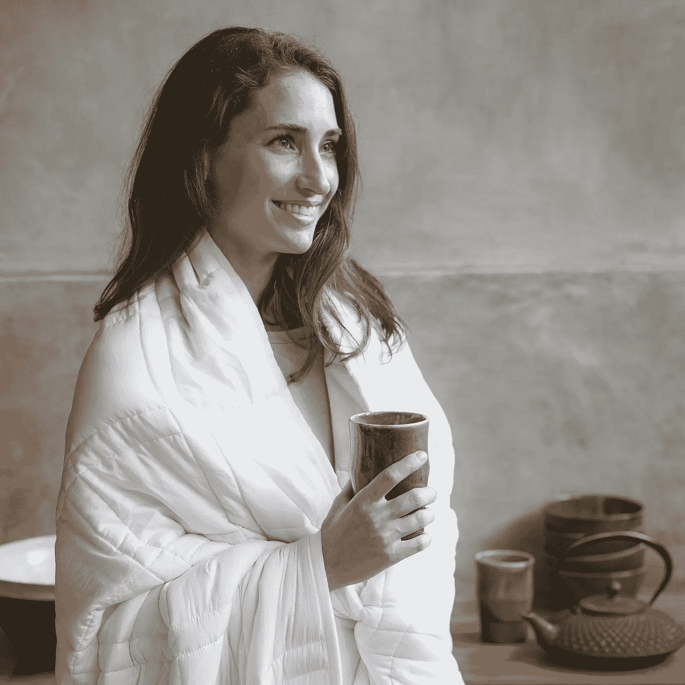

# 从靠积蓄生活到两个月内收入 72000 美元

> 原文：<https://medium.com/hackernoon/from-living-on-savings-to-grossing-usd-72k-in-2-months-e16bf69871b7>

Elizabeth Grojean using her Baloo Living weighted blanket

## *一位女性如何脱离公司竞争，在巴厘岛开发了一个利润丰厚的激情项目*

今年早些时候，当我在乌布第一次见到伊丽莎白时，她正在庆祝自己的 37 岁生日。她安静地坐在角落里，亲切地感谢她的客人，她温和的微笑首先打动了我。后来我才知道她正在创业。两周后，她告诉我生意比她想象的要好。准确地说，**她有望在今年年底赚到 25 万美元**。

> “这是我一生中最不可思议、最具变革性的一年。去年 8 月，我带着最后一点积蓄离开纽约，前往巴厘岛，决心找到一种方法，创建一家我可以在任何地方经营的企业。我不知道如何，或者会是什么，但我知道留在企业竞赛中不再是一个选项。在短短 8 个月内，我从在纽约感到困惑，到住在巴厘岛，在笔记本电脑上经营一家盈利的公司。”

为了了解 Elizabeth 的发展速度和广度，下面是一张截图，显示了**在第一个 30 天**的总销售额为 33，670 美元。

伊丽莎白创立的公司名为 [Baloo Living](https://balooliving.com/) ，这是一家以自我保健和整体健康为原则的产品公司。

> “我们在 4 月份推出了一种加重毯子，它有助于人们感到平静，睡得更沉。”

[**在亚马逊上查看她的加重毛毯**](https://www.amazon.com/s/ref=nb_sb_noss?url=me%3DAVJOMR7BQLKM1&field-keywords=weighted+blanket)

你猜对了，Baloo 来自拉迪亚德·吉卜林的*丛林之书*中的熊。他有一颗开放的心，在他去的地方传播快乐，但他是一只熊，所以他也是一个强大的保护者。伊丽莎白的加重毯子给人的生理好处和熊抱一样；通过对身体施加温和的压力，告诉神经系统这是安全的，从而获得一种安全、踏实和舒适的感觉；身体的反应就像被温暖的拥抱一样。

让我们回溯一下。伊丽莎白拥有德克萨斯大学的市场营销学位，在不同行业拥有丰富的经验。

> “我尝试过几种职业，并投入大量精力寻找自己的职业。我惊喜地发现，我现在所做的一切都是基于我过去的经历。我的第一份工作是在华盛顿的国会山，为一名说客工作。然后，我在芝加哥的一家国际广告公司工作，在贝莱德从事财务工作，并担任奢侈消费品牌 Casa Dragones 龙舌兰酒首席执行官的行政助理。在我最近的工作中，我是一家名为 Egg in the Hole Productions 的初创内容创作公司的经理，在那里我监管业务的所有方面，同时还在儿童出版公司 Scholastic 担任项目经理。

这些不同的经历让 Elizabeth 有机会更深入地了解她的客户需求。

在《心连心》中，她分享了到达这里的旅程。

## **伊莉莎白在此之前尝试过什么？**

当我还是个孩子的时候，我总是在即兴搭建柠檬水小摊，或者在宣传不佳的车库拍卖中，洗车，或者给邻居的花园除草来赚取额外的钱。多年来，我一直在攒钱买一匹马，但幸运的是，我的父母没有达到这个目标。

直到大学毕业几年后，我得到了我的第一个营销客户，一家古董地毯画廊，我才爱上了做自己的老板。我受到了小企业主的启发，看到我的工作产生影响，我也受到了激励。我知道我还有很多东西要学，所以我搬到了纽约，在那里我有幸与一些非常有才华的企业家一起工作。

## **伊莉莎白为什么选择推出这款产品？**

与其他任何平台不同的是，通过亚马逊发布可以进入市场。成功的关键是提供人们已经在寻找的东西，但是竞争不激烈或者有改进的机会。我用了一个叫做丛林侦察兵的[工具](https://hackernoon.com/tagged/tool)来研究关键词需求。挑选产品需要一门艺术和一门科学，首先要从大量数据中筛选。

我看到加重毛毯的需求量很大，我觉得我可以创造出一种人们会认同的有思想、高质量的产品。当时市场有明显的缺口。Baloo 作为一个品牌，代表着对身体与生俱来的智慧和自愈能力的尊重。我们与其他品牌不同，因为我们使用经 Oeko-Tex 100 标准认证的优质棉花，不含有害化学物质和无铅玻璃微珠。我们向 Foundation.org 碳基金捐款，以抵消我们的碳足迹，我们还与一个名为“睡衣计划”的非营利组织合作，帮助住在无家可归者收容所的儿童在就寝时感到安全。

有趣的是，我开始这个过程是因为我在寻找一种赚钱的方式，但却发现了一种激情。当我尝试了我的第一个 Baloo 加重毯子样品后，我感觉我的身体比以往任何时候都更加放松。我被这些毯子能为人们做的事情深深感动了。

## **是什么让伊莉莎白有动力继续工作？**

我的第一个客户是一位朋友，他也是一名企业家。她患有失眠症和焦虑症，以至于医生给她开了药；她对失眠的焦虑造成了恶性循环。收到她的毯子后没几天，我就开始定期收到*的短信和电子邮件*，告诉我她现在睡觉是多么兴奋！在你挣扎的时候睡个好觉是一个人一生中的重大改变。我现在经常听到这样的故事，这让我非常非常开心。我们的身体是惊人的，天生感觉良好，但我们生活的世界并不总是支持这一点。

## **自推出以来，业务增长了多少？它如何改变了她的生活？**

我用三个月的库存推出了 Baloo，我们在两个月内就卖光了！

缺货就成了“好问题”。一方面，这是一件幸事，因为它让我明白，我已经变得依赖销售数字——如果销售情况良好，我感觉很好，但如果销售缓慢，我会怀疑自己。缺货让我有机会将自己的情绪与业务结果分开。令人高兴的是，我们现在又有货了！

这项业务改变了我的生活，因为它给了我完全的灵活性。在过去的一个月里，我在克罗地亚、英国、冰岛、纽约和德克萨斯州旅行和工作。具有讽刺意味的是，工作已经成为我最喜欢做的事情，我每天都为我的挑战祈祷感谢，尽管它们可能令人沮丧，因为它们是我的，我喜欢建立一个如此贴近我内心的企业。

## 你如何推销你的新产品？

信不信由你，我还没有做过任何付费营销。我和几个社交媒体有影响力的人合作过，这很有趣，但除此之外，这是亚马逊列表优化和口碑的结合。

*关注 Instagram 上的*[*balo living*](http://instagram.com/balooliving)*获得一些健康的视觉享受！*

## **您面临过哪些电子商务挑战？新卖家开始销售时不知道什么？**

产品业务是现金密集型的，需要大量的营运资本。*现金流规划是选择产品前需要考虑的事情*。为此做准备的最佳方式是找到或建立一个由不同背景的企业家组成的社区，因为我认为一个人不可能掌握所有的知识。

## **除了亚马逊，你们还在其他平台上销售商品吗？为什么或为什么不？**

*亚马逊在推出人们正在寻找的产品方面很棒，但他们总是占上风*。例如，卖家的费用经常增加，评论政策刚刚改变，所以许多企业主正在失去成百上千的客户评论。

对于一个品牌来说，要想掌控自己的长远未来，与顾客建立直接关系是必不可少的。因此，我们也在我们的网站 balooliving.com 上销售。

## **在你的旅程中，成为数字流浪者对你有什么帮助/阻碍？**

几乎建设 Baloo 的每个方面都受到了数字游牧社区的影响。**通过在**[**Hubud**](http://hubud.org)**(一个合作空间)的一次免费技能分享演讲，我决定将亚马逊作为启动我的业务的途径**。我遇到了一些企业家同事，他们就最佳会计实务向我提供建议；我从每周的聚会中学到了几乎所有关于数字营销的知识；发现了如此多的鼓励和允许去探索新的思维方式。

远离美国是有挑战的；例如，我的第一笔订单电汇到我的工厂，被银行标记为可疑。有人告诉我，解除警报的唯一方法是带着身份证亲自出现在美国分行——当我在地球另一端的巴厘岛时，这是不可能的。我一直工作到凌晨 5 点，直到我能够联系到我的会计师的银行家，他愿意为我发放资金。

我很幸运，在我旅行的时候，我的两个姐姐都帮我。詹妮弗是我在任何法律或通信问题上的代理人(她接收我的邮件！);Kimberly 在我们家位于德克萨斯州的办公室管理客户退回的产品。在我旅行的时候，没有他们的帮助，很多小事都会变成大事。

## **你对其他创业者有什么建议(可以分享 2-3 条建议)？**

庆祝你的成就！专注于下一个目标很容易忘记你已经走了多远。庆祝并不自私，因为它承认所有相信你的人。我在巴厘岛为 Baloo 举办了一个小型的发布会，对我来说很有力量。成为关注的焦点不是我的本能，但是和朋友们一起庆祝这个时刻是有意义的，因为胜利也属于那些一路上鼓励我的人。尼萨，你可以证明这一点，因为你在那里！*【我可以:)】*

我发现的另一件非常有影响力的事情是**与一个责任合伙人一起为周一早上的签到工作**。我们使用的格式是为未来一周准备一份三到五个最重要目标的简短列表。我们还分享了上周我们最自豪的一件事(见建议 1):)

最后，我永远记得能量是我最宝贵的资源。如果我的能量很低，我不会努力去度过。我通过散步、给朋友打电话或在我的加重毯子下闭上眼睛几分钟来尊重我的身体节奏。我们不是不休息就工作的机器，最终，当我放松的时候，我比当我被咖啡和待办事项弄得筋疲力尽的时候更有创造力。

## **作为一名女性，作为一名企业家和数字流浪者，你有什么样的体验？你认为是什么阻止了女性发挥她们真正的潜力？**

我发现巴厘岛的外籍人士社区非常尊重和平等。但创业是一次无价的经历，因为它迫使我直面自己作为一名女性内在化的局限。*看到自己为了赚钱而兴奋的难受，我很震惊；我习惯性地认为，为他人服务的动机更容易被接受。当我意识到我在自己赚钱的关系中是多么无能为力时，我感到非常惊讶，我认为一个男人是不会这样做的。*

我注意到我处理这件事的方式也和男人很不一样。我是直觉型而不是分析型的。有时候，我担心我会错过一些东西，因为我的方法如此不同，但我有一个美丽的产品，我相信，人们很乐意购买。我相信，将服务于更大利益的愿望与建立企业和财富的自由结合起来，是一种强有力的结合，我很高兴看到更多的女性走上这条道路。

## 想成为更好的创业者？

我列出了 15 本你没听说过的商业书籍**(除了老一套的《零对一》和《精益创业》之外)。)**

[*在这里*](http://startupbookindia.com/readinglist/) *获取秘商书单。*