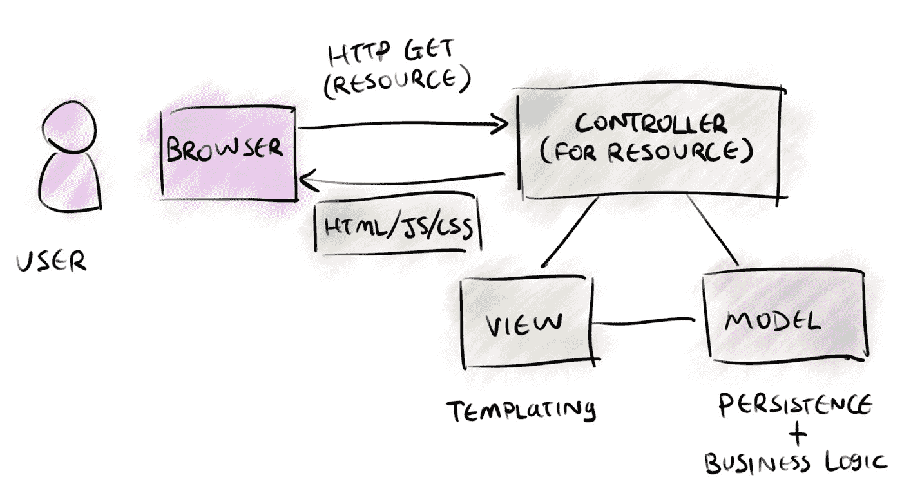

# 从 MVC 到现代 Web 框架

> 原文：<https://medium.com/hackernoon/from-mvc-to-modern-web-frameworks-8067ec9dee65>

模型-视图-控制器(MVC)是软件体系结构中最广泛和最有影响力的模式之一。尽管有 MVC 死亡的传言，但它仍然是[理解](https://en.wikipedia.org/wiki/Model%E2%80%93view%E2%80%93controller)的有用模式。在这篇文章中，我不会局限于 MVC 的各种定义，而是强调它是如何演变成我们今天所知道和喜爱的现代 web 框架的。

# 开始

1978 年，Trygve Reenskaugh 和 Adele Goldberg 创造了“模型-视图-控制器”这个名字。Trygve 认为 MVC 及其变体形成了一种[模式语言](https://en.wikipedia.org/wiki/A_Pattern_Language)，一种人们谈论问题及其解决方案的共享语言。软件模式语言的概念也影响了“四人帮”写的《设计模式》一书。如果 MVC 包含在设计模式书中，我们可能会在[行为模式](https://en.wikipedia.org/wiki/Behavioral_pattern)部分找到它，与[中介](https://en.wikipedia.org/wiki/Mediator_pattern)和[观察者](https://en.wikipedia.org/wiki/Observer_pattern)这样的模式混在一起。

下面是 try gve 2003 年的回顾论文， [MVC，它的过去和现在](http://heim.ifi.uio.no/~trygver/2003/javazone-jaoo/MVC_pattern.pdf)。Trygve 列举了构成 MVC 模式语言的 11 种模式。只有两个在很大程度上停滞不前:*模型/编辑器分离*和*输入/输出分离*，我认为它们本质上是相同的:

*Variants where the input goes through the View are also common.*

> “当视图和控制器紧密耦合时，它们可能由同一个对象扮演”——Trygve Reenskaugh(这一点在社区中一直争论不休)

# 本机 MVC

在接下来的几十年里，随着 Mac OS 和 Windows 系统的快速发展和演变，MVC 比 Smalltalk 和 powered 应用程序存在得更久。后来，当智能手机开始出现时，Windows Mobile 的原生移动应用和 iOS 的早期版本也依赖于 MVC 及其变体。在微软，MVC 后来演变成了 [MVVM](https://en.wikipedia.org/wiki/Model%E2%80%93view%E2%80%93viewmodel) ，为 WPF、Silverlight 和 Xamarin 等项目提供动力。

# Web MVC

在 21 世纪初，几个重要的 web 框架采用了 MVC 模式语言:Spring、Ruby on Rails、PHP 和 ASP.net。这些框架为控制器增加了新的职责:处理初始 HTTP 请求。事情是这样的:

Controllers respond to HTTP requests

控制器现在是应用程序的入口点，而不是视图。视图的职责也发生了变化:它的工作不再是直接向用户呈现和处理输入，而是组装一堆 HTML、JS 和 CSS 供浏览器呈现。HTML/JS 将包含类似按钮点击处理程序的逻辑，该处理程序将通过 XMLHttpRequest 将动作发送回控制器。请注意，浏览器中并没有明显的 MVC 模式。随着现代 Web 框架的出现，这种情况很快就会改变。

# 现代 Web 框架

随着浏览器大战的平息，我们终于有了好东西:XMLHttpRequest、稳定的 DOM API、ES6 等等。随着能力和灵活性的增加，公司开始构建越来越复杂的网络应用程序(有时被称为[单页应用程序- SPA](https://en.wikipedia.org/wiki/Single-page_application) )，而不是相关的简单网页集。现代 Web 框架有助于组织这种日益增加的客户端复杂性，并保持应用程序开发的可预测性和高效性。

通常，这些框架引入了额外的构建步骤来创建 HTML、JS 和 CSS 的静态包，以便通过简单的“视图控制器”(通常是/或/index.html 中的处理程序)直接托管。这些资源的静态性质意味着我们可以设置缓存控制头，并依靠 cdn 来帮助以更低的延迟为它们提供服务。这些单页应用程序包括针对“API 控制器”提供的一组资源发出 HTTP API 请求的逻辑(在 JS 中),这些资源通常用 JSON 响应:

这就把我们带到了今天: [React](https://reactjs.org/) 、 [Vue](https://vuejs.org/) 和 [Angular](https://angular.io/) 是最流行的现代 Web 框架。这些框架的组织模式与 MVC 有多相似？所有这些都有某种“视图”，因此任何比较都需要在下一层完成:状态(模型)、中介逻辑(控制器)和同步。

我将通过最常用的方法来描述这些框架。我敢肯定，某处有人坚持将数据绑定与 React、Flux 与 Angular、炸薯条与花生酱结合起来。

Vue 是最直接的:它的文档清楚地表明 [Vue 是 MVVM](https://012.vuejs.org/guide/) 的一个实现。默认情况下，Angular 也是 MVVM 风格的[。然而，React 是从一颗垂死恒星的心脏中锻造出来的，使用了一种叫做](https://angular.io/guide/architecture)[通量](https://github.com/facebook/flux)的超级模式:

*Chris Hemsworth creating React at Facebook*

Actual Flux diagram; a*ll the arrows on the right-side point clockwise.*

Flux 完全是单向数据流。回想一下，MVC 中的模型表示将由视图呈现的持久化数据。Flux 分割了 MVC 模型的职责；它将动作/API 用于业务逻辑，将“存储”用于处理状态。你可以把商店想象成整个应用程序的一个整体被动模型。

为什么 Flux 拥抱单向数据流？原因是这样的:随着应用程序变得越来越复杂，用视图更新来管理状态变化变得越来越困难，尤其是当这些变化来自不同的来源时。与[数据绑定](https://en.wikipedia.org/wiki/Data_binding)相反，在数据绑定中，视图观察 ViewModel 的可变实例的属性变化， [React 创建一个新视图作为不可变状态/属性的函数](https://reactjs.org/blog/2015/12/18/react-components-elements-and-instances.html#components-can-be-classes-or-functions)。视图从不需要担心本地状态的变化。应用程序只能通过在状态树中创建新的模型实例来进行更改。当 React 想要更新应用程序时，它会用一个新对象替换其状态树的一部分，这将触发新视图的创建。

虽然单向数据流是一个强大的概念，但它不是装满银弹的免费午餐盒，也不会将反应/流量提升到与角度/Vue 不同的 T2 级别。

The MVC tree of life

我希望这是有用的。如果没用，那就有意思。如果不有趣…那是过去的事了，过去是不可改变的；也许您应该用一个新的函数生成的不可变实例来代替自己，这个实例可以更好地决定阅读哪些文章=)。