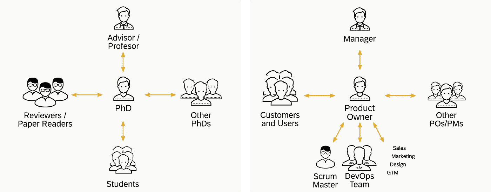

# 从博士到产品负责人

> 原文：<https://medium.com/hackernoon/from-phd-to-product-owner-c026d70db592>

与其他知识领域相比，计算机科学在当今世界有着非常优越的地位。软件已经变得如此普及，以至于很少有公司能够在重要岗位上没有一个热爱软件的人的情况下生存下来。

对于大多数即将毕业的计算机科学博士来说，这意味着在大学阶段即将结束时，一个人可以开始思考——如果不是梦想的话——自己想为哪个特定领域做出贡献，以及担任什么角色。

领域的范围非常广泛，从 A 作为航空航天(想想 SpaceX)到 W 作为葡萄酒(想想那些物联网传感器)，但那是另一篇文章的问题。相比之下，可能的角色更加有限(尤其是没有行业经验的情况下)。

尽管如此，还是有很多选择:加入一家初创公司并利用开发技能是很常见的；承担现代软件[开发](https://hackernoon.com/tagged/development)方法中定义的更加专业化的角色，比如 scrum 主管或发布经理；或者去找一个顾问的职位。

就这样，我开始担任**的产品负责人** (PO)一职。在这篇文章中，我讨论了什么是，为什么和如何在学术生涯后成为一个 PO。

## 什么

为了确保我们在同一页上:PO 职位是敏捷世界中的一个角色。简而言之，首席采购干事是其产品或服务的企业家，其任务是使所创造的产品价值最大化。具体的细节，请点击查看 [scrum 指南](https://www.scrumguides.org/docs/scrumguide/v2017/2017-Scrum-Guide-US.pdf)和其他文章[。](https://www.google.de/search?q=%22product+owner%22+site%3Ahttps%3A%2F%2Fmedium.com&oq=%22product+owner%22+site%3Ahttps%3A%2F%2Fmedium.com&aqs=chrome..69i57.4820j0j4&sourceid=chrome&ie=UTF-8)

## 为什么

追求这一角色的一个重要动机是您面临的各种任务:作为一个 PO，您用解决问题的技术构件来解决特定业务的挑战。在某些情况下，这些构件对你来说很熟悉，因为你甚至在博士期间在实验室或研讨会上讲授过相关概念。

此外，PO 是一个需要与产品的利益相关者(客户和用户)和多个领域的专家(设计、QA、用户协助、营销、法律、销售，当然还有 DevOps！).虽然不是所有的博士项目都像这样丰富多样，但我在许多以前同事的项目中观察到了这一点。特别是对我来说，在进行传感器网络研究时，有必要接触许多人来讨论研究目标和好处(比较产品价值)，评估备选方案(分析风险)，将工作委派给学生(定义 sprint backlog)，建立实验和实验室(定义开发环境)，发布和展示结果(营销)，申请研究资助(申请资金)等。因此，我很自然地接受了这个职位，我相信其他人也不会犹豫。

Working towards your PhD vs. working towards a product.

博-博匹配良好的另一个原因是产品成功所需的责任水平。我把这解释为为了产品在市场上茁壮成长，能够做一切需要做的事情。这种企业家精神在成功的博士中也很常见:这种“能做”的精神被要求将大量的研究工作整合成一个最终的包，提交它，并为它辩护。

## 怎么做

作为一名刚毕业的博士，通常会缺乏软件行业的某些行业经验——至少与其他经验丰富的公司员工相比是如此。当开始一个全新的产品时，直接进入 PO 角色可能是可以接受的。在加入一个现有产品的团队的情况下，我宁愿建议首先陪伴 PO 位置上的某人，直到过程的机制(Scrum、看板等)。)都懂。我确实度过了一段美好的时光，最初是作为一名开发人员，然后在转换到 PO 角色之前作为一个团队的 Scrum Master。

在对这个角色进行推理的过程中，我清楚地认识到，这个角色所必需的技能并不是一成不变的，也不会在某个特定的课程中教授。在[网](https://www.coursera.org/specializations/product-management)上有很好的培训材料，甚至更好的课堂培训，描述了这些机制。你完全可以通过在职培训来完成这些。

然而，我曾经听杰夫·萨瑟兰说过，“scrum 就像足球的规则:遵守它们并不能让你成为一名好球员。”有一堆高效执行 PO 任务必备的小技巧，只有通过实践经验才能学到。作为博士，这些(有时是软)技能在你口袋里的程度可能会有所不同，例如，取决于你的兴趣。这些都是超级重要的繁荣作为宝！如果你在一家中大型企业，寻找驱动成功产品的参考偶像，你很可能会找到一些。如果没有，您可以考虑为您的组织贡献这样的配置文件定义。这会帮助别人更好地理解你的目的是什么。

## 反射

自从我在 SAP 的一个团队中正式担任 PO 职位以来，一年多的时间过去了(实际上，我们最近已经发布了我们产品的第一个版本作为孵化版本)。将我的日常生活与“博士时代”相比较，我有一些想法:

*   管理完美主义。当开始博士研究时，一个自然的野心是想象一切都将以完美的结果结束。然而，候选人很快意识到有些问题必须被排除在论文的范围之外，里程碑应该与你的顾问或评估委员会协商。这与作为 PO 并不矛盾——相反，在季度优先排序期间，需要的一个共同能力是与利益相关者就什么可以在范围或预算内发布以及什么需要在未来路线图中考虑以满足他们的期望达成一致。
*   与团队建立共识[很难](https://hackernoon.com/building-shared-understanding-is-hard-4a8866be3e14)。“定义良好的问题是解决了一半的问题”，这句话在研究中至关重要，例如，当定义一篇论文的问题陈述时，这句话与 PO 同样重要:仔细制作团队合并到 sprint backlog 中的 backlog 项目有助于更快地建立共识，从而更快地交付价值。
*   没有时间编写代码:作为一名全职 PO，你的办公桌上有很多东西妨碍你编写代码。很多时候，我会被问到是否想念编码，答案是肯定的！尤其是我缺乏学习新编程语言的时间。对于一个有软件工程背景的博士来说，我可以说，在不仔细了解代码内部细节的情况下，带领产品走向成功是可行的。不过，我确实在代码审查上投入了时间，这在大多数情况下帮助我个人提高了我的知识，只有在少数情况下提高了发布的质量:)

文章的最后一个问题是这个角色是否适合你。正如开始时提到的，作为知识工作者，我们处于一个非常有利的地位，如果需要，我们可以将角色转换到各种其他职位。在我的转变过程中，我经历了很多，有些是比较容易的，有些是比较艰难的，但是我很享受这个过程，并且鼓励其他人去尝试！

博士毕业后你也转到 PO 岗位了吗？

## 注意事项:

*   我要感谢本文早期审稿人的反馈和建议，包括达姆施塔特大学的前同事；SAP 的 Stephan Aiche 博士；还有山羊软件公司的[迈克·科恩](https://www.mountaingoatsoftware.com/blog)。
*   我需要声明我拥有德国工程博士学位(Dr.-Ing)。)而不是博士，但我相信文章中的许多观察适用于这两种形式的学术工作。
*   本文仅反映我个人的观点，不一定代表我的雇主*的观点。*