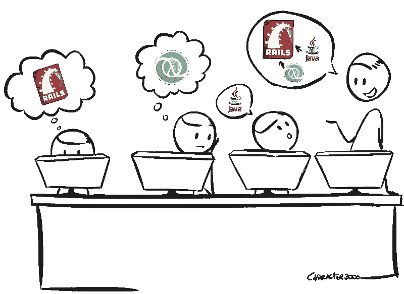

# 从 Rails 到 Clojure，再到 Java，再回到 Rails

> 原文：<https://medium.com/hackernoon/from-rails-to-clojure-then-to-java-then-back-to-rails-bd4b418f3cfb>

在过去的 6 年里，我一直在用 Rails、Clojure、 [Java](https://hackernoon.com/tagged/java) 和 back to Rails 开发 web 应用程序。这是对过去几年的概述，介绍了使用如此不同的技术堆栈的好处，以及它的缺点。

# 我从事的语言和项目概述

这是 Rails 2.3 中的一个大项目。这是典型的已经失控的 Rails。它有+1K 的端点，并使用了大量的宝石。由于依赖性，升级实际上是不可能的。在某种程度上，它有几个可维护性和性能问题，正如我们从快速上市方法中所期望的那样。

但是团队专注于扭转局面。我们开始遵循清洁建筑的指导方针。我们使用主持人、互动者和知识库。在某种程度上，我相信代码库的一部分实际上是令人愉快的，并且是正确构建的。错误和性能问题的数量大幅下降，我们对此感到自豪。但是我们只接触了应用程序的 40%。

在这一点上，我开始寻找其他工具。我去寻找更适合我想要的东西:生产率、代码质量和性能。

# Clojure

我有机会引导一个新产品，并且很幸运地在 Clojure 中这样做了。这是一个巨大的转变，走向一种新的[编程](https://hackernoon.com/tagged/programming)范式，一种拥有*外星*语法的语言。毫无疑问，Clojure 是我最喜欢的编程语言。我学到了很多，甚至今天我还在关注这个社区，因为那里有大量的创新。

我们实现了一个带有几个有界上下文服务的 web api。我们对数据库使用异步 HTTP 和异步通信，使服务器端到端完全异步。一切都很快，我们非常有效率，并且在不断地学习。

并非一切都很好。招聘是个问题。很难找到了解 Clojure 甚至愿意学习的人。从其他堆栈带来的人总是有一个大的斜坡。

但我对该产品的主要问题是业务没有扩大。在那里，我们有我们认为是好的架构和好的实现，但是它没有被测试。

所以我开始四处寻找。这次我想要一个大规模的项目。使用大数据，无论使用何种语言。

# Java 语言(一种计算机语言，尤用于创建网站)

我发现一家公司有大规模的项目，他们使用 Java。当时我并不在乎，我认为我将使用 Java entreprise-ish 工具，这将是来自两种动态语言的巨大冲击。但我愿意学习，公司也对我下了赌注。

幸运的是，Java 项目不是企业化的。他们非常精干，实际上与我以前工作过的建筑非常相似。他们有一个专门用于 HTTP 处理“控制器”和 JSON 序列化器的层。他们有一个专门用于业务逻辑等的层。使用 Java 8 实际上很好，因为我可以使用从 Clojure 学到的几个构造。

事实上，一切都更加严格。必须为所有概念定义 POJOs 是很麻烦的。但是我实际上并没有感觉到我在 Rails 和 Clojure 社区中多次听到的效率低下。我实际上速度很快，效率很高，而且我喜欢用 Java 8 编程。的确，它要冗长得多，但是一个好的 IDE 在这方面很有帮助。

有时我认为 Rails 社区实际上可以从 Java 社区学到很多东西。反之亦然。例如，在 Java 中，你花时间来定义你的模型并记录它们。Java 开发人员会以此为荣，并对我说:*“你的动态语言中没有这一点，你怎么能进行重构并知道一切正常呢？”*。

这是真的。我做了一些产品范围的重构。IDE 帮了很大的忙，当一切都编译好了(这并不总是容易完成的)，我实际上确信一切都没问题。

但有趣的是:对我来说,*很少需要对动态语言进行这种大规模的重构。虽然动态语言确实可以获得更多关于所用数据和模型的定义，但事实是，当你在这种环境下编程时，你构建的代码**更容易更改**。*

# Rails 4.2

现在我又在进行一个 Rails 项目，这次使用的是 Rails 4.2。几周之后，我有一种感觉:用 Rails 4.2 编程和用 Rails 2.3 编程是一样的。我不是说没有改进。我要说的是，从我的角度来看，从一个不太记得 Rails 2.3 旧日时光的人的角度来看，在 Rails 4.2 中编写 rest API 实际上感觉是一样的。

这让我想知道:如果我没有看到巨大的变化，为什么做升级这么难？为什么会有这么多突破性的变化？这与 Java 和 Clojure 的生态系统相冲突，它们非常注重向后兼容性。

我得到的另一件事是，新来的孩子不会喜欢 rails，这是更难雇用。现在酷孩子更喜欢 Go 或 Elixir，对 Rails 不以为然。老实说，我没想到会这样。

无论如何，我相信拥有一个好的团队和一个要解决的好问题是优秀编程的主要前提。我渴望对 Rails 进行测试，并尝试充分利用它。

# 那么，使用这么多种语言，我收获了什么？

在几个生态系统上工作真的让我大开眼界，让我考虑了几种做事的方法。这一切都是关于权衡，作为一名工程经理，我必须从能够审查任意堆栈中的代码中获益。我可能不是最好的低级审查者，但从我所学到的来看，我确实有很多可以提供的意见。

*   **来自 Ruby:** 专注于易于更改的软件，追求小功能和小类。让你的代码易于阅读和理解。关注强大的面向对象编程。让我们试着做默认情况下容易修改的代码。
*   考虑到容易和简单的区别。明确数据和改变数据的逻辑之间的区别。纯功能和有副作用功能的区分，尽量分开。我们试着默认做简单的代码。
*   **Java:** 性能，并发，严格。不要忘记您的日志记录和异常处理。让我们试着默认快速编码。

对于一个工程经理的职位，我相信这是必须的，我觉得我有更多的见解，因为所有这些不同的经验，我有。

# 缺点是什么？

掌握几种语言的确使我更加多才多艺。但也让我在某一门语言上变得不那么精通和熟练。高级工程师的工作对我来说比较复杂。几个月前，我确实申请了一个高级职位，虽然我为自己的挑战感到自豪，但公司选择不在我身上下注。但是经过考虑，我意识到我没有通过*“这是高级开发人员吗”*测试。

公司希望在特定语言方面经验丰富的开发人员具备某种特质、技能和知识。例如:

*   **Java** :日志记录和异常处理很重要，不要用原始字符串当常量，写好文档。熟悉 Java 中的并发性、Java 内存模型以及 GC 是如何工作的。
*   **Ruby/Rails** :了解内部 Rails 的细节，了解干净的架构，编写容易修改的代码。编写快速测试。
*   **clo jure:**clo jure 中的高级功能编程、高级并发编程:通道、传感器等…
*   **游戏编程**:矩阵乘法可能比`if`快。使用因缓存、线性代数而彼此靠近的内存块。

如果一家公司不想押注于一个经验丰富但会有上升空间的人，这是可以理解的。因此，如果你想换个领域或堆栈，我的建议是去找一个中级开发人员的角色。从后面开始，快速加速。

我记得我曾经是一名游戏程序员。我已经是一名经验丰富的开发人员，但我只是一名初级游戏程序员。我的代码中有一个关于物体旋转的 bug。一个队友刚刚给我指了一下，给了我解决的办法。但我就是没有*“大脑肌肉记忆”*来快速处理那些信息。

成为专家需要很多时间做同样的事情。没有捷径可走。

在一个项目中，我们需要几个层次的知识。虽然[学习语言很难](https://www.youtube.com/watch?v=6Oi8_eCaBGY)，但我们需要知道的东西还多得多。

*   了解所使用的语言
*   了解使用的构建工具(maven、npm、lein、bundle 等等)
*   了解所使用的数据存储库(postgres、mongo、elastic、cassandra 等等)
*   知道如何将项目投入生产，以及最佳配置是什么
*   了解项目的结构，在哪里以及如何实现
*   了解应用程序的业务逻辑

所以，语言只是一小部分。实际上，我认为工具和整个生态系统需要更多的时间来学习。

*原载于 2018 年 3 月 18 日*[*engineering-management . space*](https://engineering-management.space/post/from-rails-to-clojure-to-java-to-rails/)*。*