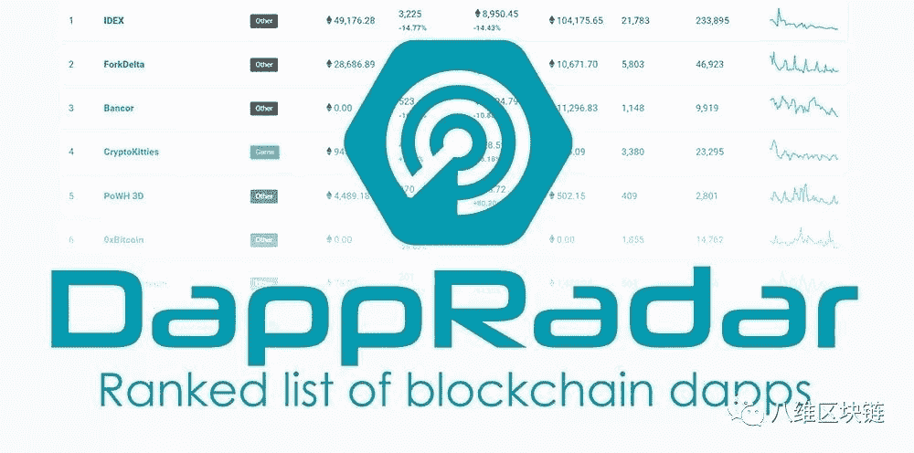

# 从研究到使用案例:8 Decimal Capital 如何战略性地构建其安全令牌景观

> 原文：<https://medium.com/hackernoon/from-research-to-use-case-how-8-decimal-capital-strategically-constructs-its-security-token-80bf2e4a257>

# [8 位十进制大写](https://medium.com/u/9e68686390f1?source=post_page-----80bf2e4a257--------------------------------)概述:

*   *数字代币的发展伴随着金融市场生态系统中的大量风险。但未来随着 RegTech 的发展，将会创建一个合规层来自动确保 KYC/反洗钱以及其他合规要求。然后，跨境监管协同效应将有可能出现。*
*   *虽然安全令牌行业目前仍处于萌芽阶段，但许多组织和公司正在讨论如何使用这项新技术。然而，通过早期投资，投资者可以帮助加速这一过程，并帮助该行业最大限度地发挥其潜力。*
*   *未来，金融代理和监管代理仍将存在。但该行业的基金将不仅提供资本，还会扮演更多角色。*

作者:魏冉

译者:钱佐伊

编辑:布莱恩·霍夫

[8 Decimal Capital](https://medium.com/u/9e68686390f1?source=post_page-----80bf2e4a257--------------------------------) 预测，资产的令牌化可能会促进加密货币和区块链技术的未来采用。随着这项新技术的发展，不同国家的法规将被编程为令牌，国家之间的监管协作也将出现。

这种数字化转型是 8 Decimal Capital 看好安全令牌空间并投资于不同细分市场以帮助行业发展的原因。

# 安全令牌的发展概述

证券的令牌化可能会在更多样化的资产类型中发生。其中一些资产包括股票和债券的混合物、股息权和非传统金融资产，如房地产和艺术品，这些资产过去很难交易。

数字代币的发展伴随着金融市场生态系统中的大量风险。这证明了为什么必须在协议层面建立更多的规则。但未来随着 RegTech 的发展，将会创建一个合规层，以自动确保 KYC/AML(了解您的客户/反洗钱)以及其他合规要求。然后，跨境监管协同效应将有可能出现。

在中国，典型的投资者熟悉公共基金、首次公开募股和股票。然而，他们不习惯，也从来没有机会投资于更大、更多样化的私募基金、私募股权、债务和另类投资市场。一旦市场对投资者的更多参与开放，那么贸易的流动性将为投资者提供更多分散投资组合的机会。

一些人可能会认为，强制要求每个投资者都参与 KYC 进程，并且只要求合格的投资者参与游戏，最初会提高参与的门槛，进而降低加密货币的流动性。8 Decimal Capital 会辩称事实并非如此。

美国私募股权市场的规模是公开市场的 22 倍。通过更加合规和包括更多的机构投资者，加密货币市场正在成为一个不断扩大的市场，而不是一个不断萎缩的市场。

*As PwC and Securitize highlight in the graph above, private funding (in billions) is 22x larger for private offerings than IPOs.*

虽然安全令牌行业目前仍处于萌芽阶段，但许多组织和公司正在讨论如何使用这项新技术。然而，通过早期投资，8 Decimal 可以加速这一过程，并帮助该行业最大限度地发挥其潜力。

# 安全令牌提供流程和主要平台

安全令牌行业包括分销平台和评级机构、支付平台和稳定货币、交易所、KYC、咨询服务公司和流动性提供商等。最重要的参与者是项目、分销平台和 st 交易所。

在 8 Decimal Capital，我们认为一个成功的安全令牌发行(STO)需要一个合法的公司推出一个合规的安全令牌，它将由列入白名单的投资者在合规的交易所进行交易。

# 行业细分

## 发行人

*   发行平台
*   投资银行
*   跟踪支出和收入的智能合同
*   支付平台和稳定币

## 投资

*   交换
*   KYC/反洗钱
*   治理平台
*   SaaS(软件即服务)平台允许投资者投票
*   帮助制定公司章程

## 代理

*   保管人
*   流动性提供者
*   媒体/公关机构
*   评级机构
*   合规、法律和会计
*   信息平台
*   管理控制台

从预 STO 到发布(release)再到生命周期管理(全过程管理)，我们正在寻找交付所需服务的最佳项目，并对它们进行投资。

# 超越资本

# 1.)法律—与 Tackett Bartlett 合作

监管推动本地和全球的创新。在全球市场中，出现了各种各样的“区块链友好”国家，它们以政府鼓励区块链和加密货币而自豪，而其他“区块链不友好”国家则有更多的规定，要求公司和项目在接触公众之前必须通过。例如，美国有豁免 Reg D、Reg A+、Reg S，新加坡 MAS 也有类似的法规，需要专门的努力来保持合规性。希望进行 STO 的中国公司可能需要建立 VIE 架构。

Under Section 5 of the Securities Act of 1933, all offers and sales of securities must be registered with the U.S. Securities and Exchange Commission or qualify for an exemption: Regulation D, Regulation A+, Regulation S, and Regulation CF.

在法律服务方面，8 Decimal Capital 正在与一些公司合作，如在加密货币领域经验丰富的 Tackett Bartlett LLP 公司。例如，伯克利市副市长本·巴特利特是 8 Decimal Capital 的顾问。他也是区块链领域的坚定支持者和加密市政债券概念的倡导者。

[*Ben Bartlett*](/@benbartlett)*, Berkeley’s Vice Mayor and an Investment Partner at Octavia Capital, believes in the future of blockchain and the concept of Crypto Municipal Bonds.*

Ben Bartlett 和 Shane Tackett 共同创立了 Tackett Bartlett LLP 公司，该公司由五个服务模块组成:代币设计、全球税收、投资基金、公司结构和法规遵从性。

For more information: [http://www.tackettbartlett.com/](http://www.tackettbartlett.com/)

# 2.)投资证券化、发行平台

说到安全令牌发行平台，8 Decimal 是证券化的有力支持者。

For more information: Medium: [https://medium.com/@securitize](/@securitize) | LinkedIn: [https://www.linkedin.com/company/securitize/](https://www.linkedin.com/company/securitize/) | Twitter: [https://twitter.com/securitize_io](https://twitter.com/securitize_io)

在未来，RegTech 必须是人工、法律和技术标准的结合。证券化平台将为创建实物资产的安全令牌提供标准化的模板和流程。

从技术角度来看，ERC20 令牌是可替换的。传统金融行业有各种证券包括偏股型和 ABS 型(资产支持证券)。这些证券是不可替代的。需要区分可替换令牌和不可替换令牌之间的特征。例子包括用于 Polymath 平台的 ST20 标准、用于 Swarm 的 SRC20 标准、用于 Harbor 的 R-token 标准、用于 Ethereum 社区的 ERC-1400/ERC，以及 1410 标准和 ERC-1404 标准。

现有的保险平台有[博学者](https://medium.com/u/bdf13a23d3e9?source=post_page-----80bf2e4a257--------------------------------)、[港湾](https://medium.com/u/3d4192241ca8?source=post_page-----80bf2e4a257--------------------------------)、证券化( [Securitize.io](https://medium.com/u/4181e01aabf0?source=post_page-----80bf2e4a257--------------------------------) )、 [Swarm](https://medium.com/u/7f2d4f2c58d?source=post_page-----80bf2e4a257--------------------------------) 等。8 Decimal 投资证券化( [Securitize.io](https://medium.com/u/4181e01aabf0?source=post_page-----80bf2e4a257--------------------------------) )的决定很大程度上是基于其成功发行项目的惊人记录。还有， [SPiCE VC](https://medium.com/u/a23443abbc57?source=post_page-----80bf2e4a257--------------------------------) 、[区块链资本](https://medium.com/u/9737c5ab2ab1?source=post_page-----80bf2e4a257--------------------------------)、22x ( [22xFund](https://medium.com/u/b88e66546294?source=post_page-----80bf2e4a257--------------------------------) )都是使用了证券化平台的数字证券发行商，都验证了证券化的成功。

# 3.)交易平台:OpenFinance

准备进入 STO 市场的交易所可以分为两类:(1)加密货币交易所；以及(2)传统的股票市场交易。

*The above graph includes a portion of Coinbase’s current licenses. For more information and to see the full chart, check out:* [*https://www.coinbase.com/legal/licenses?locale=en-US*](https://www.coinbase.com/legal/licenses?locale=en-US)

[比特币基地](https://medium.com/u/913e7ed84452?source=post_page-----80bf2e4a257--------------------------------) ( [比特币基地](https://medium.com/u/b9034df3e57a?source=post_page-----80bf2e4a257--------------------------------))是潜入 st 市场的增长最快的加密交易所之一。比特币基地从去年开始成功收购了一系列持牌金融机构，目前拥有 BD、RIA、ATS 等多个牌照。与此同时，tZERO 和 Templum ( [Templum 博客](https://medium.com/u/365d10558f67?source=post_page-----80bf2e4a257--------------------------------))正在从零开始。

另一方面，传统交易所也在寻找切入加密货币领域的方法，包括伦敦证券交易所和纳斯达克等大型参与者。但 8 Decimal 认为，一些政策弹性较强的国家，如马耳他和直布罗陀，可能更倾向于向安全令牌交易所发放合规许可证。

STO 需要的牌照主要有:ATS/ATLS(另类交易系统牌照)、RIA(注册投资顾问牌照)、BD(经纪商-交易商牌照)、RAE(清算和交易执行牌照)。

总体而言，现有的加密货币交易所更熟悉加密交易，但它们往往没有必要的许可证，而传统交易所则相反。

二级市场的私募股权交易早已存在。Equidate、 [EquityZen](https://medium.com/u/319f18c9c666?source=post_page-----80bf2e4a257--------------------------------) 和 SecondMarket、LP 兴趣交易平台等平台正在使股权交易更加灵活顺畅。他们正在解决的主要难题是私人公司股权和其他替代资产的流动性。他们正致力于为此类另类资产提供一个更透明、覆盖面更广的在线交易和托管平台。

在交易平台方面，知名项目有 [OpenFinance](https://medium.com/u/7e954409a5ac?source=post_page-----80bf2e4a257--------------------------------) 、 [tZERO](https://www.tzero.com/) 、 [Templum](https://templuminc.com/) 、[直布罗陀区块链交易所](https://gbx.gi/) ( [GBX](https://medium.com/u/63cf764914ea?source=post_page-----80bf2e4a257--------------------------------) )

我们选择投资 [OpenFinance](https://medium.com/u/7e954409a5ac?source=post_page-----80bf2e4a257--------------------------------) 。

OpenFinance 成立于 2014 年，旨在提供交易和清算结算服务。OpenFinance 首席执行官 Juan M. Hernandez 拥有西北大学的计算机科学学位和凯洛格商学院的 MBA 学位，并拥有多年的金融交易经验。OpenFinance 已经有多个 sto 在筹备中，比如 SPiCE VC (SPiCE)。它可用于法规 D、S、A+或 CF 豁免，也可以在 ATS(替代交易系统)上交易。此外，OpenFinance 与火币也达成了深度战略合作。

*For more information: Medium:* [*https://medium.com/@openfinance*](/@openfinance) *| Twitter:* [*https://twitter.com/OpenFinanceIO*](https://twitter.com/OpenFinanceIO) *| Website:* [*https://openfinance.io/*](https://openfinance.io/)

# 4.)对生态系统的投资

信息平台方面，8 Decimal 投资了 DappRadar，正在孵化 STO.review。

*For more information: Medium:* [*https://medium.com/dappradar-com*](https://medium.com/dappradar-com) *| Twitter:* [*https://twitter.com/dappradar*](https://twitter.com/dappradar) *| Website:* [*https://dappradar.com/app/676/fomo3d*](https://dappradar.com/app/676/fomo3d)

在流动性提供者方面，8 Decimal 投资了 [AirSwap Ltd](https://medium.com/u/87864c241afc?source=post_page-----80bf2e4a257--------------------------------) ( [AirSwap 团队](https://medium.com/u/b501917dd00d?source=post_page-----80bf2e4a257--------------------------------))。

*For More Information: Medium:* [*https://medium.com/@airswap*](/@airswap) *| Twitter:* [*https://twitter.com/airswap*](https://twitter.com/airswap) *| Website:* [*https://www.airswap.io/*](https://www.airswap.io/)

# 走向未来:

过去，人们购买股票和签署合同是基于纸质文件并手工签署的。现在有了 DocuSign 的电子签名工具，美国的电子签名开始拥有法律优先权。未来的趋势是进一步发展和数字化信息匹配、签约和交易的过程。

例如，允许多个见证人(改变公证人的模型)、链上数据不可修改以及合规标准(如 KYC/反洗钱/合格投资者认证标准)转变为合同层。

**法典就是法律。**要做到这一点，需要线上线下的协作，以及法规和技术的融合。

8 Decimal 还认为，在未来，金融代理人和监管代理人仍将存在。但该行业的基金将提供的不仅仅是资本，它们还将扮演更多的角色。

> 8 十进资本:塑造区块链未来
> 
> [中型](/@8DecimalCapital)|[LinkedIn](https://www.linkedin.com/company/8-decimal-capital/)|[Twitter](https://twitter.com/8decimal)|[脸书](https://www.facebook.com/8Decimal/) | [网站](http://www.8dcapital.com/)
> 
> 电子邮件:contact@8dcapital.com，如果你对这个话题还有任何问题。

*8 DECIMAL CAPITAL is a multi-strategy investment firm focusing on token and equity investments. 8 Decimal currently has more than 40 portfolio companies with an AUM of 60M USD. The investment team consists of more than 10 venture capital veterans, researchers, and trading professionals. The advisory board comprises Fan Zhang (Former Founding Partner of Sequoia Capital China), Karen Chen (Former CEO of UBS China) and Ben Bartlett (Vice Mayor of Berkeley). Based on the professional fund index ranking agency* [*Token Metrics*](https://medium.com/u/80a0e0807b05?source=post_page-----80bf2e4a257--------------------------------)*, 8 Decimal was ranked second out of the 51 active crypto funds. 8 Decimal is also well-received in China, named one of the top 10 funds in the blockchain industry by both* [*36 氪（36Kr.com）*](https://medium.com/u/ae3950e4f2fc?source=post_page-----80bf2e4a257--------------------------------)*,* [*Chain Capture*](https://medium.com/u/ac4da81bc060?source=post_page-----80bf2e4a257--------------------------------) *, and* [*Odaily*](https://medium.com/u/9c30cbe2074f?source=post_page-----80bf2e4a257--------------------------------)*, as well as named one of the top 20 funds by Tsinghua X-Lab and Youth Education Chain League.*