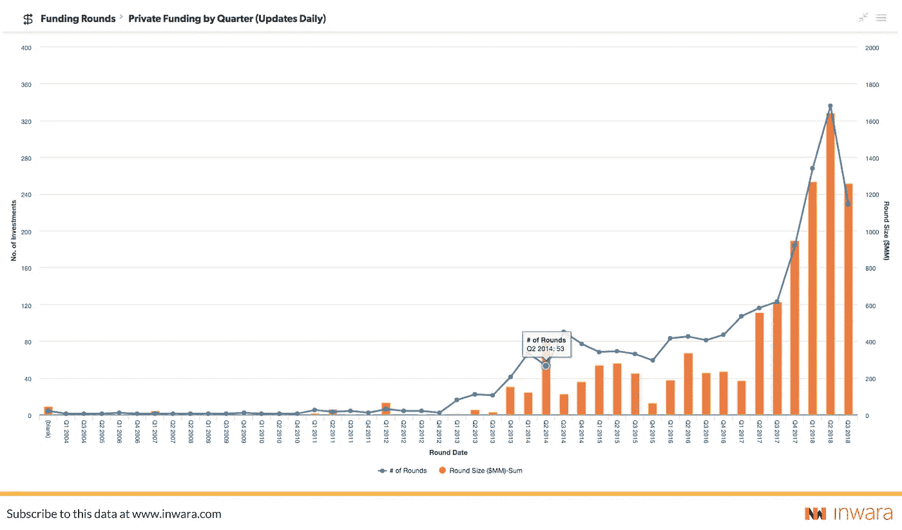

# 风险投资家拯救区块链公司& ICOs

> 原文：<https://medium.com/hackernoon/from-shipwreck-to-new-life-venture-capitalists-save-the-day-for-blockchain-companies-icos-d6fdb1463918>

## 从沉船到新生:

在 2018 年的第一个周末，加密市场达到历史最高水平，24 小时内交易的加密货币超过 600 亿美元，总市值超过 8300 亿美元。在接下来的一个月里，整个市场见证了自由落体式的下跌——暴跌 65.37%，总市值仅为 2770 亿美元。

对于怀疑者来说，这一调整是一个关键的机会，可以让他们齐心协力，质疑加密货币资产的价值。这种努力可以在大多数新闻网站上看到，形式是关于 ico 和加密货币的假新闻。

# 每一个动作都有不稳定的反应

这是一个折线图，有 4 条垂直线将市场分为 2018 年 7 月 1 日至 9 月 30 日之间的 4 个不同时间。该图描绘了顶级 ico 的 ROI。

每条线(A、B、C、D)都被仔细地放置，以映射可能已经影响了市场的看跌或看涨情绪的特定新闻或事件。

Graph showing the price variation (source: InWara)

## a)熊信号

在这里，我们看到价格在长达两周的牛市后迅速下跌。这是一个由于几个大人物的影响力而导致情绪转变的例子。

1.  一个著名的比特币 ETF 被拒绝。
2.  一份研究不充分的报告指出，从 2017 年第四季度到 2018 年 Q1，ICO 资金有所下降。

这使得怀疑论者一窝蜂地传播错误的主张和夸大的报道，从而滋生恐惧、不确定性和怀疑(FUD)。

## b)稳定的攀登

空气中弥漫着一种明显的自信感。价格稳步上涨。

## C) Reddit 调查像病毒一样传播

Reddit 的一项调查发现，一个与 111，114 BTC 的原始丝绸之路相关的钱包最近开始移动其持有的物品，这是自 2014 年以来的第一次。其中，约 11，114 个 BTC 被转移到 Bitfinex，4，421 个 BTC 被转移到币安。

Business Insider 散布的所谓假新闻称，高盛(Goldman Sachs)放弃了加密货币交易计划。

## D) BitMEX 中断

就在几个小时前，一个看似被操纵的泵使总市值增加了 120 亿美元。比特币在 2018 年 9 月 21 日飙升至 6800 美元的峰值，当时 BitMEX 出现临时停电，导致交易量异常。

此外，谷歌宣布将结束对加密货币广告的全面禁令。

# 快进到今天

随着加密的典型代表比特币在 5900 美元的坚实支撑下建立了底部，市场信心再次增强。

# ICO 热潮

在北美，美国的 ICO 轮数最多，共有约 150 轮。英国是欧洲 ico 数量最多的国家，共有 93 个。

金融服务、技术和游戏仍然是最受欢迎的投资行业。

# ICOs 真的在劫难逃吗？

贸易放缓是事实，但这是否意味着市场在劫难逃？

所有 ico 的指数化 ROI 图表明，在 2018 年 5 月至 6 月期间，300+ico 以正 delta 结束了 Q2。

尽管 ICO 市场似乎一直处于下降趋势，但如果一个人买入了正确的 ICO，他就可以获得 5X 10 倍的利润。第一季度的 ICO 融资额为 63 亿美元，超过了 2017 年的总额，这一数字可能会破坏这种经常被提及的融资方式将很快消亡的普遍印象。

相反，Cryptos 在 2018 年有所增长。只有贸易和众筹在某些情况下显得很低，然而，风险投资显著增加。

此外，在 ico 和区块链创业公司的世界里，并购变得非常普遍。

Mergers and Acquisitions by Buyer Industry

大多数研究报告声称市场正在萎缩和不成熟的原因是， ***的统计数据既不代表私人投资，也不代表并购*** 活动。

私人投资难以衡量，因为它们是在一定程度上保密的情况下进行的。需要采取广泛的措施来获取这些信息。InWara 通过分析 3000 多份 ICO 白皮书、近 2200 篇官方公司博客文章、500 篇官方新闻稿以及对新闻和社交媒体来源的持续网络监控来实现这一目标。

in wara[总监 Sushrut Gaikwad](http://www.inwara.com/?utm_source=hackernoon&utm_medium=hackernoon&utm_campaign=hackernoon) 回应以下问题说:

## 问:你如何定义新兴市场中涉及加密货币的当前趋势？

> “尽管 2018 年增速放缓，但未来似乎很乐观。真正需要做的只是从图表上退一步，接受一次关于潜在基本面的教育，以认识到数字资产被无故击败。”

Blockchain composition country wise

## 问:从公共基金到私人/风险投资基金的转变似乎很明显。你认为这是为什么？

> 自 2018 年 Q1 加密市场调整以来，“普通人”已经对 ico 变得谨慎，然而，风险投资基金和私人投资者一直在不停地向这个领域注入资本。这可能是因为进入市场的大玩家越来越有信心，并且理解了 Crypto 臭名昭著的高波动性背后的幂律动力学。”

## 问:说到区块链技术带来的颠覆，哪个行业看起来最有前景？

> “当我们比较来自区块链初创公司的许多使用案例时，我们可以看到金融服务业仍然是新兴创新和投资资本的主要焦点。这反映了“先行者”优势的重要性——这是谁先设立标杆的一个竞争因素。”

# 密码的未来

2018 年向世界推出了 crypto。区块链涉及的币、ico、钱、行业比以往任何时候都多。

**方法论**

[InWara](http://www.inwara.com/?utm_source=hackernoon&utm_medium=hackernoon&utm_campaign=hackernoon) 研究团队确保高质量和准确的研究，由质量控制人员和高技能分析师组成的团队进行详尽的分析。研究团队努力只发布尽可能准确的信息，因此所有信息都是在事实基础上仔细考虑的，数据是通过分析 3000 多份 ICO 白皮书、近 2200 篇官方公司博客文章、500 篇官方新闻稿以及对新闻和社交媒体来源的持续网络监控收集的。

“我们的客户使用我们的数据分析引擎来寻找数据和独特的见解，以帮助他们在市场上买卖加密产品。我们在本报告中使用了数据分析工具来分析后面列出的每个 ICO 的投资回报率。按行业或国家过滤数据需要 10 秒钟。

" [InWara](http://www.inwara.com/?utm_source=hackernoon&utm_medium=hackernoon&utm_campaign=hackernoon) 帮助您发现所需信息，为您未来的 ICO 投资做出无风险选择。订阅 [InWara 的](http://www.inwara.com/?utm_source=hackernoon&utm_medium=hackernoon&utm_campaign=hackernoon)市场情报工具，帮助您做出投资决策。”

访问 [InWara 网站](http://www.inwara.com/?utm_source=hackernoon&utm_medium=hackernoon&utm_campaign=hackernoon)查看完整的 2018 年第三季度报告。