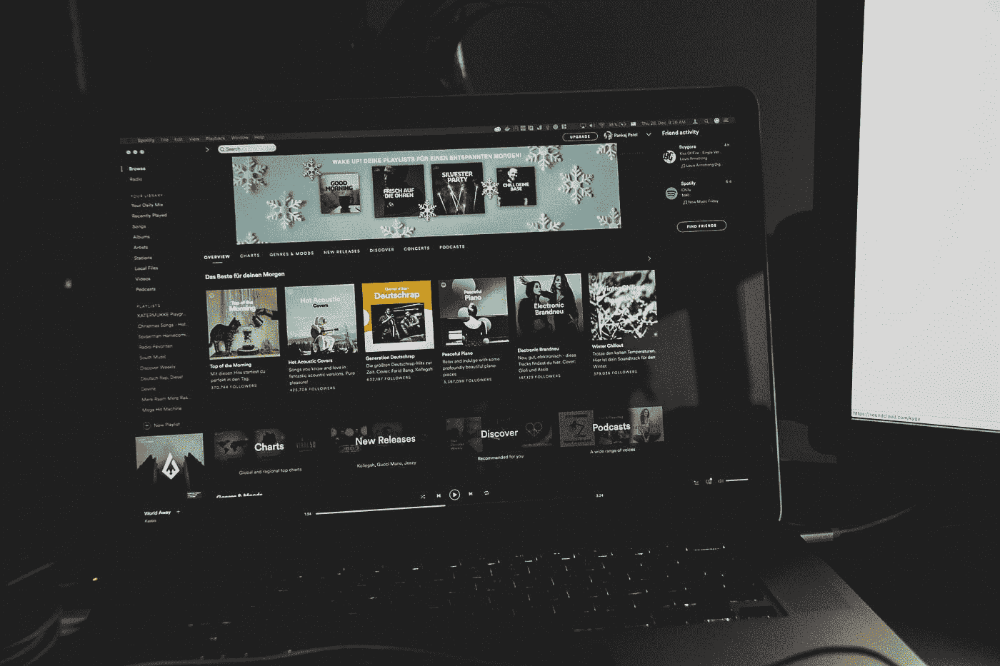

# 从辅助项目到完成的应用程序

> 原文：<https://medium.com/hackernoon/from-side-project-to-finished-app-2cd19de1d658>

Photo by [Pankaj Patel](https://unsplash.com/@pankajpatel?utm_source=medium&utm_medium=referral) on [Unsplash](https://unsplash.com?utm_source=medium&utm_medium=referral)

# **将一个想法变成一个项目，再变成一个完成的 app**

每个开发人员都应该试着花些时间在副业项目上，要么提高他的开发技能，要么满足他对创造力的渴望。有一份全职工作可能很难，但是这个兼职项目的美妙之处在于你可以按照自己的节奏来完成它。第一步是找到一个你想去做的想法。它可以是任何东西，但如果它是与你自己的兴趣相近的东西，它将对最终到来的拖延有很大帮助。
此外，记住在开发过程中尝试新技术，因为这将有助于你推进你的职业生涯，同时也让它保持有趣直到结束。

当你有了最初的想法，下一个艰难的步骤是实际开始工作。即使你真的开始了这个过程(对大多数想法来说你不会),也有很大的可能你会很快放弃这个项目。但是，会有一些值得追求的想法，并在尝试完成它们的过程中获得乐趣。其中一个想法是食谱应用程序。

## 来自日常使用的想法

我在寻找一个兼职项目，但我开始做的任何事情都很快被放弃，要么是因为失去兴趣，要么是因为纯粹的懒惰。我的一些想法要么太复杂，要么需要大量的工作(不容易独自完成)。我试图找到一些与我的日常工作相关的东西。我最大的兴趣之一是音乐，所以我试着找一些相关的东西。我也是 Spotify 的常客，所以当我在网上搜索并发现他们有一个 API 来处理他们的数据时，我立即开始研究它，以得出一个应用程序的计划。

Photo by [Aaron Burden](https://unsplash.com/@aaronburden?utm_source=medium&utm_medium=referral) on [Unsplash](https://unsplash.com?utm_source=medium&utm_medium=referral)

> 不要害怕写下你的想法，这很有帮助。

在对 Spotify 伟大而 ***确实*** 有据可查的 API 进行了一些研究后，我想到了一个想法的根源，那就是一个将帮助用户根据他们喜欢的艺术家创建播放列表和发现新音乐的应用程序。之后我做的就是在网上寻找类似的项目，从中汲取灵感，并寻找新的东西来补充。有一些应用程序非常接近我最初的设想，还有一些最终提供了一些高质量的想法。值得注意的是，最重要的是:

1.音乐地图(Music-Map)是一个网络应用程序，它根据用户最喜欢的乐队来查找用户可能喜欢的乐队。这是一个更大的发现系统的一部分，该系统被称为 [Gnod](http://www.gnod.com/) 或全球发现网络。
2。 [everynoise](http://everynoise.com) 是一个伟大的项目，它跟踪并分析来自 Spotify 的数据，以生成所有音乐流派的散点图。
3。 [playlists](http://playlists.net) 是一款非常知名的应用，它根据用户提供的单个艺术家/团体在 Spotify 上生成播放列表。您还可以搜索和收听其他人的播放列表。
4。 [Musicroamer](http://www.musicroamer.com) 是一个 web 应用程序，它可以可视化你喜欢的艺术家之间的关系，使用 last.fm 的数据，从用户提供的单个团体/艺术家开始生成一个图表。

所有上述项目都给了我灵感，帮助我微调我的想法，创造出一些类似但又独特的东西。这个想法的关键区别在于，用户将创建一个艺术家列表，从他提供的一个开始，然后是与该艺术家及其后续选择相关的列表。这个列表将作为播放列表的“配方”,因为他和其他用户以后将能够用这些艺术家的随机曲目创建播放列表。此外，关于艺术家选择的信息以及播放列表的曲目将被相应地可视化。就这样，构建食谱的旅程开始了(明白了吗？因为它创造了“食谱”……哈)。

## 应用程序开发

接下来，你必须选择你想使用的堆栈。在前端部分，我在选择 React(我只玩过一些教程/小项目)还是 Angular(这是我工作中的主要框架)之间争论不休，最终我选择了 Angular，因为我想测试 Teradata 的共价 UI 平台。在后端部分，我尝试了一个 Spring-Boot 应用程序的想法，但最终我使用了一个 NodeJS 和 Express Framework，因为它更适合应用程序的需求。至于数据库，我选择了安全的 MongoDB。

我开始实现我的后端服务，创建简单的端点，我知道这些端点以后会转化为实际的应用程序功能。这里可以提出的另一个有用的观点是，你不必从头开始做任何事情。搜索和重用别人已经创建的东西，并尝试在它们的基础上进行构建。在那一点上，一个非常好的 NodeJS 包装器给了 Spotify 的 API 很大的帮助，这个包装器来自 [thelinmichael](https://github.com/thelinmichael/spotify-web-api-node) 。使用它，我开始创建搜索艺术家的端点，然后获取相关的艺术家，然后获取特定艺术家的音轨等等。一旦我用端点编写了非常基本的逻辑，我知道我可以开始实现一个简单的附带 UI。

应用程序的 UI 部分是一个常规的 Angular 6 应用程序，但正如我所说，我想使用共价 UI 平台。该应用程序的第一次迭代完全建立在共价的用户界面风格上，但结果并不完全符合我的喜好。虽然我可以方便地使用共价平台的所有强大组件，但它的美学太像一个仪表板，而不是一个应用程序。虽然我坚持了最初的决定一段时间，但最终，我删除了大部分共价，并继续将一个漂亮的 HTML5+CSS3 主题从 [html5up](https://html5up.net/) 转换成有角度的代码。此外，我希望能够创建一些可视化效果，丰富我可以从 Spotify 的端点获得的数据。为此，我选择了强大的 [Echarts](https://ecomfe.github.io/echarts-doc/public/en/index.html) 库，用它我可以为应用程序构建漂亮的图表。

Photo by [Artem Sapegin](https://unsplash.com/@sapegin?utm_source=medium&utm_medium=referral) on [Unsplash](https://unsplash.com?utm_source=medium&utm_medium=referral)

> 咖啡，开发商的真正力量

开发继续完成这个想法的核心功能。所需的步骤可以总结如下:

1.  用户应该能够输入和搜索艺术家
2.  所搜索的艺术家的相关艺术家将可供选择
3.  每个后续选择将触发对相关艺术家的新请求(用新的/唯一的艺术家填充初始列表)
4.  从选定的艺术家中创建一个流行歌曲库，并随机选取其中的一个子集。
5.  如果用户希望将生成的播放列表保存到他的 Spotify，请通过登录 Spotify 并获得所需的访问令牌来授权他。
6.  在用户的个人资料上创建播放列表，并添加所需的曲目。
7.  在 MongoDB 上保存创建的食谱和结果播放列表。

在最初几轮开发之后，也出现了其他想法，比如:

1.  响应缓存([节点缓存](https://www.npmjs.com/package/node-cache)是一个非常强大的库)。
2.  在 MongoDB 上为创建的播放列表存储 track 的功能，这样用户不用登录就可以看到 recipe 的图表。
3.  存储和重新使用用户的刷新令牌，而不是每次都需要登录
4.  基于流派的标签过滤。

利用 [Unsplash 的](https://unsplash.com) API(以及他们自己的 unsplash-js 库)下载一个随机图片，设置为 playlist 的封面。

## 应用部署

当以上所有工作完成后，我对结果非常满意，我决定冻结新特性，继续部署应用程序。我在网上搜索了一下，看看我有哪些服务 NodeJS 应用程序的选择，尽管在开发期间我尝试了 Heroku，但最终我选择了 Google Cloud，它提供了一个很棒的免费试用，如果你在第一年花费 300 美元，至少对于我想运行的测试来说是足够的。最重要的是，由于我以前有 AWS 基础设施的经验，我也想检查一下谷歌云，因为我对谷歌 AppEngine 的经验有限。从那时起，我开始研究 Docker 和 Kubernetes，在这方面我所知甚少，过了一段时间，我可以构建我的应用程序的 Docker 映像，将其上传到 Google 的容器注册表，并通过 Kubernetes 使用 gcloud cli 工具将其部署到一个集群中。

Photo by [Guillaume Bolduc](https://unsplash.com/@guibolduc?utm_source=medium&utm_medium=referral) on [Unsplash](https://unsplash.com?utm_source=medium&utm_medium=referral)

> 不是那种容器

最后一步是使应用程序真正公开。所以，我去了 [GoDaddy](https://www.godaddy.com/) 买了一个全新的。app 领域又经过一番挣扎(。应用程序域强制执行 https，这是我起初不知道的，导致了一些奇怪的情况)[食谱](https://cooklist.app)已经建立并运行，任何人都可以查看和使用。

## 未来的改进

有更多的想法和功能可以纳入这个项目。对于 21 世纪的网络应用来说，最明显也是最缺少的是社交整合，比如 facebook 分享等。除此之外，核心机制的下一个重要特性是能够(根据带有特定选项标志的用户请求)混合您没有选择但您很可能会喜欢的艺术家/团体的曲目。另一个是能够找到相关的食谱(根据你选择的艺术家)，也能够过滤艺术家的食谱，就像你现在可以根据流派。一些其他形式的可视化或使用轨迹特征数据的其他方式可能也是一个好主意。最后但同样重要的是，这个应用程序也可以成为移动应用程序，可以使用 NativeScript 这样的框架，也可以为 Android 和 iPhone 从头开始构建。

## 总结

Photo by [Namroud Gorguis](https://unsplash.com/@namroud?utm_source=medium&utm_medium=referral) on [Unsplash](https://unsplash.com?utm_source=medium&utm_medium=referral)

> 唯一真正的播放列表

根据 Github 的提交历史记录，所有这些工作花了我将近 2 个月的时间，尽管大部分时间我在工作日完成了有限的工作，因为我的大部分提交是在周末。在那段时间里，我学会了使用一个新的 UI 平台，进一步发展了我在 NodeJS 和 MongoDB 上的技能，熟悉并学会了使用 Docker 和 Kubernetes 的基本功能以及谷歌云基础设施。最重要的是，最终，我的工作被具体化为一个可用的应用程序，对此我非常高兴，我看到自己回到这个应用程序，并根据我的想法或用户的要求实现更多的东西。所以，我强烈建议每个人都这样做。选择你的下一个副业，自己或和朋友一起开始，开发特色，学习新东西，最重要的是，从中获得乐趣。如果以上都有了，那么你将从这个过程中受益匪浅，如果你到达了终点，那么你也将有所作为，任何人都可以看到。