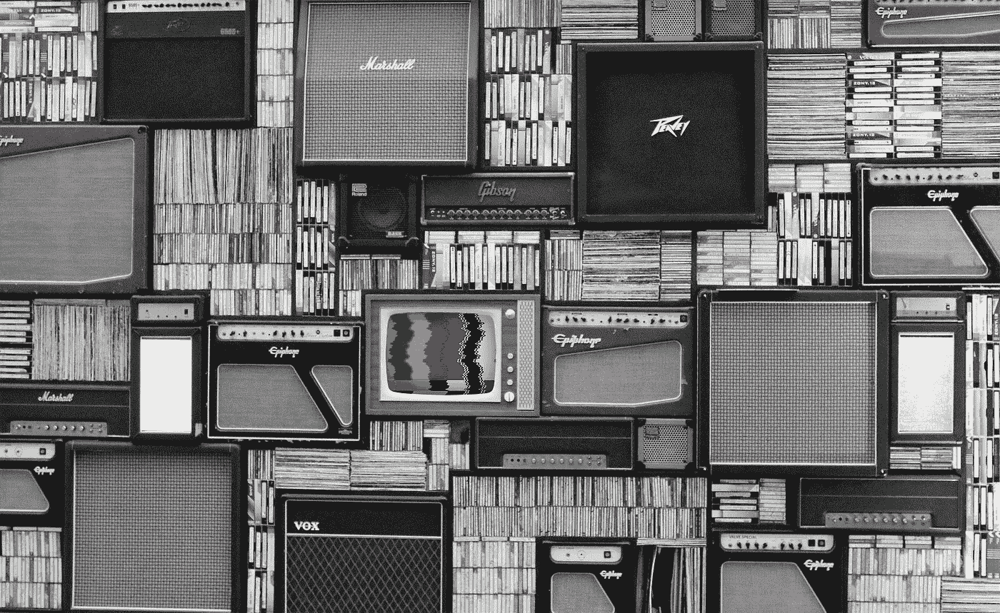

# 从挣扎到拥抱——电视的技术难题

> 原文：<https://medium.com/hackernoon/from-struggle-to-embrace-tvs-technological-conundrum-bdb70cabcf9>

电视无疑是有史以来最受欢迎的大众传媒形式之一。虽然电视机*设置*可以有静电，但电视机本身远非静电。媒体自诞生以来已经发生了很大的变化，而且在不久的将来还会发生更大的变化。

# 电视的演变

早在 1948 年，只有十分之一的美国人见过电视机。此后不久，电视的受欢迎程度激增。1960 年，7000 万美国观众收看了参议员约翰·肯尼迪和副总统理查德·尼克松的首次电视总统辩论。电视的渗透在继续。到 20 世纪 80 年代末，几乎 5300 万美国家庭订购了有线电视，而有线电视网络的数量从 1980 年的 28 个增加到 1989 年的 79 个。在随后的十年中，国家有线电视网络的数量激增至 171 个，到 1999 年底，大约十分之七拥有电视的家庭(超过 6500 万)是有线电视用户。

这一增长趋势持续到 2010 年，但随后出现逆转。尼尔森 2013 年的一项研究发现，****自 2011 年以来，拥有电视的美国家庭数量一直在下降，因为越来越多的人开始“割线”，从传统的有线电视公司转向通过手机或通过网飞、亚马逊 Prime、Hulu 等流媒体服务在线观看视频。来自 [TDG](http://www.fiercecable.com/cable/u-s-broadband-homes-without-pay-tv-have-more-than-doubled-since-2011-now-stands-at-22-report) 和[风头网络](http://img03.en25.com/Web/LLNW/%7b98ebce45-c538-42d0-b025-7cdec7092634%7d_2016SOOV.pdf?ls=SOOV16PR)的最新报告也表明，越来越多的消费者正在切断线缆，转向 OTT &视频流媒体服务。在 1 亿宽带用户中，约有 22%没有付费电视服务。拥有至少一个 OTT 流媒体视频订阅的消费者数量增长了 15%。一些消费者甚至愿意为不止一个流媒体视频服务付费。显然，越来越多的人正在从传统的电视服务转向新的服务，创造了一个令人兴奋的行业时代，并在内容交付方面带来了巨大的变化和创新。****

****网飞和 Hulu 等在线流媒体服务极大地改变了美国人的媒体消费习惯，尤其是年轻人。事实上，皮尤研究中心(Pew Research Center)最近进行的一项研究表明，18 岁至 29 岁的人群中，61%的人表示，他们观看电视节目的主要方式是通过互联网上的流媒体服务。尽管主要通过流媒体服务观看电视的美国成年人的整体比例相当低(28%)，但这些数字清楚地表明了一个巨大的世代转变，即从传统电视转向以算法为基础的以用户为中心的服务，提供精心策划的个性化观看体验。****

# ****传统广播公司正在过时吗？****

****长期以来，传统广播公司一直将 OTT 视为一种威胁，因此在提供类似服务方面行动迟缓。然而现在，似乎坚冰已经打破，广播电视的格局即将改变。最近的一个重大进展是[迪士尼宣布](https://www.forbes.com/sites/natalierobehmed/2017/08/08/disney-to-end-distribution-agreement-with-netflix-as-it-prepares-own-streaming-service/)将切断与网飞的分销协议，支持在 2019 年推出自己的流媒体服务。随着[官方证实](http://variety.com/2017/biz/news/disney-fox-merger-deal-52-4-billion-merger-1202631242/)迪士尼正在收购 21 世纪福克斯的一些核心娱乐资产，包括福克斯电影和电视工作室，迪士尼将越来越有能力用自己的电视作品填充这一流媒体服务，为自己的 OTT 用户提供独家内容。****

****迪士尼-福克斯的大规模交易表明，传统玩家并没有退出游戏。通过一系列收购和整合，电视、电影娱乐和视频价值链各部分的参与者正在寻求多元化，并参与价值链的其他部分(从内容创作到发行)，试图获得新的受众和收入流。向原创内容制作的战略转移和更广泛地采用直接面向消费者的产品，为广播公司提供了拥有消费者关系和进入新市场而不完全依赖第三方的机会。随着消费者行为的演变，这些策略将需要继续动态演变，这似乎是必然的。事实上，爱立信最近的一份报告预测，到 2020 年，只有 10%的人仍将只在传统屏幕上看电视。****

# ****美丽新世界****

****广播行业正从 SDI 工作流转向基于 IP 的工作流。很大程度上取决于这一重要的技术转变，这一转变既创造了机遇，也带来了风险(包括落后的风险)。例如，美国康卡斯特[宣布了其区块链洞察平台](https://corporate.comcast.com/news-information/news-feed/comcasts-advanced-advertising-group-and-participants-announce-plans-for-blockchain-based-technology-platform-aimed-at-making-premium-video-advertising-more-efficient)，广播参与者包括迪士尼、Altice USA、Channel 4 UK 和 Cox Communications。会员将能够将他们的个人数据集与 IPTV 和 OTT 服务的目标受众进行匹配。Comcast Blockchain Insights 平台的目标是通过非个人数据的信息交换，建立更好的多屏广告规划和货币化，以提供可寻址的广告。****

****IPTV 工作流程和其他新技术有可能改变用户与电视节目互动的方式，创造新的和改进的观看体验。****

****也许最简单和最自然的互动形式是交谈，而在广播中用于增加参与度的最新创新之一是聊天机器人。CNN 是率先探索这种可能性的网络之一，在过去六个月里，它推出了各种聊天机器人，包括 Facebook Messenger、Kik 和 LINE 等即时通讯应用，以及亚马逊 Echo 等语音激活设备。该公司认为自己目前处于试验阶段，并表示正在不断发展其用途，同时探索智能家居和汽车平台上的其他聊天机器人可能性。其他网站，如 Hulu、HBO、网飞和 Channel 4，也利用聊天机器人作为互动工具。随着这些产品的改进，消费者很可能会越来越多地使用、依赖、期待并最终要求它们的可用性。****

****随着消费者接受新技术，许多专家认为虚拟现实(“VR”)将在不久的将来成为电视和视频的一个重要方面。一些人甚至提出，虚拟现实可以在化身动画技术中实现其社交和沉浸式潜力，这将允许节目创作者将观众带入电视节目。正在开发通过逼真的人类建模来个性化化身以模仿参与者的外表的技术。虽然这些特殊的技术集中在直播电视节目上(实际的双向对话是可能的)，但它们象征着技术能够并将继续改变电视的一些可能意想不到的方式。****

****哪些新兴技术进入了我们的生活，改变了我们的日常体验，还有待观察。但是，不管电视向前发展的确切方向如何，新的技术支持的服务和参与工具将继续用于开辟和塑造电视的未来发展道路——无论是作为内容创作者、媒体高管、广告商、技术人员还是仅仅作为消费者，我们都将走过这条道路。****

*****Sergey Bludov，媒体与娱乐高级副总裁，*****

******原载于 2018 年 3 月 15 日*[*www.itproportal.com*](https://www.itproportal.com/features/from-struggle-to-embrace-tvs-technological-conundrum/)*。******