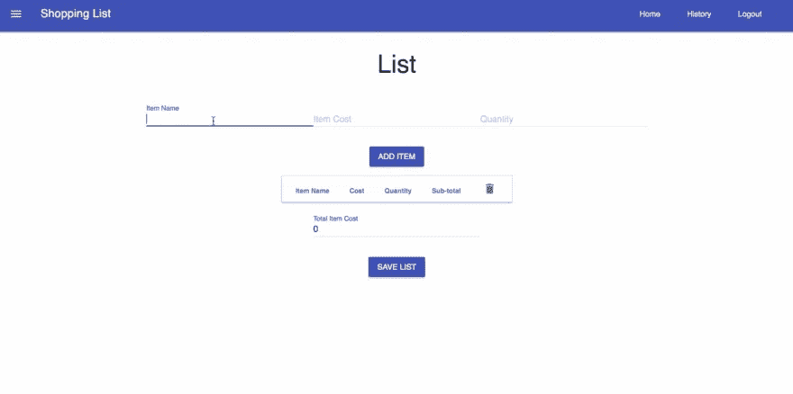
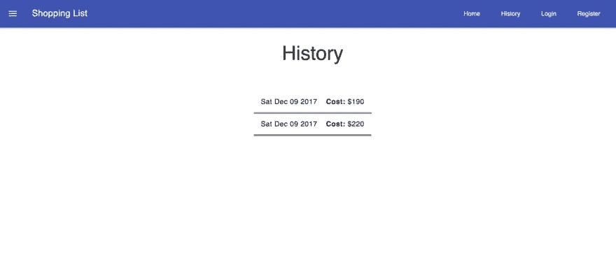

# 从 VanillaJS 到 Vue.js:重构的故事

> 原文：<https://medium.com/hackernoon/from-vanillajs-to-vue-js-a-refactoring-tale-846bee20ba3d>


Photo by [Oskar Yildiz](https://unsplash.com/@oskaryil?utm_source=medium&utm_medium=referral) on [Unsplash](https://unsplash.com?utm_source=medium&utm_medium=referral)

[Vue.js](https://vuejs.org/) 是一个构建 web 应用的框架。它有一个反应系统，允许您建模和管理您的应用程序状态，这样当数据改变时，它会反映在 UI 中，而您不必查询 DOM。如果您已经用普通 JavaScript 或 jQuery 构建了应用程序，那么您知道您需要查询 DOM 元素并更新它们，以便显示一些数据或显示一些其他应用程序状态。

对于大型应用程序来说，这变得难以管理。上周，我花了几个小时学习一些基本的东西，并在一个用 vanilla JS 构建的附带项目中采用了它。我想和你们分享我的一些心得，并一起比较代码的不同之处。[项目](https://github.com/pmbanugo/shopping-list)是一个购物清单[渐进式网络应用](https://developer.mozilla.org/en-US/Apps/Progressive)，它使用[帽衫](http://hood.ie/)。



如果你想继续，你可以下载 Vanilla JS 的[源代码](https://github.com/pmbanugo/shopping-list)，我会向你展示我是如何在 Vue 中添加的(如果你想了解我是如何用 Vanilla JS、Hoodie 和 Service Worker 构建这个应用的，请点击这个[链接](https://www.twilio.com/blog/2018/03/practical-introduction-pwa-node-hoodie-offline-first.html))。

# 添加项目

该应用程序允许用户将购物项目添加到他们的购物清单中。这是在公共文件夹的`index.html`中完成的。第 92 行到第 124 行包含这样的标记:

```
<div>
  <div class="mdl-grid center-items">
  <div class="mdl-textfield mdl-js-textfield mdl-textfield--floating-label">
      <input class="mdl-textfield__input" type="text" id="new-item-name">
      <label class="mdl-textfield__label" for="new-item-name">Item Name</label>
  </div>
  <div class="mdl-textfield mdl-js-textfield mdl-textfield--floating-label">
      <input class="mdl-textfield__input" type="number" id="new-item-cost">
      <label class="mdl-textfield__label" for="new-item-cost">Item Cost</label>
  </div>
  <div class="mdl-textfield mdl-js-textfield mdl-textfield--floating-label">
      <input class="mdl-textfield__input" type="number" id="new-item-quantity">
      <label class="mdl-textfield__label" for="new-item-quantity">Quantity</label>
  </div>
  </div> <div class="mdl-grid center-items">
  <button id="add-item" class="mdl-button mdl-js-button mdl-button--raised mdl-button--colored">
      Add Item
  </button>
  </div>
</div>
```

处理数据收集和保存数据的代码在文件`public/js/src/index.js`中。第 28 行的函数`saveNewItem()`从输入元素收集值并保存条目。然后绑定到`add-item`按钮的 click 事件。代码如下:

```
function saveNewitem() {
  let name = document.getElementById("new-item-name").value;
  let cost = document.getElementById("new-item-cost").value;
  let quantity = document.getElementById("new-item-quantity").value;
  let subTotal = cost * quantity;
  if (name && cost && quantity) {
    hoodie.store.withIdPrefix("item").add({
      name: name,
      cost: cost,
      quantity: quantity,
      subTotal: subTotal
    });
    document.getElementById("new-item-name").value = "";
    document.getElementById("new-item-cost").value = "";
    document.getElementById("new-item-quantity").value = "";
  } else {
    let snackbarContainer = document.querySelector("#toast");
    snackbarContainer.MaterialSnackbar.showSnackbar({
      message: "All fields are required"
    });
  }
}document.getElementById("add-item").addEventListener("click", saveNewitem);
```

# 切换到 Vue

采用 Vue 的第一件事就是在你的页面上添加一个对 Vue 的引用。我把这个加到`index.html`里如下:

```
<script src="https://cdn.jsdelivr.net/npm/vue@2.5.16/dist/vue.js"></script>
```

我还添加了一个 id 为`app`的`div`元素来包围 body 标签中的每个页面元素。这是必要的，因为当我们初始化一个 Vue 实例时，我们需要告诉它我们希望它控制应用程序的哪个部分。通过这样做，我告诉它管理该块中的所有内容。我修改了标记以使用一些 Vue 指令。Vue 指令是带有`v-`前缀的特殊属性。下面是更新后的标记

```
<form v-on:submit.prevent="onSubmit">
  <div class="mdl-grid center-items">
    <div class="mdl-textfield mdl-js-textfield mdl-textfield--floating-label">
      <input class="mdl-textfield__input" type="text" id="new-item-name" v-model="name">
      <label class="mdl-textfield__label" for="new-item-name">Item Name</label>
    </div>
    <div class="mdl-textfield mdl-js-textfield mdl-textfield--floating-label">
      <input class="mdl-textfield__input" type="number" id="new-item-cost" v-model.number="cost">
      <label class="mdl-textfield__label" for="new-item-cost">Item Cost</label>
    </div>
    <div class="mdl-textfield mdl-js-textfield mdl-textfield--floating-label">
      <input class="mdl-textfield__input" type="number" id="new-item-quantity" v-model.number="quantity">
      <label class="mdl-textfield__label" for="new-item-quantity">Quantity</label>
    </div>
  </div> <div class="mdl-grid center-items">
    <button id="add-item" class="mdl-button mdl-js-button mdl-button--raised mdl-button--colored">
      Add Item
    </button>
  </div>
</form>
```

`v-on`指令用于监听 DOM 事件。在上面的代码中，它被用在 form 元素中来监听 submit 事件。它还使用了`.prevent`修饰符，告诉`v-on`指令在触发的事件上调用`event.preventDefault()`。我们在输入元素上使用了`v-model`指令。它用于在表单输入上创建双向数据绑定。它会根据输入类型自动选择正确的方式来更新元素。我们已经为成本和数量输入元素使用了`.number`修饰符。它的作用是自动将输入元素的值转换成一个数字。这是因为即使类型设置为`type=number`，该值也将始终返回字符串。所以我在这里使用的这些修饰语有助于减少一些额外的检查。

我创建了一个新文件`index-vue.js`来包含与`index.js`中相同的代码，但是使用了 Vue。下面是该文件中的代码，它创建了一个 Vue 实例，该实例具有处理表单事件和收集数据所需的属性。

```
const vm = new Vue({
  el: "#app",
  data: {
    name: "",
    cost: "",
    quantity: ""
  },
  methods: {
    onSubmit: function(event) {
      if (this.name && this.cost && this.quantity) {
        hoodie.store.withIdPrefix("item").add({
          name: this.name,
          cost: this.cost,
          quantity: this.quantity,
          subTotal: this.cost * this.quantity
        }); this.name = "";
        this.cost = "";
        this.quantity = "";
      } else {
        const snackbarContainer = document.querySelector("#toast");
        snackbarContainer.MaterialSnackbar.showSnackbar({
          message: "All fields are required"
        });
      }
    }
  }
});
```

在上面的代码块中，我创建了一个 Vue 实例，向它传递一个对象，告诉 Vue 如何设置应用程序。`el`属性告诉它 Vue 将选择并定义其领域的 DOM 元素的 id。正是在这个领域内，它选择 Vue 指令(以及其他与 Vue 相关的东西)，当它被初始化时，它为应用程序设置绑定和事件处理程序。

`data`属性包含应用程序状态。初始化 Vue 实例时，包含对象中的所有属性将被添加到 Vue 的反应系统中。当绑定到 DOM 的一个值改变时，正是这个反应系统导致 UI 更新。例如，使用`v-model="name"`指令将`name`属性绑定到名称输入元素。该指令在`name`和输入元素之间建立了一个双向绑定，这样当在输入字段中添加或删除一个字符时，它会更新`name`属性，这将导致输入的值反映`name`的当前值。同样，绑定到`name`的其他元素也会随着用户输入值而改变。

`methods`属性包含函数。上面的代码定义了一个绑定到表单提交事件的`onSubmit()`函数。

# 显示保存的项目

`onSubmit`功能将物品保存到帽衫中。我想在 UI 中显示添加到表格中的项目。Vanilla JS 应用程序有以下标记:

```
<div class="mdl-grid center-items">
  <table id="item-table" class="mdl-data-table mdl-js-data-table mdl-shadow--2dp">
    <thead>
      <tr>
        <th class="mdl-data-table__cell--non-numeric">Item Name</th>
        <th class="mdl-data-table__cell--non-numeric">Cost</th>
        <th class="mdl-data-table__cell--non-numeric">Quantity</th>
        <th class="mdl-data-table__cell">Sub-total</th>
        <th class="mdl-data-table__cell--non-numeric">
          <button class="mdl-button mdl-js-button mdl-button--icon">
            <i class="material-icons">delete</i>
          </button>
        </th>
      </tr>
    </thead>
    <tbody> </tbody>
  </table>
</div>
<div class="mdl-grid center-items">
  <div class="mdl-textfield mdl-js-textfield mdl-textfield--floating-label">
    <input class="mdl-textfield__input" type="number" id="total-cost" readonly value="0">
    <label class="mdl-textfield__label" for="cost">Total Item Cost</label>
  </div>
</div><script id="item-row" type="text/template">
  <tr id='{{row-id}}'>      
    <td class="mdl-data-table__cell--non-numeric">{{name}}</td>
    <td class="mdl-data-table__cell--non-numeric">{{cost}}</td>
    <td class="mdl-data-table__cell--non-numeric">{{quantity}}</td>
    <td class="mdl-data-table__cell">{{subTotal}}</td>
    <td class="mdl-data-table__cell--non-numeric">
          <button class="mdl-button mdl-js-button mdl-button--icon mdl-button--colored"
          onclick="pageEvents.deleteItem('{{item-id}}')">
          <i class="material-icons">remove</i>
          </button>
    </td>
  </tr>
</script>
```

在上面的标记中，我使用了微模板，因为表格将包含动态数据，我想用真实数据替换一些占位符，并将其附加到 DOM。

下面是添加项目时在 UI 中显示项目的代码:

```
function addItemToPage(item) {
  if (document.getElementById(item._id)) return;
  let template = document.querySelector("#item-row").innerHTML;
  template = template.replace("{{name}}", item.name);
  template = template.replace("{{cost}}", item.cost);
  template = template.replace("{{quantity}}", item.quantity);
  template = template.replace("{{subTotal}}", item.subTotal);
  template = template.replace("{{row-id}}", item._id);
  template = template.replace("{{item-id}}", item._id);
  document.getElementById("item-table").tBodies[0].innerHTML += template; let totalCost = Number.parseFloat(
    document.getElementById("total-cost").value
  ); document.getElementById("total-cost").value = totalCost + item.subTotal;
}hoodie.store.withIdPrefix("item").on("add", addItemToPage);
```

在上面的代码块中，它从 DOM 获取脚本模板，用实际数据替换占位符，然后将其附加到 DOM。总成本也会计算出来并显示在用户界面上。

# Vue 替代方案

过渡到 Vue 我从页面中移除了脚本模板，并更新了 table 元素以使用 Vue 的`v-for`指令，该指令将遍历包含项目的数据属性。下面是标记

```
<div class="mdl-grid center-items">
  <table id="item-table" class="mdl-data-table mdl-js-data-table mdl-shadow--2dp">
    <thead>
      <tr>
        <th class="mdl-data-table__cell--non-numeric">Item Name</th>
        <th class="mdl-data-table__cell--non-numeric">Cost</th>
        <th class="mdl-data-table__cell--non-numeric">Quantity</th>
        <th class="mdl-data-table__cell">Sub-total</th>
        <th class="mdl-data-table__cell--non-numeric">
          <button class="mdl-button mdl-js-button mdl-button--icon">
            <i class="material-icons">delete</i>
          </button>
        </th>
      </tr> </thead>
    <tbody>
      <tr v-for="item in items" :key="item._id">
        <td class="mdl-data-table__cell--non-numeric">{{ item.name}}</td>
        <td class="mdl-data-table__cell--non-numeric">{{ item.cost}}</td>
        <td class="mdl-data-table__cell--non-numeric">{{ item.quantity}}</td>
        <td class="mdl-data-table__cell">{{ item.subTotal}}</td>
        <td class="mdl-data-table__cell--non-numeric">
          <button @click="deleteRow(item._id)" class="mdl-button mdl-js-button mdl-button--icon mdl-button--colored">
            <i class="material-icons">remove</i>
          </button>
        </td>
      </tr>
    </tbody>
  </table>
</div><div class="mdl-grid center-items">
  <div class="mdl-textfield mdl-js-textfield mdl-textfield--floating-label">
    <!-- <input class="mdl-textfield__input" type="number" id="total-cost" readonly value="0">
    <label class="mdl-textfield__label" for="cost">Total Item Cost</label> -->
    <h4>Total Cost: {{ total }}</h4>
  </div></div>
```

在标记上没有很大的变化。我从之前的微模板中复制了内容，并使用了 Vue 指令和文本插值。我使用`v-for`指令来呈现将从名为`items`的数据属性中获取的项目列表。各列使用 Vue 的文本插值`{{ item.name }}`渲染数据。这类似于我们在微模板中使用的占位符。总计使用文本插值显示在页面上。

更新`index-vue.js`中的 JavaScript 代码将会得到如下结果:

```
const vm = new Vue({
  el: "#app",
  data: {
    name: "",
    cost: "",
    quantity: "",
    items: []
  },
  computed: {
    // a computed getter
    total: function() {
      // `this` points to the vm instance
      return this.items.reduce(
        (accumulator, currentValue) => accumulator + currentValue.subTotal,
        0
      );
    }
  },
  methods: {
    .....
  }
});hoodie.store.withIdPrefix("item").on("add", item => vm.items.push(item));
```

Vue 改编要短得多，也简单得多。我在上面的代码中做的是添加一个数据属性`items`，这是前面看到的`v-for`指令中使用的。当一个项目被添加时，Hoodie 会调用运行`vm.items.push(item)`的函数来更新状态，而 Vue 的反应系统会自动更新用户界面。要计算总数，不需要跟踪 DOM 中的项目。我使用了一个在`items`上运行 reduce 函数的计算属性。现在，有了 Vue 的反应式系统，只要这些值发生变化，UI 就会更新。这里的好处是我不必担心代码中的 DOM 操作。因此，在更少的代码行中，我们实现了使用普通 JS 时需要更多代码的目标(我认为 jQuery 也是如此)。

# 将项目保存为列表

添加商品后，我想保存它们供以后参考，并能够添加另一个购物商品列表。我有一个按钮`Save List`,它将收集项目，保存为一组带有帽衫的项目，并允许用户添加新的项目集。

普通的 JS 版本将按钮绑定到一个 click 事件。下面是使它工作的标记和代码

```
//index.html
<div class="mdl-grid center-items">
  <button class="mdl-button mdl-js-button mdl-button--raised mdl-button--colored" onclick="pageEvents.saveList()">
    Save List
  </button>
</div>//index.js
function saveList() {
  let cost = 0; hoodie.store
    .withIdPrefix("item")
    .findAll()
    .then(function(items) {
      for (var item of items) {
        cost += item.subTotal;
      } //store the list
      hoodie.store.withIdPrefix("list").add({
        cost: cost,
        items: items
      }); //delete the items
      hoodie.store
        .withIdPrefix("item")
        .remove(items)
        .then(function() {
          //clear the table
          document.getElementById("item-table").tBodies[0].innerHTML = ""; //notify the user
          var snackbarContainer = document.querySelector("#toast");
          snackbarContainer.MaterialSnackbar.showSnackbar({
            message: "List saved succesfully"
          });
        })
        .catch(function(error) {
          //notify the user
          var snackbarContainer = document.querySelector("#toast");
          snackbarContainer.MaterialSnackbar.showSnackbar({
            message: error.message
          });
        });
    });
}window.pageEvents = {
  deleteItem: deleteItem,
  saveList: saveList
  ....
};
```

# Vue 替代方案

切换到 Vue 并不需要太多的区别。我仍然必须绑定到一个 click 事件，并在初始化期间将事件处理程序方法添加到 Vue options 对象的 methods 属性中。

下面是它的标记:

```
<div class="mdl-grid center-items">
  <button @click="saveList" class="mdl-button mdl-js-button mdl-button--raised mdl-button--colored">
    Save List
  </button>
</div>
```

`@click="saveList"`是`v-on:click=saveList"`的简写，用于监听 DOM 事件。普通 JS 版本中相同的`saveList`函数被添加到 Vue 对象的 methods 属性中。

# 导航栏

既然物品可以保存为列表，我希望看到一段时间内每个列表的总成本的历史记录。它将在另一页，看起来像下图所示



这个页面在`public/history.html`中有标记，在`public/js/src/history.js`中有控制页面的代码。这个页面与顶部的导航栏`index.html`有一些相同的代码。导航栏包含不同页面的链接，点击时会弹出登录或注册对话框的`Login`和`Register`链接，以及`Signout`按钮。

在使用普通 JS 的应用程序版本中，我在两个页面中复制了相同的 HTML 标记。下面是导航栏的标记:

```
<header class="mdl-layout__header">
    <div class="mdl-layout__header-row">
    <!-- Title -->
    <span class="mdl-layout-title">Shopping List</span>
    <!-- Add spacer, to align navigation to the right -->
    <div class="mdl-layout-spacer"></div>
    <!-- Navigation. We hide it in small screens. -->
    <nav class="mdl-navigation mdl-layout--large-screen-only">
        <a class="mdl-navigation__link" href="index.html">Home</a>
        <a class="mdl-navigation__link" href="history.html">History</a>
        <a onclick="pageEvents.showLogin()" style="cursor: pointer" class="mdl-navigation__link login">Login</a>
        <a onclick="pageEvents.showRegister()" style="cursor: pointer" class="mdl-navigation__link register">Register</a>
        <a onclick="pageEvents.signout()" style="cursor: pointer" class="mdl-navigation__link logout">Logout</a>
    </nav>
    </div>
</header>
<div class="mdl-layout__drawer">
    <span class="mdl-layout-title">Shopping List</span>
    <nav class="mdl-navigation">
    <a class="mdl-navigation__link" href="index.html">Home</a>
    <a class="mdl-navigation__link" href="history.html">History</a>
    <a onclick="pageEvents.showLogin()" style="cursor: pointer" class="mdl-navigation__link login">Login</a>
    <a onclick="pageEvents.showRegister()" style="cursor: pointer" class="mdl-navigation__link register">Register</a>
    <a onclick="pageEvents.signout()" style="cursor: pointer" class="mdl-navigation__link logout">Logout</a>
    </nav>
</div>
```

从标记中可以看到，当单击登录、注册和注销的链接时，它们调用各自的方法。这些页面事件处理程序在`index.js`中定义

```
import * as shared from "shared.js";....shared.updateDOMLoginStatus();
window.pageEvents = {
  showLogin: shared.showLoginDialog,
  showRegister: shared.showRegisterDialog,
  signout: shared.signOut
};The actual functions that gets called are defined in `shared.js`. Below are the functions in `shared.js` responsible for the navigation bar: //register dialog element
let loginDialog = document.querySelector("#login-dialog");
dialogPolyfill.registerDialog(loginDialog);
let registerDialog = document.querySelector("#register-dialog");
dialogPolyfill.registerDialog(registerDialog);let showLoginDialog = function() {
  loginDialog.showModal();
};let showRegisterDialog = function() {
  registerDialog.showModal();
};let showAnonymous = function() {
  document.getElementsByClassName("login")[0].style.display = "inline";
  document.getElementsByClassName("login")[1].style.display = "inline";
  document.getElementsByClassName("register")[0].style.display = "inline";
  document.getElementsByClassName("register")[1].style.display = "inline";
  document.getElementsByClassName("logout")[0].style.display = "none";
  document.getElementsByClassName("logout")[1].style.display = "none";
};let showLoggedIn = function() {
  document.getElementsByClassName("login")[0].style.display = "none";
  document.getElementsByClassName("login")[1].style.display = "none";
  document.getElementsByClassName("register")[0].style.display = "none";
  document.getElementsByClassName("register")[1].style.display = "none";
  document.getElementsByClassName("logout")[0].style.display = "inline";
  document.getElementsByClassName("logout")[1].style.display = "inline";
};let updateDOMLoginStatus = () => {
  hoodie.account.get("session").then(function(session) {
    if (!session) {
      // user is singed out
      showAnonymous();
    } else if (session.invalid) {
      // user is signed in, but session is no longer authenticated
      showAnonymous();
    } else {
      // user is signed in
      showLoggedIn();
    }
  });
};let signOut = function() {
  hoodie.account
    .signOut()
    .then(function() {
      showAnonymous();
      let snackbarContainer = document.querySelector("#toast");
      snackbarContainer.MaterialSnackbar.showSnackbar({
        message: "You logged out"
      });
      location.href = location.origin;
    })
    .catch(function() {
      let snackbarContainer = document.querySelector("#toast");
      snackbarContainer.MaterialSnackbar.showSnackbar({
        message: "Could not logout"
      });
    });
};export {
  signOut,
  showRegisterDialog,
  showLoginDialog,
  updateDOMLoginStatus
};
```

这段代码导出了在`index.js`中使用的函数。`showLoginDialog()`和`showRegisterDialog()`功能分别显示登录和注册模式。`signout()`功能将用户注销并调用`showAnonymous()`，隐藏`Logout`链接，仅显示`Register`和`Login`链接。函数`updateDOMLoginStatus`检查用户是否通过验证，并显示适当的链接。这个函数在页面加载时被调用。

实现共享导航栏需要复制标记和查询 DOM 元素，并应用 CSS 来显示和隐藏导航栏中的链接。我们来看看 Vue 的替代方案。

# Vue 备选方案

许多 web 应用程序都有跨页面相同的部分，例如导航标题。这些应该被抽象成某种容器或组件。Vue 提供了所谓的组件，可以用来解决这个例子中导航栏的问题。Vue 组件是独立的，可重复使用。

转到 Vue 组件，我创建了一个新文件`shared-vue.js`。在它里面，我为导航栏定义了一个 Vue 组件，如下所示:

```
Vue.component("navigation", {
  props: ["isLoggedIn", "toggleLoggedIn"],
  template: `<div>
              <header class="mdl-layout__header">
        <div class="mdl-layout__header-row">
          <!-- Title -->
          <span class="mdl-layout-title">Shopping List</span>
          <!-- Add spacer, to align navigation to the right -->
          <div class="mdl-layout-spacer"></div>
          <!-- Navigation. We hide it in small screens. -->
          <nav class="mdl-navigation mdl-layout--large-screen-only">
            <a class="mdl-navigation__link" href="index.html">Home</a>
            <a class="mdl-navigation__link" href="history.html">History</a>
            <a v-show="!isLoggedIn" @click="showLogin" style="cursor: pointer" class="mdl-navigation__link login">Login</a>
            <a v-show="!isLoggedIn" @click="showRegister" style="cursor: pointer" class="mdl-navigation__link register">Register</a>
            <a v-show="isLoggedIn" @click="logout" style="cursor: pointer" class="mdl-navigation__link logout">Logout</a>
          </nav>
        </div>
      </header>
      <div class="mdl-layout__drawer">
        <span class="mdl-layout-title">Shopping List</span>
        <nav class="mdl-navigation">
          <a class="mdl-navigation__link" href="index.html">Home</a>
          <a class="mdl-navigation__link" href="history.html">History</a>
          <a v-show="!isLoggedIn" @click="showLogin" style="cursor: pointer" class="mdl-navigation__link login">Login</a>
          <a v-show="!isLoggedIn" @click="showRegister" style="cursor: pointer" class="mdl-navigation__link register">Register</a>
          <a v-show="isLoggedIn" @click="logout" style="cursor: pointer" class="mdl-navigation__link logout">Logout</a>
        </nav>
      </div>
            </div>`,
  methods: {
    showLogin: function() {
      const loginDialog = document.querySelector("#login-dialog");
      dialogPolyfill.registerDialog(loginDialog);
      loginDialog.showModal();
    },
    showRegister: function() {
      const registerDialog = document.querySelector("#register-dialog");
      dialogPolyfill.registerDialog(registerDialog);
      registerDialog.showModal();
    },
    logout: function() {
      hoodie.account
        .signOut()
        .then(() => {
          this.toggleLoggedIn();
        })
        .catch(error => {
          alert("Could not logout");
        });
    }
  }
});
```

在上面的代码中，我们用一个选项对象注册了一个名为`navigation`的 Vue 组件，该对象类似于我们在创建 Vue 实例时使用的对象。第一个属性是 [**道具**](https://vuejs.org/v2/guide/components.html#Passing-Data-to-Child-Components-with-Props) **。** Props 是一种向组件传递数据的方式。一个组件可以定义它自己的数据，但是如果一个应用程序状态需要在不同的组件中使用，就要使用 props。`isLoggedIn` props 保存一个布尔值，显示用户是否通过验证。

第二个属性`template`包含将在页面中显示的标记。除了我们使用了两个 Vue 指令，`v-show`和`@click`之外，该标记几乎与上一节中的普通 JS 替代方法完全一样。`v-show`属性用于条件渲染。这里我告诉它当`isLoggedIn`为真时显示`Logout`链接，或者当它为假时显示`Login`和`Register`链接。Vue 还提供了用于条件渲染的`v-if`和`v-else`，你可以在这里阅读关于它们的更多信息[。属性是`v-on:click`指令的简写。我已经将`showLogin`、`showRegister`和`logout`设置为各个链接的点击事件的事件处理程序。](https://vuejs.org/v2/guide/conditional.html)

这些函数在 methods 属性中定义。成功注销后的`logout`函数调用传递给该组件的道具`this.toggleLoggedIn()`。这将执行传递给 props 的函数，并且预计会改变`isLoggedIn` props 的值，这是该组件不能修改的。当它改变时，Vue 的反应系统会相应地更新 DOM。

该组件作为自定义元素添加到`index.html`中。我将删除第 59 行到第 84 行的导航栏标记，并替换为以下内容

```
<navigation v-bind:is-logged-in="isLoggedIn" v-bind:toggle-logged-in="toggleLoggedIn"></navigation>
```

在 JavaScript 代码中，我们声明了 props `isLoggedIn`和`toggleLoggedIn`，但是当传递 props 时，这些值使用它们的 kebab 大小写的等价物。这是因为 HTML 属性不区分大小写。我已经使用了`v-bind`指令来动态传递这些属性的值。如果没有这个指令，它将作为一个静态值被传递，组件将接收字符串`isLoggedIn`而不是一个布尔值。我们也可以用简写的`:`来代替`v-bind`，它也可以重写为`<navigation :is-logged-in="isLoggedIn" :toggle-logged-in="toggleLoggedIn"></navigation>`

值`isLoggedIn`是应用状态，`toggleLoggedIn`是在`index-vue.js`中的 Vue 实例中声明的方法，如下所示

```
const vm = new Vue({
  el: "#app",
  data: {
    name: "",
    cost: "",
    quantity: "",
    items: [],
    isLoggedIn: false
  },
  computed: {
    .....//collapsed code
  },
  methods: {
    toggleLoggedIn: function() {
      this.isLoggedIn = !this.isLoggedIn;
    },
    ......//collapsed code
  }
});.....//collapsed codehoodie.account.get("session").then(function(session) {
  if (!session) {
    // user is singed out
    vm.isLoggedIn = false;
  } else if (session.invalid) {
    vm.isLoggedIn = false;
  } else {
    // user is signed in
    vm.isLoggedIn = true;
  }
});
```

使用 Vue 替代方案，我已经消除了重复的标记，如果将来我需要对它进行任何更改，我将从一个位置完成，这是使用 Vue 组件完成的。我不再需要遍历/查询 DOM 来根据身份验证状态选择显示或隐藏哪些元素。

# 登录对话框

`Login`和`Register`链接显示了一个允许用户输入用户名和密码进行认证的模式。两者的标记都像导航栏一样跨页面复制。这可以在`index.html`的第 171 至 244 行和`history.html`的第 100 至 158 行中看到。

```
<dialog id="login-dialog" class="mdl-dialog">
  <h4 class="mdl-dialog__title">Login</h4>
  <div class="mdl-dialog__content">
    <div class="mdl-grid center-items">
      <!-- Simple Textfield -->
      <div class="mdl-textfield mdl-js-textfield">
        <input class="mdl-textfield__input" type="text" id="login-username">
        <label class="mdl-textfield__label" for="login-username">Username</label>
      </div>
    </div>
    <div class="mdl-grid center-items">
      <!-- Simple Textfield -->
      <div class="mdl-textfield mdl-js-textfield">
        <input class="mdl-textfield__input" type="password" id="login-password">
        <label class="mdl-textfield__label" for="login-password">Password</label>
      </div>
    </div>
    <div class="mdl-grid center-items">
      <!-- Simple Textfield -->
      <div class="mdl-textfield mdl-js-textfield">
        <span id="login-error"></span>
      </div>
    </div>
  </div>
  <div class="mdl-dialog__actions">
    <button onclick="pageEvents.closeLogin()" type="button" class="mdl-button close">Cancel</button>
    <button onclick="pageEvents.login()" type="button" class="mdl-button">Login</button>
  </div>
</dialog><dialog id="register-dialog" class="mdl-dialog">
  <h4 class="mdl-dialog__title">Login</h4>
  <div class="mdl-dialog__content">
    <div class="mdl-grid center-items">
      <!-- Simple Textfield -->
      <div class="mdl-textfield mdl-js-textfield">
        <input class="mdl-textfield__input" type="text" id="register-username">
        <label class="mdl-textfield__label" for="register-username">Username</label>
      </div>
    </div>
    <div class="mdl-grid center-items">
      <!-- Simple Textfield -->
      <div class="mdl-textfield mdl-js-textfield">
        <input class="mdl-textfield__input" type="password" id="register-password">
        <label class="mdl-textfield__label" for="register-password">Password</label>
      </div>
    </div>
    <div class="mdl-grid center-items">
      <!-- Simple Textfield -->
      <div class="mdl-textfield mdl-js-textfield">
        <span id="register-error"></span>
      </div>
    </div>
  </div>
  <div class="mdl-dialog__actions">
    <button onclick="pageEvents.closeRegister()" type="button" class="mdl-button close">Cancel</button>
    <button onclick="pageEvents.register()" type="button" class="mdl-button">Register</button>
  </div>
</dialog>
```

处理登录和注册的代码在`shared.js`中定义，并在`index.js`中使用

```
//shared.js//register dialog element
let loginDialog = document.querySelector("#login-dialog");
dialogPolyfill.registerDialog(loginDialog);
let registerDialog = document.querySelector("#register-dialog");
dialogPolyfill.registerDialog(registerDialog);let closeLoginDialog = function() {
  loginDialog.close();
};let closeRegisterDialog = function() {
  registerDialog.close();
};let showAnonymous = function() {
  ...
};let showLoggedIn = function() {
  ....
};let signOut = function() {
  ....
};let updateDOMLoginStatus = () => {
  ....
};let login = function() {
  let username = document.querySelector("#login-username").value;
  let password = document.querySelector("#login-password").value; hoodie.account
    .signIn({
      username: username,
      password: password
    })
    .then(function() {
      showLoggedIn();
      closeLoginDialog(); let snackbarContainer = document.querySelector("#toast");
      snackbarContainer.MaterialSnackbar.showSnackbar({
        message: "You logged in"
      });
    })
    .catch(function(error) {
      console.log(error);
      document.querySelector("#login-error").innerHTML = error.message;
    });
};let register = function() {
  let username = document.querySelector("#register-username").value;
  let password = document.querySelector("#register-password").value;
  let options = { username: username, password: password }; hoodie.account
    .signUp(options)
    .then(function(account) {
      return hoodie.account.signIn(options);
    })
    .then(account => {
      showLoggedIn();
      closeRegisterDialog();
      return account;
    })
    .catch(function(error) {
      console.log(error);
      document.querySelector("#register-error").innerHTML = error.message;
    });
};export {
  register,
  login,
  closeRegisterDialog,
  closeLoginDialog,
  ...
};
```

**index.js**

```
//index.jswindow.pageEvents = {
  closeLogin: shared.closeLoginDialog,
  showLogin: shared.showLoginDialog,
  closeRegister: shared.closeRegisterDialog,
  showRegister: shared.showRegisterDialog,
  login: shared.login,
  register: shared.register,
  signout: shared.signOut
};
```

# Vue 备选方案

当切换到 Vue 时，我为登录和注册组件使用了单独的组件。下面是登录对话框的组件注册

```
Vue.component("login-dialog", {
  data: function() {
    return {
      username: "",
      password: ""
    };
  },
  props: ["toggleLoggedIn"],
  template: `<dialog id="login-dialog" class="mdl-dialog">
      <h4 class="mdl-dialog__title">Login</h4>
      <div class="mdl-dialog__content">
        <div class="mdl-grid center-items">
          <!-- Simple Textfield -->
          <div class="mdl-textfield mdl-js-textfield">
            <input v-model="username" class="mdl-textfield__input" type="text" id="login-username">
            <label class="mdl-textfield__label" for="login-username">Username</label>
          </div>
        </div>
        <div class="mdl-grid center-items">
          <!-- Simple Textfield -->
          <div class="mdl-textfield mdl-js-textfield">
            <input v-model="password" class="mdl-textfield__input" type="password" id="login-password">
            <label class="mdl-textfield__label" for="login-password">Password</label>
          </div>
        </div>
        <div class="mdl-grid center-items">
          <!-- Simple Textfield -->
          <div class="mdl-textfield mdl-js-textfield">
            <span id="login-error"></span>
          </div>
        </div>
      </div>
      <div class="mdl-dialog__actions">
        <button @click="closeLogin" type="button" class="mdl-button close">Cancel</button>
        <button @click="login" type="button" class="mdl-button">Login</button>
      </div>
    </dialog>`,
  methods: {
    closeLogin: function() {
      const loginDialog = document.querySelector("#login-dialog");
      dialogPolyfill.registerDialog(loginDialog);
      loginDialog.close();
    },
    login: function(event) {
      hoodie.account
        .signIn({
          username: this.username,
          password: this.password
        })
        .then(() => {
          this.toggleLoggedIn();
          this.closeLogin();
        })
        .catch(error => {
          console.log(error);
          document.querySelector("#login-error").innerHTML = "Error loggin in";
        });
    }
  }
});
```

它注册了数据、属性、模板和方法，作为传递给`Vue.component()`的选项对象的属性。然后在页面上，我用 Vue 的自定义元素替换标记

```
//index.html
<login-dialog v-bind:toggle-logged-in="toggleLoggedIn"></login-dialog>
```

类似的步骤也适用于我跳过的注册对话框。

为了避免显示重复的 Vue 语法，我还跳过了显示应用程序的某些部分。如果你想了解我是如何一步一步构建整个应用程序的，请点击这个[链接](https://www.twilio.com/blog/2018/03/practical-introduction-pwa-node-hoodie-offline-first.html)。它还解释了一些概念，如[服务工作者](https://developers.google.com/web/fundamentals/primers/service-workers/)和[推送 API。](https://developer.mozilla.org/en-US/docs/Web/API/Push_API)

# 结论

到目前为止，我已经向您展示了我在从 Vanilla JS 迁移到 Vue.js 时对我的应用程序所做的一些更改。如果您刚刚学会如何使用 HTML、CSS 和 JavaScript(或 jQuery)构建 web 应用程序，那么开始使用 Vue 并不复杂。您不需要了解 ES6 或理解任何构建步骤就可以开始。在使用 Vue 时，我实现了更少的代码重复和更好的代码组织。我只介绍了开始使用 Vue 需要了解的基本知识，但是当然 Vue 还有更多。在以后的文章中，我将继续深入探讨更多的概念，并希望分享如何用它构建一个相当复杂的单页面应用程序。

您可以使用下面的链接在 GitHub 上找到 Vanilla JS 和 Vue.js 应用程序的完整代码。

*   [购物清单—香草 JS](https://github.com/pmbanugo/shopping-list)
*   [购物清单— Vue.js](https://github.com/pmbanugo/shopping-list-vue)

> 也在[发展到](https://dev.to/pmbanugo/from-vanillajs-to-vuejs-a-guide-to-vue-essentials-5gii)上分享

Peter Mbanugo 对线下优先感兴趣。他目前的项目是[*Hamoni Sync*](https://www.hamoni.tech/)*，一个实时应用状态同步服务。在 Twitter 上随时可以通过*[*p.mbanugo@yahoo.com*](mailto:p.mbanugo@yahoo.com)*或* [*@p_mbanugo 联系到他。*](https://twitter.com/p_mbanugo)