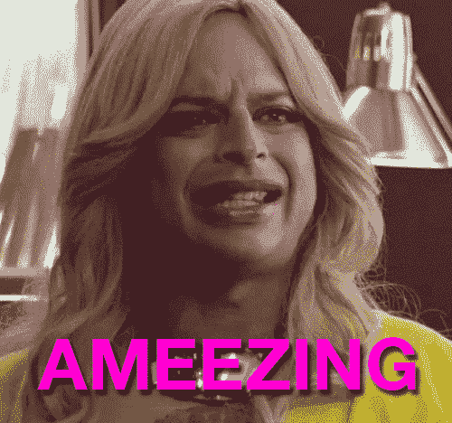

# 从零到 GraphQL 订阅

> 原文：<https://medium.com/hackernoon/from-zero-to-graphql-subscriptions-416b9e0284f3>

在这篇博文中，我将介绍从头构建 GraphQL 订阅的理论、实现和挑战。如果你不熟悉 GraphQL，这里有一本入门书:GraphQL 是一种 API 查询语言，也是一种用现有数据完成这些查询的运行时语言。GraphQL 于 2015 年开源，订阅操作(2017 年加入规范)允许你订阅 GraphQL 中的实时数据。GraphQL 订阅为脸书的许多功能提供了动力，包括对直播视频的实时评论和流媒体反应。如果你想更全面地了解 GraphQL，请查看 graphql.org 的。

假设我们正在构建一个具有两个基本特性的电子邮件客户端:

1.  当用户启动应用程序时，获取并显示收件箱中的所有电子邮件。对于每封电子邮件，显示接收时间、发件人的电子邮件和主题行。
2.  当新邮件到达时，将其添加到收件箱，显示接收时间、发件人的电子邮件和主题行。

对于需求#1，客户端可以通过一个简单的 GraphQL 查询获取相关字段:

```
query FetchEmailsOnStart($viewer: ID!) {
  allEmailsForViewer(viewer: $viewer) {
    receiveTime,
    sender,
    subject
  }
}
```

对于需求#2，客户机需要请求服务器在新邮件到达时得到通知。例如，服务器通过 pubsub(发布-订阅)API 公开此功能:

```
newEmails.Subscribe(viewerContext, onPublish: (newEmailId) => {
  // execute a GraphQL query to fetch the relevant fields from the new email
});// Elsewhere in the server-side code, we need to detect the arrival of new emails and publish:
newEmails.Publish(viewerID, newEmailId);
```

每当触发 onPublish 回调函数时，我们执行另一个 GraphQL 查询，如下所示:

```
# query to run in response to a new email
query FetchEmailById($viewer: ID!, $newEmailId: ID!) {
  email(viewer: $viewer, id: $newEmailId) {
    receiveTime,
    sender,
    subject
  }
}
```

我们现在可以定义任何反应式 GraphQL 系统的三个关键职责:

1.  定义并跟踪数据更改时要运行的查询。
2.  捕获并检测会触发重新评估查询的条件。
3.  重新评估查询并返回结果。

如果我们尝试在客户端上做这些事情会怎么样？通过显式订阅底层源事件流，客户端包含了如何检测“新电子邮件事件”的命令性逻辑。现在这不是一个大问题，但是想象一下这个代码在一个移动应用程序中，其中一小部分用户从来没有升级过那个版本。如果命令性逻辑更改包括多个 pubsub 事件或一个不同的 pubsub 事件，这些客户端很容易被破坏。如果我们把责任转移到服务器上会怎么样？换句话说，客户机可以向服务器发送一个 GraphQL 文档。那么服务器将:

1.  持久化并跟踪 GraphQL 文档
2.  捕获触发条件(源事件流)
3.  重新评估查询并返回结果。
4.  维护到客户端的持久通道，并将结果推回客户端。

通过在服务器上执行这些操作，步骤#2 的细节对客户端是隐藏的，并且可以在服务器上自由更改，并且查询变得完全是声明性的:

```
subscription SubscribeToNewEmails($viewer: ID!) {
  newEmail(viewer: $viewer) {
    receiveTime,
    sender,
    subject
  }
}
```

与客户端解决方案相比，我们节省了网络往返，避免了在后端暴露源事件流，并且消除了指定 *newEmailId* 的需要。客户端仍然知道*为什么数据改变了*，但是*为什么(新邮件到达)*与*如何(pubsub 事件调用包含新邮件 Id 的新邮件)*是分离的。



# 缩放和操作

这听起来很有希望，但是服务器现在需要维护更多的状态，并管理与潜在的数亿客户端的持久连接。有状态系统比无状态系统更难监控和调试，GraphQL 也不例外。强调几个挑战:

*   系统将如何扩展以处理数百万并发用户？
*   n 平方扇出:当一个聊天室有一百万个参与者，每个人都在同一时间打字，会发生什么？
*   对于有序的、一次且只有一次的交付，我们能做出什么样的保证？这在延迟和可用性方面有什么样的折衷？
*   我们如何衡量系统的可靠性？
*   在部署期间，我们如何将客户端连接从一个节点转移到另一个节点？
*   系统如何处理单个节点上的过载？
*   有状态层和无状态层应该集成还是分开？

这些都是没有正确答案的难题。但是在构建大规模实时 API 之前考虑它们是一个好主意。

# 开放源码

社区表达了对 GraphQL 订阅的一贯兴趣，所以我们去年将它添加到了 GraphQL 规范中。以下是规格文本:

> *如果操作是订阅，则结果是称为“响应流”的事件流，其中事件流中的每个事件是对底层“源流”上的每个新事件执行操作的结果。*
> 
> *执行订阅会在服务器上创建一个持久函数，该函数将底层的源流映射到返回的响应流。*

将此映射到我们的示例中，“源流”是“newEmails pubsub 事件”。“服务器上的持久功能”记住 GraphQL 查询并监听事件的源数据流。每次新邮件到达时，映射函数都使用来自源流事件的输入来执行存储的 GraphQL 文档。

GraphQL 订阅可以从主要的社区合作伙伴那里获得，例如 [Apollo](https://www.apollographql.com/) 和 [Prisma](https://www.prisma.io/) ，但是我希望这篇博客已经为您提供了构建自己的 GraphQL 订阅实现的知识！