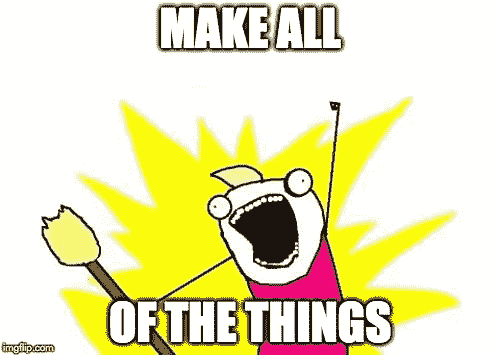

# 前端框架攻击

> 原文：<https://medium.com/hackernoon/front-end-framework-attack-df561c391391>

## 看着我尝试做一些可能是徒劳的事情。加入我的 JavaScript 死亡之旅。

我会尽量保持简短和甜蜜。每周，对于每一个 JS 前端库/ [框架](https://hackernoon.com/tagged/framework)，我都要尝试*并使用它来构建一个小的 web 应用。🙈— * *编辑未来几周将会有更新，请看文章底部。*

# **但是为什么呢？😩**

我相信框架疲劳是一件事，所以我想知道它最大是什么样的，它们都是相似的吗？我发现很难不被围绕新框架的宣传所吸引，是时候把它从我的系统中清除出去了。

说到本质，这里是一个非详尽列表的一小部分。以下是我打算开始构建的一些库/框架:

*   [超 app](https://hyperapp.js.org/)
*   [Choo](https://choo.io/)
*   [苗条的](https://svelte.technology/)
*   [刺激](https://github.com/stimulusjs/stimulus)
*   [Cycle.js](https://cycle.js.org/)
*   [Vue](https://vuejs.org/)
*   [地狱](https://infernojs.org/)
*   [暴乱](http://riotjs.com/)
*   [秘银](https://mithril.js.org/)
*   [微光](https://glimmerjs.com/)
*   BYOJSF(自带 [JavaScript](https://hackernoon.com/tagged/javascript) 框架)

你会希望看到我没有试图去大男孩明显的。然而，我认为在那里看到一些更有名的还是不错的。在所有这些产品中，我使用 Vue 的次数最多，我真的很喜欢使用它。

# 预期成果🧐

我主要感兴趣的是挑选一个作为重构工作的候选，并继续使用它。

我对几乎所有教程和如何使用所有最酷的 JavaScript 优点的一个小问题是，它都专注于如何制作 SPA，为什么没有人告诉你如何使用最新的东西来使一般的前端 js 更容易？

把这当成一次调查。

如果你主要是制作，Wordpress 主题或者小册子整天都在网站上。我们如何制作 JS 功能的高级片段，以便放入 html 页面或模板并向其提供一些数据？让我们找出答案。

最后，这些框架中的一些遵循相同的创建思想，当我从一个库跳到另一个库时，我很有兴趣看看它们有多相似。

# 方法🤔

我最初认为我应该在每一个库中做同样的事情，然后看看它是如何进行的，但是这和做另一个 todo 应用有什么不同吗？

在现实生活中(至少是理想情况下)，你不会一次又一次地做同样的事情。你已经做了一次，随着你做得越来越多，每次迭代你都会变得更快更好，我觉得这会迫使你偏向于再次做同样的应用。所以，我不会那么做。

我会想出 10 个点子，把它们写在纸上，然后在每周开始的时候随机挑选出一个项目和一个图书馆。我将确保每一个概念的复杂性大致相同，无论是单页应用程序的想法，还是一个小部件。

我会把每一个都放在我的 Github 上。提交消息中的脏话是常见的。当我完成的时候，你会有我失败的完整记录。

我不会做任何测试，因为我做这些，这将是纯粹的尝试，使在选择的 JS 库/框架的想法的 MVP。

我会为我做的每一件事写一篇附言，我会把它贴在这里。

# BYOJSF？🎉

你还记得上面的第 11 点，没错，自带 JavaScript 框架。

如果一切顺利，我可能会尝试一起粉碎一些可怕的东西，并产生另一个前端库供我们所有人使用。也许，用虚拟 dom 的 jQuery？

我会看看我从其他人那里学到了什么，挖一点，看看会发生什么🙃

# 让我知道你的想法？📣

我脑海中所有读到这篇文章的酷人们，我想知道你们在想什么！？有 JS 库你觉得我该试试？请让我知道，我看看能不能加进去。毕竟，一根绳子有多长？

几周后我会发布一篇新文章，请保持关注。

*我不能保证我做的东西不是超级类似于 todo 应用，而只是叫别的东西。请记住，我从来没有声称自己是一个天才的想法，或一个超级好的 JavaScript 开发人员。*

# 更新

*   第一周:Riot.js 产品定制(点击查看[演示](http://paulbird.co/riotjs-rioter-customiser/)，[代码](https://github.com/birdyboy18/riotjs-rioter-customiser)，这里写的是[现在](/@birdyboy18/frontend-framework-attack-riotjs-product-customiser-a2922112137b)。我希望你喜欢