# Drupal +模式实验室的前端之旅

> 原文：<https://medium.com/hackernoon/front-end-journey-into-drupal-pattern-lab-4db02e617fb4>

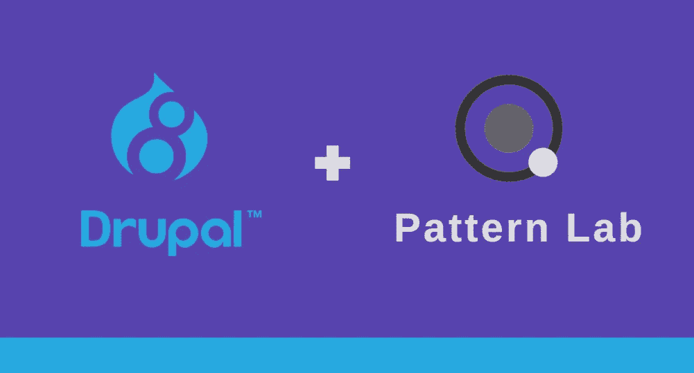

[模式实验室](http://patternlab.io/)是当今 Drupal 社区的热门话题，它提供了许多额外津贴，并承诺为设计师、客户以及最终为开发人员提供轻松的生活。作为现代和创新的团队，我们肯定不能错过，所以我们看了几篇文章，并充满兴奋地把它带到了即将到来的项目中。我注意到的一件事是，大多数演示者对 Drupal 都有很深的了解，这不是我的情况，但我当时没有注意。

我们喜欢 Pattern Lab 有三个原因，我将详细介绍这些原因，分享我们的发现，以及在采用该技术时您应该注意的方面。：

1.  基于组件的方法
2.  将前端和后端解耦，这样前端可以在不了解 Drupal 的情况下工作
3.  漂亮的图案库游乐场，可以展示给客户/设计师进行早期审查

# 1.基于组件的方法

随着 React、Angular 2+、Polymer 等前端框架的兴起，现在很难想象基于非[组件的前端架构](/@dan.shapiro1210/understanding-component-based-architecture-3ff48ec0c238)，简而言之，这意味着每个组件都有自己的数据、视图和控制器逻辑范围，通常用 JS、CSS 和 JSON 或 YML 表示，这意味着一个组件内部的变化不会影响其他组件的风格和内部逻辑。

所以正常的部分看起来像这样:

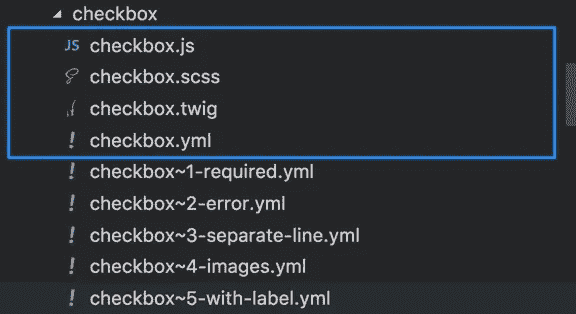

Pattern Lab 建议基于[原子设计方法](http://atomicdesign.bradfrost.com/chapter-2/#atoms)将资产分组到文件夹中，并为组件的隔离虚拟数据提供了强大的支持，让我们可以自由选择自己的工具来处理 JS 和 CSS 范围，这是一个聪明的举动，因为它们无法预测我们通常使用的首选堆栈。

**HTML**:HTML 作用域没有太多的复杂性，所以我们只需为每个组件创建自己的`twig`模板，然后通过传递适当参数值的 [include](https://twig.symfony.com/doc/2.x/tags/include.html) 和 [embed](https://twig.symfony.com/doc/2.x/tags/embed.html) twig 指令在任何我们想要的地方使用它。

**组件数据:**组件虚拟数据可以选择 JSON 或 YAML 格式。两者都很棒，而且有简单的方法可以快速地从一个迁移到另一个，尽管我们选择了 YAML，因为它看起来更干净:

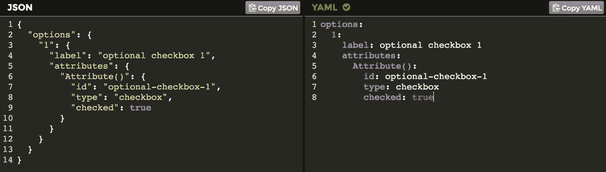

JSON vs YAML example

这些文件仅用于在 Pattern Lab UI 中呈现组件，不会出现在产品中。我们可以为每个组件设置多个虚拟数据实例，只需简单地改变文件名后缀，用波浪符号分隔，这对于测试和演示组件的不同状态非常有用。

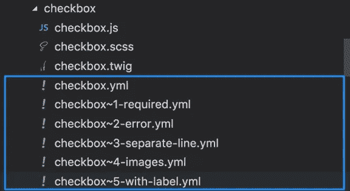

Data file structure

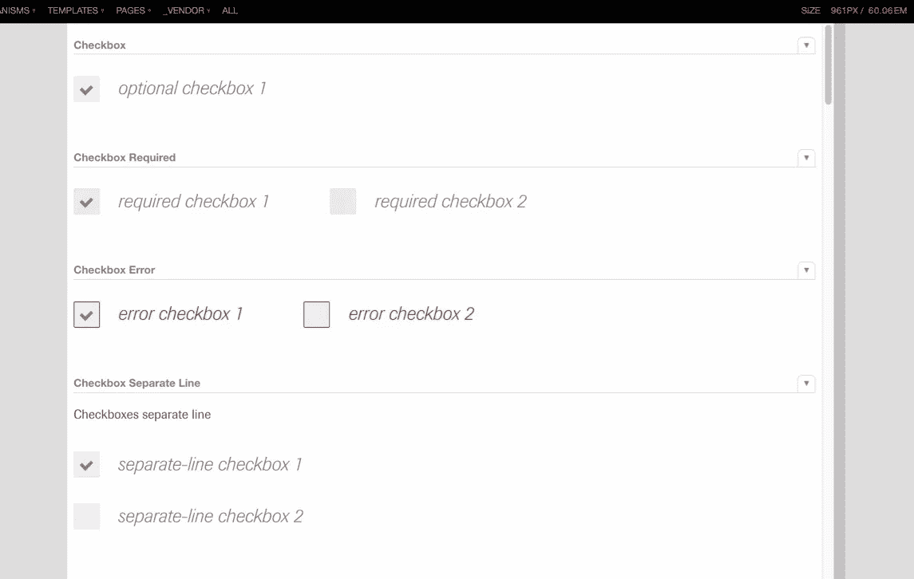

Example of different component states

有一个全局数据文件，可通过组件树访问，因此最好将全局菜单项或页脚链接放在那里。全局数据文件通常可通过以下位置访问:`pattern-lab/source/_data/data.yml`。

*注意*:用于渲染一个组件的唯一数据是它自己的数据和全局数据。如果我们在 component_2 中包含或嵌入 component_1，我们必须将 component_1 的数据放入 component_2 的数据文件中。如果你想避免手工操作，看看这个插件:[数据继承插件](https://github.com/pattern-lab/plugin-php-data-inheritance)。

CSS :我们使用了 SCSS + SMACSS + BEM 组合，这给了我们一种通过类命名约定来隔离 CSS 的方法。我不会在这里详述，但是你可以看看 SCSS 的一些小技巧来达到这个目的。我也期待着未来项目中的 CSS 模块。

**JS** :是最复杂的部分，分解成几个任务。

*模块捆绑器* : Drupal 8 默认提供了一种非常酷的方式，通过引入[库概念](https://www.drupal.org/docs/8/api/javascript-api/add-javascipt-to-your-theme-or-module)，允许在 Drupal 配置中指定不同的捆绑包，然后只将那些真正需要的捆绑包包含到页面中。库定义可能如下所示:

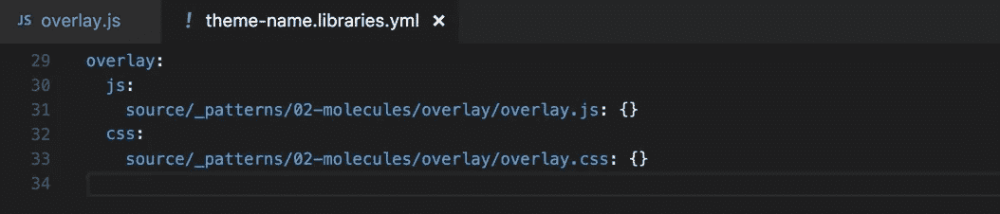

然后必须通过文件[中描述的任何方法连接到模板上。](https://www.drupal.org/docs/8/api/javascript-api/add-javascipt-to-your-theme-or-module)

如果我们例子中的`accordion.js`在内部有自己的依赖关系，问题就会出现。仅仅把这种依赖放在配置文件的同一层上并不是一个好主意，因为在这种情况下，我们必须到处复制它。如果有几个层次的依赖关系，事情就会变得非常混乱。

为了解决这个问题，我们使用了传统的浏览器，Webpack 也是一个选项。为了让它工作，我们只需在 JS 文件中`require`模块，并让 Browserify 通过一个`gulp`任务为我们处理它。我们的`overlay`组件 javascript 文件就是这样开始的:

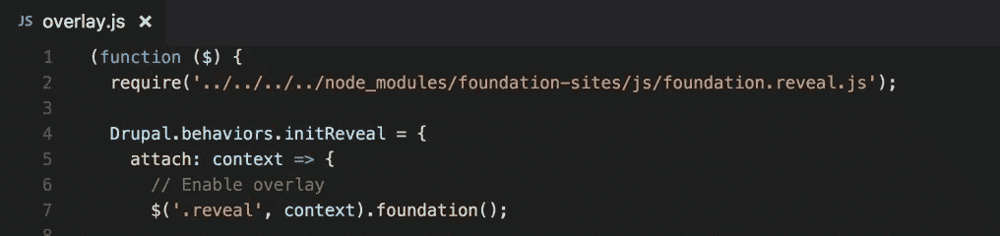

另一个问题是，Pattern Lab 对 Drupal 库的概念一无所知，如果我们希望我们的组件在它的沙箱中工作，我们必须将所有相同的库添加到`pattern-lab/source/_meta/_01-foot.twig`文件中，以确保我们的 JS 在测试环境中的所有页面上都是可访问的。

为了简化事情，一开始我们只创建了一个大的 JS 包，并把它附加到 Drupal 和 Pattern Lab 上。幸运的是，我们能够保持捆绑包相对较小，并且没有太多空间在页面之间分割 JS，所以我们的临时解决方案变成了永久的:)

*组件交互*:一旦我们隔离了所有的组件，我们必须定义它们如何相互通信。

想象一下，我们有一个标题组件和一个侧边栏菜单，当标题中的按钮被按下时，侧边栏菜单就会滑入。

我们可以在 header JS 中(在 click 事件处理程序中)执行逻辑，但是当我们努力实现一个松散耦合的架构时，我们决定使用一个简单的中介模式并选择 Redux。这是一个非常受欢迎的问题，我以前也讨论过它的一些方面。

不要忘记的一个问题是，Redux 在默认情况下调用所有的`store`订阅者，这是我们不希望发生的，因为我们没有虚拟 DOM 和像 React has 那样的智能变化检测机制，所以我们使用了一个名为`[redux-watch](https://github.com/jprichardson/redux-watch)`的扩展，并以只调用所需的`reducer`的方式包装了我们的`subscribe`方法:

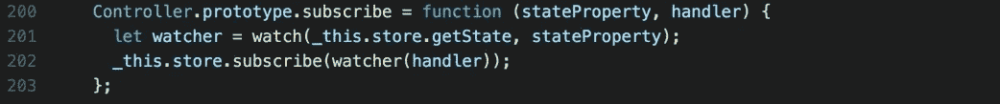

如果术语听起来令人困惑 [Redux 文档](https://redux.js.org/)可能会有帮助。

*Drupal 行为*:如果你从未参与过 Drupal 项目，你必须让自己熟悉 [Drupal 行为概念](https://www.lullabot.com/articles/understanding-javascript-behaviors-in-drupal)。简而言之，在 Drupal 世界中，我们不能依赖任何文档加载事件，因为任何时候 Drupal 都可以通过 AJAX 用新版本替换 HTML 的任何部分，我们知道这一点的唯一方法是通过`attachBehaviors`方法调用。

所以经验法则是:

> 总是用`Drupal.behaviors.yourName`对象包装你的 JS 代码

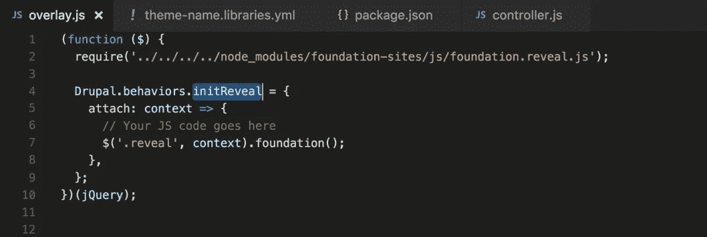

Behavior example

尽管模式实验室对`behaviors`一无所知，而且我们必须从 Drupal core 手动将`drupal.js`附加到`pattern-lab/source/_meta/_01-foot.twig`文件中的所有模式实验室页面上:

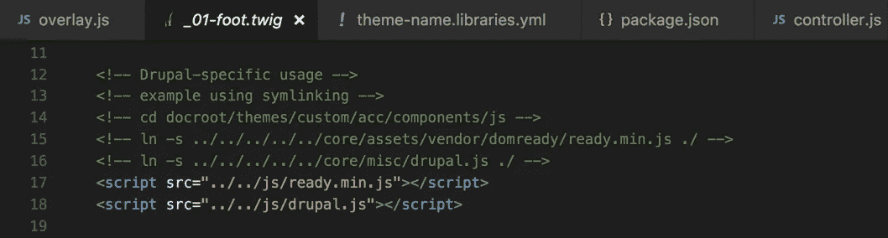

Code for attached drupal.js

连同`ready.js`。这已经包含在乳化 Drupal 主题中，我将在后面介绍，所以你可能只需要取消注释适当的代码行。

采取上述一切都做了，工作似乎我们是好的。

但是等等！

# 2.退耦

Drupal + Pattern Lab 组合的一个重要方面是将前端工作与后端工作分离，这意味着这两个团队可以通过由组件及其参数列表定义的清晰分离来几乎独立地工作。棘手的事情开始了。

解耦是通过 [twig namespaces 模块](https://www.drupal.org/project/components)实现的，它提供了一种将所有前端模板放在一个地方，然后从 Drupal templates 文件夹中引用它们的方法。

总体来说还是不错的。

表单:所以让我们从表单开始。如果您认为可以制作一个输入组件，然后在模式实验室模板`include`中将其放入一个表单中，如下所示:

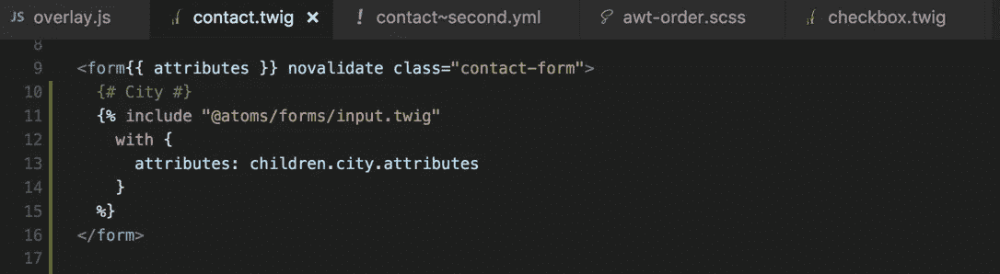

你错了。

Drupal 处理它的方式是首先将每个输入组件分别呈现为一个`field`，然后将这个呈现的 HTML 作为一个字符串参数提供给`form`。第一次发现这一点时，我们创建了一个`if`子句，其中对于 Pattern Lab 我们使用了`include`，对于 Drupal 我们使用了 rendered field。我们在`pattern-lab/source/_data/data.yml`文件中创建了一个名为`patternLab`的全局参数，以此来区分我们是否在模式实验室中。

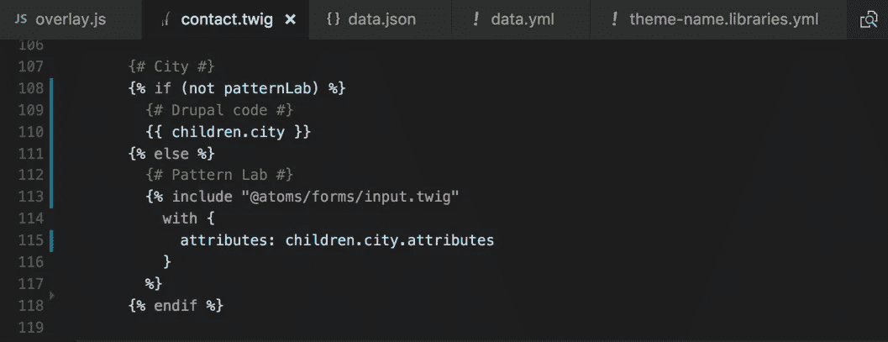

Example of incorrect code

不要这样。

首先，你不能确定 Drupal 中是否没有`patternLab`变量，其次，有一种更简洁的方法可以做到这一点，通过将 Pattern Lab 数据移动到它应该在的地方，移动到 YAML 文件，就可以得到单一版本的`twig`文件:

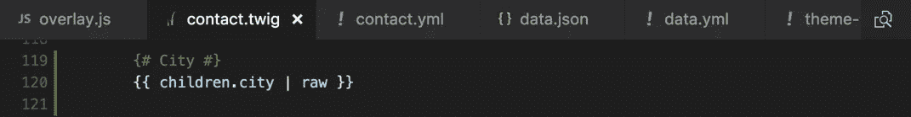

Example of correct code — twig

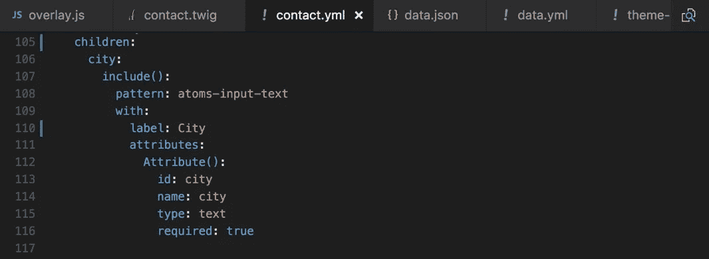

Example of correct code — yml

这要感谢 [aleksip](http://www.aleksip.net) 的[数据转换插件](https://github.com/aleksip/plugin-data-transform)(非常酷的家伙！，如果你是 Drupal 前端的话就跟着他吧)。

**属性对象**:我的第一个输入实现是这样的:

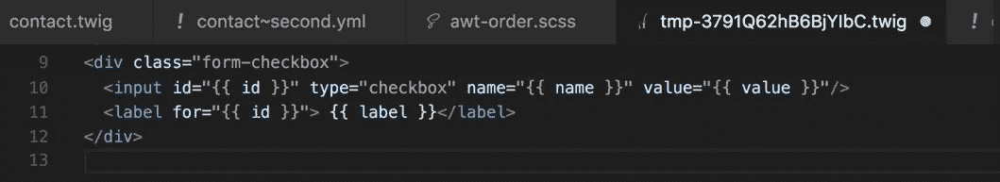

Input — example of incorrect code

你猜怎么着？这是不对的。Drupal 使用表单和表单控件的`Attribute`对象来设置和操作它们的 HTML 属性。

> 点击了解`Attribute`对象及其最佳使用方法

所以正确的方法是这样的:

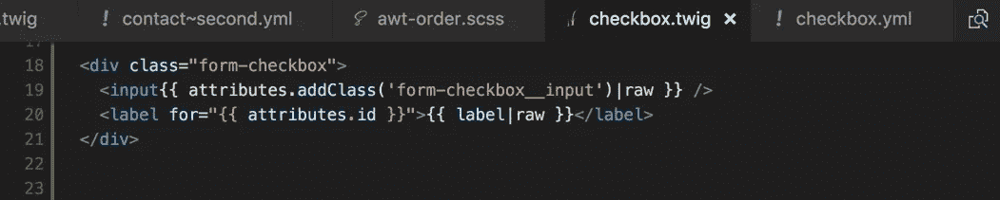

Input — example of correct code

幸运的是，为了让它在 Pattern Lab 中工作(再次感谢[数据转换插件](https://github.com/aleksip/plugin-data-transform))，我们可以在数据文件中模拟属性对象:

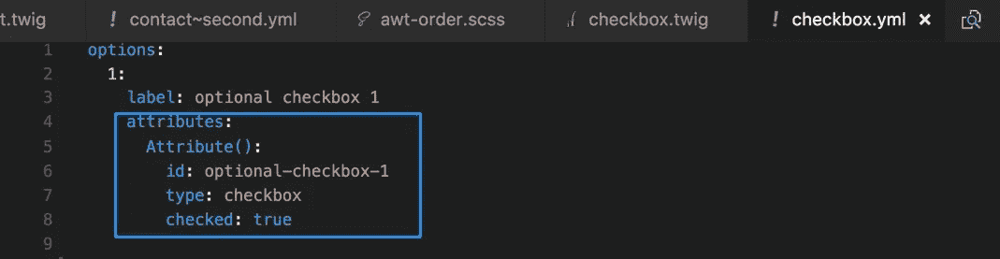

***更新 19.01.2018:*** 在模式实验室中有一种更干净的处理属性的方式。请点击查看乳化[维护者 Evan Willhite 的精彩回应。](/@evan_62057/great-article-9834c9cb3bcb)

但是

> 不要在模式实验室使用`create_attribute()`方法。是[不支持](https://github.com/pattern-lab/plugin-drupal-twig-components/issues/3)。您应该只在 Drupal 模板文件夹中使用它。

**模块**:得益于大量的贡献模块，Drupal 允许快速构建一个 web 应用程序。

我不知道为什么(可能有些模块没有完全迁移到 Drupal 8，或者很难为它们分离一个视图),但是有些情况下，如果你想保持快速的开发速度，你必须处理从服务器获得的任何 HTML。其中一个例子是一个[搜索](https://www.drupal.org/project/search_api)的结果。如果你为此准备了一个模板，你可以把它扔掉。您可以对其进行样式化的唯一方式是覆盖该 HTML 的 CSS，该 HTML 已经由该模块提供。

> 与您的团队一起提前定义项目中要使用的所有模块

表格、验证信息、[Sharif](https://www.drupal.org/project/shariff)、 [sitemap](https://www.drupal.org/project/sitemap) 都是很好的选择。有一个例子，我不得不要求 Drupal 团队在元素中添加一个类，这样我就可以在最后添加一个填充。不管你喜不喜欢，我们都得面对它。

有时，可能会根据底层的 JS 技术来选择一个模块。非常流行的[简单的分层选择](https://www.drupal.org/project/shs)例如在里面使用[主干 js](http://backbonejs.org/) ，所以准备在调试应用程序的路上学习它..或者要求团队考虑替代方案。

**响应图像**:请单独关注 [Drupal 响应图像](https://chromatichq.com/blog/responsive-images-drupal-8-using-srcset)模块，因为它很有可能会用于该应用中。

> 准备好从服务器接收整个渲染的<picture>元素，而不是模板中的图像路径。</picture>

**翻译**:不是很特别，但是请记住你树枝上的翻译。与团队讨论您将使用哪些选项:

`string | t`或` string `

如果需要的话，不要忘记翻译上下文，尽管它可以在以后用全部替换 IDE 功能来修复。

**调试 Drupal** :在专门讨论前端和后端分离的章节中，禁止写 Drupal 调试，但是

> 了解 Drupal 模板的 [kint](https://www.drupal.org/docs/8/theming/twig/discovering-and-inspecting-variables-in-twig-templates) 和[定位](https://www.drupal.org/docs/8/theming/twig/locating-template-files-with-debugging)

我们前端开发人员可能不会自己使用这些方法，但至少我们应该知道它们的存在，并要求 Drupal 团队在需要的时候帮助调试。

**主题** : Drupal 是一个很大的开源社区，这意味着很多事情都已经准备好了，并且由一些聪明的家伙来完成。为了避免重复发明轮子，最好从 Drupal 主题开始，它已经包含了模式实验室。最受欢迎的有:

— [粒子](https://github.com/phase2/particle)

— [乳化](https://github.com/fourkitchens/emulsify)。

我们从乳化开始，我非常欣赏他们组织`gulp`任务和[文档](https://github.com/fourkitchens/emulsify/wiki/Installation)的方式，但是要小心，因为他们默认使用[模式实验室标准版的 Twig](https://github.com/pattern-lab/edition-php-twig-standard) ，其中不包括重要的 Drupal 插件，即:

— [Drupal Twig 组件插件](https://github.com/pattern-lab/plugin-drupal-twig-components)，它允许在模式实验室中使用 Drupal 过滤器和函数(比如说`| t`过滤器)

并且上面已经提到

— [数据转换插件](https://github.com/aleksip/plugin-data-transform)，它让生活变得简单多了(`Attributes`对象，YML 文件中的`include`，等等。)

粒子主题同时使用了 Drupal 的[模式实验室树枝标准版](https://github.com/pattern-lab/edition-php-drupal-standard)，其中包括了默认提到的插件和一些有用的方法，如`[npm run new](https://weknowinc.com/blog/drupal-theming-using-pattern-lab?utm_source=drupal-newsletter&utm_medium=email&utm_campaign=drupal-newsletter-20170104)`。

> 选择正确的模式实验室版本。

如果你仍然喜欢在乳化主题中组织一切的方式，只需更新其中的`[pattern_lab.sh](https://github.com/fourkitchens/emulsify/blob/develop/scripts/pattern_lab.sh)`文件来选择正确的版本。

# 3.模式实验室用户界面

Pattern Lab UI 很好，很好用。如果您不确定如何从菜单中访问它，它允许查看特定组件、组件组或搜索一个组件。

你应该记住的一件事是

> 所有的控件都是在 iframe 中测试的

如果出现问题或特殊情况(例如打印页面功能)，有一种方法可以在 iframe 之外的单独窗口中测试组件:

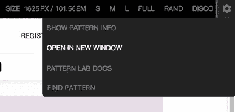

Menu to open component in a separate window

Pattern Lab UI 有很多设置，但是我没有找到任何好的文档。如果你知道的话，请在评论中分享。

# 跟随谁

我建议关注几个博客/回复，以获得一些见解:

 [## aleksip.net

### Aleksi Peebles 的个人网站，他自 1996 年以来一直是专业 web 开发人员，自 2007 年以来一直是 Drupal 开发人员。

www.aleksip.net](http://www.aleksip.net/)  [## 相位 2/粒子

### particle——使用原型工具 Pattern Lab 和 Drupal 主题的起点。可以使用…

github.com](https://github.com/phase2/particle)  [## 乳化//模式 Lab + Drupal 8

### 组件是可重用的网站块。它们可以是小型的(输入、标签、按钮)，中型的(页眉、页脚…

emulsify.info](http://emulsify.info/) 

乳化主题维护者的 Evan Willhite 博客:

 [## Evan Willhite，Four Kitchens 的高级前端工程师

### Evan Willhite 是 Four Kitchens 的高级前端工程师，致力于创造令人愉快的数字…

www.fourkitchens.com](https://www.fourkitchens.com/team/evan-willhite/)  [## 加入 Slack 上的 Drupaltwig！

### 编辑描述

drupaltwig-slack.herokuapp.com](https://drupaltwig-slack.herokuapp.com/)  [## 博客&数字新闻| BUZZWOO！

### 欢迎来到互联网代理博客 BUZZWOO！你找到你的文章了吗？

www.buzzwoo.de](https://www.buzzwoo.de/blog) 

以及以下回复中建议的其他资源([此处](/@evan_62057/great-article-9834c9cb3bcb))。

# 结论

Pattern Lab 确实是一个非常好的组织和展示前端模板库的方法，我不知道有什么好的替代方法来实现它，目前来看它不是一个无头的 Drupal 项目。

像 Particle 和 Emulsify 这样的项目朝着前端和后端工作分离的方向迈进了一大步，尽管认为在这样的项目中编写高质量的前端代码不再需要以前的 Drupal 经验是幼稚的。在我看来，了解 Drupal 主题化、表单和其他流行模块的工作方式仍然是不可或缺的。

享受编码的乐趣，请在评论中告诉我你的体验。